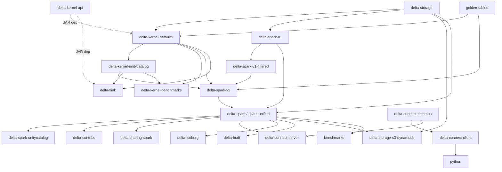
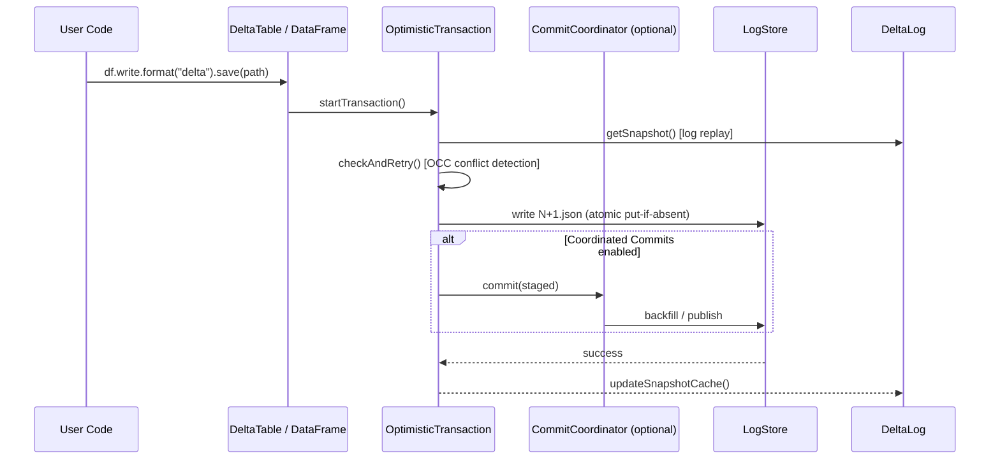
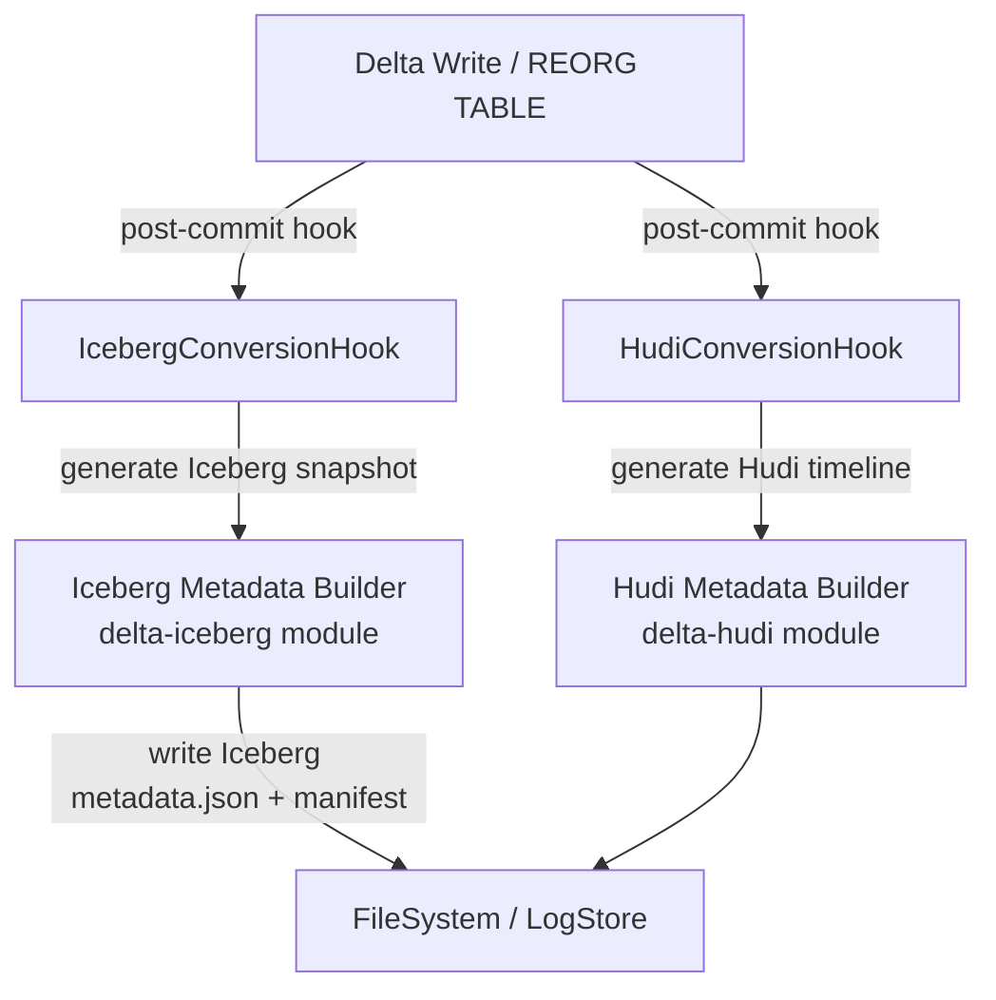
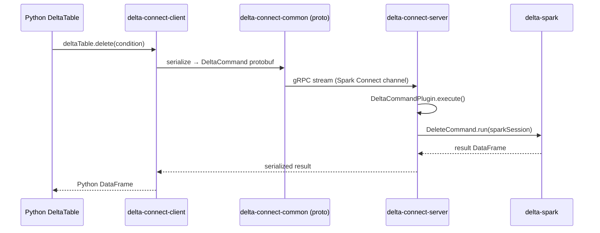

# Module Manifest

> Generated by codebase-decomposer. Do not edit manually.
> Last updated: 2026-03-02 | Pass: fix (adjudication_decompose_01 — 4 MAJOR + 5 MINOR + 2 escalation resolutions applied)

## Project Root
`/Users/vishnuc/OSS/delta.git/main`

---

## Build System Overview

- **Build tool**: SBT (Scala Build Tool), multi-project monorepo
- **Primary language**: Scala 2.13.17, Java 11 (bytecode target)
- **Cross-version support**: Spark 4.0.1 and 4.1.0 (`ALL_SPECS` in `CrossSparkVersions.scala`); Spark 4.2.0-SNAPSHOT defined (`spark42Snapshot`) but excluded from `ALL_SPECS` and not released; Spark 3.x support was dropped prior to this branch.
- **Default build target**: Spark 4.1.0 (`DEFAULT = spark41`)
- **Scala versions**: Scala 2.13 only (dropped 2.12)
- **Key shared config**: `build.sbt` (root), `project/CrossSparkVersions.scala`, `project/Mima.scala`, `project/Unidoc.scala`
- **Published artifacts**: `delta-spark`, `delta-kernel-api`, `delta-kernel-defaults`, `delta-storage`, `delta-flink`, `delta-sharing-spark`, `delta-connect-*`, `delta-iceberg`, `delta-hudi`

---

## Dependency Order (exploration order, leaves first)

1. `golden-tables` (connectors/golden-tables) — test fixture, no runtime deps
2. `delta-storage` (storage) — LogStore + CommitCoordinator API
3. `delta-storage-s3-dynamodb` (storage-s3-dynamodb) — depends on storage
4. `delta-kernel-api` (kernel/kernel-api) — engine-agnostic read/write API (Java)
5. `delta-kernel-defaults` (kernel/kernel-defaults) — Hadoop/Parquet engine impl; depends on storage + kernel-api
6. `delta-kernel-unitycatalog` (kernel/unitycatalog) — UC coordinated-commit client; depends on kernel-defaults + storage
7. `delta-kernel-benchmarks` (kernel/kernel-benchmarks) — JMH benchmarks for kernel; depends on kernel-defaults
8. `delta-spark-v1` (spark/) — Spark connector core; depends on storage
9. `delta-spark-v1-filtered` (spark-v1-filtered virtual) — filtered subset of spark-v1 for composition
10. `delta-spark-v2` (spark/v2) — Spark DataSource V2 / kernel-backed reader; depends on spark-v1-filtered + kernel-defaults + kernel-unitycatalog
11. `delta-spark` (spark-unified) — unified facade; depends on spark-v1 + spark-v2 + storage
12. `delta-spark-unitycatalog` (spark/unitycatalog) — UC integration tests; depends on delta-spark
13. `delta-contribs` (contribs) — community LogStore contribs; depends on delta-spark
14. `delta-sharing-spark` (sharing) — Delta Sharing client; depends on delta-spark
15. `delta-connect-common` (spark-connect/common) — Protobuf + gRPC stubs (no Spark runtime dep)
16. `delta-connect-client` (spark-connect/client) — Python/thin-client planner; depends on connect-common
17. `delta-connect-server` (spark-connect/server) — server-side plugin; depends on connect-common + delta-spark
18. `delta-iceberg` (iceberg) — UniForm Iceberg conversion; depends on delta-spark
19. `delta-hudi` (hudi) — UniForm Hudi conversion; depends on delta-spark
20. `delta-flink` (flink) — Flink Table API connector (kernel-based); depends on kernel-defaults + kernel-unitycatalog
21. `benchmarks` (benchmarks) — Spark-level perf benchmarks; depends on delta-spark (test scope)
22. `python` — Python DeltaTable API; wraps delta-spark + spark-connect-client
23. `protocol_rfcs` — documentation only, no code

---

## Module Entries

### golden-tables
- **path**: `connectors/golden-tables`
- **type**: sub-module (test fixture)
- **language**: Scala, Parquet/JSON binary resources
- **description**: Curated set of pre-built Delta tables in various formats (DVs, column mapping, checkpoints, partitioning, type widening, etc.) used as golden test fixtures by kernel-defaults, spark, and flink tests. No runtime production code.
- **key_files**: `src/main/scala/io/delta/golden/GoldenTableUtils.scala`, `src/main/resources/golden/` (130+ table dirs)
- **depends_on**: []
- **depended_on_by**: [delta-kernel-defaults, delta-spark-v2, delta-flink]
- **kg_doc_target**: `memory_bank/knowledge-graph/modules/connectors/golden-tables.md`
- **decomposition_candidate**: false

---

### delta-storage
- **path**: `storage`
- **type**: module
- **language**: Java 11
- **description**: Defines the `LogStore` interface for atomic file-system writes and the `CommitCoordinatorClient` API for coordinated (catalog-managed) commits. Ships concrete LogStore implementations for HDFS, S3, Azure, GCS, and Local. Also contains the `UCCommitCoordinatorClient` for Unity Catalog-based commit coordination.
- **key_files**:
  - `src/main/java/io/delta/storage/LogStore.java`
  - `src/main/java/io/delta/storage/commit/CommitCoordinatorClient.java`
  - `src/main/java/io/delta/storage/commit/uccommitcoordinator/UCCommitCoordinatorClient.java`
  - `src/main/java/io/delta/storage/S3SingleDriverLogStore.java`
  - `src/main/java/io/delta/storage/commit/CoordinatedCommitsUtils.java`
- **depends_on**: [Hadoop `hadoop-common`, AWS SDK (optional)]
- **depended_on_by**: [delta-kernel-defaults, delta-spark-v1, delta-storage-s3-dynamodb, delta-spark-unified]
- **decomposition_candidate**: false

#### depth-3 components inside delta-storage

##### storage.logstore
- **path**: `storage/src/main/java/io/delta/storage/`
- **type**: component
- **description**: Abstract `LogStore` contract + concrete impls: `HDFSLogStore`, `S3SingleDriverLogStore`, `AzureLogStore`, `GCSLogStore`, `LocalLogStore`, `HadoopFileSystemLogStore`.

##### storage.commit
- **path**: `storage/src/main/java/io/delta/storage/commit/`
- **type**: component
- **description**: `CommitCoordinatorClient` interface, `Commit`/`CommitResponse`/`GetCommitsResponse` DTOs, `CoordinatedCommitsUtils` helpers. The `uniform/` sub-package contains UniForm-specific commit types.

##### storage.commit.uccommitcoordinator
- **path**: `storage/src/main/java/io/delta/storage/commit/uccommitcoordinator/`
- **type**: component
- **description**: Unity Catalog implementation of `CommitCoordinatorClient` via a REST-based `UCTokenBasedRestClient`. Handles staged commit lifecycle (publish, backfill, rollback) against the UC control plane.

---

### delta-storage-s3-dynamodb
- **path**: `storage-s3-dynamodb`
- **type**: module
- **language**: Java 11, Scala 2.13 (tests)
- **description**: DynamoDB-backed multi-cluster S3 log store that uses DynamoDB as a coordination layer to achieve atomic rename semantics on S3. Separate published artifact used in multi-writer S3 deployments.
- **key_files**: `src/main/java/io/delta/storage/` (DynamoDB store classes)
- **depends_on**: [delta-storage, AWS DynamoDB SDK, delta-spark (test)]
- **depended_on_by**: []
- **kg_doc_target**: `memory_bank/knowledge-graph/modules/storage.md`
- **decomposition_candidate**: false

---

### delta-kernel-api
- **path**: `kernel/kernel-api`
- **type**: module
- **language**: Java 11 (public API), Scala 2.13 (tests)
- **description**: Engine-agnostic, stable public API for reading and writing Delta tables without Spark. Defines the `Table`, `Snapshot`, `ScanBuilder`, `Transaction`, and `Engine` interfaces. Contains all protocol-layer logic (log replay, checkpointing, data skipping, deletion vectors, row tracking, table features) in the `internal` packages. This is the authoritative, published API for external engine integrations (Flink, non-Spark engines).
- **key_files**:
  - `src/main/java/io/delta/kernel/Table.java`
  - `src/main/java/io/delta/kernel/Transaction.java`
  - `src/main/java/io/delta/kernel/engine/Engine.java`
  - `src/main/java/io/delta/kernel/internal/snapshot/SnapshotManager.java`
  - `src/main/java/io/delta/kernel/internal/replay/LogReplay.java`
- **depends_on**: [] (zero runtime deps — pure Java API)
- **depended_on_by**: [delta-kernel-defaults (compile-time JAR dep), delta-flink, delta-connect-server]
- **kg_doc_target**: `memory_bank/knowledge-graph/modules/kernel.md`
- **decomposition_candidate**: true — 30+ internal packages, 3 distinct layers (public API, protocol impl, internal utilities)

#### depth-3 components inside delta-kernel-api

##### kernel-api.public
- **path**: `kernel/kernel-api/src/main/java/io/delta/kernel/`
- **type**: component
- **description**: Top-level public interfaces: `Table`, `Snapshot`, `ScanBuilder`, `Scan`, `data/`, `expressions/`, `types/`, `utils/`, `transaction/`, `commit/`, `metrics/`, `statistics/`.

##### kernel-api.engine-spi
- **path**: `kernel/kernel-api/src/main/java/io/delta/kernel/engine/`
- **type**: component
- **description**: `Engine` SPI and sub-interfaces: `FileSystemClient`, `JsonHandler`, `ParquetHandler`, `ExpressionHandler`. `MetricsReporter` is a default (optional) extension point. Engine implementors must supply the four required sub-interfaces.

##### kernel-api.internal
- **path**: `kernel/kernel-api/src/main/java/io/delta/kernel/internal/`
- **type**: component
- **description**: Protocol implementation: `replay/` (log replay + snapshot construction), `snapshot/` (SnapshotManager, state reconstruction), `checkpoints/` (V1/V2 checkpoint reading/writing), `deletionvectors/`, `skipping/` (data skipping predicate pushdown), `tablefeatures/`, `commit/` (OCC, conflict detection), `clustering/`, `rowtracking/`, `icebergcompat/`, `metrics/`, `util/`.

---

### delta-kernel-defaults
- **path**: `kernel/kernel-defaults`
- **type**: module
- **language**: Java 11
- **description**: Reference `Engine` implementation backed by Hadoop FileSystem and Apache Parquet. Provides `DefaultEngine` (the production-ready engine), Parquet read/write, JSON log reading, and LogStore-based file I/O. Used directly by the Flink connector and kernel integration tests.
- **key_files**:
  - `src/main/java/io/delta/kernel/defaults/engine/DefaultEngine.java`
  - `src/main/java/io/delta/kernel/defaults/engine/DefaultFileSystemClient.java`
  - `src/main/java/io/delta/kernel/defaults/internal/parquet/ParquetFileWriter.java`
  - `src/main/java/io/delta/kernel/defaults/internal/json/JsonUtils.java`
- **depends_on**: [delta-kernel-api (JAR), delta-storage, Hadoop, Parquet, Jackson/Gson]
- **depended_on_by**: [delta-spark-v2, delta-kernel-unitycatalog, delta-flink, delta-kernel-benchmarks]
- **kg_doc_target**: `memory_bank/knowledge-graph/modules/kernel.md`
- **decomposition_candidate**: false

#### depth-3 components inside delta-kernel-defaults

##### kernel-defaults.engine
- **path**: `kernel/kernel-defaults/src/main/java/io/delta/kernel/defaults/engine/`
- **type**: component
- **description**: `DefaultEngine` factory + `fileio/` (file-based I/O helpers) and `hadoopio/` (Hadoop FS-backed implementations of `FileSystemClient`, `JsonHandler`, `ParquetHandler`).

##### kernel-defaults.internal
- **path**: `kernel/kernel-defaults/src/main/java/io/delta/kernel/defaults/internal/`
- **type**: component
- **description**: Internal Parquet reader/writer, JSON serialization, expression evaluator, LogStore adapter, and columnar data vector implementations.

---

### delta-kernel-unitycatalog
- **path**: `kernel/unitycatalog`
- **type**: sub-module
- **language**: Java 11
- **description**: Kernel-level Unity Catalog integration: `UCCatalogManagedClient` and `UCCatalogManagedCommitter` implement the `CommitCoordinatorClient` contract using UC REST APIs. Adapters translate between Kernel data model and UC protocol. Used by both Flink and kernel benchmarks when targeting UC-managed tables.
- **key_files**:
  - `src/main/java/io/delta/kernel/unitycatalog/UCCatalogManagedClient.java`
  - `src/main/java/io/delta/kernel/unitycatalog/UCCatalogManagedCommitter.java`
  - `src/main/java/io/delta/kernel/unitycatalog/adapters/`
- **depends_on**: [delta-kernel-api (JAR, unmanaged compile+test), delta-kernel-defaults (test), delta-storage]
- **depended_on_by**: [delta-spark-v2, delta-flink, delta-kernel-benchmarks]
- **kg_doc_target**: `memory_bank/knowledge-graph/modules/kernel.md`
- **decomposition_candidate**: false

---

### delta-kernel-benchmarks
- **path**: `kernel/kernel-benchmarks`
- **type**: sub-module (benchmarks)
- **language**: Java 11 (JMH)
- **description**: JMH-based micro and workload benchmarks for the Kernel read/write path. Workload specs stored as JSON in `src/test/resources/workload_specs/`, covering basic append, snapshot, and catalog-managed scenarios.
- **key_files**: `src/test/java/io/delta/kernel/benchmarks/` (workload runners, models)
- **depends_on**: [delta-kernel-defaults, delta-kernel-api, delta-storage, delta-kernel-unitycatalog]
- **depended_on_by**: []
- **kg_doc_target**: `memory_bank/knowledge-graph/modules/kernel.md`
- **decomposition_candidate**: false

---

### delta-spark-v1
- **path**: `spark`
- **type**: module
- **language**: Scala 2.13, Java 11, ANTLR4 (SQL grammar)
- **description**: The primary Delta Spark connector (v1 code path): `DeltaLog`, `OptimisticTransaction`, `Snapshot`, all DML commands (write, delete, update, merge, restore, optimize, vacuum, clone, REORG), streaming source/sink, CDF, schema evolution, column mapping, coordinated commits, server-side planning, and the Delta SQL parser extension. This is the largest module in the repo (~150+ source files).
- **key_files**:
  - `src/main/scala/org/apache/spark/sql/delta/DeltaLog.scala`
  - `src/main/scala/org/apache/spark/sql/delta/OptimisticTransaction.scala`
  - `src/main/scala/org/apache/spark/sql/delta/DeltaConfig.scala`
  - `src/main/scala/org/apache/spark/sql/delta/sources/DeltaDataSource.scala`
  - `src/main/scala/org/apache/spark/sql/delta/commands/WriteIntoDelta.scala`
- **depends_on**: [delta-storage, Apache Spark SQL/Core/Catalyst (provided)]
- **depended_on_by**: [delta-spark-v1-filtered, delta-spark-unified, delta-spark-unitycatalog, delta-contribs, delta-sharing-spark, delta-connect-server, delta-iceberg, delta-hudi, delta-storage-s3-dynamodb (test)]
- **kg_doc_target**: `memory_bank/knowledge-graph/modules/spark.md`
- **decomposition_candidate**: true — 150+ source files, ~12 distinct internal sub-domains

#### depth-3 components inside delta-spark-v1

##### spark.core
- **path**: `spark/src/main/scala/org/apache/spark/sql/delta/`
- **type**: component
- **description**: Core table management: `DeltaLog` (per-table singleton), `OptimisticTransaction` (OCC write gate), `Snapshot`/`CheckpointProvider`, `DeltaConfig`, `DeltaErrors`, `DeltaHistoryManager`, `ConflictChecker`, `DeltaAnalysis` (Spark analyzer rule), `DeltaOptions`, `DeltaUnsupportedOperationsCheck`.

##### spark.actions
- **path**: `spark/src/main/scala/org/apache/spark/sql/delta/actions/`
- **type**: component
- **description**: Scala case-class representations of all Delta protocol actions: `Action`, `AddFile`, `RemoveFile`, `AddCDCFile`, `Metadata`, `Protocol`, `CommitInfo`, `SetTransaction`, `DomainMetadata`, `CheckpointMetadata`, `SidecarFile`.

##### spark.commands
- **path**: `spark/src/main/scala/org/apache/spark/sql/delta/commands/`
- **type**: component
- **description**: All DML and DDL command implementations: `WriteIntoDelta`, `DeleteCommand`, `UpdateCommand`, `MergeIntoCommand`+helpers (`merge/`), `OptimizeTableCommand`+helpers (`optimize/`), `VacuumCommand`, `RestoreTableCommand`, `ConvertToDeltaCommand`, `CreateDeltaTableCommand`, `CloneTableCommand`, `DeltaReorgTableCommand`, `DeltaGenerateCommand`, `DescribeDeltaDetailsCommand`, `DescribeDeltaHistoryCommand`, CDC helpers (`cdc/`), backfill (`backfill/`), column mapping conversion (`columnmapping/`), convert sub-commands (`convert/`).
- **decomposition_candidate**: true — `spark.commands` contains 6+ distinct sub-packages (`merge/`, `optimize/`, `cdc/`, `backfill/`, `columnmapping/`, `convert/`), each with multiple command classes; warrants its own dedicated L3 document.
- **kg_doc_target**: `memory_bank/knowledge-graph/modules/spark/commands.md`

##### spark.streaming
- **path**: `spark/src/main/scala/org/apache/spark/sql/delta/sources/`
- **type**: component
- **description**: Structured Streaming integration: `DeltaSource` (micro-batch + CDF streaming source), `DeltaSink` (streaming sink), `DeltaSourceOffset`, `DeltaSourceCDCSupport`, `DeltaSourceMetadataEvolutionSupport`, `DeltaSourceMetadataTrackingLog`, `SchemaTrackingLog` (in `streaming/` sub-package), `DeltaSQLConf` (all SQL configuration keys).

##### spark.catalog
- **path**: `spark/src/main/scala/org/apache/spark/sql/delta/catalog/`
- **type**: component
- **description**: Spark catalog integration: `AbstractDeltaCatalog` (base for DeltaCatalog V2), `DeltaTableV2` (Catalog V2 table representation), `CatalogResolver`, `IcebergTablePlaceHolder` (UniForm placeholder during conversion).

##### spark.coordinatedcommits
- **path**: `spark/src/main/scala/org/apache/spark/sql/delta/coordinatedcommits/`
- **type**: component
- **description**: Spark-side coordinated commits: `CommitCoordinatorClient` (Spark-level interface), `AbstractBatchBackfillingCommitCoordinatorClient`, `InMemoryCommitCoordinator` (test impl), `InMemoryUCCommitCoordinator`, `UCCommitCoordinatorBuilder`, `TableCommitCoordinatorClient`, `CoordinatedCommitsUtils`.

##### spark.files
- **path**: `spark/src/main/scala/org/apache/spark/sql/delta/files/`
- **type**: component
- **description**: File index layer: `TahoeFileIndex`, `TahoeRemoveFileIndex`, `TahoeChangeFileIndex`, `CdcAddFileIndex`, `DeltaSourceSnapshot`, `TransactionalWrite`, `DelayedCommitProtocol`, `DeltaFileFormatWriter`, `SQLMetricsReporting`.

##### spark.schema
- **path**: `spark/src/main/scala/org/apache/spark/sql/delta/schema/`
- **type**: component
- **description**: Schema management: `SchemaUtils` (schema evolution, merging, validation), `SchemaMergingUtils`, `ImplicitMetadataOperation` (DDL helpers), `InvariantViolationException`.

##### spark.skipping
- **path**: `spark/src/main/scala/org/apache/spark/sql/delta/skipping/`
- **type**: component
- **description**: Data skipping and clustering: `MultiDimClustering` (Z-order + Hilbert clustering orchestration), `MultiDimClusteringFunctions`, `clustering/` sub-package (liquid clustering support).

##### spark.uniform
- **path**: `spark/src/main/scala/org/apache/spark/sql/delta/uniform/`
- **type**: component
- **description**: UniForm (Universal Format) Parquet/Iceberg compatibility helper: `ParquetIcebergCompatV2Utils` — utilities for maintaining Iceberg-compatible metadata alongside Delta commits. (Core UniForm conversion lives in `iceberg/` and `hudi/` modules.)

##### spark.serverSidePlanning
- **path**: `spark/src/main/scala/org/apache/spark/sql/delta/serverSidePlanning/`
- **type**: component
- **description**: Server-side planning integration (Unity Catalog metadata fetch): `ServerSidePlannedTable`, `ServerSidePlanningClient`, `ServerSidePlanningMetadata`, `UnityCatalogMetadata`. Enables the Spark connector to delegate query planning metadata to a UC server.

##### spark.v2-interop
- **path**: `spark/src/main/scala/org/apache/spark/sql/delta/v2/interop/`
- **type**: component
- **description**: Interoperability layer between the v1 and v2 (kernel-backed) read paths for DataSource V2 API bridging.

##### spark.sql-parser
- **path**: `spark/src/main/scala/io/delta/sql/` + `spark/src/main/antlr4/`
- **type**: component
- **description**: Delta SQL parser extension: ANTLR4 grammar (`DeltaSqlBase.g4`), `DeltaSqlParser`, `DeltaSparkSessionExtension` — adds `VACUUM`, `DESCRIBE HISTORY`, `RESTORE`, `OPTIMIZE`, `REORG TABLE` SQL syntax.

##### spark.public-api
- **path**: `spark/src/main/scala/io/delta/tables/`
- **type**: component
- **description**: Public Scala/Java API: `DeltaTable`, `DeltaMergeBuilder`, `DeltaTableBuilder`, and `execution/` helpers. This is the user-facing entry point for programmatic Delta operations in Scala/Java.

---

### delta-spark-v2
- **path**: `spark/v2`
- **type**: sub-module
- **language**: Java 11
- **description**: Kernel-backed DataSource V2 read path for Delta. Implements `SparkTable`, `SparkScan`, `SparkBatch`, `SparkPartitionReader`, `SparkMicroBatchStream` using the Kernel API as the underlying engine. Handles deletion-vector-aware reads and Unity Catalog snapshot integration.
- **key_files**:
  - `src/main/java/io/delta/spark/internal/v2/catalog/SparkTable.java`
  - `src/main/java/io/delta/spark/internal/v2/read/SparkScan.java`
  - `src/main/java/io/delta/spark/internal/v2/read/SparkMicroBatchStream.java`
  - `src/main/java/io/delta/spark/internal/v2/snapshot/unitycatalog/` (UC snapshot helpers)
- **depends_on**: [delta-spark-v1-filtered, delta-kernel-defaults, delta-kernel-unitycatalog, golden-tables (test)]
- **depended_on_by**: [delta-spark-unified]
- **kg_doc_target**: `memory_bank/knowledge-graph/modules/spark.md`
- **decomposition_candidate**: false

---

### delta-spark-unified (facade)
- **path**: `spark-unified`
- **type**: module (published facade)
- **language**: Scala 2.13, Java 11
- **description**: The published `delta-spark` artifact — a thin facade that aggregates `delta-spark-v1`, `delta-spark-v2`, and `delta-storage`. Also contains `DeltaCatalog` (the user-facing Spark V2 catalog class in `spark-unified/src/main/java/.../catalog/`), `io.delta.sql.DeltaSparkSessionExtension`, and the `io.delta.internal` compatibility layer.
- **key_files**:
  - `src/main/java/org/apache/spark/sql/delta/catalog/DeltaCatalog.java` (V2 catalog entry point)
  - `src/main/scala/io/delta/sql/DeltaSparkSessionExtension.scala`
  - `src/main/scala/io/delta/internal/`
- **depends_on**: [delta-spark-v1, delta-spark-v2, delta-storage]
- **depended_on_by**: [delta-spark-unitycatalog, delta-contribs, delta-sharing-spark, delta-connect-server, delta-iceberg, delta-hudi]
- **kg_doc_target**: `memory_bank/knowledge-graph/modules/spark.md`
- **decomposition_candidate**: false

---

### delta-spark-unitycatalog
- **path**: `spark/unitycatalog`
- **type**: sub-module (integration tests only)
- **language**: Java 11 (tests)
- **description**: Integration test project for Delta Spark + Unity Catalog. Contains `src/test/java/io/sparkuctest/` — end-to-end tests verifying UC-managed table operations (coordinated commits, catalog interaction) using the full Spark connector stack.
- **key_files**: `src/test/java/io/sparkuctest/` (test files)
- **depends_on**: [delta-spark (test)]
- **depended_on_by**: []
- **kg_doc_target**: `memory_bank/knowledge-graph/modules/spark.md`
- **decomposition_candidate**: false

---

### delta-contribs
- **path**: `contribs`
- **type**: module
- **language**: Scala 2.13
- **description**: Community-contributed LogStore implementations. Currently contains `io.delta.storage` Scala-based stores (e.g., alternative S3 implementations) not part of the core `delta-storage` artifact.
- **key_files**: `src/main/scala/io/delta/storage/` (community store classes)
- **depends_on**: [delta-spark]
- **depended_on_by**: []
- **kg_doc_target**: `memory_bank/knowledge-graph/modules/connectors.md`
- **decomposition_candidate**: false

---

### delta-sharing-spark
- **path**: `sharing`
- **type**: module
- **language**: Scala 2.13
- **description**: Delta Sharing client for Spark: mounts shared Delta tables over a virtual `DeltaSharingFileSystem`, supports batch reads, time travel, Change Data Feed, and schema evolution. Hooks into the Spark connector's `DeltaLog` abstraction via `DeltaSharingLogFileSystem`.
- **key_files**:
  - `src/main/scala/io/delta/sharing/spark/DeltaSharingDataSource.scala`
  - `src/main/scala/io/delta/sharing/spark/DeltaSharingClient.scala`
  - `src/main/scala/io/delta/sharing/spark/DeltaSharingFileSystem.scala`
- **depends_on**: [delta-spark]
- **depended_on_by**: []
- **kg_doc_target**: `memory_bank/knowledge-graph/modules/sharing.md`
- **decomposition_candidate**: false

---

### delta-connect-common
- **path**: `spark-connect/common`
- **type**: sub-module
- **language**: Proto3, Java 11 (generated gRPC stubs), Scala 2.13
- **description**: Protobuf schema and generated Java/gRPC stubs for the Delta Spark Connect protocol. Defines `commands.proto` (DML commands), `relations.proto` (Delta-specific relations), and `base.proto`. Shared between client and server.
- **key_files**:
  - `src/main/protobuf/delta/connect/commands.proto`
  - `src/main/protobuf/delta/connect/relations.proto`
  - `src/main/protobuf/delta/connect/base.proto`
  - `src/main/scala/org/apache/spark/sql/connect/delta/` (Spark Connect integration helpers)
- **depends_on**: [grpc-java, protobuf-java, spark-connect-common (provided)]
- **depended_on_by**: [delta-connect-client, delta-connect-server]
- **kg_doc_target**: `memory_bank/knowledge-graph/modules/spark-connect.md`
- **decomposition_candidate**: false

---

### delta-connect-client
- **path**: `spark-connect/client`
- **type**: sub-module
- **language**: Scala 2.13
- **description**: Client-side Spark Connect planner for Delta: translates `DeltaTable` operations into Connect protocol messages. Provides `io.delta.connect.tables.DeltaTable` (Spark Connect-compatible API), `DeltaMergeBuilder`, and related execution helpers.
- **key_files**:
  - `src/main/scala/io/delta/connect/tables/DeltaTable.scala`
  - `src/main/scala/io/delta/connect/tables/execution/`
- **depends_on**: [delta-connect-common, spark-connect-client-jvm (provided)]
- **depended_on_by**: [python (indirect)]
- **kg_doc_target**: `memory_bank/knowledge-graph/modules/spark-connect.md`
- **decomposition_candidate**: false

---

### delta-connect-server
- **path**: `spark-connect/server`
- **type**: sub-module
- **language**: Scala 2.13
- **description**: Server-side Spark Connect plugin for Delta: `DeltaRelationPlugin` (relation resolver), `DeltaCommandPlugin` (command executor), `DeltaPlannerBase`, `SimpleDeltaConnectService` (test service). Bridges Spark Connect protocol to the full Delta Spark command set.
- **key_files**:
  - `src/main/scala/io/delta/connect/DeltaRelationPlugin.scala`
  - `src/main/scala/io/delta/connect/DeltaCommandPlugin.scala`
  - `src/main/scala/io/delta/connect/SimpleDeltaConnectService.scala`
- **depends_on**: [delta-connect-common, delta-spark, spark-connect (provided)]
- **depended_on_by**: []
- **kg_doc_target**: `memory_bank/knowledge-graph/modules/spark-connect.md`
- **decomposition_candidate**: false

---

### delta-iceberg
- **path**: `iceberg`
- **type**: module
- **language**: Scala 2.13, Java 11
- **description**: UniForm Iceberg support: converts Delta commits to Iceberg-compatible metadata (REST catalog, Iceberg table format). Contains Iceberg compat conversion logic (`icebergShaded/` for shaded Iceberg jars), server-side planning extension for Iceberg metadata, and Delta-to-Iceberg catalog integration. Conditional on `supportIceberg` build flag.
- **key_files**:
  - `src/main/scala/org/apache/spark/sql/delta/icebergShaded/` (core conversion)
  - `src/main/scala/org/apache/spark/sql/delta/serverSidePlanning/` (Iceberg server-side planning)
  - `src/main/java/org/apache/spark/sql/delta/serverSidePlanning/` (Java SSP classes)
  - `src/main/scala/org/apache/iceberg/transforms/` (custom Iceberg transform extensions)
- **depends_on**: [delta-spark, iceberg-shaded (internal), spark-sql (provided)]
- **depended_on_by**: []
- **kg_doc_target**: `memory_bank/knowledge-graph/modules/connectors/uniform-iceberg.md`
- **decomposition_candidate**: false

---

### delta-hudi
- **path**: `hudi`
- **type**: module
- **language**: Scala 2.13
- **description**: UniForm Hudi support: converts Delta table metadata to Hudi-compatible format. Implements `HudiConverter` and related utilities. Conditional on `supportHudi` build flag.
- **key_files**: `src/main/scala/org/apache/spark/sql/delta/hudi/` (converter classes)
- **depends_on**: [delta-spark, hudi-client (provided)]
- **depended_on_by**: []
- **kg_doc_target**: `memory_bank/knowledge-graph/modules/connectors/uniform-hudi.md`
- **decomposition_candidate**: false

---

### delta-flink
- **path**: `flink`
- **type**: module
- **language**: Java 11
- **description**: Apache Flink Table API connector for Delta, built directly on the Kernel API (no Spark dependency). Provides `DeltaCatalog` and `DeltaTable` Flink Catalog/Table API classes (`flink/table/`), kernel-backed checkpoint and column-vector utilities (`flink/kernel/`), and credential management for Unity Catalog. Uses `DefaultEngine` from kernel-defaults for I/O. No DataStream API (`DeltaSource`/`DeltaSink`) classes are present in this module.
- **key_files**:
  - `src/main/java/io/delta/flink/table/DeltaCatalog.java` (Table API catalog entry point)
  - `src/main/java/io/delta/flink/table/DeltaTable.java` (Table API table representation)
  - `src/main/java/io/delta/flink/kernel/CheckpointWriter.java` (kernel checkpoint utility)
  - `src/main/java/io/delta/flink/kernel/ColumnVectorUtils.java` (column vector utility)
- **depends_on**: [delta-kernel-defaults, delta-kernel-unitycatalog, Apache Flink 2.0.1]
- **depended_on_by**: []
- **kg_doc_target**: `memory_bank/knowledge-graph/modules/connectors/flink.md`
- **decomposition_candidate**: false

---

### python
- **path**: `python`
- **type**: module
- **language**: Python 3
- **description**: Python DeltaTable API. Provides `delta.tables.DeltaTable` wrapping the PySpark DataFrame API for classic Spark, and `delta.connect.tables.DeltaTable` for Spark Connect (via `delta-connect-client`). Contains `tables.py`, `exceptions/`, `testing/` helpers, integration tests, and typed stubs.
- **key_files**:
  - `delta/tables.py` (classic PySpark API)
  - `delta/connect/tables.py` (Spark Connect API)
  - `delta/connect/plan.py` (plan serialization for Spark Connect)
  - `delta/connect/proto/` (Python protobuf stubs)
- **depends_on**: [PySpark, delta-connect-client (JVM), pydantic (typing)]
- **depended_on_by**: []
- **kg_doc_target**: `memory_bank/knowledge-graph/modules/python.md`
- **decomposition_candidate**: false

---

### benchmarks
- **path**: `benchmarks`
- **type**: module (performance testing)
- **language**: Scala 2.13
- **description**: Spark-level performance benchmarks: `MergeBenchmark`, `TPCDSBenchmark`, `Benchmark` base, `MergeTestCases`, data load utilities. Driven by `run-benchmark.py` script. Separate SBT project with its own `build.sbt`.
- **key_files**:
  - `src/main/scala/benchmark/MergeBenchmark.scala`
  - `src/main/scala/benchmark/TPCDSBenchmark.scala`
  - `run-benchmark.py`
- **depends_on**: [delta-spark (test scope), Apache Spark]
- **depended_on_by**: []
- **kg_doc_target**: `memory_bank/knowledge-graph/dev/build_system.md`
- **decomposition_candidate**: false

---

### protocol_rfcs
- **path**: `protocol_rfcs`
- **type**: documentation
- **language**: Markdown
- **description**: RFC proposals for Delta protocol changes. Contains `accepted/` (approved RFCs that became protocol features), `rejected/`, and in-flight proposals: variant shredding, iceberg compat v3, column mapping usage tracking, collated string type, checkpoint protection, materialize partition columns, iceberg writer compat v1.
- **key_files**:
  - `variant-shredding.md`
  - `iceberg-compat-v3.md`
  - `checkpoint-protection.md`
  - `accepted/` (fully ratified RFCs)
- **depends_on**: []
- **depended_on_by**: []
- **kg_doc_target**: `memory_bank/knowledge-graph/protocol/`
- **decomposition_candidate**: false

---

### examples
- **path**: `examples` + `kernel/examples/kernel-examples`
- **type**: documentation / runnable examples
- **language**: Scala, Python, Java
- **description**: Two distinct example areas: (1) `examples/` — non-SBT end-user reference materials: cheat sheet, Python notebooks, Scala snippets. (2) `kernel/examples/kernel-examples/` — standalone Maven project (`pom.xml`) with Java examples demonstrating Kernel API usage (single-table reads, integration patterns). Both are included in KG scope; the explorer must be Maven-aware when covering the kernel-examples sub-area.
- **key_files**:
  - `kernel/examples/kernel-examples/src/main/java/io/delta/kernel/examples/`
  - `examples/scala/`
  - `examples/python/`
- **depends_on**: [delta-kernel-api, delta-spark]
- **depended_on_by**: []
- **kg_doc_target**: `memory_bank/knowledge-graph/modules/kernel.md`
- **decomposition_candidate**: false

---

## Inter-Module Flow Diagrams

### SBT Project Dependency Graph

_Arrows show the "depended-upon-by" direction: A → B means B depends on A (arrows flow from foundation modules up to consumers). Dashed arrows = JAR-level dependency: kernel-api is consumed as a compiled JAR by kernel-defaults and flink via `unmanagedJars`, not via SBT `.dependsOn()` source linking._

---

### Delta Table Write Path (Spark → Protocol)

_Applies to: delta-spark-v1, delta-storage, spark.coordinatedcommits_

---

### Kernel Read Path (Engine → Data)

```mermaid
graph LR
    E[Engine SPI caller<br/>e.g. Flink, spark-v2] -->|Table.forPath| T[Table]
    T -->|getLatestSnapshot| S[Snapshot / SnapshotManager]
    S -->|LogReplay| LR[Log Replay<br/>JSON + Parquet log files]
    LR --> SC[Scan / ScanBuilder]
    SC -->|data skipping predicate| SF[Filtered AddFile list]
    SF -->|getScanFiles| RB[Row Batches via Engine.ParquetHandler]
    RB -->|applyDeletionVectors| OUT[Final ColumnarBatch output]
```

_Applies to: delta-kernel-api, delta-kernel-defaults, delta-spark-v2, delta-flink_

---

### UniForm Conversion Flow

_Applies to: delta-spark-v1 (hooks), delta-iceberg, delta-hudi_

---

### Spark Connect Request Flow

_Applies to: python, delta-connect-client, delta-connect-common, delta-connect-server, delta-spark_

---

## Decomposition Candidates

Modules flagged for subsequent deeper decomposer pass:

| Module | Reason |
|---|---|
| `delta-spark-v1` | ~150+ source files, 12+ distinct sub-packages (commands, streaming, catalog, coordinatedcommits, skipping, schema, files, etc.) |
| `delta-kernel-api` | 30+ internal packages spanning public API, protocol implementation, and utility layers |

---

## External Dependencies

Notable third-party libraries referenced across modules:

| Library | Version | Used by |
|---|---|---|
| Apache Spark SQL/Core/Catalyst | 4.0.1, 4.1.0 (provided); 4.2.0-SNAPSHOT (defined, unreleased) | delta-spark-v1, delta-spark-v2, delta-spark-unified, delta-connect-server |
| Apache Hadoop | 3.4.2 | delta-storage, delta-kernel-defaults |
| Apache Parquet | (via Spark/Hadoop) | delta-kernel-defaults, delta-spark-v1 |
| Apache Flink | 2.0.1 | delta-flink |
| gRPC / protobuf-java | grpc 1.62.2 / proto 3.25.1 | delta-connect-common, delta-connect-client, delta-connect-server |
| Apache Iceberg | shaded (icebergShaded) | delta-iceberg |
| Apache Hudi | (provided) | delta-hudi |
| AWS DynamoDB SDK | (provided) | delta-storage-s3-dynamodb |
| ScalaTest | 3.2.15 | all test modules |
| RoaringBitmap | (via parquet) | delta-kernel-api (deletion vectors) |

---

## Generated / Vendored (excluded from KG)

- `target/` — SBT build output in every module
- `project/target/` — SBT meta-project build output
- `spark-connect/common/src/main/java/` — protobuf-generated Java stubs (auto-generated by `sbt protoc`)
- `python/delta/connect/proto/` — Python protobuf generated stubs
- `icebergShaded/` — shaded Iceberg dependency JAR project (not a source module, produces a fat JAR)
- `icebergTestsShaded/` — shaded Iceberg test dependency
- `testDeltaIcebergJar/` — integration test harness for verifying iceberg JAR contents
- `spark/delta-suite-generator/` — internal SBT code generation utility, not published
- `.git/` — version control
- `build/` — SBT plugin configurations
- `docs/` — Astro-based documentation website (`astro.config.mjs`, `pnpm-lock.yaml`, `generate_docs.py`); no production Delta source code
