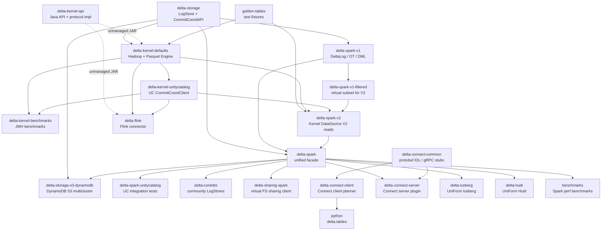

# Module Dependencies

#architecture #L2 #dependencies #artifacts

## Published Artifact Matrix

| SBT Module | Maven Coordinate | Purpose | Spark dependency |
|---|---|---|---|
| `delta-storage` | `io.delta:delta-storage:<version>` | LogStore SPI + concrete impls (HDFS/S3/Azure/GCS/Local) + CommitCoordinatorClient API + UC REST client | None |
| `delta-storage-s3-dynamodb` | `io.delta:delta-storage-s3-dynamodb:<version>` | DynamoDB-backed multi-cluster S3 LogStore | None |
| `delta-kernel-api` | `io.delta:delta-kernel-api:<version>` | Engine-agnostic public API for reading/writing Delta tables (Java); all protocol impl in `internal` packages | None |
| `delta-kernel-defaults` | `io.delta:delta-kernel-defaults:<version>` | Reference `Engine` implementation on Hadoop + Apache Parquet | None (Hadoop + Parquet) |
| `delta-spark` | `io.delta:delta-spark_<spark_major_minor>_<scala>:<version>` | Unified Spark connector (v1+v2 facade): DeltaLog, OptimisticTransaction, all DML, streaming, catalog, coordinated commits, DeltaSparkSessionExtension | Spark SQL (provided) |
| `delta-flink` | `io.delta:delta-flink-<flink_version>:<version>` | Flink Table API connector (kernel-based, no Spark) | None (Flink provided) |
| `delta-sharing-spark` | `io.delta:delta-sharing-spark_<spark>_<scala>:<version>` | Delta Sharing client for Spark; virtual filesystem for shared tables | Spark SQL (provided) + delta-spark |
| `delta-connect-common` | `io.delta:delta-connect-common_<scala>:<version>` | Protobuf IDL + gRPC stubs for Delta Connect protocol | None |
| `delta-connect-client` | `io.delta:delta-connect-client_<scala>:<version>` | Client-side Spark Connect DeltaTable planner | spark-connect-client (provided) |
| `delta-connect-server` | `io.delta:delta-connect-server_<scala>:<version>` | Server-side Spark Connect plugin (RelationPlugin + CommandPlugin) | Spark Connect (provided) + delta-spark |
| `delta-iceberg` | `io.delta:delta-iceberg_<spark>_<scala>:<version>` | UniForm Iceberg metadata conversion pipeline | delta-spark + iceberg-shaded |
| `delta-hudi` | `io.delta:delta-hudi_<spark>_<scala>:<version>` (Spark 4.0.1 only) | UniForm Hudi timeline conversion pipeline | delta-spark + Hudi (provided) |
| `delta-contribs` | `io.delta:delta-contribs_<spark>_<scala>:<version>` | Community LogStore implementations (IBM COS, Oracle Cloud) | delta-spark |
| `python/delta-spark` | `delta-spark` (PyPI) | Python DeltaTable bindings (classic PySpark + Spark Connect modes) | PySpark |

---

## Full SBT Dependency Graph

_Arrow direction: A → B = B depends on A. Dashed arrows = unmanaged JAR dependency (not via SBT `.dependsOn()`)._

---

## Cross-Cutting Foundation Modules

Three modules form the foundation everything else builds on:

### 1. `delta-storage` — The I/O Contract

`delta-storage` is the only module that defines the **atomic write and commit coordination contracts**. Every Delta writer (Spark, Kernel, Flink) ultimately calls `LogStore.write()` or `CommitCoordinatorClient.commit()` to land a commit file.

| Consumers (compile) | Usage |
|---|---|
| `delta-kernel-defaults` | `DefaultFileSystemClient` wraps `LogStore` for all Delta log I/O; `DefaultEngine` routes coordinated commits through `CommitCoordinatorClient` (delta-storage) internally |
| `delta-spark-v1` | `DeltaLog` holds a `LogStore` per table; `TableCommitCoordinatorClient` wraps `CommitCoordinatorClient` |
| `delta-spark-unified` | Transitive via v1 + v2 |
| `delta-storage-s3-dynamodb` | Extends `BaseExternalLogStore` from this module |
| `delta-flink` | Indirectly via `delta-kernel-defaults` |

Source: [[modules/storage]]

### 2. `delta-kernel-api` — The Protocol Specification in Code

`delta-kernel-api` is the **only place** where Delta protocol logic is implemented in a language-executable form without Spark coupling:
- Log replay (`LogReplay.java`)
- Snapshot construction (`SnapshotManager.java`)
- OCC commit (`DefaultFileSystemManagedTableOnlyCommitter.java`)
- Deletion vector application (`DeletionVectorUtils.java`, `RoaringBitmapArray.java`)
- Data skipping (`DataSkippingUtils.java`)
- Table feature enforcement (`TableFeatures.java`)
- Checkpoint reading/writing (`Checkpointer.java`)

Zero runtime dependencies — no Hadoop, no Parquet, no Spark.

| Consumers | Usage |
|---|---|
| `delta-kernel-defaults` | Provides concrete `Engine` implementation for `delta-kernel-api`'s interfaces |
| `delta-spark-v2` | `SparkTable` / `SparkScan` drive the Kernel read path |
| `delta-flink` | Entire connector built on Kernel API |
| External engines | Any custom connector can depend on `delta-kernel-api` only |

Source: [[modules/kernel]]

### 3. `PROTOCOL.md` — The Authoritative Specification

The repository root `PROTOCOL.md` is the specification that all three of the above modules implement. It defines:
- File naming conventions (`_delta_log/`, zero-padded versions)
- Action types (add, remove, metadata, protocol, commitInfo, etc.)
- Snapshot construction algorithm (log replay rules)
- Commit protocol (OCC, catalog-managed)
- Table features registry
- Checkpoint formats (V1 classic, V2 sidecar-based)

Source: [[protocol/transaction_log]], [[protocol/table_features]]

---

## Dependency Classifications

### Runtime Dependencies (required at query execution time)

| Module | Runtime deps |
|---|---|
| `delta-spark` | Spark SQL/Core/Catalyst (provided by user's Spark cluster), `delta-storage`, Hadoop |
| `delta-kernel-defaults` | Hadoop, Apache Parquet |
| `delta-flink` | Apache Flink (provided), Hadoop-AWS, Caffeine, Failsafe, unitycatalog-client |
| `delta-iceberg` | iceberg-shaded (bundled), iceberg-spark-runtime (provided by user), delta-spark |
| `delta-hudi` | Apache Hudi (provided by user), delta-spark |
| `delta-sharing-spark` | delta-sharing-client 1.3.9 (external Maven artifact), delta-spark |

### Compile-Only Dependencies

| Module | Compile-only deps | Notes |
|---|---|---|
| `delta-kernel-api` | None | Zero runtime deps |
| `delta-connect-common` | grpc-java, protobuf-java | gRPC stubs are compile-time; bundled in artifact |
| `delta-connect-server` | spark-connect (provided) | Spark Connect plugin API |
| `delta-connect-client` | spark-connect-client-jvm (provided) | Connect channel API |

### Test-Only Dependencies

| Module | Test deps |
|---|---|
| All Spark modules | ScalaTest 3.2.15 |
| `delta-kernel-api` | `delta-kernel-defaults` (for integration tests via `DefaultEngine`) |
| `delta-kernel-defaults` | `golden-tables` (fixture Delta tables) |
| `delta-spark-v2` | `golden-tables` |
| `delta-flink` | `delta-kernel-defaults`, WireMock (UC REST mocking), Flink mini-cluster |
| `delta-storage-s3-dynamodb` | `delta-spark` (test scope for LogStoreSuiteBase) |
| `delta-contribs` | `delta-spark` (test scope for `FakeFileSystem`) |
| `benchmarks` | `delta-spark` (test scope), Apache Spark |

### Unmanaged JAR Dependencies (non-SBT)

Two modules use `unmanagedJars` rather than SBT `.dependsOn()`:

| Consumer | JAR | Reason |
|---|---|---|
| `delta-kernel-defaults` | `delta-kernel-api` | Avoids SBT source-linking; `kernel-defaults` is a separate published artifact that should not recompile `kernel-api` sources |
| `delta-flink` | `delta-kernel-api` | Avoids circular dependency; Flink consumes Kernel as a compiled JAR |

---

## Build Cross-Spark Version Support

| Spark Version | Status | Iceberg UniForm | Hudi UniForm | Notes |
|---|---|---|---|---|
| 4.0.1 | Supported + published | Yes | Yes | `spark40` spec |
| 4.1.0 | Supported + published (default) | No | No | `spark41` spec; default build target; both UniForm formats disabled (`CrossSparkVersions.scala` line 279: `supportIceberg = false`) |
| 4.2.0-SNAPSHOT | Defined but excluded from `ALL_SPECS` | — | — | Not released; experimental |
| 3.x | Dropped | — | — | Prior to this branch |

Build entry: `project/CrossSparkVersions.scala`. Default: `spark41`.

Source: [[dev/build_system]]

---

## Layered Build Order (exploration order, leaves first)

1. `golden-tables` — test fixtures, no runtime deps
2. `delta-storage` — LogStore + CommitCoordinator API
3. `delta-storage-s3-dynamodb` — DynamoDB S3 store
4. `delta-kernel-api` — engine-agnostic protocol API (JAR dep, no SBT source link)
5. `delta-kernel-defaults` — Hadoop+Parquet Engine impl
6. `delta-kernel-unitycatalog` — UC commit client
7. `delta-kernel-benchmarks` — JMH benchmarks
8. `delta-spark-v1` — Spark connector core
9. `delta-spark-v1-filtered` — virtual v1 subset for v2
10. `delta-spark-v2` — Kernel-backed DataSource V2 reads
11. `delta-spark` (spark-unified) — published facade
12. `delta-spark-unitycatalog` — UC integration tests
13. `delta-contribs` — community LogStore impls
14. `delta-sharing-spark` — sharing client
15. `delta-connect-common` — protobuf IDL
16. `delta-connect-client` — Connect client planner
17. `delta-connect-server` — Connect server plugin
18. `delta-iceberg` — UniForm Iceberg
19. `delta-hudi` — UniForm Hudi
20. `delta-flink` — Flink connector
21. `benchmarks` — Spark perf benchmarks
22. `python` — Python bindings
23. `protocol_rfcs` — documentation only

---

## Notable Asymmetries and Architectural Debt

> [!WARNING] `delta-contribs` depends on full `delta-spark`, not just `delta-storage`
> Community LogStore implementations extend `HadoopFileSystemLogStore`, which lives in `delta-spark-v1` (package `org.apache.spark.sql.delta.storage`), not in `delta-storage`. This forces a dependency on the full `delta-spark` artifact for what is essentially a pure storage-layer extension. Source: [[modules/connectors]]

> [!WARNING] Dual read path maintenance burden
> `delta-spark-v1` and `delta-spark-v2` implement overlapping log replay and snapshot reading logic. v1 is used for all writes and classic reads; v2 is used for DV-aware reads and UC snapshots. Both paths must remain correct as the protocol evolves. Source: [[modules/spark]]

> [!WARNING] `delta-kernel-api` JAR consumed as unmanaged dep
> `delta-kernel-defaults` and `delta-flink` consume `delta-kernel-api` via `unmanagedJars` symlinks rather than SBT `.dependsOn()`. This means SBT's incremental compilation does not detect `kernel-api` source changes; developers must manually rebuild when `kernel-api` changes before testing `kernel-defaults` or `delta-flink`. Source: [[_index/module_manifest]]

---

## Related Documents

- [[architecture/system_map]] — Full system architecture
- [[_index/module_manifest]] — Per-module detail (paths, key files, dependencies)
- [[cross_cutting/interfaces_idl]] — Engine SPI, LogStore, CommitCoordinatorClient, protobuf IDL
- [[modules/kernel]] — Kernel API detail
- [[modules/spark]] — Spark connector detail
- [[modules/storage]] — LogStore and CommitCoordinatorClient detail
- [[dev/build_system]] — SBT build system, cross-Spark versioning, MiMa, publishing
