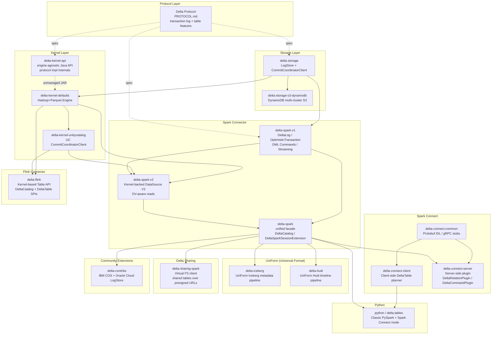
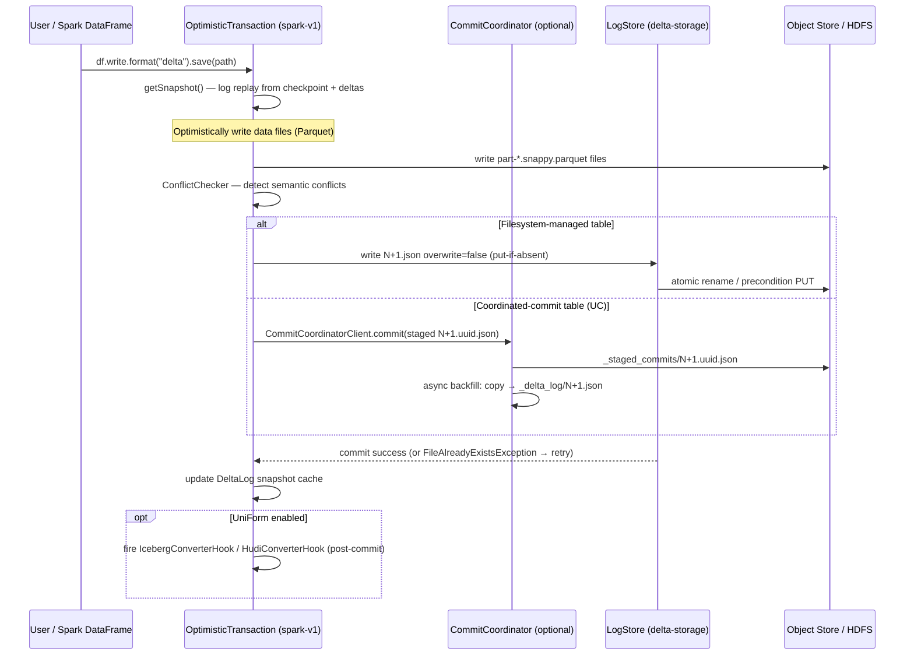
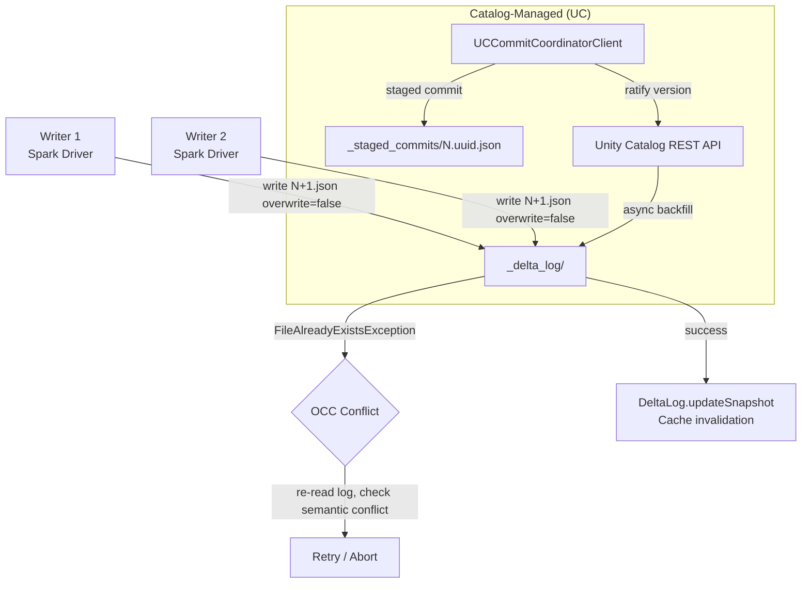
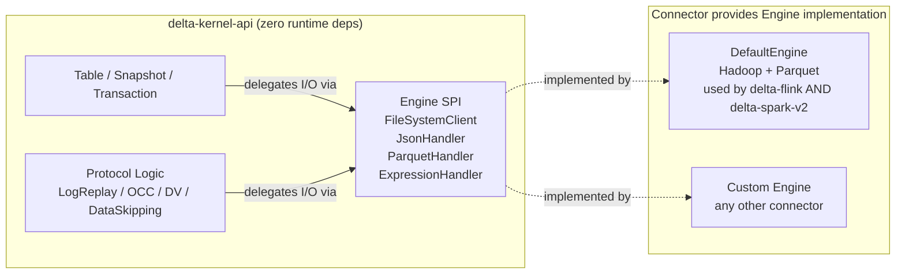
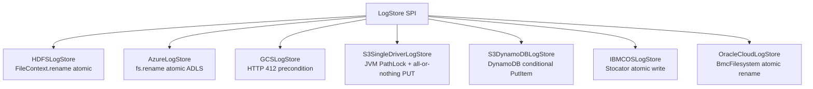
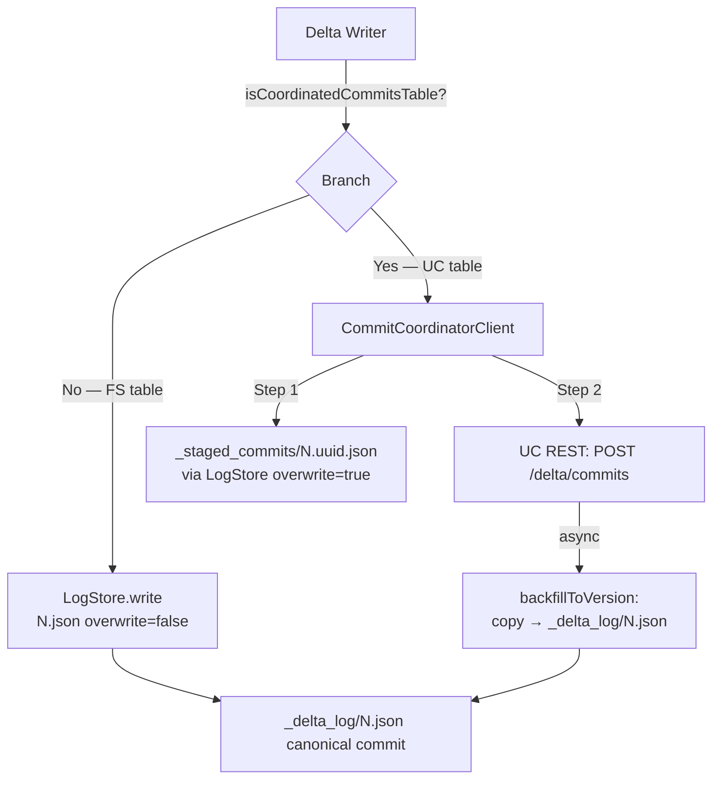
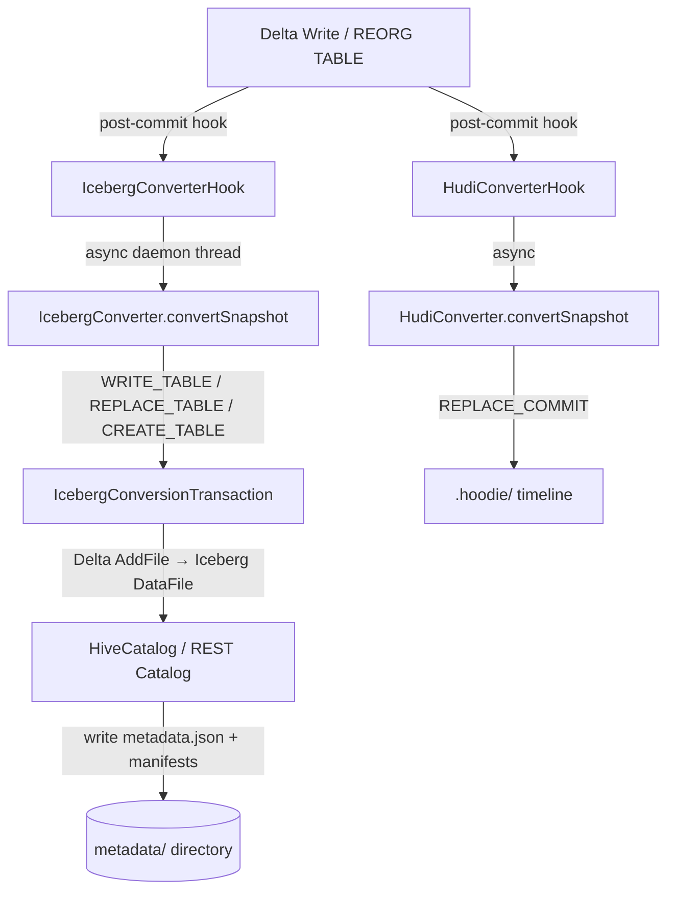
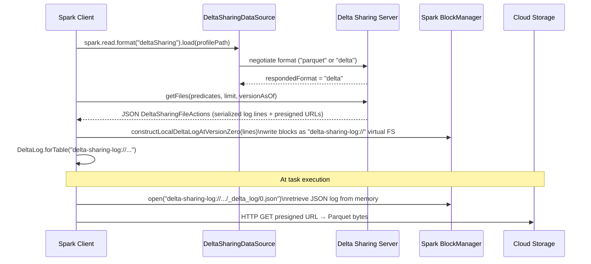
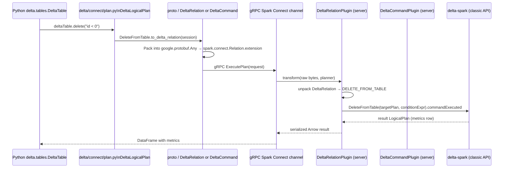

# System Map

#architecture #L2 #system-map

## Architecture Overview

Delta Lake is an open-source **transactional storage layer** that brings ACID semantics, scalable metadata, and time travel to data lake files (primarily Parquet) stored on any object store or distributed filesystem. It is structured as a layered architecture:

```
┌─────────────────────────────────────────────────────────────┐
│                      Client Layer                            │
│  Python (PySpark/Connect)  │  Scala/Java  │  SQL extensions  │
├──────────────┬─────────────┴───────────────┬────────────────┤
│  delta-spark │  delta-spark-connect        │  delta-flink   │
│  (Spark V1+V2│  (gRPC/proto client+server) │  (Kernel SPI)  │
│  connector)  │                             │                │
├──────────────┴─────────────────────────────┴────────────────┤
│           delta-kernel-api  (Engine-agnostic Java API)       │
│  Table │ Snapshot │ ScanBuilder │ Transaction │ Engine SPI   │
├─────────────────────────────────────────────────────────────┤
│     delta-kernel-defaults  (Hadoop + Parquet Engine impl)    │
├──────────────────────────┬──────────────────────────────────┤
│     delta-storage        │    delta-storage-s3-dynamodb     │
│  (LogStore + CommitCoord)│    (DynamoDB multi-cluster S3)   │
├──────────────────────────┴──────────────────────────────────┤
│               Delta Protocol / Transaction Log               │
│          _delta_log/*.json  │  checkpoints  │  CRC          │
└─────────────────────────────────────────────────────────────┘
```

The architecture is governed by four key design principles:

1. **Protocol-first**: The Delta protocol (`PROTOCOL.md`) is the authoritative specification. All engines must honor it.
2. **Engine-agnostic Kernel**: `delta-kernel-api` encapsulates all protocol logic with zero Spark dependencies. Any engine implements the thin `Engine` SPI.
3. **Pluggable Storage Abstraction**: `LogStore` decouples Delta from specific cloud storage atomic-write semantics; `CommitCoordinatorClient` decouples it from filesystem-based version assignment.
4. **UniForm (Universal Format)**: Metadata-only conversion produces Iceberg/Hudi-readable metadata alongside every Delta commit—no data copying.

---

## Full Dependency Graph (Subsystem View)



_Dashed arrows from Protocol = specification relationship (not a code dependency). Solid arrows = build/compile dependency. Arrow direction: A → B means B depends on A._

---

## Subsystems

| Subsystem | Domain | KG Doc |
|---|---|---|
| Protocol Layer | Delta transaction log format, action types, versioning, table features | [[protocol/transaction_log]], [[protocol/table_features]] |
| Storage Layer | Pluggable atomic file writes (LogStore), coordinated commits (CommitCoordinatorClient), S3+DynamoDB | [[modules/storage]] |
| Kernel Layer | Engine-agnostic read/write API, all protocol logic, OCC, deletion vectors, data skipping, checkpointing | [[modules/kernel]] |
| Spark Connector | Full DML support, Structured Streaming, catalog integration, schema evolution, coordinated commits | [[modules/spark]], [[modules/spark/commands]] |
| Spark Connect | gRPC protocol extension enabling remote Python/thin-client Delta operations | [[modules/spark-connect]] |
| Python Bindings | Transparent classic-PySpark and Spark-Connect DeltaTable API | [[modules/python]] |
| UniForm — Iceberg | Metadata-only Delta→Iceberg conversion; server-side planning via REST catalog | [[modules/connectors/uniform-iceberg]] |
| UniForm — Hudi | Metadata-only Delta→Hudi timeline generation | [[modules/connectors/uniform-hudi]] |
| Delta Sharing | Virtual filesystem client for cross-org shared tables via pre-signed URLs | [[modules/sharing]] |
| Flink Connector | Kernel-based Flink Table API connector with incremental checkpoint writer | [[modules/connectors/flink]] |
| Community Extensions | IBM COS and Oracle Cloud LogStore implementations | [[modules/connectors]] |

---

## Data Plane Architecture — How Data Flows to Parquet Files

### Write Path (Spark)



### Read Path (Kernel-based, e.g. Flink / spark-v2)

```mermaid
graph LR
    C[Connector / Engine] -->|Table.forPath| T[Table / SnapshotManager]
    T -->|listFrom _delta_log/| FS[(Object Store)]
    T -->|load checkpoint + delta JSONs| LR[LogReplay]
    LR -->|action reconciliation| SN[SnapshotImpl]
    SN -->|getScanBuilder| SB[ScanBuilder]
    SB -->|data skipping pred| DS[DataSkipping\nmin/max/nullCount statistics]
    DS -->|filtered AddFile list| SC[Scan.getScanFiles]
    SC -->|readParquetFiles| PH[ParquetHandler\nEngine SPI]
    PH -->|physical Parquet data| DV[Scan.transformPhysicalData]
    DV -->|apply RoaringBitmap DV\nadd partition cols / column mapping| OUT[FilteredColumnarBatch\nlogical output rows]
```



---

## Control Plane Architecture — Transaction Log Coordinates Writers



The transaction log provides **serializable isolation** via Optimistic Concurrency Control (OCC):
- Each writer reads at version N (the "read snapshot").
- It writes data files optimistically.
- It then attempts to atomically write `_delta_log/N+1.json` using put-if-absent semantics via `LogStore`.
- If another writer won (`FileAlreadyExistsException`), `ConflictChecker` re-reads the new commits and determines if a semantic conflict exists. If not, the transaction rebases and retries.
- UC-managed tables delegate version assignment to the Unity Catalog control plane, eliminating filesystem-based racing while retaining the same OCC retry loop for semantic conflict detection.

---

## Engine-Agnostic Design Pattern — The Kernel + Engine SPI

The central architectural innovation of the Kernel layer is the **inversion of I/O dependencies**. Instead of Kernel calling filesystems and Parquet readers directly, it calls through the `Engine` SPI—which the connector provides:



This means:
- **`delta-kernel-api`** has **zero runtime dependencies** — no Hadoop, no Parquet, no Spark.
- All protocol implementation (log replay, checkpoint reading/writing, data skipping, deletion vector application, OCC) lives inside `kernel-api`'s `internal` packages.
- Each connector can provide the best `Engine` implementation for its environment (Flink uses native Flink columnar readers; Spark-v2 uses Spark's vectorized reader).

---

## Multi-Connector Architecture

Delta Lake supports multiple query engines reading/writing the same tables through a common protocol. The path differs per engine:

| Engine | Module | Foundation | Spark dependency |
|---|---|---|---|
| Apache Spark | `delta-spark` (v1+v2+unified) | Spark DataSource API + Kernel (v2 read) | Yes (provided) |
| Apache Flink | `delta-flink` | Kernel API + DefaultEngine | **None** |
| Python (classic) | `python/delta/tables.py` | PySpark Py4J bridge → delta-spark | Yes (via Py4J) |
| Python (Connect) | `python/delta/connect/` | gRPC proto → delta-connect-client | Remote gRPC |
| Delta Sharing (Spark) | `delta-sharing-spark` | Virtual LogFS + delta-spark | Yes (via delta-spark) |
| Other JVM engines | `delta-kernel-api` + `delta-kernel-defaults` | DefaultEngine (Hadoop+Parquet) | **None** |

---

## Storage Abstraction Layer — LogStore Provides Pluggable Atomic Writes

Delta's correctness on diverse object stores is achieved through `LogStore`, which abstracts three invariants:
1. **Atomic visibility**: Write is all-or-nothing (never partially visible).
2. **Mutual exclusion**: Only one writer can create `N.json` (losers see `FileAlreadyExistsException`).
3. **Consistent listing**: Once `N.json` is written, `listFrom()` always returns it.

Different storage systems achieve these differently:



Source: [[modules/storage]]

---

## Coordinated Commits Architecture — Catalog-Managed vs. Filesystem-Based



Key properties:
- Staged commits are written with `overwrite=true` (UUID uniqueness prevents collisions).
- Readers of UC-managed tables must call `getCommits()` to merge ratified-but-unbackfilled commits with the `_delta_log/` listing.
- `inCommitTimestamp` is required for catalog-managed tables (file modification timestamps become unreliable in backfill scenarios).

Source: [[modules/storage]], [[protocol/transaction_log]]

---

## UniForm (Universal Format) — Metadata-Only Conversion

UniForm allows the same Parquet files to be read natively by Iceberg and Hudi engines without data copying:



Requirements for UniForm Iceberg:
- `delta.universalFormat.enabledFormats = iceberg`
- `IcebergCompatV2` table feature (enforces column mapping + no DVs + no partition evolution)
- Parquet files must use INT64 timestamps and carry `field_id` metadata
- No data duplication — same Parquet files are read by both engines

Source: [[modules/connectors/uniform-iceberg]], [[modules/connectors/uniform-hudi]]

---

## Delta Sharing Architecture — Cross-Org Data Sharing



The `DeltaSharingLogFileSystem` is a read-only Hadoop `FileSystem` serving a synthetic Delta log from Spark BlockManager. The actual Parquet data is served via pre-signed cloud storage URLs vended by the sharing server. No direct cloud credentials are needed by the client.

Source: [[modules/sharing]]

---

## Spark Connect Integration — Remote Python Delta Clients



Key design decisions:
1. **DML as Relations**: Delete, Update, Merge, Optimize, Restore are `DeltaRelation` (not `DeltaCommand`) because they return execution metrics as a DataFrame.
2. **Extension-point mechanism**: Delta uses `google.protobuf.Any` extension fields—no changes to Spark's core proto schema.
3. **Server delegates to classic API**: `DeltaRelationPlugin` / `DeltaCommandPlugin` are thin translators; all engine logic reuses `delta-spark`.
4. **Vendored proto copy**: Delta's client vendors a copy of Spark Connect's proto definitions to avoid hard compile-time dependency on Spark internals. `ImplicitProtoConversions` handles the serialization round-trip at runtime.

Source: [[modules/spark-connect]], [[modules/python]]

---

## Key Architectural Decisions

### 1. Engine-Agnostic Kernel vs. Spark-Coupled Design

**Decision**: Extract all Delta protocol logic into `delta-kernel-api` with zero runtime dependencies and a thin `Engine` SPI.

**Rationale**: Early Delta was tightly coupled to Spark internals. As non-Spark engines (Flink, Trino, custom) needed Delta access, maintaining separate implementations became unsustainable. The Kernel design centralizes all protocol correctness in one audited library, while letting each engine provide its own optimized I/O layer. Flink's connector is entirely Spark-free as a result.

**Trade-off**: The `delta-spark-v1` connector still implements a parallel protocol stack (log replay via `DeltaLog`, OCC via `OptimisticTransaction`) for the v1 write path and classic reads. The v2 path uses Kernel, creating a **dual read path** that must be maintained simultaneously. See § "Why v1+v2 dual read paths coexist."

### 2. LogStore Over Distributed Locking

**Decision**: Implement mutual exclusion via atomic file operations (`put-if-absent`, `atomic-rename`, `conditional-PUT`) rather than a distributed lock manager.

**Rationale**: Distributed locks introduce coordinator availability as a table availability dependency. Object stores that support atomic PUT semantics (S3, GCS, ADLS, HDFS) can provide the mutual exclusion guarantee without a separate coordination service. For S3 multi-cluster scenarios that lack cross-JVM atomics, `S3DynamoDBLogStore` provides a lightweight external coordinator using DynamoDB's conditional PutItem.

**Trade-off**: Each storage system requires its own `LogStore` implementation with subtle differences (e.g., GCS's new-thread write pattern to avoid interruption bugs, HDFS's `FileContext` vs. `FileSystem` distinction, S3's JVM-local `PathLock`).

### 3. Optimistic Concurrency Control (OCC) Over Pessimistic Locking

**Decision**: Writers read at version N, write data files, then attempt to atomically commit `N+1.json`. If the commit fails due to a concurrent write, `ConflictChecker` determines semantic conflicts and retries.

**Rationale**: Delta tables have high read-to-write ratios, and concurrent conflicting writes to disjoint data partitions are common (e.g., parallel streaming jobs writing to different date partitions). OCC avoids lock contention for the common case of non-conflicting writes. The `ConflictChecker` determines whether conflicting operations are actually semantically incompatible (e.g., two DELETE operations on overlapping files conflict; two INSERT operations do not).

**Trade-off**: High-concurrency write workloads with semantic conflicts (e.g., multiple writers updating the same rows) may experience high retry rates.

### 4. Why v1+v2 Dual Read Paths Coexist

**Decision**: Maintain both the classic Spark `DeltaLog`-based read path (v1) and the Kernel-backed DataSource V2 path (delta-spark-v2) simultaneously.

**Rationale**: 
- **v1** handles all writes and provides the full Spark optimization stack (Catalyst rules, statistics-based data skipping, server-side planning with UC).
- **v2** provides the Kernel-backed path required for deletion-vector-aware reads (`FilteredColumnarBatch` with selection vectors) and Unity Catalog snapshot integration.
- The v1 path is deeply integrated with Spark internals (Catalyst, logical plan rules, analyzer rules) and cannot be trivially replaced.
- The v2 path needs to co-exist with v1 writes until the Kernel write path can match all v1 write features.

**Trade-off**: Two implementations of snapshot reading/log replay must be maintained. `delta-spark-v1-filtered` is a virtual subset of v1 used by v2 to share utility code without circular dependencies.

### 5. Why UniForm Uses Metadata-Only Conversion

**Decision**: Generate Iceberg/Hudi metadata from Delta metadata without copying or rewriting Parquet data files.

**Rationale**: Copying terabytes of Parquet data for format interoperability is prohibitively expensive. Since all three formats (Delta, Iceberg, Hudi) can use the same underlying Parquet files, the only thing that differs is the catalog-level metadata layer. UniForm leverages `IcebergCompatV2` table feature constraints to ensure Delta's Parquet files are already Iceberg-readable (correct `field_id` metadata, INT64 timestamps, column mapping), so only the metadata needs to be generated.

**Trade-off**: UniForm Iceberg requires `IcebergCompatV2` (column mapping mode `name`, no deletion vectors, no partition evolution), restricting some Delta features on UniForm-enabled tables.

---

## Key Data Flows

| Flow | Path | Doc |
|---|---|---|
| Spark batch write | User → OptimisticTransaction → LogStore → `_delta_log/N+1.json` | [[modules/spark]] |
| Spark streaming write | DeltaSink → OptimisticTransaction → LogStore (each micro-batch) | [[modules/spark]] |
| Kernel read (Flink) | Flink → Table.forPath → SnapshotManager → LogReplay → Scan → ParquetHandler | [[modules/kernel]] |
| Spark-v2 DV read | SparkScan → Kernel Scan → transformPhysicalData → RoaringBitmap DV apply | [[modules/spark]] |
| UC coordinated commit | OptimisticTransaction → UCCommitCoordinatorClient → UC REST → backfill | [[modules/storage]] |
| UniForm Iceberg | Post-commit hook → IcebergConverter → HiveCatalog → metadata/*.json | [[modules/connectors/uniform-iceberg]] |
| Delta Sharing batch | DeltaSharingDataSource → server RPC → virtual BlockManager log → TahoeFileIndex | [[modules/sharing]] |
| Python Connect delete | delta.tables.DeltaTable → plan.py proto → gRPC → DeltaRelationPlugin → delta-spark | [[modules/spark-connect]], [[modules/python]] |

---

## External Dependency Architecture

| Library | Version | Role | Modules |
|---|---|---|---|
| Apache Spark SQL/Core/Catalyst | 4.0.1, 4.1.0 (provided) | Execution engine, DataFrame API, Catalyst planner | delta-spark-v1, delta-spark-v2, delta-connect-server |
| Apache Hadoop | 3.4.2 | FileSystem API for LogStore and DefaultEngine I/O | delta-storage, delta-kernel-defaults |
| Apache Parquet | (via Spark/Hadoop) | Columnar data file format for data and checkpoints | delta-kernel-defaults, delta-spark-v1 |
| Apache Flink | 2.0.1 (provided) | Stream processing engine | delta-flink |
| gRPC / protobuf-java | 1.62.2 / 3.25.1 | RPC transport for Spark Connect protocol | delta-connect-* |
| Apache Iceberg | shaded 1.10.1 | Iceberg table format for UniForm metadata generation | delta-iceberg (icebergShaded) |
| Apache Hudi | (provided) | Hudi table format for UniForm timeline generation | delta-hudi |
| AWS DynamoDB SDK | (provided) | External commit coordinator for multi-cluster S3 | delta-storage-s3-dynamodb |
| RoaringBitmap | (via parquet) | Deletion vector bitmap representation | delta-kernel-api |
| Unity Catalog REST client | unitycatalog-client 0.3.1 | UC-managed table commit coordination | delta-kernel-unitycatalog, delta-flink |
| Caffeine | 3.1.8 | Snapshot cache in Flink connector | delta-flink |
| Failsafe | 3.2.0 | Retry / resilience in Flink connector | delta-flink |
| Google Guava | (via Spark) | Hashing (Delta Sharing), cache (DeltaLog) | delta-spark, delta-sharing-spark |

---

## Related Documents

- [[overview/executive_summary]] — Executive summary
- [[architecture/module_dependencies]] — Full artifact matrix and dependency classifications
- [[cross_cutting/interfaces_idl]] — Engine SPI, LogStore SPI, CommitCoordinatorClient SPI, protobuf IDL
- [[cross_cutting/data_models]] — ColumnarBatch/ColumnVector, DataFrame, Delta schema model
- [[cross_cutting/shared_utilities]] — GoldenTableUtils, SchemaUtils, CoordinatedCommitsUtils
- [[protocol/transaction_log]] — Delta log format, snapshot construction, commit protocol
- [[protocol/table_features]] — Table feature registry, protocol versioning
- [[modules/kernel]] — Kernel API, Engine SPI, log replay, deletion vectors, OCC
- [[modules/spark]] — Spark connector, DeltaLog, OptimisticTransaction, streaming
- [[modules/storage]] — LogStore, CommitCoordinatorClient, DynamoDB store
- [[modules/connectors/flink]] — Flink Table API connector
- [[modules/connectors/uniform-iceberg]] — UniForm Iceberg conversion pipeline
