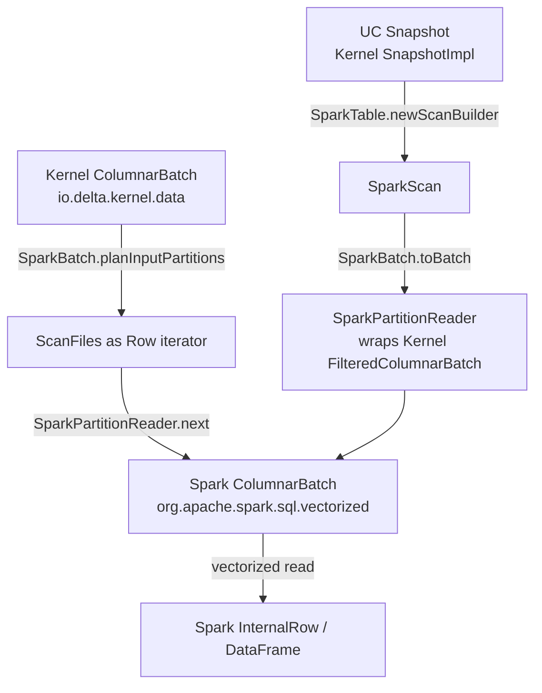

# Data Models

#cross-cutting #L2 #data-models #schema #columnar

## Overview

Delta Lake uses two distinct data model families depending on the execution layer:

1. **Kernel Data Model** (`io.delta.kernel.data`): The engine-agnostic, columnar representation used by `delta-kernel-api` and all connectors built on it (Flink, spark-v2, custom engines). Designed to be zero-copy and columnar.
2. **Spark Data Model** (`org.apache.spark.sql`): The DataFrame/Dataset API backed by Spark's `InternalRow` / columnar vector types, used in the v1 Spark connector path.

These two models interoperate through adapter layers in `delta-spark-v2`.

---

## Kernel Data Model (`io.delta.kernel.data`)

Source: [[modules/kernel]] §§ "Data Model", "Type System"

### Core Types

| Type | Package | Description |
|---|---|---|
| `ColumnarBatch` | `io.delta.kernel.data` | An in-memory batch of rows in **columnar** format. Has a `StructType` schema and an ordered list of `ColumnVector`s, one per column. |
| `ColumnVector` | `io.delta.kernel.data` | Typed column of values. Access via `getInt(rowId)`, `getString(rowId)`, `isNullAt(rowId)`, `getChild(ordinal)` for nested structs. Produced by `Engine.getParquetHandler()` during reads. |
| `Row` | `io.delta.kernel.data` | Row-oriented view of a single record. Wraps `ColumnVector` access with ordinal-based indexing. Used for action rows (AddFile, Metadata, Protocol) in the transaction log. |
| `FilteredColumnarBatch` | `io.delta.kernel.data` | A `ColumnarBatch` paired with an optional boolean `ColumnVector` **selection vector** — `false` or `null` means the row is excluded (deleted). This is how deletion vectors are applied at the API surface. |
| `DataFileStatus` | `io.delta.kernel.data` | Written file path + size + modification time + optional `DataFileStatistics` (numRecords, min/max/nullCount per column). Returned by `ParquetHandler.writeParquetFiles()` and used to generate `AddFile` action rows. |

### Type System (`io.delta.kernel.types`)

All Delta types extend `DataType`. The complete mapping:

| Kernel Type | Delta Protocol Type | Notes |
|---|---|---|
| `BooleanType` | BOOLEAN | |
| `ByteType` | BYTE (int8) | Widened to IntegerType in Iceberg |
| `ShortType` | SHORT (int16) | Widened to IntegerType in Iceberg |
| `IntegerType` | INTEGER (int32) | |
| `LongType` | LONG (int64) | |
| `FloatType` | FLOAT | |
| `DoubleType` | DOUBLE | |
| `DecimalType(precision, scale)` | DECIMAL | |
| `StringType` | STRING | Optional `CollationIdentifier` for collated strings |
| `BinaryType` | BINARY | |
| `DateType` | DATE | Days since Unix epoch |
| `TimestampType` | TIMESTAMP | Microseconds since epoch, UTC |
| `TimestampNTZType` | TIMESTAMP_NTZ | No timezone; wall-clock time |
| `ArrayType(elementType, containsNull)` | ARRAY | |
| `MapType(keyType, valueType, valueContainsNull)` | MAP | |
| `StructType` + `StructField` | STRUCT | Ordered list of named fields |
| `VariantType` | VARIANT | Semi-structured JSON-like; blocked for writes in current Kernel |

### `StructField` Metadata

`StructField` carries `name`, `DataType`, `nullable`, and `FieldMetadata`. `FieldMetadata` is the carrier for all Delta protocol-level field annotations:

| Metadata Key | Purpose |
|---|---|
| `delta.columnMapping.id` | Column ID in column mapping mode (read by `DeltaColumnMapping`) |
| `delta.columnMapping.physicalName` | Physical Parquet column name (may differ from logical name) |
| `parquet.field.id` | Parquet `field_id` attribute; used by `ParquetHandler` for column matching by ID |
| `delta.generationExpression` | SQL expression for generated columns |
| `delta.identity.*` (start/step/allowExplicitInsert) | Identity column generation config |
| `CURRENT_DEFAULT_COLUMN_METADATA_KEY` | Current default value for `AddColumn` DDL |
| `delta.comment` | Column comment |
| `nested_column_ids` (map/array) | Field IDs for nested array element / map key + value |

### `MetadataColumnSpec` — Special Internal Columns

Some metadata columns are injected into physical reads by the Kernel scan machinery:

| Column | Description | Required by |
|---|---|---|
| `ROW_INDEX` | 0-based row number within a Parquet file | Deletion vector application (`Scan.transformPhysicalData`); automatically included when a DV is present |

> [!WARNING] Missing ROW_INDEX causes runtime error
> If a scan file has a deletion vector and `ROW_INDEX` is not in the physical read schema, `Scan.transformPhysicalData` throws `IllegalArgumentException`. The Kernel's `ScanImpl` automatically includes it, but custom `Engine.ParquetHandler` implementations must populate it when requested.

### Statistics Model (`DataFileStatistics`)

Per-file column statistics are attached to `DataFileStatus` during writes and stored in the `add.stats` JSON field in the transaction log:

| Statistic | Type | Description |
|---|---|---|
| `numRecords` | `long` | Row count of the data file (required for IcebergCompatV1/V2) |
| `minValues` | `Map<column, typed value>` | Per-column minimum value |
| `maxValues` | `Map<column, typed value>` | Per-column maximum value |
| `nullCount` | `Map<column, long>` | Per-column null count |

These are used by `DataSkippingUtils` to build statistics predicates during scan. The `StatsSchemaHelper` maps logical column paths (`a.b.c`) to the corresponding nested fields in the stats JSON schema.

Source: [[modules/kernel]] §§ "Data Skipping", `kernel-api.internal`

---

## Spark Data Model (`org.apache.spark.sql`)

Source: [[modules/spark]]

### Core Spark Types

| Type | Description |
|---|---|
| `DataFrame` / `Dataset[T]` | Spark's distributed data collection; backed by a Catalyst logical plan. The primary API surface for Delta reads (`DeltaLog.createRelation()`) and write results (DML metrics). |
| `InternalRow` | Spark's internal row representation (used in Catalyst, vectorized reads). Not directly exposed in the Delta public API but used internally by `SparkTable` / `SparkScan`. |
| `ColumnarBatch` (Spark) | `org.apache.spark.sql.vectorized.ColumnarBatch` — Spark's native columnar batch type, distinct from Kernel's `io.delta.kernel.data.ColumnarBatch`. |
| `ColumnVector` (Spark) | `org.apache.spark.sql.vectorized.ColumnVector` — Spark's native column vector type. |
| `Column` | User-facing Spark expression reference; used in DML conditions and merge actions. |

### Delta Schema Model (Spark side)

In the Spark connector, the table schema is represented as `org.apache.spark.sql.types.StructType`:

| Spark Type | Delta Protocol Type | Notes |
|---|---|---|
| `org.apache.spark.sql.types.StructType` | STRUCT | Logical table schema |
| `org.apache.spark.sql.types.StructField` | Field | Carries `name`, `DataType`, `nullable`, `Metadata` |
| Spark `Metadata` | Field metadata | Carries column mapping IDs, generation expressions, default values |

Spark `StructField.metadata` carries the same Delta-specific keys as Kernel `FieldMetadata`:
- `"delta.columnMapping.id"` → column ID for column mapping
- `"delta.columnMapping.physicalName"` → physical Parquet column name
- `"delta.generationExpression"` → SQL generation expression
- `"delta.identity.*"` → identity column configuration
- `"comment"` → column-level comment

### Actions Model (`org.apache.spark.sql.delta.actions`)

Delta protocol actions are Scala case classes in `delta-spark-v1`:

| Case Class | Protocol Action | Key Fields |
|---|---|---|
| `AddFile` | `add` | path, partitionValues, size, modificationTime, dataChange, deletionVector (optional), stats, tags |
| `RemoveFile` | `remove` | path, deletionTimestamp, dataChange, extendedFileMetadata |
| `AddCDCFile` | `cdc` | path, partitionValues, size, dataChange, tags |
| `Metadata` | `metaData` | id, name, description, format, schemaString, partitionColumns, configuration |
| `Protocol` | `protocol` | minReaderVersion, minWriterVersion, readerFeatures, writerFeatures |
| `CommitInfo` | `commitInfo` | timestamp, operation, operationParameters, operationMetrics, engineInfo, version |
| `SetTransaction` | `txn` | appId, version, lastUpdated (idempotent transaction marker) |
| `DomainMetadata` | `domainMetadata` | domain, configuration (JSON), removed |
| `CheckpointMetadata` | `checkpointMetadata` | version (V2 checkpoint manifest) |
| `SidecarFile` | `sidecar` | path, sizeInBytes, modificationTime, tags (V2 checkpoint sidecar reference) |

These mirror the JSON fields in the transaction log. The same action model is used for log writing (`OptimisticTransaction.commit()`), log replay (`Snapshot.stateDS`), and streaming (`DeltaSource`).

---

## Interoperability Between Kernel and Spark Data Models

The bridge between the two data models lives in `delta-spark-v2`:

`SparkPartitionReader` in `delta-spark-v2` converts Kernel's `FilteredColumnarBatch` (with its selection vector) into Spark's `ColumnarBatch` by:
1. Applying the selection vector to exclude DV-deleted rows.
2. Remapping Kernel `ColumnVector`s to Spark's `ColumnVector` interface.
3. Adding partition columns from partition values (as Spark `ConstantColumnVector`s).

Source: [[modules/spark]] §§ "delta-spark-v2", "spark.v2-interop"

---

## Type System Mapping: Kernel ↔ Spark ↔ Iceberg ↔ Parquet

| Delta/Kernel Type | Spark SQL Type | Iceberg Type | Parquet Physical Type | Notes |
|---|---|---|---|---|
| `BooleanType` | `BooleanType` | `BooleanType` | BOOLEAN | |
| `ByteType` | `ByteType` | `IntegerType` | INT32 (INT_8) | Iceberg widens |
| `ShortType` | `ShortType` | `IntegerType` | INT32 (INT_16) | Iceberg widens |
| `IntegerType` | `IntegerType` | `IntegerType` | INT32 | |
| `LongType` | `LongType` | `LongType` | INT64 | Iceberg min/max stats TODO |
| `FloatType` | `FloatType` | `FloatType` | FLOAT | |
| `DoubleType` | `DoubleType` | `DoubleType` | DOUBLE | |
| `DecimalType(p,s)` | `DecimalType(p,s)` | `DecimalType(p,s)` | INT32/INT64/BINARY | |
| `StringType` | `StringType` | `StringType` | BYTE_ARRAY (UTF8) | |
| `BinaryType` | `BinaryType` | `BinaryType` | BYTE_ARRAY | |
| `DateType` | `DateType` | `DateType` | INT32 (DATE) | Days since epoch |
| `TimestampType` | `TimestampType` | `TimestampType.withZone()` | INT64 (TIMESTAMP_MICROS) | IcebergCompat requires INT64, not INT96 |
| `TimestampNTZType` | `TimestampNTZType` | `TimestampType.withoutZone()` | INT64 | |
| `ArrayType` | `ArrayType` | `ListType` | REPEATED group | V2 only for IcebergCompat |
| `MapType` | `MapType` | `MapType` | MAP group | V2 only for IcebergCompat |
| `StructType` | `StructType` | `StructType` | GROUP | |
| `VariantType` | `VariantType` | (not supported) | BINARY (Parquet variant spec) | Blocked for UniForm writes |

Source: [[modules/kernel]] §§ "Type System", [[modules/connectors/uniform-iceberg]] §§ "Delta Schema → Iceberg Schema"

---

## Deletion Vector Data Model

Deletion vectors (DVs) are off-by-default bitmaps stored alongside data files that mark deleted rows without rewriting the file.

| Component | Type | Description |
|---|---|---|
| `DeletionVectorDescriptor` | `StructType` in `AddFile` | `storageType` (inline/relative/absolute), `pathOrInlineDv`, `offset`, `sizeInBytes`, `cardinality` |
| `RoaringBitmapArray` | Java class | 64-bit extension of `org.roaringbitmap.RoaringBitmap`. High 32 bits = index into array of 32-bit bitmaps. |
| Inline DV | Base85 string | Small DVs embedded directly in `AddFile.deletionVector.pathOrInlineDv` JSON field |
| Relative DV | Relative path | DV file stored relative to table root (`deletion_vector-<uuid>.bin`) |
| Absolute DV | Full URI | DV file at an absolute URI |

DV application in `Scan.transformPhysicalData()`:
1. Read `ROW_INDEX` metadata column from Parquet (0-based row number within file).
2. Load the `RoaringBitmapArray` from the DV descriptor (lazy, cached per file).
3. Create a `SelectionColumnVector` wrapping `(bitmap, rowIndexVector)` — row is included iff its row index is **not** in the bitmap.
4. Wrap the `ColumnarBatch` + selection vector as `FilteredColumnarBatch`.

Source: [[modules/kernel]] §§ "Deletion Vector Application"

---

## Column Mapping Data Model

Column mapping allows Delta columns to have a logical name that differs from their physical Parquet column name. This supports schema evolution (column renames) and Iceberg interoperability.

| Mode | Physical column ID | Use case |
|---|---|---|
| `none` | Name-based matching (legacy) | Default for new tables without column mapping |
| `name` | Physical names stored in field metadata | UniForm Iceberg requires this (or `id` mode) |
| `id` | Integer field IDs stored in field metadata | Parquet `field_id` attribute; used by Iceberg readers |

`StructField.metadata` carries:
- `"delta.columnMapping.id"` → integer column ID
- `"delta.columnMapping.physicalName"` → physical Parquet column name (may differ from `StructField.name`)

When column mapping is enabled, `Scan.transformPhysicalData()` remaps physical column names to logical names in the output `FilteredColumnarBatch`.

Source: [[modules/kernel]] §§ "Column Mapping", [[modules/connectors/uniform-iceberg]] §§ "IcebergCompatV2 Requirements"

---

## Related Documents

- [[cross_cutting/interfaces_idl]] — Engine SPI, LogStore SPI, how these types flow through the SPI
- [[cross_cutting/shared_utilities]] — JsonUtils, SchemaUtils that manipulate these types
- [[modules/kernel]] — Full Kernel data model, type system, `ColumnarBatch` / `ColumnVector` contracts
- [[modules/spark]] — Spark-side actions model, Delta schema representation
- [[modules/connectors/uniform-iceberg]] — Delta→Iceberg type mapping, statistics conversion
- [[protocol/transaction_log]] — `AddFile`, `RemoveFile`, other action types in JSON format
