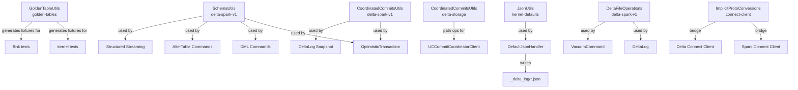

# Shared Utilities

#cross-cutting #L2 #utilities #scala-implicits #test

## Overview

Delta Lake has a small set of utility classes and Scala extension mechanisms that are used across multiple modules. This document catalogs them: what they do, where they live, and which modules depend on them.

```
delta-storage         → CoordinatedCommitsUtils (shared Spark+Storage helper)
delta-kernel-defaults → JsonUtils, MetadataUtils (kernel internal)
delta-spark-v1        → SchemaUtils, DeltaFileOperations, DeltaEncoder (Spark internal)
connectors/golden-tables → GoldenTableUtils (cross-module test fixture generator)
```

---

## 1. GoldenTableUtils (`golden-tables`)

### Purpose

`GoldenTableUtils` (and the broader `golden-tables` module) generates the **reference Parquet + Delta log fixture files** used by kernel integration tests, the Flink connector, and any third-party Kernel implementation. These fixtures are written once and committed to the repository (under `kernel/kernel-api/src/test/resources/golden-tables/` and related paths).

Golden tables exist because delta-kernel-api tests cannot depend on `delta-spark` to generate test data — that would create a circular dependency. Instead, a standalone JVM program (`GenerateGoldenTables`) runs ahead of time (via `sbt generateGoldenTables`) and emits static, version-controlled Delta table directories.

### Key Components

| Class / Object | Role |
|---|---|
| `GoldenTableUtils` | Shared reader/locator for golden table directories; resolves paths for `Table.forPath(engine, path)` |
| `GenerateGoldenTables` | One-time generator program. Runs via `sbt run` in the `golden-tables` project; writes all golden table directories. |
| `TestRow` | Structural equality wrapper for `Row` objects in tests (unrelated to engine Row interface). |

### Module Dependencies

```
golden-tables
  ├── delta-spark-v1 (compile — to generate via OptimisticTransaction)
  ├── delta-kernel-api (compile — TestRow, GoldenTableUtils)
  └── delta-kernel-defaults (runtime — DefaultEngine for verification reads)
```

> [!NOTE] One-way dependency
> `golden-tables` depends on Spark to **generate** fixtures, but all consumers depend only on the output files, not on the `golden-tables` module itself. Kernel tests reference the file paths directly; `delta-flink` has a similar independent copy of some golden tables.

Source: [[modules/connectors/golden-tables]], [[modules/connectors/flink]] §§ "Testing"

---

## 2. SchemaUtils (`delta-spark-v1`)

### Purpose

`SchemaUtils` is the central Spark-side schema manipulation library. It handles schema merging, compatibility checks, column additions/removals, and the translation between user-facing column names and column mapping physical names.

### Location

```
spark/src/main/scala/org/apache/spark/sql/delta/schema/SchemaUtils.scala
```

### Key Operations

| Operation | Description |
|---|---|
| `mergeSchemas(current, update, allowImplicit, ...)` | Merge two `StructType`s during schema evolution; enforces type compatibility rules; inserts new top-level or nested fields |
| `checkColumnNameDuplication(schema, colType)` | Verify no duplicate column names (case-insensitive) at any nesting level |
| `normalizeColumnNamesInDataType(schema, dt)` | Canonicalize casing for nested field paths |
| `findColumnPosition(column, schema)` | Find a column path (list of field names) within a (possibly nested) schema |
| `addColumn(schema, colName, position, colType)` | Return a new `StructType` with the column inserted at a specific position |
| `dropColumn(schema, columnPath)` | Return a new `StructType` with the field at `columnPath` removed |
| `transformColumns(schema)(fn)` | Recursively map all `StructField`s in schema; used for column renames, metadata updates, etc. |
| `checkFieldNames(names)` | Validate field names don't contain `.`, `[`, `]` (illegal in nested access syntax) |
| `isReadCompatible(existingSchema, readSchema)` | Check if `readSchema` is a projection of `existingSchema` (all read columns exist with compatible types) |

### Column Mapping Interaction

`SchemaUtils` is tightly coupled to column mapping logic:

- `DeltaColumnMappingBase` calls `SchemaUtils.transformColumns` to assign/verify physical column names and field IDs.
- When column mapping mode is `name`, `SchemaUtils.mergeSchemas` must preserve existing `delta.columnMapping.physicalName` metadata entries.

### Consumers

Used throughout `delta-spark-v1`:
- `OptimisticTransaction.updateMetadata` — validates schema before writing `Metadata` action
- `MergeIntoCommand`, `UpdateCommand`, `DeleteCommand` — verify output schema compatibility
- `DeltaSource` / `DeltaSink` — schema compatibility checks on streaming reads/writes
- `AlterTableCommands` (`ADD COLUMN`, `DROP COLUMN`, `RENAME COLUMN`) — produce modified schemas

Source: [[modules/spark]]

---

## 3. CoordinatedCommitsUtils (`delta-storage` + `delta-spark-v1`)

### Purpose

`CoordinatedCommitsUtils` is a shared helper that appears in **both** `delta-storage` (Java, storage-layer) and `delta-spark-v1` (Scala, Spark-layer) namespaces. This split is intentional: the storage-level utilities need no Spark dependency, while the Spark-level utilities know about `SparkConf`, `DataFrame`, and `DeltaLog`.

### Location

```
storage/src/main/java/io/delta/storage/commit/CoordinatedCommitsUtils.java
spark/src/main/scala/org/apache/spark/sql/delta/coordinatedcommits/CoordinatedCommitsUtils.scala
```

### Storage-Level Utility (`delta-storage`)

| Method | Description |
|---|---|
| `getCommitCoordinatorName(tableProperties)` | Extracts `delta.coordinatedCommits.commitCoordinator-preview` from table properties |
| `getCommitCoordinatorConf(tableProperties)` | Parses the JSON-encoded coordinator configuration map from table properties |
| `getTableConf(tableProperties)` | Extracts `delta.coordinatedCommits.tableConf-preview` — per-table opaque config returned by `registerTable` |
| `normalizePath(path)` | Ensures `_delta_log/` paths are comparable; strips trailing slashes etc. |
| `constructStagedCommitPath(logPath, version)` | Builds the staged commit file path: `_commits/<20-digit version>.uuid.json` |
| `isBackfilledCommit(path)` | True if path is in `_delta_log/` (not `_delta_log/_commits/`) |
| `getBackfilledDeltaFilePath(logPath, version)` | Builds the canonical `_delta_log/<20-digit version>.json` path |
| `getMinVersionForCCTables(...)` | Minimum version from `GetCommitsResponse` needed to reconstruct a snapshot |

### Spark-Level Utility (`delta-spark-v1`)

| Method | Description |
|---|---|
| `commitCoordinatorClientOpt(snapshot)` | Returns `Option[CommitCoordinatorClient]` for a `Snapshot`'s table based on protocol + metadata |
| `getCommitCoordinator(spark, name, conf)` | Registry lookup → `CommitCoordinatorClient` instance; used by `OptimisticTransaction` |
| `registerTable(...)` | Thin wrapper around `CommitCoordinatorClient.registerTable`; called from `CreateDeltaTableCommand` |
| `validateCoordinatedCommitsMDConf(...)` | Validate that in-flight metadata changes don't break coordinated commit invariants |
| `unbackfilledCommitsIterator(...)` | Wraps `GetCommitsResponse` commits + `LogStore` listing to produce a unified sorted commit stream for snapshot construction |

### Interaction with `DeltaLog` Snapshot Construction

When `DeltaLog.getSnapshotAt` is called for a coordinated-commits table:

```
1. LogSegment.fromPath reads _delta_log/: checkpoint + any backfilled .json files
2. CoordinatedCommitsUtils.unbackfilledCommitsIterator fetches staged commits from coordinator
3. Merge + replay produces full snapshot
```

Source: [[modules/storage]] §§ "CommitCoordinator", [[modules/spark]] §§ "Coordinated Commits"

---

## 4. JsonUtils (`delta-kernel-defaults`)

### Purpose

`JsonUtils` is an internal kernel-defaults utility providing Jackson-backed JSON serialization helpers for log file I/O. It is **not** part of the public kernel API and is not exported.

### Location

```
kernel/kernel-defaults/src/main/java/io/delta/kernel/defaults/internal/json/JsonUtils.java
```

### Key Operations

| Method | Description |
|---|---|
| `rowToJson(Row schema, Row data)` | Serialize a Kernel `Row` to JSON string per Delta protocol null-handling rules |
| `parseJson(String json, StructType schema)` | Parse a JSON string into a Kernel `Row` |
| `toJsonNode(Object value)` | Convert a primitive/struct/array/map value to a Jackson `JsonNode` |

### Delta-Specific Null Serialization Rules

Jackson's defaults don't match Delta's protocol requirements. `JsonUtils` overrides them:

1. **Struct fields with `null` values** → field is **omitted** from JSON output (NOT written as `"key": null`)
2. **Map entries with `null` values** → entry IS written as `"key": null`
3. **`false` booleans** → written only if they are explicit protocol fields (not skipped like nulls)

> [!WARNING] Rule 1 is subtle
> Many JSON libraries write `null` for missing optional struct fields. Delta protocol requires omission. Any `JsonHandler` implementation must replicate this exact behavior for log entries to be round-trippable.

Source: [[modules/kernel]] §§ "JsonUtils", [[cross_cutting/interfaces_idl]] §§ "JsonHandler"

---

## 5. DeltaFileOperations (`delta-spark-v1`)

### Purpose

`DeltaFileOperations` provides filesystem-level helpers used throughout the Spark connector: listing `_delta_log/` directories, finding log and checkpoint files, identifying whether a path is in a Delta table's log, and resolving relative paths.

### Location

```
spark/src/main/scala/org/apache/spark/sql/delta/DeltaFileOperations.scala
```

### Key Operations

| Method | Description |
|---|---|
| `listDeltaAndCheckpointFiles(path, fs, startVersion)` | List all `.json` and `.<n>.checkpoint.*` files in `_delta_log/` starting from a version |
| `recursiveListDirs(fs, root)` | Recursive listing for table discovery and VACUUM |
| `pathExists(fs, path)` | Null-safe `FileSystem.exists` call |
| `createRelativeSymlink(linkDir, target)` | For `generate symlink_format_manifest` |
| `isInDeltaDir(path)` | True if path is inside a `_delta_log/` directory |
| `absolutePath(basePath, child)` | Resolve child relative to basePath |

---

## 6. Key Scala Implicits and Extension Methods

### `ImplicitMetadataOperations` (`delta-spark-v1`)

A Scala `trait` mixed into `OptimisticTransaction` and `DeltaLog`. Provides extension-like methods on `Metadata` and `Protocol` to validate and update them during a commit:

```scala
trait ImplicitMetadataOperations {
  def updateMetadata(metadata: Metadata)(implicit txn: OptimisticTransaction): Unit
  def assertDataSchemaIsAllowed(schema: StructType, protocol: Protocol): Unit
  def verifySchemaNullability(schema: StructType, isStreaming: Boolean): Unit
}
```

### `DeltaTableUtils` Implicits (`delta-spark-v1`)

`DeltaTableUtils` provides Scala implicit conversions and extension methods on `DataFrame`, `DataStreamWriter`, and `SparkSession`:

```scala
implicit class DeltaDataFrameOperations(df: DataFrame) {
    def toTable(tableName: String): Unit = ...
    def clone(target: String, ...): DataFrame = ...
}
implicit class DeltaSparkSessionOps(spark: SparkSession) {
    def isDeltaTable(path: String): Boolean = ...
}
```

### `ImplicitProtoConversions` (`delta-connect-client`)

Provides implicit conversions between Delta's vendored Spark Connect proto classes and Spark's live proto classes via byte-level serialization:

```scala
implicit def toSparkRelation(r: delta.vendored.spark.connect.Relation): spark.connect.Relation =
  spark.connect.Relation.parseFrom(r.toByteArray)
```

This is the bridge enabling the Delta Connect client to compose with the official Spark Connect client's `RemoteSparkSession`.

Source: [[modules/spark-connect]] §§ "Vendored Proto Copy"

### `DeltaEncoder` (`delta-spark-v1`)

```scala
object DeltaEncoder {
  implicit def encoder[T <: Action]: Encoder[T] = ...
}
```

Provides a Spark `Encoder` for `Action` case class subtypes so that `DeltaLog` can use `Dataset[SingleAction]` internally (for log replay). This avoids using slow `KryoEncoder` for Action objects.

### `ColumnWithDefaultExprUtils` (`delta-spark-v1`)

Scala object with helpers for resolving and validating `DEFAULT` column expressions. Used by `AlterTableAddColumnsDelta`, `MergeIntoCommand`, and `WriteIntoDelta` to evaluate column default expressions.

---

## 7. MetadataUtils / ActionUtils (`delta-kernel-api`)

### Purpose

Internal helpers inside `delta-kernel-api` for working with `Metadata` and `Action`-like row objects extracted from the transaction log.

### Location

```
kernel/kernel-api/src/main/java/io/delta/kernel/internal/util/
  ├── ColumnMetadataUtils.java
  ├── PartitionUtils.java
  ├── SchemaUtils.java           # kernel-side; distinct from Spark's SchemaUtils
  └── VectorUtils.java           # helpers for ColumnVector
```

### Key Utilities

| Class | Key methods |
|---|---|
| `SchemaUtils` (kernel) | `pruneSchema(schema, requiredCols)`, `validateSchema(schema)`, `isNested(type)` — simpler than the Spark version; no evolution logic |
| `PartitionUtils` | `extractPartitionValues(row, partitionCols)`, `serializePartitionValue(literal)` — encode/decode partition directory paths |
| `ColumnMetadataUtils` | Extract `delta.columnMapping.id`, `delta.columnMapping.physicalName` from `FieldMetadata` — used by column mapping path resolution in log replay |
| `VectorUtils` | `toJavaList(ColumnVector)`, `toColumnVector(List, type)` — convenience bridge for tests and internal code |

---

## Cross-Module Utility Dependency Map



---

## Related Documents

- [[cross_cutting/interfaces_idl]] — The SPI interfaces these utilities work with
- [[cross_cutting/data_models]] — `Row`, `ColumnVector`, `ColumnarBatch` types used by these utilities
- [[modules/kernel]] — `JsonUtils`, `VectorUtils`, `PartitionUtils` context
- [[modules/spark]] — `SchemaUtils`, `DeltaFileOperations`, `DeltaEncoder` context
- [[modules/storage]] — `CoordinatedCommitsUtils` (storage layer) context
- [[modules/spark-connect]] — `ImplicitProtoConversions` context
- [[modules/connectors/golden-tables]] — `GoldenTableUtils` detail
