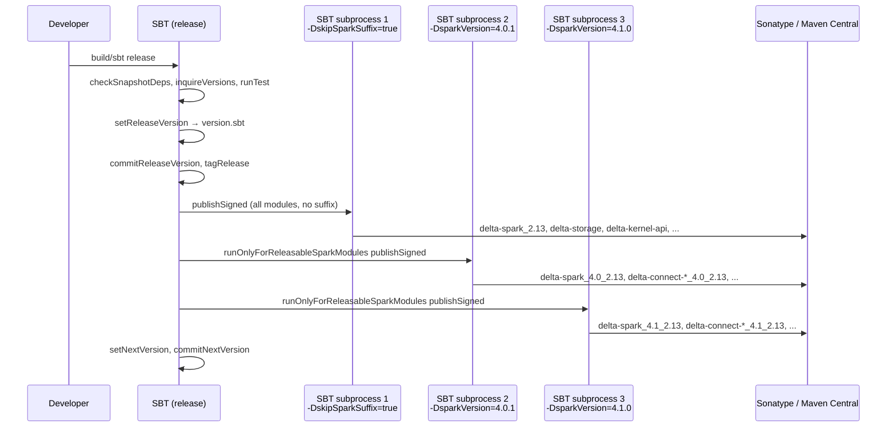
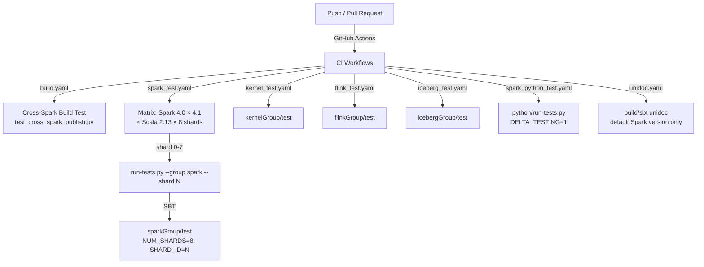

# Build System & Benchmarks

## Purpose

This document covers the SBT multi-project build system for the Delta Lake OSS monorepo, including cross-Spark-version build mechanics, artifact publishing, binary compatibility checking, code quality tooling, the Spark-level benchmarks module, and the CI/CD pipeline.

---

## Build System Overview

| Property | Value |
|---|---|
| Build tool | SBT (Scala Build Tool) |
| Primary language | Scala 2.13.17 (2.12 dropped) |
| Java bytecode target | JVM 11 (default); JVM 17 for Spark 4.x modules |
| Current version | `4.1.0-SNAPSHOT` (`version.sbt`) |
| Default Spark version | Spark 4.1.0 |
| Supported Spark versions | 4.0.1, 4.1.0 (`ALL_SPECS`) |
| Cross-build entrypoint | `project/CrossSparkVersions.scala` |
| Root build file | `build.sbt` (1710 lines) |

The build is a flat monorepo where all subprojects share the same `build.sbt` at the repository root. There is no per-module `build.sbt` (exception: `benchmarks/` has its own `build.sbt`). All Scala modules target Scala 2.13 only — Scala 2.12 support was dropped.

---

## Cross-Spark Version Build (`project/CrossSparkVersions.scala`)

### SparkVersionSpec

The `SparkVersionSpec` case class captures all per-Spark-version build configuration:

```scala
// project/CrossSparkVersions.scala:214-246
case class SparkVersionSpec(
  fullVersion: String,        // e.g. "4.0.1"
  targetJvm: String,          // "11" or "17"
  additionalSourceDir: Option[String], // "scala-shims/spark-4.0" etc.
  supportIceberg: Boolean,
  supportHudi: Boolean = true,
  antlr4Version: String,
  additionalJavaOptions: Seq[String] = Seq.empty,
  jacksonVersion: String = "2.15.2",
  additionalResolvers: Seq[Resolver] = Seq.empty
)
```

The `additionalSourceDir` field injects version-specific shim sources at compile time. For Spark 4.0 that is `src/main/scala-shims/spark-4.0` and `src/main/java-shims/spark-4.0`, enabling API-incompatibility workarounds without `#if`-style macros.

### Defined Spark Versions

```scala
// project/CrossSparkVersions.scala:265-307
private val spark40 = SparkVersionSpec(
  fullVersion = "4.0.1",
  targetJvm = "17",
  additionalSourceDir = Some("scala-shims/spark-4.0"),
  supportIceberg = true,   // delta-iceberg published for 4.0 only
  antlr4Version = "4.13.1",
  jacksonVersion = "2.18.2"
)

private val spark41 = SparkVersionSpec(
  fullVersion = "4.1.0",
  targetJvm = "17",
  additionalSourceDir = Some("scala-shims/spark-4.1"),
  supportIceberg = false,  // no Iceberg for 4.1
  supportHudi = false,     // no Hudi for 4.1
  antlr4Version = "4.13.1",
  jacksonVersion = "2.18.2"
)

private val spark42Snapshot = SparkVersionSpec(
  fullVersion = "4.2.0-SNAPSHOT",
  targetJvm = "17",
  additionalSourceDir = Some("scala-shims/spark-4.2"),
  supportIceberg = false,
  supportHudi = false,
  antlr4Version = "4.13.1",
  additionalResolvers = Seq("jitpack" at "https://jitpack.io")
)

val DEFAULT = spark41           // build without -DsparkVersion uses 4.1
val MASTER: Option[SparkVersionSpec] = None  // no master/snapshot in this branch
val ALL_SPECS = Seq(spark40, spark41)        // spark42Snapshot excluded
```

> [!NOTE] spark42Snapshot excluded from ALL_SPECS
> `spark42Snapshot` is defined but intentionally excluded from `ALL_SPECS` and not released. It is present for forward-compatibility testing only. To build against it, you would need to add it to `ALL_SPECS`.

### Selecting the Spark Version

The `sparkVersion` Java system property controls which version is active:

```bash
build/sbt                           # Uses DEFAULT (Spark 4.1.0)
build/sbt -DsparkVersion=4.0        # Uses Spark 4.0.1
build/sbt -DsparkVersion=4.1        # Uses Spark 4.1.0
build/sbt -DsparkVersion=4.0.1      # Full version string also works
build/sbt -DsparkVersion=default    # Alias for DEFAULT
# build/sbt -DsparkVersion=master   # Error: no MASTER configured
```

Resolution in `CrossSparkVersions.getSparkVersionSpec()` tries:
1. Resolve aliases (`default`, `master`)
2. Match by `fullVersion` or `shortVersion` in `ALL_SPECS`
3. Throw `IllegalArgumentException` with valid options

### Module Classification

| Type | Settings | Example Modules |
|---|---|---|
| Spark-dependent **published** | `sparkDependentSettings` + `releaseSettings` | `delta-spark`, `delta-connect-*`, `delta-sharing-spark`, `delta-iceberg`, `delta-hudi`, `delta-contribs` |
| Spark-dependent **internal** | `sparkDependentSettings` + `skipReleaseSettings` | `delta-spark-v1`, `delta-spark-v2`, `delta-spark-v1-filtered` |
| Spark-independent **published** | neither setting | `delta-storage`, `delta-kernel-api`, `delta-kernel-defaults`, `delta-kernel-unitycatalog` |
| Internal/test only | `skipReleaseSettings` | `delta-suite-generator`, `golden-tables`, `delta-kernel-benchmarks`, `benchmarks` |

### Artifact Naming Convention

Spark-dependent modules always carry a Spark version suffix in development builds:

```
io.delta:delta-spark_4.0_2.13:4.1.0    # built against Spark 4.0
io.delta:delta-spark_4.1_2.13:4.1.0    # built against Spark 4.1 (default)
io.delta:delta-storage:4.1.0            # Spark-independent, no suffix
io.delta:delta-kernel-api:4.1.0         # Java-only, no Scala suffix
```

During release, backward-compatible artifacts **without** the suffix are also published:

```
io.delta:delta-spark_2.13:4.1.0         # backward compat (skipSparkSuffix=true)
```

The `skipSparkSuffix=true` property strips the `_4.x` infix from the module name.

### Jackson Version Overrides

Jackson is pinned per Spark version to prevent classpath conflicts. Spark 4.0 and 4.1 both use Jackson 2.18.2; this is applied as `dependencyOverrides` for all Jackson modules in every Spark-dependent project.

---

## SBT Project Structure

### Complete Project Table

| SBT ref | Artifact name | Source path | Published | Notes |
|---|---|---|---|---|
| `connectCommon` | `delta-connect-common_4.x_2.13` | `spark-connect/common` | Yes | Protobuf + gRPC stubs; `exportJars := true` |
| `connectClient` | `delta-connect-client_4.x_2.13` | `spark-connect/client` | Yes | Client-side Spark Connect planner |
| `connectServer` | `delta-connect-server_4.x_2.13` | `spark-connect/server` | Yes | Server-side Spark Connect plugin; `exportJars := true` |
| `deltaSuiteGenerator` | `delta-suite-generator` | `spark/delta-suite-generator` | No | Internal code generation tool |
| `sparkV1` | `delta-spark-v1` | `spark/` | No | Core Delta Spark (v1); `exportJars := true`; tests compiled in `spark` module |
| `sparkV1Filtered` | `delta-spark-v1-filtered` | `spark-v1-filtered/` | No | v1 classes minus DeltaLog/Snapshot/OTx (used by v2) |
| `sparkV2` | `delta-spark-v2` | `spark/v2` | No | Kernel-based DataSource V2; `exportJars := true` |
| `spark` | `delta-spark_4.x_2.13` | `spark-unified/` | Yes | Published facade; merges v1+v2+Python files |
| `contribs` | `delta-contribs_2.13` | `contribs/` | Yes | Community LogStore impls |
| `sparkUnityCatalog` | `delta-spark-unitycatalog` | `spark/unitycatalog/` | No | UC integration tests only |
| `sharing` | `delta-sharing-spark_4.x_2.13` | `sharing/` | Yes | Delta Sharing Spark client |
| `kernelApi` | `delta-kernel-api` | `kernel/kernel-api` | Yes (Java-only) | Shades Jackson; produces fat JAR |
| `kernelDefaults` | `delta-kernel-defaults` | `kernel/kernel-defaults` | Yes (Java-only) | Hadoop/Parquet engine impl |
| `kernelBenchmarks` | `delta-kernel-benchmarks` | `kernel/kernel-benchmarks` | No | JMH benchmarks for kernel |
| `kernelUnityCatalog` | `delta-kernel-unitycatalog` | `kernel/unitycatalog` | Yes (Java-only) | UC CommitCoordinator client |
| `storage` | `delta-storage` | `storage/` | Yes (Java-only) | LogStore + CommitCoordinatorClient |
| `storageS3DynamoDB` | `delta-storage-s3-dynamodb` | `storage-s3-dynamodb/` | Yes (Java-only) | DynamoDB-backed S3 multi-writer |
| `iceberg` | `delta-iceberg_2.13` | `iceberg/` | Yes (if `supportIceberg`) | UniForm Iceberg conversion; fat JAR |
| `icebergShaded` | `iceberg-shaded` | `icebergShaded/` | No | Shaded Iceberg deps (shadedForDelta.* prefix) |
| `icebergTestsShaded` | `iceberg-tests-shaded` | `icebergTestsShaded/` | No | Shaded Iceberg test deps |
| `testDeltaIcebergJar` | `test-delta-iceberg-jar` | `testDeltaIcebergJar/` | No | Integration test for Iceberg JAR |
| `hudi` | `delta-hudi_2.13` | `hudi/` | Yes (if `supportHudi`) | UniForm Hudi conversion; fat JAR |
| `flink` | `delta-flink` | `flink/` | Only Scala 2.12 | Java-only; Table API connector; `crossPaths := false` |
| `goldenTables` | `golden-tables` | `connectors/golden-tables` | No | Test fixture tables |

### Project Groups (aggregators)

```scala
// build.sbt:1504-1560
lazy val sparkGroup    // spark, sparkV1, sparkV1Filtered, sparkV2, contribs, sparkUnityCatalog,
                       // storage, storageS3DynamoDB, sharing, connect* (+ hudi if supportHudi)
lazy val icebergGroup  // iceberg, testDeltaIcebergJar (if supportIceberg)
lazy val kernelGroup   // kernelApi, kernelDefaults, kernelBenchmarks
lazy val flinkGroup    // flink
```

These groups are used as SBT aggregate targets in `run-tests.py` (e.g., `sparkGroup/test`).

### Special Build Mechanics

**delta-spark-v1-filtered**: A zero-source project that repackages `sparkV1`'s JAR but filters out classes for `DeltaLog`, `Snapshot`, `OptimisticTransaction`, and `actions/actions`. This is needed because `sparkV2` depends on some v1 utilities but must not have access to the v1 log/transaction machinery (it uses Kernel instead).

**delta-kernel-api fat JAR**: `kernelApi` shades Jackson under `io.delta.kernel.shaded.com.fasterxml.jackson.*` so that downstream consumers don't face Jackson version conflicts. The fat JAR is consumed by `kernelDefaults`, `kernelUnityCatalog`, `sparkV2`, and `flink` via `unmanagedJars` (not SBT `.dependsOn()`). This means changes to `kernelApi` require a re-package step before dependent modules pick them up.

**delta-spark published JAR merging**: The `spark` (spark-unified) project merges class files from `sparkV1`, `sparkV2`, and Python files into a single published JAR. Duplicate class detection is explicit — a `sys.error` is thrown at package time if duplicates are found.

**Iceberg/Hudi conditional compilation**: Both `iceberg` and `hudi` modules check `supportIceberg` / `supportHudi` (derived from the active `SparkVersionSpec`) and set `Compile / skip`, `publish / skip`, etc. to no-ops when not supported.

---

## Key SBT Commands

### Building

```bash
# Build with default Spark version (4.1)
build/sbt compile

# Build against Spark 4.0
build/sbt -DsparkVersion=4.0 compile

# Build a specific module
build/sbt spark/compile
build/sbt kernelApi/compile

# Build Iceberg (requires icebergShaded first)
build/sbt clean icebergShaded/compile iceberg/compile
```

### Testing

```bash
# Run all tests (default Spark version)
build/sbt test

# Run tests for a specific group
build/sbt sparkGroup/test
build/sbt kernelGroup/test
build/sbt flinkGroup/test

# Run a specific test class
build/sbt "spark/testOnly org.apache.spark.sql.delta.DeltaSQLSuite"

# Run tests against Spark 4.0
build/sbt -DsparkVersion=4.0 sparkGroup/test

# Run with coverage
build/sbt coverage sparkGroup/test coverageAggregate coverageOff
```

### Publishing

```bash
# Publish to local Maven (~/.m2) with Spark suffix (dev builds)
build/sbt publishM2                              # delta-spark_4.1_2.13
build/sbt -DsparkVersion=4.0 publishM2          # delta-spark_4.0_2.13

# Publish without Spark suffix (backward compat, release only)
build/sbt -DskipSparkSuffix=true publishM2       # delta-spark_2.13

# Publish only Spark-dependent modules for a given version
build/sbt -DsparkVersion=4.0 "runOnlyForReleasableSparkModules publishM2"
build/sbt -DsparkVersion=4.1 "runOnlyForReleasableSparkModules publishM2"

# Signed publishing (CI/release)
build/sbt publishSigned

# Full release process (runs automatically via sbt-release)
build/sbt release
```

### Code Quality

```bash
# Scalafmt check (runs on compile for relevant projects)
build/sbt scalafmtCheckAll

# Java formatter check
build/sbt javafmtCheckAll

# Checkstyle
build/sbt checkstyle    # for Java modules with javaCheckstyleSettings

# MiMa binary compatibility check (runs as part of test)
build/sbt spark/mimaReportBinaryIssues
```

### Utility Commands

```bash
# List configured Spark versions
build/sbt showSparkVersions

# Export Spark versions as JSON (used by CI matrix generation)
build/sbt exportSparkVersionsJson
# Output: target/spark-versions.json

# Generate Python version.py
build/sbt sparkV1/generatePythonVersion

# Generate unified API docs
build/sbt unidoc
```

---

## Testing Infrastructure

### Unit Test Framework

All Scala/Java tests use **ScalaTest 3.2.15** as the primary framework. Java-only modules (`sparkV2`, `kernelApi`, `flink`, `sparkUnityCatalog`) also use **JUnit 5 (Jupiter)**. The `junit-interface` bridge allows JUnit tests to run within SBT's test runner.

Common test JVM options (from `commonSettings`):
```
-Dspark.ui.enabled=false
-Dspark.ui.showConsoleProgress=false
-Dspark.databricks.delta.snapshotPartitions=2
-Dspark.sql.shuffle.partitions=5
-Ddelta.log.cacheSize=3
-Xmx1024m
```

For Java 17+, required `--add-opens` flags are applied automatically via `java17TestSettings` in `SparkVersionSpec`.

The `DELTA_TESTING=1` environment variable is required for tests that exercise table features needing unreleased protocol bits.

### Test Runner (`run-tests.py`)

```bash
# Run all SBT tests (default Spark version)
python run-tests.py

# Run a specific group
python run-tests.py --group spark
python run-tests.py --group kernel
python run-tests.py --group iceberg
python run-tests.py --group spark-python  # runs Python test suite

# Run with coverage
python run-tests.py --group spark --coverage

# Run against a specific Spark version
python run-tests.py --group spark --spark-version 4.0

# Run in Docker
USE_DOCKER=1 python run-tests.py --group spark

# Sharded execution (set NUM_SHARDS env var first)
python run-tests.py --group spark --shard 3
```

Valid groups: `spark`, `iceberg`, `kernel`, `spark-python`.

The script calls `build/sbt [group]Group/test` internally. Docker support uses a Dockerfile-hash-derived image tag and optionally pulls/pushes to a `DOCKER_REGISTRY`.

### Test Sharding

The Spark test suite is sharded across 8 CI workers (shards 0–7). The `SHARD_ID` and `NUM_SHARDS` environment variables are consumed by `TestParallelization.settings` / `MultiShardMultiJVMTestParallelization.settings` in `build.sbt` to divide the test suite automatically. This is driven by `delta-suite-generator` which generates modular test suites for each shard.

### Golden Tables

`connectors/golden-tables/src/main/resources/golden/` contains 130+ pre-built Delta tables covering diverse scenarios (DVs, column mapping, checkpoints, partitioning, type widening, etc.). They are used as read-only test fixtures by:
- `delta-kernel-defaults` tests
- `delta-spark-v2` tests
- `delta-flink` tests

Golden tables are built using `io.delta:delta-spark:3.3.2` (pinned old version) to ensure they remain stable regardless of ongoing development.

### Integration Test Runner

`run-integration-tests.py` is not present in the codebase as a standalone script (the name was referenced in the task spec but does not exist at the repo root). Integration tests are instead part of the per-module SBT test suites. The `spark/unitycatalog` module contains UC-specific integration tests.

---

## Publishing Architecture

### Release Settings

Two publishing modes:

**`releaseSettings`** (Scala artifacts):
- `publishMavenStyle := true`
- Signs with PGP (`sbt-pgp`); passphrase via `PGP_PASSPHRASE` env var
- Publishes to Sonatype OSSRH (snapshots → `central.sonatype.com/repository/maven-snapshots/`, releases → `ossrh-staging-api.central.sonatype.com`)
- Credentials via `SONATYPE_USERNAME` / `SONATYPE_PASSWORD` env vars
- `releaseCrossBuild := true` for cross-Scala publishing

**`javaOnlyReleaseSettings`** (Java-only artifacts like `delta-storage`, `delta-kernel-api`):
- `crossPaths := false` — drops Scala suffix from artifact
- `autoScalaLibrary := false` — excludes `scala-library` from POM
- Only publishes when `scalaBinaryVersion == "2.13"` to avoid duplicate Java JARs

### Release Process

The `releaseProcess` in `build.sbt` (lines 1682–1710):

```
1. checkSnapshotDependencies
2. inquireVersions
3. runTest
4. setReleaseVersion       → writes version.sbt
5. commitReleaseVersion
6. tagRelease
7. [CrossSparkVersions.crossSparkReleaseSteps("publishSigned")]
   Step A: build/sbt -DskipSparkSuffix=true publishSigned
           → Publishes delta-spark_2.13, delta-storage, delta-kernel-api, ...
   Step B: build/sbt -DsparkVersion=4.0.1 "runOnlyForReleasableSparkModules publishSigned"
           → Publishes delta-spark_4.0_2.13, delta-connect-*_4.0_2.13, ...
   Step C: build/sbt -DsparkVersion=4.1.0 "runOnlyForReleasableSparkModules publishSigned"
           → Publishes delta-spark_4.1_2.13, delta-connect-*_4.1_2.13, ...
8. setNextVersion
9. commitNextVersion
```

Each step in `crossSparkReleaseSteps` runs as a **separate SBT subprocess** because `moduleName` (which includes the Spark suffix) is evaluated once at build load time and cannot be changed at runtime.

### POM Cleanup

The `spark` (delta-spark) module applies `pomPostProcess` to strip internal module references (`delta-spark-v1`, `delta-spark-v1-filtered`, `delta-spark-v2`) from the published POM. Consumers only see `delta-kernel-api`, `delta-kernel-defaults`, etc.

---

## Binary Compatibility (MiMa)

### How MiMa Works

`project/Mima.scala` configures the `sbt-mima-plugin` to check backward binary compatibility. MiMa downloads the previous published version, compares its public API against the current build, and reports `IncompatibleSignatureProblem`, `MissingMethodProblem`, etc.

MiMa runs as a **pre-test hook**: `Test / test := ((Test / test) dependsOn mimaReportBinaryIssues).value`

### Version Computation

Previous version computation (from `getMajorMinorPatch`):

```scala
// project/Mima.scala:54-72
def getPrevSparkVersion(currentVersion: String): String = {
  if (minor == 0)  → lastVersionInMajorVersion(major - 1)  // 4.0.0 → 3.3.1
  if (patch == 0)  → s"$major.${minor - 1}.0"              // 4.1.0 → 4.0.0
  else             → s"$major.$minor.${patch - 1}"          // 4.1.1 → 4.1.0
}
```

| Current | Previous |
|---|---|
| 4.0.0 | 3.3.1 (last in 3.x) |
| 4.1.0 | 4.0.0 |
| 4.1.1 | 4.1.0 |

Note: `getPrevSparkName` maps versions < 3.0.0 to `"delta-core"` (historical artifact rename).

### MiMa Settings per Module Type

| Setting | Applied to | Previous artifact |
|---|---|---|
| `sparkMimaSettings` | `delta-spark` (`spark` project) | `io.delta::delta-spark:<prevVersion>` |
| `standaloneMimaSettings` | `delta-standalone` (historical) | `io.delta::delta-standalone:<prevConnectorVersion>` |
| `flinkMimaSettings` | `delta-flink` | `io.delta:delta-flink:<prevConnectorVersion>` |

### Adding MiMa Exclusions

Exclusions are in `project/Mima.scala` under `SparkMimaExcludes.ignoredABIProblems` and `FlinkMimaExcludes.ignoredABIProblems`. Add entries using the standard `ProblemFilters.exclude[...]` DSL:

```scala
// In SparkMimaExcludes.ignoredABIProblems:
ProblemFilters.exclude[MissingMethodProblem]("org.apache.spark.sql.delta.SomeSealedClass.*")
ProblemFilters.exclude[IncompatibleResultTypeProblem]("io.delta.tables.DeltaTable.someMethod")
```

---

## Code Quality Tooling

### SBT Plugins Summary

| Plugin | Version | Purpose |
|---|---|---|
| `sbt-scalafmt` | 2.5.4 | Scala code formatting (scalafmt) |
| `sbt-java-formatter` | 0.8.0 | Java code formatting (google-java-format) |
| `scalastyle-sbt-plugin` | 1.0.0 | Scala style checks |
| `sbt-checkstyle-plugin` | 4.0.1 | Java style checks (Checkstyle 9.3) |
| `sbt-mima-plugin` | 1.1.3 | Binary compatibility |
| `sbt-unidoc` | 0.5.0 | Unified Javadoc/Scaladoc |
| `sbt-assembly` | 2.1.0 | Fat JAR creation |
| `sbt-antlr4` | 0.8.3 | ANTLR4 grammar code generation |
| `sbt-protoc` | 1.0.7 | Protobuf code generation |
| `sbt-release` | 1.1.0 | Release process automation |
| `sbt-pgp` | 2.1.2 | GPG artifact signing |
| `sbt-sonatype` | 3.11.3 | Sonatype/Maven Central publishing |
| `sbt-scoverage` | 2.4.0 | Code coverage reporting |
| `sbt-jupiter-interface` | 0.17.0 | JUnit 5 test runner in SBT |

### Format Check on Compile

Formatting checks are gated on compilation via SBT task dependencies:

```scala
// build.sbt:134-136 (Scala)
(Compile / compile) := ((Compile / compile) dependsOn (Compile / scalafmtCheckAll)).value

// build.sbt:129-131 (Java)
(Compile / compile) := ((Compile / compile) dependsOn (Compile / javafmtCheckAll)).value
```

Modules opt in explicitly:
- `scalafmtCheckSettings` applied to: `kernelApi`, `kernelDefaults`, `kernelUnityCatalog`, `kernelBenchmarks`
- `javafmtCheckSettings` applied to: `kernelApi`, `kernelDefaults`, `kernelUnityCatalog`, `kernelBenchmarks`, `sparkV2`, `sparkUnityCatalog`, `flink`
- `scalaStyleSettings` applied to: `sparkV1`, `spark`, `contribs`, `sharing`, `iceberg`, `hudi`, and others

### Checkstyle Configuration

Two Checkstyle rule files:
- `dev/kernel-checkstyle.xml` — applied to `kernelApi`, `kernelDefaults`, `kernelUnityCatalog` via `javaCheckstyleSettings("dev/kernel-checkstyle.xml")`
- `dev/connectors-checkstyle.xml` — applied to connector Java modules
- `dev/checkstyle-suppressions.xml` — shared suppressions

### Unidoc (`project/Unidoc.scala`)

`Unidoc.scala` provides a `configureUnidoc()` extension method for SBT `Project`. It generates unified Java API docs (`JavaUnidocPlugin`) and optionally Scala docs (`ScalaUnidocPlugin`), using `genjavadoc` to expose Scala classes as Java types.

Key behaviors:
- Only generates docs when `generateDocs = CrossSparkVersions.getSparkVersionSpec().generateDocs` is true (i.e., only for the **default** Spark version to avoid duplicate doc jobs)
- Filters source files by `unidocSourceFilePatterns` — only files matching the patterns are included (e.g., `io/delta/tables/`, `io/delta/exceptions/` for `delta-spark`)
- Excludes `internal/`, `execution/`, and `$`-suffixed files
- `DISABLE_UNIDOC=1` env var disables doc generation entirely
- Unidoc runs as part of `test` via: `(Test / test) := ((Test / test) dependsOn (Compile / unidoc)).value`

---

## Benchmarks Module (`benchmarks/`)

### Overview

The `benchmarks/` module is a standalone Scala 2.13 SBT project with its own `build.sbt` (`benchmarks/run-benchmark.py` as the primary entry point). It measures end-to-end Spark-level performance of Delta operations and is designed to run on cloud clusters.

Dependencies: `delta-spark` (test scope), Apache Spark, `scopt` for argument parsing.

### Class Hierarchy

```
Benchmark (abstract base class)
├── MergeBenchmark
└── TPCDSBenchmark
```

### `Benchmark` Base Class

`benchmarks/src/main/scala/benchmark/Benchmark.scala`

Core infrastructure for all benchmarks:

| Member | Type | Description |
|---|---|---|
| `BenchmarkConf` | trait | Provides `benchmarkPath`, `dbLocation()`, `reportUploadPath` |
| `QueryResult` | case class | Captures `name`, `iteration`, `durationMs`, `errorMsg` |
| `BenchmarkReport` | case class | Full report: `benchmarkSpecs`, `queryResults`, `extraMetrics`, `sparkEnvInfo` |
| `run()` | method | Entry point: calls `runInternal()`, then `generateReport()` |
| `runQuery(sqlCmd, ...)` | method | Times `spark.sql().collect()`, records `QueryResult` |
| `runFunc(...)` | method | Times an arbitrary Scala thunk |
| `generateReport()` | private | Writes JSON + CSV reports; uploads to S3 or GCS |

The `BENCHMARK_ID` env var (or `spark.benchmarkId` Spark conf) controls the output file prefix (e.g., `my-bench-report.json`).

Upload logic: if the `benchmarkPath` starts with `s3://`, uses `aws s3 cp`; if `gs://`, uses `gsutil cp`.

### `MergeBenchmark`

`benchmarks/src/main/scala/benchmark/MergeBenchmark.scala`

Measures the performance of Delta MERGE INTO across a matrix of configurations derived from the TPC-DS `web_returns` table.

**Configuration (`MergeBenchmarkConf`)**:

| Arg | Required | Default | Description |
|---|---|---|---|
| `--scale-in-gb` | Yes | — | Scale factor (1 or 3000) |
| `--benchmark-path` | Yes | — | Cloud storage path |
| `--iterations` | No | 3 | Repetitions per test case |

**Test Case Matrix** (defined in `MergeTestCases`):

| Category | Variants | Description |
|---|---|---|
| `SingleInsertOnlyTestCase` | 3 rowsNotMatchedFraction × 1 = 3 cases | `WHEN NOT MATCHED THEN INSERT *` |
| `MultipleInsertOnlyTestCase` | 3 rowsNotMatchedFraction × 1 = 3 cases | Two `WHEN NOT MATCHED` clauses |
| `DeleteOnlyTestCase` | 1 case | `WHEN MATCHED THEN DELETE` |
| `UpsertTestCase` | 9 cases | `WHEN MATCHED UPDATE + WHEN NOT MATCHED INSERT` |

Each test case specifies `filesMatchedFraction` and `rowsMatchedFraction`/`rowsNotMatchedFraction` to cover low-match vs. high-match scenarios. The target table is **shallow-cloned** before each run to ensure a fresh state, then dropped afterwards.

**Key metric**: `merge-result-seconds` — sum of median durations across all test cases.

### `TPCDSBenchmark`

`benchmarks/src/main/scala/benchmark/TPCDSBenchmark.scala`

Runs the full TPC-DS query suite against Delta (or Parquet) tables.

**Configuration (`TPCDSBenchmarkConf`)**:

| Arg | Required | Default | Description |
|---|---|---|---|
| `--format` | Yes | — | `"delta"` or `"parquet"` |
| `--scale-in-gb` | Yes | — | Scale factor (1, 3000) |
| `--benchmark-path` | Yes | — | Cloud storage path |
| `--iterations` | No | 3 | Repetitions per query |

Query sets:
- `TPCDSQueries3TB` — for scale ≤ 3000 GB
- `TPCDSQueries10TB` — for scale = 10000 GB (not accessible via `run-benchmark.py` predefined specs)

**Key metric**: `tpcds-result-seconds` — sum of per-query median durations.

### Benchmark Runner (`benchmarks/run-benchmark.py`)

Runs benchmarks on a remote cluster over SSH. Uses a fixed `delta_version = "2.3.0"` for downloading the Delta JAR (this version is hardcoded and may need updating for benchmarks against newer features).

**Usage**:

```bash
./run-benchmark.py \
  --cluster-hostname <driver-host-or-ip> \
  -i <pem-file> \
  --ssh-user hadoop \
  --cloud-provider aws \
  --benchmark merge-1gb-delta

# Resume a running benchmark
./run-benchmark.py \
  --cluster-hostname <host> -i <pem> \
  --resume-benchmark <benchmark-id>
```

**Predefined benchmarks**:

| Name | Class | Scale |
|---|---|---|
| `tpcds-1gb-delta-load` | `TPCDSDataLoad` | 1 GB |
| `tpcds-3tb-delta-load` | `TPCDSDataLoad` | 3 TB |
| `tpcds-1gb-delta` | `TPCDSBenchmark` | 1 GB |
| `tpcds-3tb-delta` | `TPCDSBenchmark` | 3 TB |
| `tpcds-1gb-parquet` | `TPCDSBenchmark` (Parquet) | 1 GB |
| `tpcds-3tb-parquet` | `TPCDSBenchmark` (Parquet) | 3 TB |
| `merge-1gb-delta-load` | `MergeDataLoad` | 1 GB |
| `merge-3tb-delta-load` | `MergeDataLoad` | 3 TB |
| `merge-1gb-delta` | `MergeBenchmark` | 1 GB |
| `merge-3tb-delta` | `MergeBenchmark` | 3 TB |

> [!NOTE] Hardcoded delta_version in run-benchmark.py
> `run-benchmark.py` hardcodes `delta_version = "2.3.0"`. This means the benchmark runner downloads Delta 2.3.0 by default. Use `--use-local-delta-dir` to override with the local repository build.

---

## Dev Tooling (`dev/`)

| File | Purpose |
|---|---|
| `dev/lint-python` | Shell script: runs `pycodestyle`, `flake8`, `pydocstyle` on `python/` sources. Invoked in CI to enforce Python style. |
| `dev/kernel-checkstyle.xml` | Checkstyle ruleset for Kernel Java code (applied via `javaCheckstyleSettings`). |
| `dev/checkstyle-suppressions.xml` | Shared Checkstyle suppressions referenced by Kernel and connector checkstyle configs. |
| `dev/connectors-checkstyle.xml` | Checkstyle ruleset for connector (Flink) Java code. |
| `dev/delta-connect-gen-protos.sh` | Shell script to regenerate Python protobuf stubs from `.proto` sources. |
| `dev/check-delta-connect-codegen-python.py` | Verifies that Python protobuf generated code is up-to-date (fails CI if regeneration needed). |
| `dev/requirements.txt` | Python development dependencies (for linting, testing). |
| `dev/pyproject.toml` | Python project metadata for tooling. |
| `dev/tox.ini` | `pycodestyle` and `pydocstyle` configuration (line length, ignore rules). |
| `dev/spark_structured_logging_style.py` | Style checker for Spark structured logging usage patterns. |
| `dev/copyrightHeader` | Expected copyright header template for license checks. |

---

## CI/CD Pipeline (`.github/workflows/`)

GitHub Actions workflows, triggered on push and PR (excluding markdown/txt changes):

### Workflow Summary

| Workflow file | Name | Trigger | Key jobs |
|---|---|---|---|
| `build.yaml` | Delta Build | push, PR | `test` — runs `project/tests/test_cross_spark_publish.py` (verifies cross-Spark build) |
| `spark_test.yaml` | Delta Spark | push, PR | `generate-matrix` → `test` matrix (Spark × Scala × 8 shards) |
| `kernel_test.yaml` | Delta Kernel | push, PR | `test` — runs `kernelGroup/test` |
| `kernel_unitycatalog_test.yaml` | Kernel UC | push, PR | UC-specific integration tests |
| `flink_test.yaml` | Delta Flink | push, PR | `flinkGroup/test` |
| `iceberg_test.yaml` | Delta Iceberg | push, PR | `icebergGroup/test` |
| `spark_python_test.yaml` | Spark Python | push, PR | `run-tests.py --group spark-python` |
| `spark_examples_test.yaml` | Spark Examples | push, PR | Runs `examples/` scenarios |
| `kernel_docs.yaml` | Kernel Docs | push, PR | Generates Kernel API docs |
| `unidoc.yaml` | Unidoc | push, PR | Generates unified API docs for default Spark version |
| `publish_docs.yaml` | Publish Docs | push to main | Deploys Astro-based docs website |

### Dynamic Spark Version Matrix

`spark_test.yaml` uses a two-step approach to avoid hardcoding Spark versions in CI:

```yaml
# Step 1: generate-matrix job
run: |
  SPARK_VERSIONS=$(python3 project/scripts/get_spark_version_info.py --all-spark-versions)
  echo "spark_versions=$SPARK_VERSIONS" >> $GITHUB_OUTPUT

# Step 2: test job — matrix driven by output
matrix:
  spark_version: ${{ fromJson(needs.generate-matrix.outputs.spark_versions) }}
  scala: [2.13.16]
  shard: [0, 1, 2, 3, 4, 5, 6, 7]
```

The script calls `build/sbt exportSparkVersionsJson` internally to produce `target/spark-versions.json`. This ensures that `ALL_SPECS` in `CrossSparkVersions.scala` is the **single source of truth** for which Spark versions are tested in CI — no manual sync required.

The `targetJvm` for each Spark version is also read dynamically via:
```bash
JVM_VERSION=$(python3 project/scripts/get_spark_version_info.py --get-field "${{ matrix.spark_version }}" targetJvm | jq -r)
```

### Java Version by Workflow

| Workflow | Java Version |
|---|---|
| `build.yaml` | Java 17 |
| `spark_test.yaml` | Dynamically set from `SparkVersionSpec.targetJvm` (17 for 4.0/4.1) |
| `kernel_test.yaml` | Java 17 |
| `flink_test.yaml` | Java 17 |
| `iceberg_test.yaml` | Java 17 |

### SBT Cache Key

CI caches `~/.sbt`, `~/.ivy2`, `~/.cache/coursier` with cache keys like:
```
delta-sbt-cache-spark4.0.1-scala2.13.16
delta-sbt-cache-spark4.1.0-scala2.13.16
```

This ensures that each Spark version shard gets its own cache entry, preventing cross-contamination.

---

## Diagram: Cross-Spark Release Workflow



_Each `runSbtSubprocess` spawns a new JVM so that `moduleName` (evaluated at build load) reflects the correct suffix for that subprocess invocation._

---

## Diagram: Test Pipeline Flow



---

## Diagram Opportunity Flag

> FLAG FOR ORCHESTRATOR: The `exportSparkVersionsJson` → GitHub Actions matrix generation pipeline is a data-flow pattern that deserves a diagram in the manifest-level flow diagrams section showing how `CrossSparkVersions.scala` drives CI configuration. Suggested diagram type: `sequenceDiagram`. Relevant files: `project/CrossSparkVersions.scala:582-619`, `.github/workflows/spark_test.yaml:28-46`, `project/scripts/get_spark_version_info.py`.
