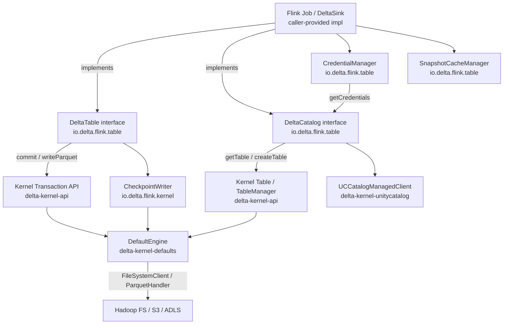
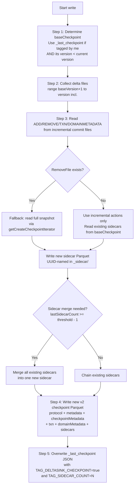
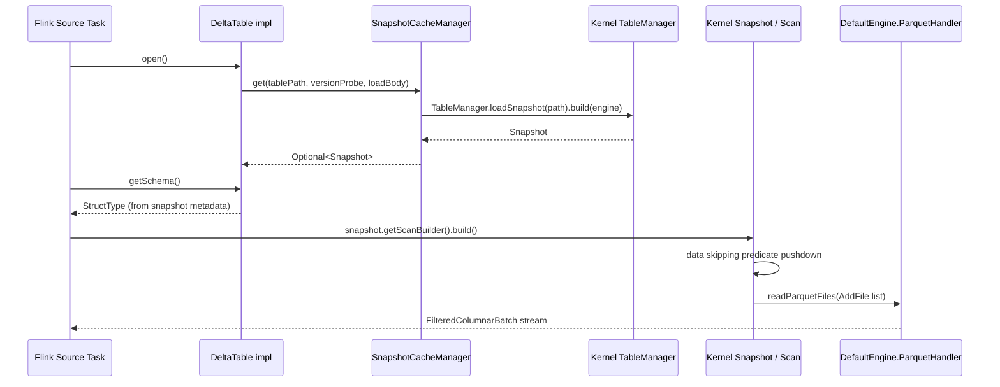
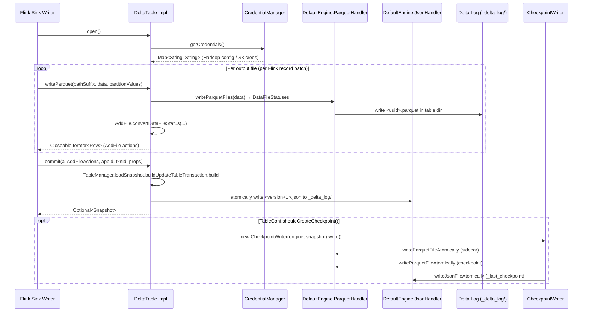

# delta-flink

## Purpose

`delta-flink` is an Apache Flink 2.0.1 connector for Delta Lake, built directly on the **Delta Kernel API** (no Spark dependency). It provides:

1. **SPI interfaces** — `DeltaCatalog` and `DeltaTable` — that define the contract for a Flink-compatible Delta connector, leaving concrete implementations (filesystem-based, Unity Catalog-backed, etc.) to callers.
2. **Kernel-level utilities** optimized for the Flink sink pattern: `CheckpointWriter` (incremental v2 checkpoint creation) and `ColumnVectorUtils` (columnar batch manipulation helpers used during checkpoint construction).
3. **Infrastructure** shared across all connector implementations: `CredentialManager` (proactive credential refresh), `SnapshotCacheManager` (Caffeine-backed snapshot cache), `TableConf` (per-table configuration), `Conf` (JVM-wide singleton), `MetricListener` (performance instrumentation), and `ExceptionUtils`.

> [!WARNING] Manifest discrepancy
> The module manifest describes this module as a "Flink Table API connector (kernel-based)." The current source code does **not** contain concrete implementations of Flink's `org.apache.flink.table.catalog.Catalog`, `DynamicTableSource`, or `DynamicTableSink` interfaces. `DeltaCatalog` and `DeltaTable` are custom internal SPI **interfaces**, not Flink framework implementations. The Flink Table API SQL-facing integration layer appears to be in development. What is present constitutes a fully functional connector foundation: SPI contracts + kernel utilities + infrastructure. This is a newly authored module (copyright 2026).

---

## Architecture Overview

The module's design is layered: Flink sink-facing code (to be implemented by callers) sits atop the `DeltaTable` SPI, which in turn delegates all I/O to the Delta Kernel `Engine` SPI. No Spark classes are imported anywhere in the module.



_`DeltaCatalog` and `DeltaTable` are interfaces defined in this module; concrete implementations (e.g., filesystem catalog, UC-backed catalog) live outside this module and must be provided by the consumer. `CheckpointWriter` uses `DefaultEngine` directly via the Kernel Engine SPI._

---

## File Inventory

| File | Category | Description |
|---|---|---|
| `io/delta/flink/Conf.java` | Configuration | Global JVM singleton; loads `delta-flink.properties` |
| `io/delta/flink/table/DeltaCatalog.java` | SPI interface | Catalog abstraction: resolve table identifiers → `TableDescriptor` |
| `io/delta/flink/table/DeltaTable.java` | SPI interface | Table abstraction: schema, commit, writeParquet |
| `io/delta/flink/table/CredentialManager.java` | Infrastructure | Thread-safe proactive credential refresh |
| `io/delta/flink/table/SnapshotCacheManager.java` | Infrastructure | Caffeine-backed `Snapshot` cache with freshness probing |
| `io/delta/flink/table/TableConf.java` | Configuration | Per-table config (checkpoint frequency, checksum enable) |
| `io/delta/flink/table/ExceptionUtils.java` | Utilities | Recursive exception inspection + custom exception types |
| `io/delta/flink/table/MetricListener.java` | Observability | Metric event interface + `StatsListener` + `PointListener` |
| `io/delta/flink/kernel/CheckpointWriter.java` | Kernel utility | Flink-optimized incremental v2 checkpoint writer |
| `io/delta/flink/kernel/CheckpointActionRow.java` | Kernel utility | `Row` adapter mapping action objects to checkpoint schema |
| `io/delta/flink/kernel/ColumnVectorUtils.java` | Kernel utility | Columnar batch manipulation helpers |
| `src/main/resources/delta-flink.properties` | Configuration | Shipped (all-commented) defaults for `Conf` |

---

## Public Interface

### `DeltaCatalog` (interface) — `io.delta.flink.table.DeltaCatalog`

```17:115:flink/src/main/java/io/delta/flink/table/DeltaCatalog.java
public interface DeltaCatalog extends Serializable {
  default void open() {}
  TableDescriptor getTable(String tableId);
  void createTable(String tableId, StructType schema, List<String> partitions, Map<String, String> properties);
  Map<String, String> getCredentials(String uuid);
  class TableDescriptor {
    String tableId;
    String uuid;
    URI tablePath;
  }
}
```

`TableDescriptor` carries the stable UUID, logical identifier, and physical `URI` for a resolved table.

### `DeltaTable` (interface) — `io.delta.flink.table.DeltaTable`

```49:168:flink/src/main/java/io/delta/flink/table/DeltaTable.java
public interface DeltaTable extends Serializable, AutoCloseable {
  String getId();
  StructType getSchema();
  List<String> getPartitionColumns();
  void open();
  Optional<Snapshot> commit(CloseableIterable<Row> actions, String appId, long txnId, Map<String, String> properties);
  void refresh();
  CloseableIterator<Row> writeParquet(String pathSuffix, CloseableIterator<FilteredColumnarBatch> data, Map<String, Literal> partitionValues) throws IOException;
}
```

`writeParquet` is called per-file during a Flink sink write; `commit` atomically applies the resulting `AddFile` action rows to the Delta log. The `pathSuffix` parameter structures generated file paths as `<table_root>/<pathSuffix>/<parquet_file>`.

### `CheckpointWriter` — `io.delta.flink.kernel.CheckpointWriter`

```101:512:flink/src/main/java/io/delta/flink/kernel/CheckpointWriter.java
public class CheckpointWriter {
  public static final String TAG_DELTASINK_CHECKPOINT = "io.delta.flink.sink.checkpoint";
  public static final String TAG_SIDECAR_COUNT = "io.delta.flink.num_sidecar";
  public CheckpointWriter(Engine engine, Snapshot snapshot, int sidecarMergeThreshold) { ... }
  public CheckpointWriter(Engine engine, Snapshot snapshot) { ... }  // sidecarMergeThreshold = -1
  public void write() throws IOException { ... }
}
```

Single-use: calling `write()` twice throws `IllegalStateException`.

### `SnapshotCacheManager` — `io.delta.flink.table.SnapshotCacheManager`

| Symbol | Type | Description |
|---|---|---|
| `getInstance()` | static factory | Returns `LocalCacheManager` or `NoCacheManager` based on `Conf` |
| `put(key, snapshot)` | method | Insert/update snapshot for path key |
| `invalidate(key)` | method | Evict cached snapshot |
| `get(key, versionProbe, body)` | method | Load-on-miss with freshness probing |
| `NoCacheManager` | inner class | No-op implementation |
| `LocalCacheManager` | inner class | Caffeine-backed bounded cache |

### `CredentialManager` — `io.delta.flink.table.CredentialManager`

| Symbol | Type | Description |
|---|---|---|
| `CREDENTIAL_EXPIRATION_KEY` | `String` | Key `"credential.expiration"` (epoch-ms string) in credential map |
| `isCredentialsExpired` | `Predicate<Throwable>` | Returns true if exception chain contains `AccessDeniedException` |
| `getCredentials()` | method | Returns current credentials; auto-schedules background refresh |

### `TableConf` — `io.delta.flink.table.TableConf`

| Config Key | Type | Default | Description |
|---|---|---|---|
| `checkpoint.frequency` | `Double` | `0.0` | Probability [0.0, 1.0] to create a v2 checkpoint per commit |
| `checksum.enable` | `Boolean` | `true` | Whether to generate `.crc` checksum files for commits |
| `delta.*` (pass-through) | — | — | Any key prefixed `delta.` is persisted to catalog |
| `delta.feature.v2Checkpoint` | — | `supported` | Auto-injected: always included in `catalogConf()` |

`engineConf()` returns an empty map in the current implementation (placeholder).

### `Conf` — `io.delta.flink.Conf` (global singleton)

| Property Key | Default | Description |
|---|---|---|
| `sink.retry.max_attempt` | `4` | Max commit retry attempts |
| `sink.retry.delay_ms` | `200` | Initial retry delay (exponential: `delay * 2^i`) |
| `sink.retry.max_delay_ms` | `20000` | Maximum retry delay cap |
| `sink.writer.num_concurrent_file` | `1000` | Max concurrent open write files |
| `table.thread_pool_size` | `5` | Thread pool size for table operations |
| `table.cache.enable` | `true` | Enable `SnapshotCacheManager.LocalCacheManager` |
| `table.cache.size` | `100` | Max entries in Caffeine snapshot cache |
| `table.cache.expire_ms` | `300000` | Cache entry TTL (5 minutes, access-time-based) |
| `credentials.refresh.thread_pool_size` | `10` | Thread pool for credential refresh tasks |
| `credentials.refresh.ahead_ms` | `60000` | Refresh credentials this many ms before expiration |

---

## Key Dependencies

- **[[delta-kernel-api]]** (unmanaged JAR): Core `Engine`, `Snapshot`, `Table`, `Transaction`, `CommitActions`, and all `internal.*` action/checkpoint classes. Consumed as a compiled JAR via `unmanagedJars` in `build.sbt` — **not** via SBT `.dependsOn()` — to avoid circular dependency.
- **[[delta-kernel-defaults]]** (`dependsOn`): Provides `DefaultEngine` as the production `Engine` implementation. Used directly in tests via `DefaultEngine.create(new Configuration())`.
- **[[delta-kernel-unitycatalog]]** (`dependsOn`): Provides `UCCatalogManagedClient` / `UCCatalogManagedCommitter` for Unity Catalog-managed table operations.
- **`unitycatalog-client 0.3.1`** (runtime): UC REST API client used by `delta-kernel-unitycatalog`.
- **`com.github.ben-manes.caffeine:caffeine 3.1.8`**: Backing cache for `SnapshotCacheManager.LocalCacheManager`.
- **`dev.failsafe:failsafe 3.2.0`**: Retry/resilience framework (used in `TestHelper` and available for sink retry logic).
- **`org.apache.hadoop:hadoop-aws`**: S3 filesystem support via Hadoop AWS connector.
- **Apache Flink 2.0.1** (provided): `flink-core`, `flink-table-common`, `flink-table-api-java-bridge`, `flink-streaming-java`.

---

## Modules That Depend On This

None — `delta-flink` is a leaf module in the SBT dependency graph (no other SBT module depends on it).

---

## Build Notes

- **Published artifact**: `delta-flink` (published only for `scalaBinaryVersion == "2.12"`, once; `autoScalaLibrary := false` excludes Scala stdlib from the fat JAR)
- **Assembly JAR**: `delta-flink-<flinkVersion>-<projectVersion>.jar` — includes all transitive compile deps (kernel-defaults, unitycatalog, caffeine, failsafe, hadoop-aws), excludes `bundle-*.jar` shaded internal JARs
- **Merge strategy**: Discards `module-info.class`, `parquet.thrift`, `mozilla/public-suffix-list.txt`
- **JVM flags**: `--add-opens=java.base/java.util=ALL-UNNAMED` (required for Flink with Java 17)

---

## Component Deep-Dives

### Component: `DeltaCatalog` Interface

**Source**: `flink/src/main/java/io/delta/flink/table/DeltaCatalog.java`

`DeltaCatalog` is the connector's table-resolution SPI. It is **not** an implementation of Flink's `org.apache.flink.table.catalog.Catalog` — it is a custom internal abstraction that decouples how the connector discovers table locations from how Flink executes queries.

The interface is minimal by design: three methods covering the three operations a sink needs from its catalog:

1. **`getTable(tableId)`** — resolves a logical identifier to a `TableDescriptor` containing `tableId`, `uuid`, and physical `tablePath` (a `java.net.URI`). Throws `ExceptionUtils.ResourceNotFoundException` if the table cannot be resolved.
2. **`createTable(tableId, schema, partitions, properties)`** — creates a new table in the catalog. Throws `ExceptionUtils.ResourceAlreadyExistException` if the table already exists.
3. **`getCredentials(uuid)`** — returns a credential map keyed by the stable table UUID. This separation of UUID (identity) from tableId (naming) allows credentials to be refreshed without re-resolving the table name.

The `default void open()` lifecycle hook is a no-op by default. Implementations requiring initialization (e.g., REST client setup) override this.

`DeltaCatalog.TableDescriptor` is a simple container (non-private fields, no constructor): `tableId`, `uuid`, `tablePath`. 

> [!NOTE] UUID stability rationale
> The UUID field exists specifically to support `CredentialManager`'s keying strategy: credentials are fetched by UUID rather than table path, so catalog renames don't require credential refetch. This is important for UC-backed catalogs where table identity is independent of location.

---

### Component: `DeltaTable` Interface

**Source**: `flink/src/main/java/io/delta/flink/table/DeltaTable.java`

`DeltaTable` is the write-path SPI for a single Delta table. It is the connector's abstraction over the Kernel transaction API. Implementations are required to be `Serializable` and `AutoCloseable` for Flink's distributed execution and task lifecycle.

#### Write Path Contract

```49:168:flink/src/main/java/io/delta/flink/table/DeltaTable.java
CloseableIterator<Row> writeParquet(
    String pathSuffix,
    CloseableIterator<FilteredColumnarBatch> data,
    Map<String, Literal> partitionValues) throws IOException;

Optional<Snapshot> commit(
    CloseableIterable<Row> actions, String appId, long txnId, Map<String, String> properties);
```

The intended usage pattern for a Flink sink:
1. Call `writeParquet(pathSuffix, data, partitionValues)` per output file — this physically writes Parquet data and returns one or more `AddFile` `Row` action objects.
2. Collect all `AddFile` rows across the micro-batch.
3. Call `commit(actions, appId, txnId, properties)` once per checkpoint to atomically commit all actions to the Delta log.

The `pathSuffix` parameter is appended to the table root when constructing physical file paths: `<table_root>/<path_suffix>/<parquet_file>`. This allows callers to organize files into logical subdirectories (e.g., by task/partition).

#### Transaction Idempotency

The `appId` + `txnId` pair maps to the Delta Protocol's `SetTransaction` action (idempotent transaction tracking). Implementations commit a `SetTransaction` record so that a failed-then-retried commit with the same `(appId, txnId)` can be detected and deduplicated.

#### `refresh()`

`refresh()` reloads the latest snapshot metadata. Implementations should call this before accessing `getSchema()` or `getPartitionColumns()` after external writes may have occurred (e.g., concurrent writers). The contract notes that this may perform I/O.

---

### Component: `CheckpointWriter`

**Source**: `flink/src/main/java/io/delta/flink/kernel/CheckpointWriter.java`

This is the most complex component in the module. It writes a Flink-optimized Delta v2 checkpoint with sidecar files.

#### Why a custom checkpoint writer?

The standard Kernel checkpoint writer (`Snapshot.writeCheckpoint(engine)`) performs a full log replay for every checkpoint, which is expensive for large tables. Because Flink sinks perform **blind appends** (no deletes between checkpoints in the common case), `CheckpointWriter` can be **incremental**: it only reads commit files in the range `(previousCheckpointVersion + 1, currentVersion]` and adds a single new sidecar containing just those files. Prior sidecars are chained, not re-read.

#### Preconditions

```143:171:flink/src/main/java/io/delta/flink/kernel/CheckpointWriter.java
public CheckpointWriter(Engine engine, Snapshot snapshot, int sidecarMergeThreshold) {
    this.snapshot = (SnapshotImpl) snapshot;

    Preconditions.checkArgument(
        this.snapshot.getProtocol().supportsFeature(TableFeatures.CHECKPOINT_V2_RW_FEATURE));
    if (this.snapshot.getProtocol().supportsFeature(TableFeatures.CATALOG_MANAGED_RW_FEATURE)) {
        Preconditions.checkArgument(
            this.snapshot.getLogSegment().getMaxPublishedDeltaVersion().orElse(-1L)
                >= this.snapshot.getVersion());
    }
```

- Table **must** support v2 checkpoints (`TableFeatures.CHECKPOINT_V2_RW_FEATURE`). `TableConf`'s `DEFAULT_CONFS` auto-enables this on table creation.
- For UC-managed (catalog-managed) tables, the snapshot version must be fully published before checkpointing.

#### `write()` Algorithm — 5 Steps



_The checkpoint Parquet is written atomically via `engine.getParquetHandler().writeParquetFileAtomically()`._

#### Fallback Conditions

The incremental approach is **abandoned** and a full snapshot is used when any of the following hold:
- No `_last_checkpoint` file exists
- `_last_checkpoint` does not have tag `io.delta.flink.sink.checkpoint=true` (i.e., was written by another tool)
- `RemoveFile` actions appear in the commit range (indicates overwrite/delete, not blind append)
- `write()` is called on a snapshot version **older** than the version in `_last_checkpoint`

#### Sidecar Merge

When `sidecarMergeThreshold > 0` and `lastSidecarCount >= sidecarMergeThreshold - 1`, all existing sidecar files are read, their `AddFile` entries are materialized and re-written into a single new sidecar, reducing total file count. This avoids unbounded sidecar growth on long-running tables.

```327:363:flink/src/main/java/io/delta/flink/kernel/CheckpointWriter.java
if (sidecarMergeThreshold > 0 && lastSidecarCount >= sidecarMergeThreshold - 1) {
    // Too many existing sidecars. Merge them into one.
    try (CloseableIterator<FileStatus> sidecarFiles = ...;
         CloseableIterator<FilteredColumnarBatch> addFileRows = engine.getParquetHandler()
             .readParquetFiles(sidecarFiles, SIDECAR_SCHEMA, Optional.empty())
             .map(FileReadResult::getData).map(ColumnVectorUtils::wrap)) {
        existingSidecars = rowsToBatch(Stream.of(sidecarFromAddFiles(addFileRows)));
        lastSidecarCount = 1;
    }
}
```

#### `SetTransaction` Aggregation

While scanning incremental commits, `filterActions()` **side-effects** the `transactionIds` map, tracking the **maximum** version per `appId`:

```419:424:flink/src/main/java/io/delta/flink/kernel/CheckpointWriter.java
ColumnVector txnVector = columnarBatch.getColumnVector(txnOrdinal);
if (!txnVector.isNullAt(rowId)) {
    String appId = txnVector.getChild(0).getString(rowId);
    long txnVersion = txnVector.getChild(1).getLong(rowId);
    transactionIds.merge(appId, txnVersion, Math::max);
}
```

The deduplicated max-version `SetTransaction` records are written into the checkpoint, satisfying the Delta protocol's requirement that checkpoints contain the latest transaction marker per application.

#### `DomainMetadata` Aggregation

Similarly, `domainMetadata` actions are tracked: puts update the map, removes delete from it. The final set of active domain metadata entries is written to the checkpoint.

#### Known Limitations

- Domain metadata feature is noted as unsupported in the class Javadoc (the field tracking is implemented but the full support path is incomplete).
- Single-use per instance — `used` flag prevents reuse.
- Does not support tables that lack `v2Checkpoint` table feature.

---

### Component: `CheckpointActionRow`

**Source**: `flink/src/main/java/io/delta/flink/kernel/CheckpointActionRow.java`

An adapter implementing Kernel's `Row` interface. It wraps a raw action object (`Protocol`, `Metadata`, `CheckpointMetadataAction`, `SetTransaction`, `SidecarFile`, or `DomainMetadata`) and presents it as a row in the checkpoint's union schema.

```33:41:flink/src/main/java/io/delta/flink/kernel/CheckpointActionRow.java
public static final StructType CHECKPOINT_SCHEMA =
    new StructType()
        .add("checkpointMetadata", CheckpointMetadataAction.FULL_SCHEMA)
        .add("metaData", Metadata.FULL_SCHEMA)
        .add("protocol", Protocol.FULL_SCHEMA)
        .add("txn", SetTransaction.FULL_SCHEMA)
        .add("sidecar", SidecarFile.READ_SCHEMA)
        .add("domainMetadata", DomainMetadata.FULL_SCHEMA)
        .add("add", AddFile.FULL_SCHEMA);
```

`isNullAt(ordinal)` works by attempting a cast via `ROW_MAPPERS.get(ordinal).apply(action)` and catching `ClassCastException`. If the action is not of the expected type for that ordinal, the slot is null — this is how the multi-action union schema is realized without a separate nullable wrapper type.

> [!NOTE] 
> The `add` column (ordinal 6) is absent from `ROW_MAPPERS` (which has only 6 entries, indices 0–5). Any row with an `AddFile` at ordinal 6 falls through to `return true` in `isNullAt` for ordinals >= ROW_MAPPERS.size(), meaning the `add` column is always null in rows created from this class. AddFile rows in sidecars are created from actual `FilteredColumnarBatch` data, not via `CheckpointActionRow`.

---

### Component: `ColumnVectorUtils`

**Source**: `flink/src/main/java/io/delta/flink/kernel/ColumnVectorUtils.java`

A utility class providing combinators for Kernel's columnar data API (`ColumnVector`, `ColumnarBatch`, `FilteredColumnarBatch`). All methods are static.

| Method | Signature | Purpose |
|---|---|---|
| `wrap` | `ColumnarBatch → FilteredColumnarBatch` | Lifts a batch into `FilteredColumnarBatch` with no selection vector (all rows selected) |
| `notNullAt` | `int → Function<ColumnarBatch, FilteredColumnarBatch>` | Creates a filter selecting rows where the column at `ordinal` is non-null |
| `child` | `String → Function<FilteredColumnarBatch, FilteredColumnarBatch>` | Projects a named nested struct column: extracts child schema + child column vectors, preserves the selection vector |
| `filter` | `(int, Predicate<Integer>) → Optional<ColumnVector>` | Creates an anonymous `ColumnVector` of type `BooleanType` that applies `pred(rowId)` lazily |
| `notNull` | `ColumnVector → Optional<ColumnVector>` | Convenience for `filter(size, rowId -> !input.isNullAt(rowId))` |

The `filter` method is particularly central — it is used throughout `CheckpointWriter.filterActions()` to build composite row-level predicates over columnar batches without materializing intermediate boolean arrays.

```72:98:flink/src/main/java/io/delta/flink/kernel/ColumnVectorUtils.java
public static Optional<ColumnVector> filter(int size, Predicate<Integer> pred) {
    return Optional.of(new ColumnVector() {
        @Override public DataType getDataType() { return BooleanType.BOOLEAN; }
        @Override public int getSize() { return size; }
        @Override public void close() {}
        @Override public boolean isNullAt(int rowId) { return false; }
        @Override public boolean getBoolean(int rowId) { return pred.test(rowId); }
    });
}
```

---

### Component: `CredentialManager`

**Source**: `flink/src/main/java/io/delta/flink/table/CredentialManager.java`

Manages short-lived credentials (e.g., UC temporary S3 credentials) with proactive refresh.

#### Refresh Strategy

```110:146:flink/src/main/java/io/delta/flink/table/CredentialManager.java
Map<String, String> getCredentials() {
    Map<String, String> cached = cachedCredentials.get();
    if (cached != null) return cached;
    Map<String, String> newCredentials = this.credSupplier.get();
    if (cachedCredentials.compareAndSet(null, newCredentials)) {
        scheduleNextRefresh(newCredentials);
        return newCredentials;
    }
    return cachedCredentials.get();
}

protected void scheduleNextRefresh(Map<String, String> newCredentials) {
    long expiration = Long.parseLong(newCredentials.getOrDefault(CREDENTIAL_EXPIRATION_KEY, "-1"));
    if (expiration >= 0) {
        long refreshDelay = Math.max(100,
            expiration - Conf.getInstance().getCredentialsRefreshAheadInMs() - System.currentTimeMillis());
        refreshExecutors.schedule(() -> {
            Map<String, String> refreshed = this.credSupplier.get();
            if (cachedCredentials.compareAndSet(existingCredential, refreshed)) {
                this.refreshCallback.run();
                scheduleNextRefresh(refreshed);
            }
        }, refreshDelay, TimeUnit.MILLISECONDS);
    }
}
```

The `compareAndSet` pattern on `AtomicReference` ensures only one concurrent refresh wins. The winning thread then schedules the **next** refresh recursively. If no `credential.expiration` key is present, no background refresh is scheduled (credentials assumed to be static/non-expiring).

#### Shared Thread Pool

`refreshExecutors` is a `static ScheduledExecutorService` shared across all `CredentialManager` instances within the JVM, sized by `Conf.getInstance().getCredentialsRefreshThreadPoolSize()` (default: 10).

#### Error Detection

`isCredentialsExpired = ExceptionUtils.recursiveCheck(ex -> ex instanceof AccessDeniedException)` allows callers to detect that a failed operation was due to expired credentials and trigger a credential re-fetch + retry.

---

### Component: `SnapshotCacheManager`

**Source**: `flink/src/main/java/io/delta/flink/table/SnapshotCacheManager.java`

Caches Kernel `Snapshot` instances to avoid repeated log replay for high-frequency access patterns.

#### Freshness Probing

The `LocalCacheManager.get()` implementation includes a **forward-version probe** to detect stale entries:

```135:147:flink/src/main/java/io/delta/flink/table/SnapshotCacheManager.java
Optional<Snapshot> cached = SNAPSHOT_CACHE.get(key, body);
long versionToProbe = cached.map(Snapshot::getVersion).orElse(-1L) + 1;
if (versionProbe.test(versionToProbe)) {
    // version+1 exists → our cached version is outdated
    SNAPSHOT_CACHE.invalidate(key);
    return SNAPSHOT_CACHE.get(key, body);
}
return cached;
```

The `versionProbe` is expected to be a **fast** check (e.g., a filesystem file-existence check for `_delta_log/<version+1>.json`) rather than a full snapshot load. This allows the cache to remain fresh in concurrent multi-writer scenarios with minimal overhead.

#### Static Caffeine Cache

The `SNAPSHOT_CACHE` in `LocalCacheManager` is a `static final` field, meaning it is **shared across all `LocalCacheManager` instances** within a JVM (i.e., across multiple Flink tasks or sink instances in the same process). This is intentional for sharing warm cached snapshots but means cache size and TTL apply JVM-wide.

---

### Component: `TableConf`

**Source**: `flink/src/main/java/io/delta/flink/table/TableConf.java`

Parses raw table option maps (from Flink table DDL or programmatic configuration) into typed values.

#### v2 Checkpoint Auto-Enablement

```61:63:flink/src/main/java/io/delta/flink/table/TableConf.java
private static final Map<String, String> DEFAULT_CONFS =
    Map.of("delta.feature.v2Checkpoint", "supported");
```

`catalogConf()` always merges this default, ensuring that any table created via this connector automatically opts in to v2 checkpoint support at the Delta protocol level.

#### Stochastic Checkpoint Creation

`shouldCreateCheckpoint()` is a probabilistic gate, sampling `random.nextDouble() < getCheckpointFrequency()`. At `frequency=0.0` (default), no checkpoint is ever created. At `frequency=1.0`, every commit creates a checkpoint. Intermediate values create checkpoints with that probability per commit — useful for amortizing checkpoint cost across high-throughput append workloads.

#### Catalog vs. Engine Config Split

`catalogConf()` returns entries with `delta.` prefix (to be persisted in the catalog/table metadata). `engineConf()` returns an empty map currently — the split is intended to allow future forwarding of engine-specific Hadoop/Parquet options without polluting catalog metadata.

---

### Component: `MetricListener`

**Source**: `flink/src/main/java/io/delta/flink/table/MetricListener.java`

A lightweight observability interface. Single method: `onEvent(String eventName, long elapseNano)`.

Two bundled implementations:
- **`StatsListener`**: tracks `(count, max, min, sum)` per event name in a `HashMap<String, long[]>`. `report()` returns `(count, max, min, average)`.
- **`PointListener`**: stores all raw data points per event name in a `HashMap<String, List<Long>>`. Useful for latency histograms in tests.

Intended to instrument operations like `"snapshot.load"`, `"commit.retry"`, etc. The interface is `Serializable` for use in distributed Flink job contexts.

---

### Component: `ExceptionUtils`

**Source**: `flink/src/main/java/io/delta/flink/table/ExceptionUtils.java`

Three utilities:

1. **`recursiveCheck(pred)`** — wraps a `Predicate<Throwable>` to walk the full `getCause()` chain. Used to detect `AccessDeniedException` anywhere in a nested exception stack.
2. **`ResourceNotFoundException`** — thrown when `DeltaCatalog.getTable()` cannot resolve a table identifier.
3. **`ResourceAlreadyExistException`** — thrown when `DeltaCatalog.createTable()` encounters an existing table.
4. **`wrap(Throwable)`** — converts checked exceptions to `RuntimeException` for use in lambda chains.

---

## Read Path (Conceptual — not yet fully implemented in source)

Based on the interface contracts and kernel API usage in tests:



---

## Write Path



---

## Unity Catalog Integration

`delta-kernel-unitycatalog` is a compile-time dependency of this module. It provides:
- `UCCatalogManagedClient` — implements Kernel's `CommitCoordinatorClient` using UC REST APIs, enabling UC-managed Delta table commits (staged commit → publish cycle).
- `UCCatalogManagedCommitter` — per-commit coordinator that handles the two-phase: stage commit JSON → call UC publish endpoint.

From the Flink connector's perspective, UC integration is transparent: a UC-backed `DeltaCatalog` implementation would use `UCCatalogManagedClient` to resolve table locations and supply `getCredentials()` responses. The `CredentialManager` is designed precisely for this: UC temporary credentials expire and must be refreshed.

The `CheckpointWriter` explicitly handles UC-managed tables: it checks `TableFeatures.CATALOG_MANAGED_RW_FEATURE` and requires the snapshot version to be fully published before creating a checkpoint:

```149:154:flink/src/main/java/io/delta/flink/kernel/CheckpointWriter.java
if (this.snapshot.getProtocol().supportsFeature(TableFeatures.CATALOG_MANAGED_RW_FEATURE)) {
    Preconditions.checkArgument(
        this.snapshot.getLogSegment().getMaxPublishedDeltaVersion().orElse(-1L)
            >= this.snapshot.getVersion());
}
```

---

## Test Coverage

| Test File | Scope | What's Tested |
|---|---|---|
| `CheckpointWriterTest` | Unit + integration (local FS) | Incremental checkpoint creation, sidecar accumulation, fallback on RemoveFiles, checkpoint-on-older-snapshot, sidecar merge at threshold, domain metadata aggregation, tag recognition |
| `CredentialManagerTest` | Unit | Initial credential fetch + scheduled auto-refresh within 150ms window |
| `TestHelper` | Base class | Reusable helper methods: temp dir lifecycle, `createNonEmptyTable`, `writeTable`, `writeRemoveFile`, `writeDomainMetadata`, `verifyTableContent`, `readParquet`, `checkSerializability` |

**Notable gaps**:
- No tests for `SnapshotCacheManager` (freshness probe path untested in isolation)
- No tests for `TableConf` (stochastic `shouldCreateCheckpoint`, `catalogConf` filtering)
- No integration tests for `CredentialManager.isCredentialsExpired` predicate
- No end-to-end tests connecting `DeltaCatalog` + `DeltaTable` implementations to Flink SQL (no concrete implementations present in source)
- `wiremock` is in test dependencies but no tests using it are visible in source (likely intended for future UC REST endpoint mocking)

---

## Configuration Reference

### `delta-flink.properties`

Located at `flink/src/main/resources/delta-flink.properties`. All entries are commented out (no overrides shipped). Override by placing a `delta-flink.properties` file earlier on the classpath.

```properties
# Commit retry behavior
#sink.retry.max_attempt=4
#sink.retry.delay_ms=200         # exponential backoff base; i-th retry waits delay * 2^i ms
#sink.retry.max_delay_ms=20000   # cap on retry delay

# Snapshot cache
#table.cache.enable=true
#table.cache.size=100             # max entries
#table.cache.expire_ms=300000    # 5 min TTL (access-time based)

# Credential refresh
#credentials.refresh.thread_pool_size=10
#credentials.refresh.ahead_ms=60000   # refresh 60s before expiration
```

### Flink Table Options (per-table, via `TableConf`)

| Option Key | Type | Default | Description |
|---|---|---|---|
| `checkpoint.frequency` | `double` | `0.0` | Probability of creating a v2 checkpoint after each commit. `0.0` = never, `1.0` = always |
| `checksum.enable` | `boolean` | `true` | Generate `.crc` checksum files for each commit |
| `delta.<key>` | `string` | — | Any `delta.*` option is persisted to catalog table properties |

---

## Diagram Opportunity Flag

> FLAG FOR ORCHESTRATOR: The `CredentialManager` ↔ `DeltaCatalog` credential refresh lifecycle (how a UC-backed catalog impl wires a `CredentialManager` callback to re-initialize the `Engine`'s Hadoop configuration) involves a non-trivial stateful interaction that would benefit from a `sequenceDiagram` in the manifest. Relevant files: `flink/src/main/java/io/delta/flink/table/CredentialManager.java:121-144`, `flink/src/main/java/io/delta/flink/table/DeltaCatalog.java:96`.
>
> FLAG FOR ORCHESTRATOR: The `CheckpointWriter` incremental vs. fallback branching logic (steps 1-5 with sidecar merge path) warrants a `flowchart TD` diagram at the **manifest** level under the Flink connector's position in the overall write pipeline. Relevant file: `flink/src/main/java/io/delta/flink/kernel/CheckpointWriter.java:197-316`.
