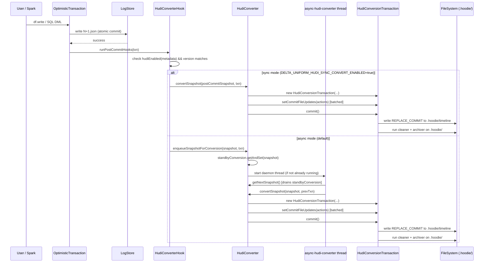
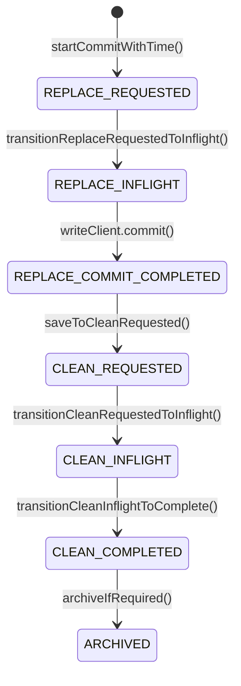

# delta-hudi (UniForm Hudi)

## Purpose

The `delta-hudi` module is the **UniForm Hudi** compatibility layer: after every successful Delta commit on a Hudi-enabled table, it generates and persists Apache Hudi metadata (the `.hoodie/` timeline) at the same table path. This allows Hudi-native query engines to read the same underlying Parquet data files without any data duplication or migration. The module is a conversion bridge — it translates Delta protocol actions (adds, removes) and the Delta schema into their Hudi equivalents and writes them to the Hudi active timeline.

> [!NOTE] Spark Version Gate
> `delta-hudi` is only compiled and published when building against **Spark 4.0.1** (`supportHudi = true`).
> It is **disabled** for Spark 4.1.0 and the 4.2.0-SNAPSHOT (`supportHudi = false` in `CrossSparkVersions.scala`).
> At runtime, the module is loaded via reflection so that `delta-spark` has no compile-time dependency on Hudi.

---

## Public Interface

| Symbol | Type | File | Description |
|---|---|---|---|
| `HudiConverter` | class | `HudiConverter.scala` | Top-level converter; extends `UniversalFormatConverter`. Manages async/sync conversion lifecycle. |
| `HudiConverter.enqueueSnapshotForConversion(snapshot, txn)` | method | `HudiConverter.scala:88` | Starts or queues an async background conversion thread for the given snapshot. |
| `HudiConverter.convertSnapshot(snapshot, txn)` | method | `HudiConverter.scala:190` | Blocking conversion entrypoint used directly in tests and sync mode. |
| `HudiConverter.DELTA_VERSION_PROPERTY` | constant | `HudiConverter.scala:50` | `"delta-version"` — key stored in Hudi commit extra metadata. |
| `HudiConverter.DELTA_TIMESTAMP_PROPERTY` | constant | `HudiConverter.scala:56` | `"delta-timestamp"` — key stored in Hudi commit extra metadata. |
| `HudiConversionTransaction` | class | `HudiConversionTransaction.scala` | Represents a single pending Hudi commit; accumulates `WriteStatus` and `partitionToReplacedFileIds`, then writes to `.hoodie/`. |
| `HudiConversionTransaction.setCommitFileUpdates(actions)` | method | `HudiConversionTransaction.scala:106` | Ingests a batch of Delta `Action` objects (adds and removes) into the transaction. |
| `HudiConversionTransaction.commit()` | method | `HudiConversionTransaction.scala:132` | Finalises the Hudi `REPLACE_COMMIT` and runs the cleaner and archiver. |
| `HudiSchemaUtils.convertDeltaSchemaToHudiSchema(schema)` | method | `HudiSchemaUtils.scala:33` | Converts a Delta `StructType` to an Apache Avro `Schema`. |
| `HudiTransactionUtils.convertAddFile(add, path, time)` | method | `HudiTransactionUtils.scala:34` | Maps a Delta `AddFile` action to a Hudi `WriteStatus`+`HoodieDeltaWriteStat`. |
| `HudiTransactionUtils.loadTableMetaClient(...)` | method | `HudiTransactionUtils.scala:86` | Loads an existing `HoodieTableMetaClient` or initialises a new Hudi COPY_ON_WRITE table. |

---

## Key Dependencies

- **[[spark]] (`delta-spark`)**: `HudiConverter` extends `UniversalFormatConverter` (defined in `spark/`). The hook `HudiConverterHook` is registered in `OptimisticTransaction`. The `DeltaLog` exposes `hudiConverter` via `ProvidesUniFormConverters`. Schema validation in `UniversalFormat.enforceHudiDependencies()` runs in `delta-spark`.
- **`org.apache.hudi:hudi-java-client:0.15.0`**: Provides `HoodieJavaWriteClient`, `HoodieTableMetaClient`, `HoodieJavaTable`, `HoodieTimeline`, `CleanPlanner`, `HoodieTimelineArchiver`, and all Hudi commit/clean/archive primitives. Compiled into the module; Hadoop and ZooKeeper transitive deps are excluded.
- **`org.apache.avro` (via Hudi)**: Avro schema library used in the schema conversion path (`HudiSchemaUtils`).
- **`org.apache.parquet:parquet-avro:1.12.3`**: Required at compile time for Avro↔Parquet interop.
- **`spark-avro` (test scope)**: Used in test assertions (`SchemaConverters.toSqlType`) to round-trip Avro schemas back to Spark StructType for validation.

---

## Modules That Depend On This

No module depends on `delta-hudi` at compile time — it is a leaf module. It is consumed at runtime by any Spark application that bundles `delta-hudi-assembly_2.13-<version>.jar` on the classpath alongside `delta-spark`.

---

## Configuration

### Table Property (enables the feature)

```sql
-- Enable Hudi compatibility when creating a table
CREATE TABLE my_table (id INT, name STRING) USING DELTA
LOCATION '/path/to/table'
TBLPROPERTIES (
  'delta.universalFormat.enabledFormats' = 'hudi'
);

-- Enable on existing table (triggers full state reconstruction if no prior Hudi conversion)
ALTER TABLE my_table SET TBLPROPERTIES (
  'delta.universalFormat.enabledFormats' = 'hudi'
);
```

**Key**: `delta.universalFormat.enabledFormats`  
**Managed by**: `DeltaConfigs.UNIVERSAL_FORMAT_ENABLED_FORMATS` in `DeltaConfig.scala`  
**Check**: `UniversalFormat.hudiEnabled(metadata)` → `metadata.configuration` contains `"hudi"` in the comma-separated list.

### Spark SQL Configuration

| Conf key | Default | Description |
|---|---|---|
| `spark.databricks.delta.uniform.hudi.sync.convert.enabled` | `false` | If `true`, conversion runs **synchronously** in the commit thread. Default is async (background daemon thread). |
| `spark.databricks.delta.hudi.maxPendingCommits` | `100` | Maximum number of Delta commits to replay incrementally. If the gap exceeds this, falls back to full state reconstruction (`snapshot.allFiles`). |

---

## Hudi Constraints and Incompatibilities

These are enforced in `UniversalFormat.enforceHudiDependencies()` (`UniversalFormat.scala:132`) and raise `DeltaUnsupportedOperationException` on violation:

| Constraint | Reason |
|---|---|
| **Deletion Vectors must be disabled** | Hudi COW tables track file-level replacements via `partitionToReplacedFileIds`. DVs embed deleted row bitmaps inside the file itself, invisible to Hudi file tracking. |
| **`SMALLINT` (`ShortType`) not supported** | No direct Avro mapping in `HudiSchemaUtils.convertAtomic`. |
| **`TINYINT` (`ByteType`) not supported** | Same as ShortType — not in the `convertAtomic` match. |
| **`TIMESTAMP_NTZ` not supported** | Hudi's Avro schema has no timezone-naive timestamp logical type equivalent. |
| **`VOID` (`NullType`) not supported** | Cannot represent in Avro. |

> [!NOTE] Column Mapping
> Column mapping (`delta.columnMapping.mode = name`) is not strictly required by the Hudi module's constraint checks, but the test suite always enables it via `withDefaultTablePropsInSQLConf`. Tables relying on column IDs (not names) may expose internal column ID names to the Hudi Avro schema. Using `name` mode is strongly recommended.

---

## Architecture: Delta Write → Hudi Conversion Flow



*The async path uses a single per-table daemon thread (named `async-hudi-converter [id=<tableId>]`). Only one snapshot can be "queued" at a time in `standbyConversion`; if a second commit arrives before the first is processed, the earlier snapshot is discarded (logged as `delta.hudi.conversion.async.backlog`).*

---

## Component: HudiConverter — Conversion Orchestrator

**File**: `hudi/src/main/scala/org/apache/spark/sql/delta/hudi/HudiConverter.scala`

### Class structure

`HudiConverter` extends `UniversalFormatConverter` (abstract base in `spark/`). It is instantiated via reflection in `ProvidesUniFormConverters._hudiConverter` and accessed through `DeltaLog.hudiConverter`.

```scala
// hudi/src/main/scala/org/apache/spark/sql/delta/hudi/HudiConverter.scala:62-72
class HudiConverter
  extends UniversalFormatConverter
  with DeltaLogging {

  protected val currentConversion =
    new AtomicReference[(Snapshot, CommittedTransaction)]()
  protected val standbyConversion =
    new AtomicReference[(Snapshot, CommittedTransaction)]()

  @GuardedBy("asyncThreadLock")
  private var asyncConverterThreadActive: Boolean = false
  private val asyncThreadLock = new Object
```

### Async queue design

The converter maintains a **two-slot queue**: `currentConversion` (being processed right now) and `standbyConversion` (next to process). If a new snapshot arrives while one is queued in standby, `getAndSet` atomically replaces it, and the displaced snapshot is logged and dropped. This means **at most one conversion is ever pending**, preventing unbounded accumulation under write-heavy workloads.

```scala
// hudi/src/main/scala/org/apache/spark/sql/delta/hudi/HudiConverter.scala:96-97
val previouslyQueued = standbyConversion.getAndSet((snapshotToConvert, txn))
```

### Incremental vs. full-scan conversion

```scala
// hudi/src/main/scala/org/apache/spark/sql/delta/hudi/HudiConverter.scala:228-244
val prevConvertedSnapshotOpt = (lastDeltaVersionConverted, txnOpt) match {
  case (Some(version), Some(txn)) if version == txn.readSnapshot.version =>
    Some(txn.readSnapshot)
  case (Some(version), _) if snapshotToConvert.version - version <= maxCommitsToConvert =>
    try { Some(log.getSnapshotAt(version, catalogTableOpt = catalogTable)) }
    catch { case _: DeltaFileNotFoundException => None }
  case (_, _) => None
}
```

- **Fast path** (incremental): If the last converted Delta version is the transaction's read snapshot, reuse it directly. Otherwise load it from the log if within `maxCommitsToConvert` (default 100). Reads individual delta JSON files via `DeltaFileProviderUtils.getDeltaFilesInVersionRange` + `parallelReadAndParseDeltaFilesAsIterator`.
- **Slow path** (state reconstruction): If the gap exceeds `maxCommitsToConvert` or the previous commit file has been log-cleaned (throws `DeltaFileNotFoundException`), falls back to `snapshotToConvert.allFiles.toLocalIterator()` — a full file listing.

> [!NOTE] Driver Memory Risk
> The slow path materialises all `AddFile` actions on the driver. A TODO comment in the code (`HudiConverter.scala:258`) notes a future optimisation to run this as a Spark job on executors.

### Last converted version bookmark

`loadLastDeltaVersionConverted(metaClient)` reads the Hudi active timeline's most recent completed commit and extracts `delta-version` from `HoodieCommitMetadata.extraMetadata`. This is how the converter knows where to resume. If the Hudi table has no completed commits, returns `None`, triggering a full scan.

```scala
// hudi/src/main/scala/org/apache/spark/sql/delta/hudi/HudiConverter.scala:319-326
val lastCompletedCommit = metaClient.getCommitsTimeline.filterCompletedInstants.lastInstant
if (!lastCompletedCommit.isPresent) return None
val extraMetadata = parseCommitExtraMetadata(lastCompletedCommit.get(), metaClient)
extraMetadata.get(HudiConverter.DELTA_VERSION_PROPERTY).map(_.toLong)
```

---

## Component: HudiConversionTransaction — Hudi Commit Writer

**File**: `hudi/src/main/scala/org/apache/spark/sql/delta/hudi/HudiConversionTransaction.scala`

### Delta actions → Hudi commit state

`setCommitFileUpdates(actions)` partitions a batch of Delta `Action` objects into two structures:

1. **`writeStatuses`** (`List[WriteStatus]`): Each `AddFile` → `HoodieDeltaWriteStat` with external file path marker appended via `ExternalFilePathUtil.appendCommitTimeAndExternalFileMarker`. This tells Hudi that the Parquet files are managed externally (by Delta).
2. **`partitionToReplacedFileIds`** (`Map[String, List[String]]`): Each `RemoveFile` → grouped by partition path → file names (IDs). Tells Hudi which file groups are being replaced.

```scala
// hudi/src/main/scala/org/apache/spark/sql/delta/hudi/HudiConversionTransaction.scala:106-130
def setCommitFileUpdates(actions: scala.collection.Seq[Action]): Unit = {
  val newPartitionToReplacedFileIds = actions
    .map(_.wrap).filter(action => action.remove != null).map(_.remove)
    .map(remove => { val path = remove.toPath; ... (partitionPath, path.getName) })
    .groupBy(_._1).map(v => (v._1, v._2.map(_._2).asJava)).asJava
  partitionToReplacedFileIds.putAll(newPartitionToReplacedFileIds)
  val newWriteStatuses = actions
    .map(_.wrap).filter(action => action.add != null).map(_.add)
    .map(add => { convertAddFile(add, tablePath, instantTime) }).asJava
  writeStatuses.addAll(newWriteStatuses)
}
```

### Commit as REPLACE_COMMIT

All Delta-to-Hudi commits are written as Hudi `REPLACE_COMMIT_ACTION`. This is intentional: Hudi's `REPLACE_COMMIT` unambiguously records which files replace which others, matching Delta's file-level upsert semantics.

```scala
// hudi/src/main/scala/org/apache/spark/sql/delta/hudi/HudiConversionTransaction.scala:138-150
writeClient.startCommitWithTime(instantTime, HoodieTimeline.REPLACE_COMMIT_ACTION)
metaClient.getActiveTimeline.transitionReplaceRequestedToInflight(...)
val syncMetadata: Map[String, String] = Map(
  HudiConverter.DELTA_VERSION_PROPERTY -> version.toString,
  HudiConverter.DELTA_TIMESTAMP_PROPERTY -> postCommitSnapshot.timestamp.toString)
writeClient.commit(instantTime, writeStatuses,
  HudiOption.of(syncMetadata.asJava),
  HoodieTimeline.REPLACE_COMMIT_ACTION, partitionToReplacedFileIds)
```

### Hudi write config

`getWriteConfig()` builds a `HoodieWriteConfig` with these notable settings:

| Setting | Value | Rationale |
|---|---|---|
| `IndexType` | `INMEMORY` | No persistent index needed — Delta already tracks files. |
| `populateMetaFields` | `false` (from table config) | No Hudi internal record key/partition fields are injected into user data. |
| `embeddedTimelineServerEnabled` | `false` | Disable embedded HTTP server to avoid port conflicts in batch contexts. |
| `AUTO_INITIALIZE` | `false` | Table is already initialised by `HudiTransactionUtils.loadTableMetaClient`. |
| Clean policy | `KEEP_LATEST_BY_HOURS` with 168h (7 days) retention | Rolling 7-day window. |
| Archive window | `[numInstantsToRetain-1 .. numInstantsToRetain]` | Computed from commits within last 7×24 hours. |
| Metadata table | enabled with column stats | Enables column-level statistics in the `.hoodie/metadata/` table. |

### Timeline instant time

Delta `postCommitSnapshot.timestamp` (epoch millis) → `convertInstantToCommit()` → Hudi instant time string in `yyyyMMddHHmmssSSS` format (UTC). The local Hudi helper `parseFromInstantTime()` forces UTC timezone, unlike the upstream Hudi code which uses system timezone.

> [!NOTE] UTC Timestamp Override
> `HudiConversionTransaction.parseFromInstantTime()` (line 325) explicitly overrides Hudi's default timezone-handling to use UTC. This prevents instant time mismatches between Delta's UTC-normalised timestamps and Hudi timeline names on machines with non-UTC system timezones.

### Timeline lifecycle management

After each commit, two maintenance operations run:

1. **`markInstantsAsCleaned()`**: Uses `CleanPlanner.KEEP_LATEST_BY_HOURS` to identify Hudi file groups replaced more than 7 days ago, creates a `CLEAN` action on the timeline (updates the metadata table's file entries to mark them deleted).
2. **`runArchiver()`**: Calls `HoodieTimelineArchiver.archiveIfRequired()` to move old completed instants from the active timeline to the archived timeline (preventing unbounded `.hoodie/` directory growth).



*State transitions for a single Delta→Hudi conversion cycle. CLEAN and ARCHIVE only occur if there are files to clean or instants to archive.*

### Error handling in `commit()`

Three specific `HoodieException` messages are caught and **swallowed** (logged as INFO, not thrown):

- `"Failed to update metadata"` — metadata table update race condition from a concurrent writer.
- `"Error getting all file groups in pending clustering"` — clustering race.
- `"Error fetching partition paths from metadata table"` — metadata table partition listing failure.
- `HoodieRollbackException` — concurrent commit rollback, also swallowed.

All other non-fatal exceptions are re-thrown after being recorded as `delta.hudi.conversion.commit.error` events. This means **the Hudi timeline may fall behind Delta** under concurrent writes, but Delta table correctness is unaffected.

---

## Component: HudiSchemaUtils — Delta→Avro Schema Conversion

**File**: `hudi/src/main/scala/org/apache/spark/sql/delta/hudi/HudiSchemaUtils.scala`

`convertDeltaSchemaToHudiSchema(deltaSchema: StructType): Schema` recursively converts a Delta schema to an Avro `Schema`. The root record is named `"root"` and nested struct names are dot-separated path expressions (e.g., `"root.address.city"`).

### Type mapping table

| Delta Type | Avro Type | Notes |
|---|---|---|
| `StringType` | `STRING` | |
| `LongType` | `LONG` | |
| `IntegerType` | `INT` | |
| `FloatType` | `FLOAT` | |
| `DoubleType` | `DOUBLE` | |
| `DecimalType(p, s)` | `BYTES` + `decimal(p,s)` logical | Avro `logicalType: decimal` |
| `BooleanType` | `BOOLEAN` | |
| `BinaryType` | `BYTES` | |
| `DateType` | `INT` + `date` logical | Avro `logicalType: date` |
| `TimestampType` | `LONG` + `timestamp-micros` logical | UTC microseconds |
| `StructType` | Avro `record` | Nested; name = dotted path |
| `ArrayType` | Avro `array` | |
| `MapType` | Avro `map` | Only `STRING` keys in Avro; value type converted recursively |
| **`ShortType`** | ❌ throws | `UnsupportedOperationException` |
| **`ByteType`** | ❌ throws | `UnsupportedOperationException` |
| **`TimestampNTZType`** | ❌ throws | falls into `_` catch-all |
| **`NullType`** | ❌ throws | falls into `_` catch-all |

Nullable fields are wrapped in an Avro `["null", <type>]` union via `finalizeSchema(schema, isNullable=true)`. Non-nullable fields are written directly.

---

## Component: HudiTransactionUtils — Table Init and File Path Helpers

**File**: `hudi/src/main/scala/org/apache/spark/sql/delta/hudi/HudiTransactionUtils.scala`

### Table initialisation

`loadTableMetaClient(...)` attempts `HoodieTableMetaClient.builder.setBasePath(...).build()`. On `TableNotFoundException`, it calls `initializeHudiTable()` which creates:

- Table type: `COPY_ON_WRITE`
- Timeline timezone: `UTC`
- Hive-style partitioning: enabled (e.g., `col=value/` partition dirs)
- `populateMetaFields`: `false` (no Hudi internal metadata injected into user Parquet files)
- Key generator: depends on partition field count:

```scala
// hudi/src/main/scala/org/apache/spark/sql/delta/hudi/HudiTransactionUtils.scala:132-140
private def getKeyGeneratorClass(partitionFields: Seq[String]): String = {
  if (partitionFields.isEmpty)    "org.apache.hudi.keygen.NonpartitionedKeyGenerator"
  else if (partitionFields.size > 1) "org.apache.hudi.keygen.CustomKeyGenerator"
  else                            "org.apache.hudi.keygen.SimpleKeyGenerator"
}
```

### File path mapping

`getPartitionPath(tableBasePath, filePath)` extracts the relative partition path between the table root and the file name. This handles both absolute paths (e.g., `file:///data/table/year=2024/part-0.parquet`) and relative paths (e.g., `year=2024/part-0.parquet`). Returns `""` for non-partitioned tables.

`convertAddFile(addFile, tablePath, commitTime)` builds a `WriteStatus`:
- `fileId` = file name (no UUID, unlike native Hudi writes)
- `HoodieDeltaWriteStat.path` = `ExternalFilePathUtil.appendCommitTimeAndExternalFileMarker(filePath, commitTime)` — marks the file as externally managed
- `numWrites` = `addFile.numLogicalRecords` (or 0 if absent)
- `totalWriteBytes` / `fileSizeInBytes` = `addFile.size`

---

## Component: HudiConverterHook — Post-Commit Integration Point

**File**: `spark/src/main/scala/org/apache/spark/sql/delta/hooks/HudiConverterHook.scala`

`HudiConverterHook` is a `PostCommitHook` registered unconditionally in `OptimisticTransaction` (line 455 of `OptimisticTransaction.scala`). It fires after every successful Delta commit but short-circuits immediately if Hudi is not enabled.

```scala
// spark/src/main/scala/org/apache/spark/sql/delta/hooks/HudiConverterHook.scala:31-46
override def run(spark: SparkSession, txn: CommittedTransaction): Unit = {
  val postCommitSnapshot = txn.postCommitSnapshot
  if (txn.committedVersion != postCommitSnapshot.version ||
      !UniversalFormat.hudiEnabled(postCommitSnapshot.metadata)) {
    return
  }
  val converter = postCommitSnapshot.deltaLog.hudiConverter
  if (spark.sessionState.conf.getConf(DELTA_UNIFORM_HUDI_SYNC_CONVERT_ENABLED)) {
    converter.convertSnapshot(postCommitSnapshot, txn)
  } else {
    converter.enqueueSnapshotForConversion(postCommitSnapshot, txn)
  }
}
```

The guard `txn.committedVersion != postCommitSnapshot.version` prevents re-converting when a conflict-retry makes the post-commit snapshot skip ahead of the committed version.

`HudiConverter` is lazily instantiated in `ProvidesUniFormConverters` (a trait mixed into `DeltaLog`) via `Utils.classForName("org.apache.spark.sql.delta.hudi.HudiConverter")` — pure reflection, no compile-time dependency from `delta-spark` to `delta-hudi`.

---

## How Files Are Persisted

After conversion, the table directory contains both Delta and Hudi metadata:

```
<table-path>/
  _delta_log/           ← Delta transaction log (JSON + Parquet checkpoints)
  .hoodie/              ← Hudi metadata (created by this module)
    .hoodie.properties  ← Table configuration (type=COPY_ON_WRITE, etc.)
    <instant>.replacecommit         ← Completed REPLACE_COMMIT entries
    <instant>.replacecommit.inflight  (transient inflight state)
    <instant>.clean                 ← Completed CLEAN entries (if cleaning ran)
    archived/           ← Old instants moved here by archiver
    metadata/           ← Hudi metadata table (column stats, file listing index)
  year=2024/            ← Shared Parquet data files (read by both Delta and Hudi)
    part-00000.parquet
    ...
```

> [!NOTE] No Data Duplication
> The Parquet data files are shared between Delta and Hudi. UniForm Hudi only writes metadata files. Hudi readers use the `.hoodie/` timeline to discover which Parquet files are active; Delta readers use `_delta_log/`.

---

## Comparison: UniForm Hudi vs. UniForm Iceberg

| Dimension | UniForm Hudi (`delta-hudi`) | UniForm Iceberg (`delta-iceberg`) |
|---|---|---|
| **Dependency loading** | Reflection via `ProvidesUniFormConverters` | Same reflection pattern |
| **External library** | `hudi-java-client:0.15.0` (unshaded, Hadoop/ZK excluded) | Shaded Iceberg JAR (`icebergShaded` project) |
| **Protocol feature required** | None — constraints only (no DV, no unsupported types) | Requires `IcebergCompatV1` or `IcebergCompatV2` table feature enabled |
| **Column mapping required** | Not enforced (but recommended) | Required by IcebergCompat |
| **Metadata location** | `.hoodie/` at table root | `<table>/_delta_log/` (stores Iceberg metadata location pointer); separate Iceberg metadata tree |
| **Commit type** | Hudi `REPLACE_COMMIT` on active timeline | Iceberg snapshot + manifest files |
| **Schema format** | Apache Avro | Iceberg schema JSON |
| **Timeline management** | Built-in: cleaner (7-day retention) + archiver run after every commit | Iceberg snapshot expiry managed separately |
| **Async thread** | Single daemon thread per table, single-slot standby queue | Same pattern (`IcebergConverterHook`, `async-iceberg-converter`) |
| **Retry logic** | Specific Hudi exceptions swallowed silently | Iceberg has explicit retry config (`DELTA_UNIFORM_ICEBERG_RETRY_TIMES`) |
| **Spark version support** | Spark 4.0.1 only (`supportHudi = true`) | Spark 4.0.1 only (`supportIceberg = true`); disabled in 4.1+ |
| **Published artifact** | `delta-hudi_2.13` (no Spark suffix by design) | `delta-iceberg_2.13` |

---

## Test Coverage

**File**: `hudi/src/test/scala/org/apache/spark/sql/delta/hudi/ConvertToHudiSuite.scala`

The test suite is split into a shared `ConvertToHudiTestBase` trait and the concrete `ConvertToHudiSuite`. Tests run with `local[*]` Spark using `DeltaSparkSessionExtension` + `DeltaCatalog`. `HoodieTableMetaClient` and `HoodieMetadataFileSystemView` are used directly in test assertions (no Hudi Spark dependency needed).

**Coverage summary**:

| Test category | Tests |
|---|---|
| Basic creation (SQL, DataFrame) | `basic test - managed table created with SQL`, `catalog table created with DataFrame` |
| Multi-commit incremental path | `validate multiple commits (partitioned = true/false)` |
| DML (UPDATE, DELETE) | Covered in multi-commit test |
| Schema types | `validate various data types` (BIGINT, BOOLEAN, DATE, DOUBLE, FLOAT, INT, STRING, TIMESTAMP, BINARY, DECIMAL, nested STRUCT) |
| Complex types | ARRAY, ARRAY<STRUCT>, ARRAY<ARRAY>, MAP, nested STRUCT |
| Constraint violations | DV + Hudi raises `DeltaUnsupportedOperationException`; unsupported types (SMALLINT, TINYINT, TIMESTAMP_NTZ, VOID) raise same exception |
| Batching | `all batches of actions are converted` (HUDI_MAX_COMMITS_TO_CONVERT=3 with 10 commits) |
| Timeline lifecycle | `validate Hudi timeline archival and cleaning` (20 commits over 12-day simulated time; asserts 1 clean instant) |

**Notable gaps**:
- No test for full state-reconstruction fallback path (the `snapshotToConvert.allFiles` path) when `DeltaFileNotFoundException` is thrown.
- No multi-writer / concurrent commit test for the swallowed `HoodieRollbackException` path.
- No test for the async backlog-replacement behaviour (`delta.hudi.conversion.async.backlog` event).

---

## Key Classes Reference

| Class | File | Role |
|---|---|---|
| `HudiConverter` | `hudi/.../hudi/HudiConverter.scala` | Conversion orchestrator; async queue manager |
| `HudiConversionTransaction` | `hudi/.../hudi/HudiConversionTransaction.scala` | Single Hudi commit writer; manages WriteStatus accumulation + cleaner + archiver |
| `HudiSchemaUtils` | `hudi/.../hudi/HudiSchemaUtils.scala` | Delta StructType → Avro Schema conversion |
| `HudiTransactionUtils` | `hudi/.../hudi/HudiTransactionUtils.scala` | File path helpers; table init; AddFile→WriteStatus mapping |
| `HudiConverterHook` | `spark/.../hooks/HudiConverterHook.scala` | Post-commit hook; dispatches to `HudiConverter` |
| `UniversalFormat` | `spark/.../UniversalFormat.scala` | `hudiEnabled()` predicate; `enforceHudiDependencies()` constraint checker |
| `ProvidesUniFormConverters` | `spark/.../ProvidesUniFormConverters.scala` | Lazy `hudiConverter` instantiation via reflection in `DeltaLog` |
| `UniversalFormatConverter` | `spark/.../UniversalFormat.scala:295` | Abstract base for both Iceberg and Hudi converters |

---

## Diagram Opportunity Flag

> FLAG FOR ORCHESTRATOR: The interaction between `delta-spark` (OptimisticTransaction / HudiConverterHook) and `delta-hudi` (HudiConverter / HudiConversionTransaction) via the post-commit hook and reflection-loaded converter is a key architectural pattern shared with the Iceberg UniForm flow. A side-by-side comparison sequence diagram of the Hudi and Iceberg post-commit paths in the module manifest would reinforce the UniForm Conversion Flow diagram already present in `module_manifest.md`.
> Relevant files: `spark/src/main/scala/org/apache/spark/sql/delta/hooks/HudiConverterHook.scala`, `spark/src/main/scala/org/apache/spark/sql/delta/hooks/IcebergConverterHook.scala`, `hudi/src/main/scala/org/apache/spark/sql/delta/hudi/HudiConverter.scala`.
> Suggested diagram type: `sequenceDiagram`.
