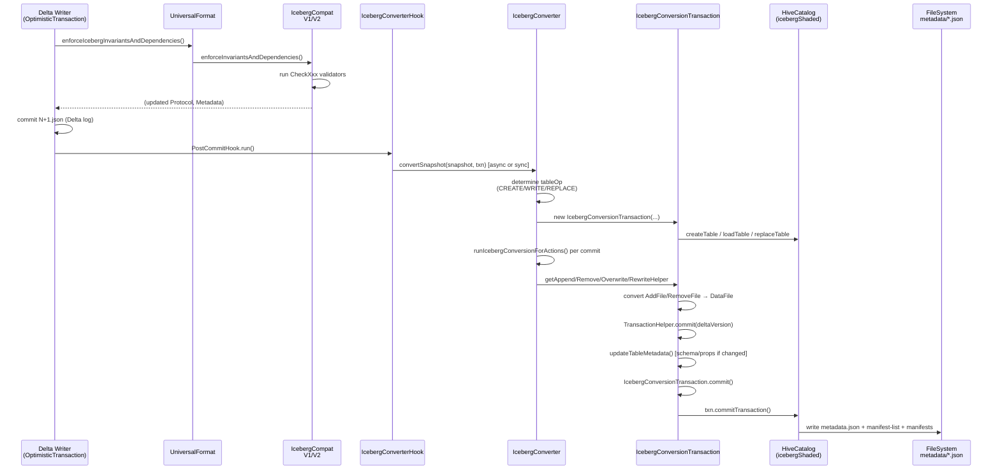
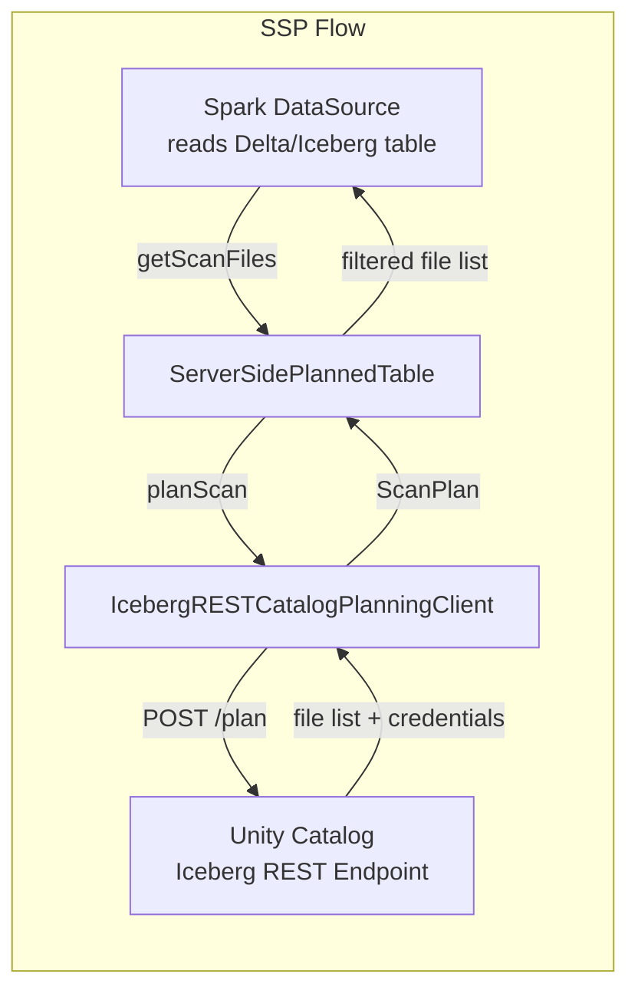

# delta-iceberg (UniForm Iceberg)

## Purpose

`delta-iceberg` implements **UniForm (Universal Format) Iceberg** support: it converts the Delta transaction log metadata of a Delta table into Iceberg-compatible metadata (Iceberg snapshots, manifest lists, and a HiveCatalog-backed `metadata.json`) **without copying or duplicating the underlying Parquet data files**. Iceberg-native readers can then query the same Parquet files that Delta writers produce, treating the table as a native Iceberg table.

This is the core "read Delta as Iceberg" technology: the Parquet files are shared; only the catalog-level metadata differs.

---

## UniForm Overview

### The Problem

Delta and Iceberg are separate open table formats, each with their own metadata layer (transaction log vs. Iceberg snapshots). Without UniForm, sharing data between Delta writers and Iceberg readers required ETL pipelines that physically duplicated data.

### The Solution

UniForm maintains a **parallel Iceberg metadata layer** alongside the Delta transaction log. After each Delta commit:

1. The Iceberg metadata (manifest files, manifest list, `metadata.json`) is generated from the Delta snapshot.
2. The metadata is written to `<table_path>/metadata/` (the same filesystem as the Delta `_delta_log/`).
3. Iceberg readers (e.g., Spark with Iceberg, Trino, Flink via Iceberg catalog, or Iceberg-aware REST catalogs) can discover the table through a Hive metastore entry or REST catalog — and read the same Parquet files directly.

**No data duplication.** The Parquet files written by Delta are Iceberg-readable because UniForm requires `icebergCompatV1` or `icebergCompatV2` (column mapping mode + other write constraints) to keep the Parquet layout conformant with the Iceberg spec.

### Key Concept: IcebergCompat vs. UniForm

| Concept | What It Is | Location |
|---|---|---|
| `IcebergCompatV1` / `V2` | Delta table feature: write-time constraints ensuring Parquet files are Iceberg-readable | `spark/src/main/scala/org/apache/spark/sql/delta/IcebergCompat.scala` |
| UniForm (Iceberg) | The actual metadata conversion pipeline | `delta.universalFormat.enabledFormats = iceberg` |

**IcebergCompatVx does NOT require UniForm.** A table can have `IcebergCompatV2` enabled (enforcing write constraints) without publishing Iceberg metadata. UniForm depends on IcebergCompat, not the other way around.

---

## Configuration

### Enabling UniForm (Iceberg)

```sql
-- New table (auto-selects IcebergCompatV2 and ColumnMapping=name)
CREATE TABLE my_catalog.my_db.my_table (id INT, name STRING)
USING DELTA
TBLPROPERTIES (
  'delta.universalFormat.enabledFormats' = 'iceberg'
);

-- Existing table (use REORG TABLE to rewrite files with IcebergCompatV2)
ALTER TABLE my_catalog.my_db.my_table
SET TBLPROPERTIES ('delta.universalFormat.enabledFormats' = 'iceberg');
-- or for upgrading existing non-uniform table:
REORG TABLE my_catalog.my_db.my_table UPGRADE UNIFORM (ICEBERG_COMPAT_VERSION=2);
```

### Key Table Properties

| Property | Config Key | Description |
|---|---|---|
| `delta.universalFormat.enabledFormats` | `DeltaConfigs.UNIVERSAL_FORMAT_ENABLED_FORMATS` | Comma-separated list: `iceberg`, `hudi`, or both |
| `delta.enableIcebergCompatV1` | `DeltaConfigs.ICEBERG_COMPAT_V1_ENABLED` | Enables IcebergCompatV1 (Iceberg format v2, no Arrays/Maps/NullType) |
| `delta.enableIcebergCompatV2` | `DeltaConfigs.ICEBERG_COMPAT_V2_ENABLED` | Enables IcebergCompatV2 (Iceberg format v2, full type support, no DVs) |
| `delta.columnMapping.mode` | `DeltaConfigs.COLUMN_MAPPING_MODE` | Auto-set to `name` when enabling IcebergCompat (required) |

### Key SQL Configurations

| SQL Conf | Default | Description |
|---|---|---|
| `spark.databricks.delta.uniform.iceberg.sync.convert.enabled` | `false` | Forces synchronous Iceberg conversion (for debugging/tests only) |
| `spark.databricks.delta.uniform.iceberg.retry.times` | `3` | Retries on Iceberg `CommitFailedException` |
| `spark.databricks.delta.iceberg.maxPendingCommits` | (default) | Max Delta commits to process incrementally before falling back to full REPLACE_TABLE |
| `spark.databricks.delta.uniform.iceberg.include.base.converted.version` | `true` | Include `base-delta-version` property in Iceberg metadata |

### Iceberg Table Properties Forwarding

Delta properties with prefix `delta.universalformat.config.iceberg.*` are stripped of their prefix and forwarded verbatim to Iceberg table properties (`DeltaConfigs.DELTA_UNIVERSAL_FORMAT_ICEBERG_CONFIG_PREFIX`). This allows passing arbitrary Iceberg properties (e.g., `write.metadata.compression-codec`) without Delta changes.

---

## IcebergCompat Protocol Features

### IcebergCompatV1

- **Iceberg format version written**: 2
- **Required table properties**: `delta.columnMapping.mode` = `name` or `id` (auto-set)
- **Incompatible features**: `DeletionVectors`
- **Schema checks**:
  - `CheckAddFileHasStats`: every `AddFile` must have `numRecords` stat
  - `CheckNoPartitionEvolution`: partition columns cannot change after creation
  - `CheckNoListMapNullType`: disallows `ArrayType`, `MapType`, `NullType` in schema (V1 limitation)
  - `CheckDeletionVectorDisabled`: DVs must be disabled
  - `CheckTypeWideningSupported`: type changes must be Iceberg-compatible

### IcebergCompatV2

- **Iceberg format version written**: 2
- **Required table properties**: `delta.columnMapping.mode` = `name` or `id`
- **Incompatible features**: `DeletionVectors`
- **Schema checks**:
  - `CheckAddFileHasStats`
  - `CheckTypeInV2AllowList`: full type allowlist including `ArrayType`, `MapType`, `StructType` (V2 relaxes the V1 restriction)
  - `CheckPartitionDataTypeInV2AllowList`: partition columns restricted to scalar types
  - `CheckNoPartitionEvolution`
  - `CheckDeletionVectorDisabled`
  - `CheckTypeWideningSupported`

### IcebergCompatV1 vs V2 Comparison

| Constraint | V1 | V2 |
|---|---|---|
| Iceberg format version | 2 | 2 |
| `ArrayType` in schema | ❌ blocked | ✅ allowed |
| `MapType` in schema | ❌ blocked | ✅ allowed |
| `NullType` in schema | ❌ blocked | ❌ blocked |
| `DeletionVectors` | ❌ incompatible | ❌ incompatible |
| Column Mapping | required (name or id) | required (name or id) |
| Mutual exclusivity | only one version enabled at a time | only one version enabled at a time |

### Deletion Vector Restriction — Special Case: `REORG UPGRADE UNIFORM`

`CheckDeletionVectorDisabled` has two behaviors:

1. **For `REORG UPGRADE UNIFORM`**: checks only the *newest* metadata (not the previous snapshot). This allows `REORG` to atomically disable DVs and enable UniForm in a single pass, rewriting DV-referenced files as plain Parquet.
2. **For all other commands**: checks both the *previous snapshot* and the *newest metadata*. This guards against concurrent writers.

Source: `IcebergCompat.scala:491-522`

---

## Public Interface

| Symbol | Type | Description |
|---|---|---|
| `IcebergConverter` | class | Main converter — async and sync `convertSnapshot` entry points |
| `IcebergConversionTransaction` | class | Wraps an `IcebergTransaction`; orchestrates file-level and metadata updates |
| `IcebergSchemaUtils` | trait + object | Delta `StructType` → Iceberg `Schema` conversion; two impls: name-mapping and ID-mapping |
| `DeltaToIcebergConverter` | class | Encapsulates schema, partition spec, and properties for a snapshot |
| `IcebergTransactionUtils` | object | Low-level helpers: `DataFile` construction, partition value deserialization, `HiveCatalog` creation |
| `IcebergStatsConverter` | case class | Delta stats JSON → Iceberg `Metrics` conversion |
| `DeltaToIcebergConvert` | object | Partition value conversion, table properties computation, default value extraction |
| `IcebergCompatV1` / `IcebergCompatV2` | objects | Protocol feature enforcement — `enforceInvariantsAndDependencies` |
| `IcebergCompat` | object | Version registry for `IcebergCompatV1` and `V2` |
| `UniversalFormat` | object | UniForm feature orchestrator — `enforceIcebergInvariantsAndDependencies`, `icebergEnabled` |
| `IcebergConverterHook` / `IcebergSyncConverterHook` | objects | Post-commit hooks that trigger `IcebergConverter` |
| `ParquetIcebergCompatV2Utils` | object | Parquet footer inspection: validates `field_id` and `TIMESTAMP` encoding |
| `IcebergRESTCatalogPlanningClient` | class | SSP: queries an Iceberg REST catalog `/plan` endpoint for server-side scan planning |
| `IcebergRESTCatalogPlanningClientFactory` | class | SSP factory — creates `IcebergRESTCatalogPlanningClient` from `ServerSidePlanningMetadata` |
| `SparkToIcebergExpressionConverter` | object | Translates Spark `Filter` predicates to Iceberg `Expression` for SSP filter pushdown |

---

## Key Dependencies

- **[[spark]] (`delta-spark`)**: `IcebergConverter` depends on `Snapshot`, `DeltaLog`, `OptimisticTransaction`, `DeltaConfig`, `DeltaColumnMapping`, `UniversalFormat`, `IcebergCompat`
- **`icebergShaded` (internal shaded JAR)**: All Iceberg classes are accessed via `shadedForDelta.org.apache.iceberg.*` — the result of shading `org.apache.iceberg:iceberg-core:1.10.1` + `iceberg-hive-metastore:1.10.1` to avoid classpath conflicts with user-provided Iceberg JARs
- **`iceberg-spark-runtime-<spark_version>`** (`org.apache.iceberg` artifact, `provided`): Runtime Iceberg integration for Spark; not shaded — loaded by the user's classpath
- **[[storage]]**: `HadoopConf` from `DeltaLog.newDeltaHadoopConf()` used for Iceberg filesystem I/O

## Modules That Depend On This

- No production module depends on `delta-iceberg` (it is a leaf in the SBT dependency graph)
- `testDeltaIcebergJar` is an integration test harness that verifies the published JAR contents

---

## Architecture: Delta Write → Iceberg Metadata Flow



_This flow applies to every Delta write when `delta.universalFormat.enabledFormats` contains `iceberg`. Async mode (default) fires the conversion in a background daemon thread; sync mode is for tests only._

---

## Component: IcebergConverter (Async Orchestrator)

**Source**: `iceberg/src/main/scala/org/apache/spark/sql/delta/icebergShaded/IcebergConverter.scala`

### Async Conversion Queue

`IcebergConverter` maintains two `AtomicReference` slots:

```scala
// iceberg/src/main/scala/org/apache/spark/sql/delta/icebergShaded/IcebergConverter.scala:86-89
protected val currentConversion =
  new AtomicReference[(Snapshot, CommittedTransaction)]()
protected val standbyConversion =
  new AtomicReference[(Snapshot, CommittedTransaction)]()
```

`enqueueSnapshotForConversion()` (line 107):
- Replaces any already-queued snapshot in `standbyConversion` (only the latest snapshot is ever queued — intermediate versions are dropped)
- If no async thread is active, spawns a daemon thread named `async-iceberg-converter [id=<tableId>]`
- The daemon loops: pick next from `standbyConversion` → call `convertSnapshot` → pick next → ... → exit when queue is empty

> [!NOTE] Why drop intermediate snapshots?
> Iceberg conversion is idempotent and monotonic. If commits N, N+1, N+2 are queued and we only convert N+2 (the latest), the resulting Iceberg snapshot reflects the full current state. Intermediate snapshots are re-constructed from the Delta log during the incremental conversion step anyway.

### Conversion Entry Points

Three `convertSnapshot` overloads are layered:

1. **`convertSnapshot(snapshot, txn: CommittedTransaction)`** (public) — used by `IcebergConverterHook`; extracts `catalogTable` from `txn.catalogTable`
2. **`convertSnapshot(snapshot, catalogTable: CatalogTable)`** (public) — used when no txn is available (e.g., initial conversion on `CREATE TABLE`)
3. **`convertSnapshotWithRetry(...)` → `convertSnapshot(snapshot, txnOpt, catalogTable)`** (private core) — implements retry logic on `CommitFailedException` (up to `DELTA_UNIFORM_ICEBERG_RETRY_TIMES`, default 3)

### tableOp Decision

```scala
// iceberg/src/main/scala/org/apache/spark/sql/delta/icebergShaded/IcebergConverter.scala:419-423
val tableOp = (lastDeltaVersionConverted, prevConvertedSnapshotOpt) match {
  case (Some(_), Some(_)) => WRITE_TABLE   // incremental update
  case (Some(_), None)    => REPLACE_TABLE // prev snapshot expired / too far behind
  case (None, None)       => CREATE_TABLE  // first-ever conversion
}
```

**REPLACE_TABLE** is triggered when:
- The table was previously converted but the old Delta commit file has been vacuumed away (`DeltaFileNotFoundException`)
- The delta version gap exceeds `ICEBERG_MAX_COMMITS_TO_CONVERT`

In REPLACE_TABLE, the converter reads `snapshot.allFiles` (full state reconstruction) and creates a fresh Iceberg table, discarding all previous Iceberg snapshot history.

### Action → TransactionHelper Dispatch

`runIcebergConversionForActions()` (line 675) scans all actions in a commit to determine which Iceberg operation type to use:

```
+-------------------+---------------+---------------------+--------------------+
|  Type of actions  |  Data Change  |   TransactionHelper | Example            |
+-------------------+---------------+---------------------+--------------------+
|  Create table     |  Any          |   AppendHelper      |  initial load      |
|  Add only         |  All=true     |   AppendHelper      |  INSERT            |
|  Add only         |  All=false    |   NullHelper        |  add tag (no-op)   |
|  Add only (auto)  |  All=false    |   RewriteHelper     |  COMPUTE STATS     |
|  Remove only      |  Any          |   RemoveHelper      |  DELETE            |
|  Add + Remove     |  All=true     |   OverwriteHelper   |  UPDATE/MERGE      |
|  Add + Remove     |  None=false   |   RewriteHelper     |  OPTIMIZE          |
+-------------------+---------------+---------------------+--------------------+
```

Files with `DeletionVectors` are rejected at this stage (`UnsupportedOperationException`), which is consistent with the IcebergCompat DV restriction.

### OPTIMIZE Triggers Iceberg Snapshot Expiry

```scala
// iceberg/src/main/scala/org/apache/spark/sql/delta/icebergShaded/IcebergConverter.scala:511-518
val OPR_TRIGGER_EXPIRE = Set(DeltaOperations.OPTIMIZE_OPERATION_NAME)
val needsExpireSnapshot = OPR_TRIGGER_EXPIRE
  .intersect(convertedCommits.flatten.map(_.operation).toSet).nonEmpty
if (needsExpireSnapshot) {
  expireIcebergSnapshot(snapshotToConvert, icebergTxn)
}
```

When a Delta `OPTIMIZE` is converted, `IcebergConverter` also commits an Iceberg `ExpireSnapshots` operation, keeping the Iceberg snapshot history in sync with Delta's compacted state. The expiry logic guards against deleting physical Parquet files that happen to live in the same location as the Iceberg metadata directory.

---

## Component: IcebergConversionTransaction

**Source**: `iceberg/src/main/scala/org/apache/spark/sql/delta/icebergShaded/IcebergConversionTransaction.scala`

This class wraps a single Iceberg `Transaction` and exposes typed helpers for each Iceberg operation type.

### TransactionHelper Hierarchy

```
TransactionHelper (abstract)
├── NullHelper          — no-op for metadata-only or unrecognized commits
├── AppendOnlyHelper    — wraps Iceberg AppendFiles  (INSERT)
├── RemoveOnlyHelper    — wraps Iceberg DeleteFiles  (DELETE)
├── OverwriteHelper     — wraps Iceberg OverwriteFiles (UPDATE/MERGE)
├── RewriteHelper       — wraps Iceberg RewriteFiles (OPTIMIZE)
└── ExpireSnapshotHelper — wraps Iceberg ExpireSnapshots (post-OPTIMIZE)
```

Each helper receives `AddFile` or `RemoveFile` objects and converts them to Iceberg `DataFile` objects using the `toDataFile` implicit conversions.

### Serialization Guard (Snapshot ID Check)

```scala
// iceberg/src/main/scala/org/apache/spark/sql/delta/icebergShaded/IcebergConversionTransaction.scala:428-432
if (startFromSnapshotId.isDefined && lastConvertedIcebergSnapshotId != startFromSnapshotId) {
  throw new ConcurrentModificationException("Cannot commit because the converted " +
    s"metadata is based on a stale iceberg snapshot $lastConvertedIcebergSnapshotId"
  )
}
```

Before `commitTransaction()`, the transaction checks that no other Iceberg commit snuck in between when it loaded the table and when it commits. This ensures Iceberg history is linear and consistent with the Delta version sequence.

### CREATE_TABLE Field ID Override

```scala
// iceberg/src/main/scala/org/apache/spark/sql/delta/icebergShaded/IcebergConversionTransaction.scala:438-447
if (tableOp == CREATE_TABLE) {
  metadataUpdates.add(
    new AddSchema(icebergSchema, postCommitSnapshot.metadata.columnMappingMaxId.toInt)
  )
  ...
  txn.commitTransaction()
}
```

Iceberg normally reassigns field IDs during `CREATE TABLE`. This block overrides that behavior by explicitly injecting the Delta-generated field IDs into the Iceberg schema metadata. This is critical: Delta's Parquet files embed these field IDs (via column mapping), and Iceberg readers use them for schema evolution. Mismatching IDs would break column-by-ID resolution.

### Commit Properties Written

Every `IcebergConversionTransaction.commit()` writes these Iceberg table properties:

| Property | Value |
|---|---|
| `delta-version` | Delta snapshot version number |
| `delta-timestamp` | Delta snapshot timestamp (epoch ms) |
| `schema.name-mapping.default` | Iceberg name-mapping JSON (generated from current schema) |
| `base-delta-version` | (optional) The Delta version conversion started from |

The `delta-version` property is read back by `IcebergConverter.getLastConvertedDeltaVersion()` to detect whether a conversion is up-to-date and to know from which version incremental conversion should start.

---

## Component: Delta Schema → Iceberg Schema Mapping

**Source**: `iceberg/src/main/scala/org/apache/spark/sql/delta/icebergShaded/IcebergSchemaUtils.scala`

`IcebergSchemaUtils` is a trait with two concrete implementations:

| Implementation | When Used | Field ID Source |
|---|---|---|
| `IcebergSchemaUtilsIdMapping` | Column mapping mode is `name` or `id` (standard UniForm) | `DeltaColumnMapping.getColumnId(field)` from field metadata |
| `IcebergSchemaUtilsNameMapping` | Column mapping mode is `NoMapping` (no column IDs, e.g., raw convert-to-Delta tables) | Auto-incrementing dummy IDs |

### Type Mapping

```scala
// iceberg/src/main/scala/org/apache/spark/sql/delta/icebergShaded/IcebergSchemaUtils.scala:194-207
def convertAtomic[E <: DataType](elem: E): IcebergType.PrimitiveType = elem match {
  case StringType         => IcebergTypes.StringType.get()
  case LongType           => IcebergTypes.LongType.get()
  case IntegerType | ShortType | ByteType => IcebergTypes.IntegerType.get()
  case FloatType          => IcebergTypes.FloatType.get()
  case DoubleType         => IcebergTypes.DoubleType.get()
  case d: DecimalType     => IcebergTypes.DecimalType.of(d.precision, d.scale)
  case BooleanType        => IcebergTypes.BooleanType.get()
  case BinaryType         => IcebergTypes.BinaryType.get()
  case DateType           => IcebergTypes.DateType.get()
  case TimestampType      => IcebergTypes.TimestampType.withZone()
  case TimestampNTZType   => IcebergTypes.TimestampType.withoutZone()
}
```

> [!NOTE] ShortType and ByteType widening
> Both `ShortType` and `ByteType` are mapped to Iceberg `IntegerType`. This is a lossy widening at the metadata level; Parquet stores shorts/bytes as 32-bit integers natively, so no data-level change occurs.

> [!NOTE] LongType stats caveat
> `IcebergStatsConverter.isMinMaxStatTypeSupported()` does **not** list `LongType` as supported for min/max stats conversion. A TODO comment (line 215) references a Spark PR. In practice, `Long` min/max stats are not emitted in the Iceberg metadata, though null counts and row counts still work.

### Composite Types

- `StructType` → `IcebergTypes.StructType.of(...)` (recursive)
- `ArrayType` → `IcebergTypes.ListType.ofOptional/ofRequired(elementId, ...)` — element field ID comes from `COLUMN_MAPPING_METADATA_NESTED_IDS_KEY` in the field metadata
- `MapType` → `IcebergTypes.MapType.ofOptional/ofRequired(keyId, valId, ...)` — both key and value IDs from nested IDs metadata

### Column Default Values (IcebergCompatV3+ Preview)

In `convertStruct`, when `compatVersion >= 3` (not yet released, gated by `iceberg-compat-v3.md` RFC):

```scala
// iceberg/src/main/scala/org/apache/spark/sql/delta/icebergShaded/IcebergSchemaUtils.scala:84-90
if (compatVersion >= 3) {
  DeltaToIcebergConvert.Schema.extractLiteralDefault(f) match {
    case Left(errorMsg) =>
      throw new UnsupportedOperationException(errorMsg)
    case _ => icebergField
  }
}
```

Non-literal defaults (expressions) are rejected; literal defaults are extracted from `CURRENT_DEFAULT_COLUMN_METADATA_KEY` in Spark column metadata and converted to Iceberg `Literal` objects.

---

## Component: Delta Statistics → Iceberg Statistics

**Source**: `iceberg/src/main/scala/org/apache/spark/sql/delta/icebergShaded/IcebergStatsConverter.scala`

### Iceberg Metrics Model

Iceberg represents per-file statistics as maps from **column ID** (integer) to a typed value. Delta uses JSON stats with logical column names. The conversion:

1. Parse Delta `AddFile.stats` JSON into a `statsRow: InternalRow` using a pre-built `statsParser`
2. Recursively traverse the stats schema, mapping physical column names → column IDs via `DeltaColumnMapping.getColumnId(field)`
3. Emit three stat categories:

| Iceberg Metric | Delta Source | Encoding |
|---|---|---|
| `rowCount` (required) | `numRecords` | `java.lang.Long` |
| `lowerBounds` | `minValues` | `Map[colId, ByteBuffer]` (Iceberg binary encoding) |
| `upperBounds` | `maxValues` | `Map[colId, ByteBuffer]` (Iceberg binary encoding) |
| `nullValueCounts` | `nullCount` | `Map[colId, java.lang.Long]` |
| `columnSizes`, `valueCounts`, `nanValueCounts` | not converted | `null` (optional in Iceberg spec) |

### ByteBuffer Encoding

Iceberg uses `Conversions.toByteBuffer(icebergType, value)` for lower/upper bound serialization. Type-specific handling:
- `ByteType` / `ShortType`: widened to `Int` before encoding (matches `convertAtomic` widening)
- `UTF8String` (Spark internal): converted to Java `String`
- `Decimal`: converted to `java.math.BigDecimal`
- All other numeric/boolean/date/timestamp: used directly

Stats conversion is **best-effort** — if it fails with a `NonFatal` exception (e.g., unsupported type, null stats), the `DataFile` is built without stats rather than aborting the conversion.

---

## Component: Delta Partition → Iceberg Partition Spec

**Source**: `iceberg/src/main/scala/org/apache/spark/sql/delta/icebergShaded/IcebergTransactionUtils.scala` (lines 51-63)

Delta's partitioning is exclusively **identity transforms** (partition-by-value). Iceberg's `PartitionSpec` supports arbitrary transforms (bucket, truncate, date transforms, etc.).

UniForm only supports identity transforms for Delta tables:

```scala
// iceberg/src/main/scala/org/apache/spark/sql/delta/icebergShaded/IcebergTransactionUtils.scala:51-63
def createPartitionSpec(icebergSchema: IcebergSchema, partitionColumns: Seq[String]): PartitionSpec = {
  if (partitionColumns.isEmpty) {
    PartitionSpec.unpartitioned
  } else {
    val builder = PartitionSpec.builderFor(icebergSchema)
    for (partitionName <- partitionColumns) {
      builder.identity(partitionName)
    }
    builder.build()
  }
}
```

### Partition Value Deserialization

Delta stores partition values as **strings** in `AddFile.partitionValues`. Iceberg requires typed values. `stringToIcebergPartitionValue()` deserializes each string:

| Delta Type | Iceberg Type | Conversion |
|---|---|---|
| `StringType` | String | identity |
| `DateType` | `Int` (days since epoch) | `java.sql.Date.valueOf(str).toLocalDate.toEpochDay` |
| `TimestampType` | `Long` (µs since epoch) | ISO-8601 parse → `DateTimeUtil.microsFromInstant`, with fallback to system timezone |
| `TimestampNTZType` | `Long` (µs since epoch, no tz) | `DateTimeUtil.isoTimestampToMicros()` |
| `IntegerType`, `ShortType`, `ByteType` | `Integer` | parse and cast |
| `LongType` | `Long` | parse |
| `BooleanType` | `Boolean` | parse |
| `DecimalType` | `BigDecimal` | parse |
| `BinaryType` | `ByteBuffer` | UTF-8 encode string |
| `null` / `__HIVE_DEFAULT_PARTITION__` | `null` | Iceberg null partition |

---

## Component: Shaded Iceberg JAR

**Source**: `build.sbt` lines 1232-1280, `icebergShaded/` directory

### Why Shading?

Delta Spark runs in a user's Spark environment that may already have Apache Iceberg on the classpath (for users running both Delta and Iceberg tables). Without shading, Iceberg's classes would conflict — potentially at incompatible versions.

The solution: `icebergShaded` is a separate SBT sub-project that:
1. Declares `iceberg-core:1.10.1` and `iceberg-hive-metastore:1.10.1` as dependencies
2. Uses `sbt-assembly` with `ShadeRule.rename("org.apache.iceberg.**" -> "shadedForDelta.@0")` to relocate all Iceberg classes to the `shadedForDelta.` namespace
3. Produces a fat JAR consumed by `delta-iceberg` via `unmanagedJars += (icebergShaded / assembly).value`

```scala
// build.sbt:1266
ShadeRule.rename("org.apache.iceberg.**" -> "shadedForDelta.@0").inAll
```

### What's Included in the Shaded JAR

- `iceberg-core` (all Iceberg table format logic, catalog implementations, metric classes)
- `iceberg-hive-metastore` (HiveCatalog, HiveTableOperations — for writing Iceberg metadata to HMS)
- All transitive dependencies that are NOT in Spark's classpath (Avro, ORC Iceberg reader, etc.)

### Custom Overrides in `icebergShaded/src`

```
// build.sbt:1276-1280
// all following classes have Delta customized implementation under icebergShaded/src and thus
// require them to be 'first' to replace the class from iceberg jar
```

Any file in `icebergShaded/src/main/scala/org/apache/spark/sql/delta/icebergShaded/` (or corresponding Java dir) overrides the equivalent class from the shaded Iceberg JAR. This is used for the custom `HiveCatalog` initialization that accepts `MetadataUpdate` pre-seeding.

### `icebergTestsShaded`

A parallel `icebergTestsShaded` project shades `iceberg-core:1.10.1:tests` for use in tests that need Iceberg's internal test utilities (e.g., `IcebergRESTServer`).

---

## Component: Server-Side Planning Integration

**Sources**:
- `iceberg/src/main/scala/org/apache/spark/sql/delta/serverSidePlanning/IcebergRESTCatalogPlanningClient.scala`
- `iceberg/src/main/scala/org/apache/spark/sql/delta/serverSidePlanning/IcebergRESTCatalogPlanningClientFactory.scala`
- `iceberg/src/main/scala/org/apache/spark/sql/delta/serverSidePlanning/SparkToIcebergExpressionConverter.scala`
- `iceberg/src/main/java/org/apache/spark/sql/delta/serverSidePlanning/FixedGcsAccessTokenProvider.java`

### Purpose

Server-side planning (SSP) allows an external catalog server (e.g., Unity Catalog's Iceberg REST endpoint) to perform **file scan planning** on behalf of the Spark client. Instead of the client listing all Parquet files and applying data skipping locally, the server returns a pre-filtered list of files to read.

### IcebergRESTCatalogPlanningClient

`IcebergRESTCatalogPlanningClient` implements `ServerSidePlanningClient` (defined in `spark/src/main/scala/org/apache/spark/sql/delta/serverSidePlanning/`).

**Lifecycle**:
1. Constructor: sets `baseUri`, `catalogName`, `token`
2. Lazy `icebergRestCatalogUriRoot`: calls `GET /v1/config?warehouse=<catalogName>` to fetch catalog prefix per Iceberg REST spec; returns `<baseUri>/<prefix>` or `<baseUri>` if no prefix
3. `planScan(database, table, filterOpt, projectionOpt, limitOpt)`:
   - Constructs `POST /namespaces/<db>/tables/<table>/plan` request body as `PlanTableScanRequest` JSON
   - Converts `sparkFilterOption` to Iceberg `Expression` via `SparkToIcebergExpressionConverter`
   - Injects `min-rows-requested` for limit pushdown (Iceberg 1.11+ field, injected via json4s manipulation since not yet in public API)
   - Parses `PlanTableScanResponse` via reflection on `PlanTableScanResponseParser.fromJson()`
   - Validates plan status is `completed` (async planning not yet supported)
   - Validates all files are unpartitioned (partitioned tables not yet supported)
   - Extracts `storage-credentials` from response for S3/Azure/GCS credential vending

**Storage Credential Vending**:

The response JSON may include a `storage-credentials` block. `IcebergRESTCatalogPlanningClient` extracts S3, Azure (ADLS SAS token), or GCS credentials from this block and wraps them in a `ScanPlanStorageCredentials` sealed trait implementation. These credentials are then applied to the Hadoop `Configuration` for the scan.



### SparkToIcebergExpressionConverter

Converts Spark `Filter` objects to Iceberg `Expression` objects for filter pushdown to the REST catalog server. Supports:

- Equality: `EqualTo`, with special handling for `null → isNull` and `NaN → isNaN`
- Comparisons: `LessThan`, `GreaterThan`, `LessThanOrEqual`, `GreaterThanOrEqual`
- Set: `In`, `Not(In)` → `notIn`
- Null checks: `IsNull`, `IsNotNull`
- Logical: `And`, `Or`
- NOT special cases: `Not(EqualTo)`, `Not(IsNull)`, `Not(StringStartsWith)`
- String: `StringStartsWith`, `Not(StringStartsWith)`
- Constants: `AlwaysTrue`, `AlwaysFalse`
- **Unsupported** (returns `None`): `StringEndsWith`, `StringContains`, `Not(LessThan)`, etc.

`canConvertFilters(filters)` returns `true` only if **all** filters can be converted; partial pushdown is not supported.

### FixedGcsAccessTokenProvider

`FixedGcsAccessTokenProvider` (Java) implements the Google Cloud Storage `AccessTokenProvider` interface. It reads a pre-configured OAuth2 access token from Hadoop configuration properties (`fs.gs.auth.access.token` and optionally `fs.gs.auth.access.token.expiration.ms`) and serves it as a static, fixed credential. This enables using short-lived tokens vended by the Iceberg REST catalog for GCS table access.

---

## Component: Post-Commit Hook Integration

**Source**: `spark/src/main/scala/org/apache/spark/sql/delta/hooks/IcebergConverterHook.scala`

`IcebergConverterHook` is a `PostCommitHook` registered on `DeltaLog`. It fires after every successful Delta commit.

```scala
// spark/src/main/scala/org/apache/spark/sql/delta/hooks/IcebergConverterHook.scala:32-44
override def run(spark: SparkSession, txn: CommittedTransaction): Unit = {
  val postCommitSnapshot = txn.postCommitSnapshot
  if (txn.committedVersion != postCommitSnapshot.version ||
      !UniversalFormat.icebergEnabled(postCommitSnapshot.metadata)) {
    return
  }
  val converter = postCommitSnapshot.deltaLog.icebergConverter
  triggerIcebergConversion(converter, spark, txn)
}
```

**Guard Condition**: Skips conversion if `committedVersion != postCommitSnapshot.version` — this prevents duplicate conversions when multiple txns commit in quick succession and one of them picks up a snapshot that includes another transaction's changes.

**Two Variants**:

| Hook | Mode | Error Handling |
|---|---|---|
| `IcebergConverterHook` | Async by default (sync if `DELTA_UNIFORM_ICEBERG_SYNC_CONVERT_ENABLED`); also sync when enabling UniForm for the first time | Always throws on error |
| `IcebergSyncConverterHook` | Always synchronous | Always throws on error |

---

## Component: ParquetIcebergCompatV2Utils

**Source**: `spark/src/main/scala/org/apache/spark/sql/delta/uniform/ParquetIcebergCompatV2Utils.scala`

Used by `REORG TABLE UPGRADE UNIFORM` to validate that existing Parquet files are IcebergCompatV2-safe **before** upgrading a table. This avoids upgrading a table that contains physically incompatible Parquet files.

Two conditions checked per file:

1. **TIMESTAMP stored as INT96**: Iceberg requires timestamps to be INT64 (microseconds since epoch). Delta historically stored timestamps as INT96 (96-bit binary). `IcebergCompatV2` requires INT64.
2. **Missing `field_id`**: Every Parquet column and nested element must carry a `field_id` metadata attribute. Iceberg uses `field_id` for schema evolution and column renaming. Delta with `ColumnMapping=name` writes `field_id` into Parquet metadata; tables without column mapping do not.

```scala
// spark/src/main/scala/org/apache/spark/sql/delta/uniform/ParquetIcebergCompatV2Utils.scala:103-110
def isParquetIcebergCompatV2(footer: ParquetMetadata): Boolean = {
  !footer.getFileMetaData.getSchema.getFields.toArray.exists {
    case field: org.apache.parquet.schema.Type =>
      hasTimestampAsInt96OrFieldIdNotExistForType(field)
  }
}
```

For nested types (`LIST`, `MAP`), the check traverses into the inner group elements per Parquet spec — the outer `list`/`key_value` wrapper groups' `field_id` is checked, and their children are recursed into.

---

## IcebergCompatV2 Constraints Summary

The following table summarizes all write-time constraints enforced by `IcebergCompatV2`:

| Constraint | Enforced By | Error Path |
|---|---|---|
| Column Mapping must be `name` or `id` | `RequireColumnMapping` (auto-set on CREATE/REORG) | `handleMissingRequiredTableProperties` |
| No `DeletionVectors` | `CheckDeletionVectorDisabled` | `icebergCompatDeletionVectorsShouldBeDisabledException` |
| `AddFile` must have `numRecords` stat | `CheckAddFileHasStats` | `UnsupportedOperationException` |
| No partition evolution | `CheckNoPartitionEvolution` | `icebergCompatReplacePartitionedTableException` |
| Only one IcebergCompatVx at a time | `CheckOnlySingleVersionEnabled` | `icebergCompatVersionMutualExclusive` |
| Data types in schema allowlist | `CheckTypeInV2AllowList` | `icebergCompatUnsupportedDataTypeException` |
| Partition columns scalar types only | `CheckPartitionDataTypeInV2AllowList` | `icebergCompatUnsupportedPartitionDataTypeException` |
| Type widening must be Iceberg-compatible | `CheckTypeWideningSupported` | `icebergCompatUnsupportedTypeWideningException` |

---

## Test Coverage

| Test File | Scope |
|---|---|
| `iceberg/src/test/scala/.../uniform/UniFormE2EIcebergSuite.scala` | E2E: write Delta table with UniForm enabled, read via Iceberg Spark runtime |
| `iceberg/src/test/scala/.../uniform/UniversalFormatSuite.scala` | Unit: `UniversalFormat` and `IcebergCompat` checks |
| `iceberg/src/test/scala/.../uniform/IcebergCompatV2EnableUniformByAlterTableSuite.scala` | ALTER TABLE to enable UniForm on existing table |
| `iceberg/src/test/scala/.../uniform/TypeWideningUniformSuite.scala` | Type widening with UniForm: supported and unsupported cases |
| `iceberg/src/test/scala/.../ConvertIcebergToDeltaSuite.scala` | Convert existing Iceberg tables to Delta format |
| `iceberg/src/test/scala/.../ConvertToIcebergSuite.scala` | Delta → Iceberg conversion output validation |
| `iceberg/src/test/scala/.../commands/convert/IcebergStatsUtilsSuite.scala` | Delta stats → Iceberg metrics conversion |
| `iceberg/src/test/scala/.../commands/convert/IcebergPartitionConverterSuite.scala` | Partition value deserialization |
| `iceberg/src/test/scala/.../serverSidePlanning/IcebergRESTCatalogPlanningClientSuite.scala` | SSP client: HTTP plumbing, filter conversion, credential extraction |
| `iceberg/src/test/scala/.../serverSidePlanning/SparkToIcebergExpressionConverterSuite.scala` | Filter → Iceberg Expression conversion |
| `iceberg/src/test/java/.../rest/IcebergRESTServer.java` | Test Iceberg REST server for SSP integration tests |

Notable gap: no test for the async queue drop-on-backlog behavior (intermediate snapshot skipping).

---

## Key Classes Reference

```
delta-iceberg module (iceberg/)
├── icebergShaded/
│   ├── IcebergConverter.scala          — main async/sync conversion orchestrator
│   ├── IcebergConversionTransaction.scala — Iceberg txn wrapper, TransactionHelper hierarchy
│   ├── IcebergTransactionUtils.scala   — DataFile construction, partition values, HiveCatalog
│   ├── IcebergSchemaUtils.scala        — Delta StructType → Iceberg Schema
│   ├── DeltaToIcebergConvert.scala     — DeltaToIcebergConverter, partition, table properties
│   └── IcebergStatsConverter.scala     — Delta stats → Iceberg Metrics
├── serverSidePlanning/
│   ├── IcebergRESTCatalogPlanningClient.scala   — REST client for Iceberg /plan endpoint
│   ├── IcebergRESTCatalogPlanningClientFactory.scala
│   ├── SparkToIcebergExpressionConverter.scala  — Spark Filter → Iceberg Expression
│   └── FixedGcsAccessTokenProvider.java         — GCS credential provider for vended tokens
└── (other)
    ├── IcebergTable.scala              — Delta table wrapper for Iceberg read-path
    ├── IcebergSchemaUtils.scala (root) — legacy/alternate schema utils (no-shading)
    ├── IcebergStatsUtils.scala (root)  — stats utilities used in Iceberg-to-Delta convert
    └── IcebergPartitionConverter.scala — partition converter for Iceberg-to-Delta convert

spark module (spark/)
├── IcebergCompat.scala                 — IcebergCompatV1/V2 feature enforcement
├── UniversalFormat.scala               — UniForm feature orchestrator + IcebergConstants
├── hooks/IcebergConverterHook.scala    — PostCommitHook triggering IcebergConverter
└── uniform/ParquetIcebergCompatV2Utils.scala — Parquet footer IcebergCompatV2 validation

icebergShaded/ (build project)          — sbt-assembly shading of iceberg-core + iceberg-hive-metastore
icebergTestsShaded/ (build project)     — shaded Iceberg test classes
```

---

## Diagram Opportunity Flag

> FLAG FOR ORCHESTRATOR: The interaction between `delta-iceberg` and Unity Catalog via the
> Iceberg REST catalog server-side planning endpoint (SSP) is a significant multi-component flow
> that warrants a sequence diagram at the module manifest level. The flow involves
> `delta-spark-v1` (query planning), `delta-iceberg` (SSP client), and an external REST server.
> Suggested diagram type: `sequenceDiagram`.
> Relevant files: `iceberg/src/main/scala/.../serverSidePlanning/IcebergRESTCatalogPlanningClient.scala:325-409`,
> `spark/src/main/scala/.../serverSidePlanning/ServerSidePlannedTable.scala` (in spark module).
