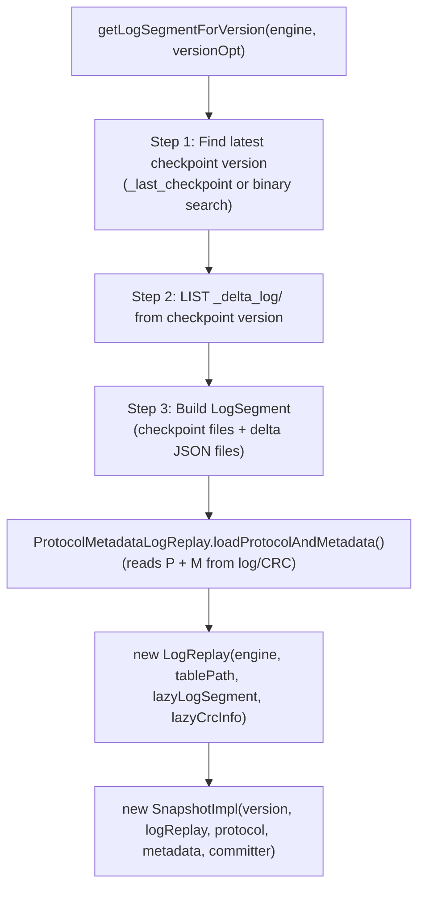
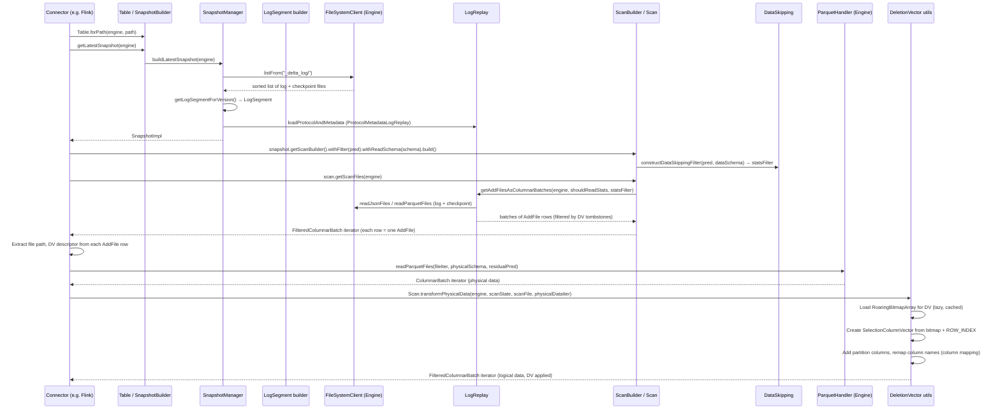

# Delta Kernel

## Purpose

Delta Kernel is a set of Java libraries that enables building Delta Lake connectors **without needing to understand the Delta protocol details**. It provides an engine-agnostic read/write API (`delta-kernel-api`) and a reference `Engine` implementation backed by Hadoop and Apache Parquet (`delta-kernel-defaults`). The design goal: any processing engine (Flink, custom readers, embedded tools) can read and write Delta tables by implementing the thin `Engine` SPI and using the stable public Java API. Zero runtime dependencies on Spark.

---

## Design Philosophy

### Engine-agnostic, Zero-Spark API

The kernel was designed from first principles to avoid Spark coupling. The `delta-kernel-api` JAR has **zero runtime dependencies**—no Hadoop, no Parquet, no Spark. All I/O is delegated to the `Engine` SPI, which the connector provides. This means:

- Kernel never calls `FileSystem` directly; it calls `engine.getFileSystemClient()`.
- Kernel never reads Parquet files; it calls `engine.getParquetHandler().readParquetFiles(...)`.
- Kernel never evaluates expressions; it calls `engine.getExpressionHandler().getEvaluator(...)`.

This SPI pattern lets each connector provide the best implementation for its environment (e.g., Flink uses its own columnar reader; Spark uses its own vectorized reader).

### Two API Families

1. **Table APIs** — `Table`, `Snapshot`, `ScanBuilder`, `Scan`, `Transaction` — the user-facing interface for reading and writing tables.
2. **Engine APIs** — `Engine` and its sub-interfaces — the connector-provided implementations of I/O and expression evaluation.

### Protocol Ownership

All Delta protocol logic lives inside `kernel-api`'s `internal` packages. Log replay, checkpoint reading/writing, deletion vector application, data skipping, table feature enforcement, OCC conflict detection — none of this is duplicated in `kernel-defaults` or connectors. The `internal` code is considered private; only public APIs in `io.delta.kernel` (non-internal) carry backward compatibility guarantees.

---

## Artifact Structure

| Artifact | Maven coordinate | Purpose |
|---|---|---|
| `delta-kernel-api` | `io.delta:delta-kernel-api` | Public Table/Engine APIs + all protocol impl |
| `delta-kernel-defaults` | `io.delta:delta-kernel-defaults` | Reference `Engine` on Hadoop + Parquet |
| `delta-kernel-unitycatalog` | (internal) | UC catalog-managed commit client |
| `delta-kernel-benchmarks` | (internal) | JMH micro-benchmarks |
| kernel-examples | (Maven, `kernel/examples/`) | Runnable Java examples |

---

## Public API Layer

### `Table` — `kernel/kernel-api/src/main/java/io/delta/kernel/Table.java`

`Table` is the entry point for both reads and writes. It is an interface with a static factory method:

```java
// Table.java:56-58
static Table forPath(Engine engine, String path) {
    return TableImpl.forPath(engine, path);
}
```

**Key methods:**

| Method | Description |
|---|---|
| `Table.forPath(engine, path)` | Factory — resolves path via `FileSystemClient.resolvePath()` |
| `getLatestSnapshot(engine)` | Build snapshot from the latest committed version |
| `getSnapshotAsOfVersion(engine, versionId)` | Time travel to a specific version |
| `getSnapshotAsOfTimestamp(engine, millisSinceEpochUTC)` | Time travel to latest version ≤ timestamp |
| `createTransactionBuilder(engine, engineInfo, operation)` | Initiate a write transaction |
| `checkpoint(engine, version)` | Write a V1 single-file Parquet checkpoint |
| `checksum(engine, version)` | Write a `.crc` checksum file for the version |

**Behavior contract at non-existent paths:**
- Reads → `TableNotFoundException`
- Writes → creates the table directory

### `Snapshot` — `kernel/kernel-api/src/main/java/io/delta/kernel/Snapshot.java`

A `Snapshot` is a consistent view of the table at one version. Two creation paths exist:

1. **New API (recommended)**: `TableManager.loadSnapshot(path)` → `SnapshotBuilder` → `build(engine)`.
2. **Legacy API**: `Table.forPath(...)` → `getLatestSnapshot(...)`.

**Key methods:**

| Method | Description |
|---|---|
| `getVersion()` | The Delta version number |
| `getSchema()` | `StructType` — the logical table schema |
| `getPartitionColumnNames()` | List of partition column names (in definition order) |
| `getTimestamp(engine)` | Commit timestamp of this version in ms since epoch |
| `getTableProperties()` | Map of all `delta.` table configuration key/values |
| `getDomainMetadata(domain)` | Retrieve stored domain metadata string for a domain key |
| `getStatistics()` | `SnapshotStatistics` — checksum state, # active files |
| `getScanBuilder()` | Entry point for reading data |
| `buildUpdateTableTransaction(engineInfo, operation)` | Initiate an update-existing-table transaction |
| `publish(engine)` | Publish catalog commits to the Delta log (UC tables only) |
| `writeChecksum(engine, mode)` | Write `.crc` file (SIMPLE = pre-computed; FULL = log-replay compute) |
| `writeCheckpoint(engine)` | Write a Parquet checkpoint for this version |

**`ChecksumWriteMode` enum:** `SIMPLE` (uses pre-loaded CRC, cheap) and `FULL` (replays log, expensive for large tables). Use `SnapshotStatistics.getChecksumWriteMode()` to determine which is appropriate.

### `ScanBuilder` / `Scan` — `ScanBuilder.java`, `Scan.java`

`ScanBuilder` is obtained from `snapshot.getScanBuilder()` and follows a builder pattern:

```java
// ScanBuilder.java:57-69
ScanBuilder withFilter(Predicate predicate);   // data skipping predicate pushdown
ScanBuilder withReadSchema(StructType readSchema); // column pruning
Scan build();
PaginatedScan buildPaginated(long pageSize, Optional<Row> pageToken); // paginated scan
```

**Data skipping contract**: Kernel uses partition values + file-level min/max/null-count statistics to prune scan files. Pruning is **best-effort**. `Scan.getRemainingFilter()` returns a residual predicate the connector _must_ apply on returned rows.

`Scan` provides:

| Method | Description |
|---|---|
| `getScanFiles(engine)` | Iterator of `FilteredColumnarBatch` — each selected row is one `AddFile` |
| `getRemainingFilter()` | Residual predicate to apply on data rows |
| `getScanState(engine)` | Shared scan state `Row` (schema, column mapping, config) |
| `Scan.transformPhysicalData(engine, scanState, scanFile, physicalDataIter)` | **Static** — converts physical Parquet data to logical output (applies DVs, adds partition columns, maps column names) |

**`getScanFiles` row schema** (each selected row represents one `AddFile`):
- `add.path` — URI of the data file
- `add.partitionValues` — `map<string,string>` partition key/value pairs
- `add.size` — file size in bytes
- `add.modificationTime` — creation time ms
- `add.dataChange` — boolean
- `add.deletionVector` — struct (storageType, pathOrInlineDv, offset, sizeInBytes, cardinality) or null
- `add.tags` — `map<string,string>`
- `tableRoot` — absolute table URI

### `Transaction` — `kernel/kernel-api/src/main/java/io/delta/kernel/Transaction.java`

The transaction interface is the write side. A connector obtains one via `table.createTransactionBuilder(...)` or `snapshot.buildUpdateTableTransaction(...)`.

**Staged write model** (the connector calls all static methods in parallel at the data-writing tasks):

```
Transaction txn = table.createTransactionBuilder(engine, "MyEngine/1.0", Operation.WRITE)
    .withSchema(engine, tableSchema)
    .withPartitionColumns(engine, partitionCols)
    .build(engine);

Row txnState = txn.getTransactionState(engine);  // broadcast to tasks

// Per-task (per-partition):
DataWriteContext ctx = Transaction.getWriteContext(engine, txnState, partitionValues);
CloseableIterator<FilteredColumnarBatch> physData =
    Transaction.transformLogicalData(engine, txnState, logicalDataIter, partitionValues);
// Write physData via engine.getParquetHandler().writeParquetFiles(ctx.getTargetDirectory(), physData, statsColumns)
CloseableIterator<Row> actions = Transaction.generateAppendActions(engine, txnState, fileStatusIter, ctx);

// On driver:
TransactionCommitResult result = txn.commit(engine, CloseableIterable.inMemoryIterable(actions));
```

**Key interface methods:**

| Method | Description |
|---|---|
| `getSchema(engine)` | Table schema as of this transaction |
| `getPartitionColumns(engine)` | Partition column names |
| `getReadTableVersion()` | Base version for OCC conflict detection |
| `getTransactionState(engine)` | `Row` to broadcast to data-writing tasks |
| `getCommitter()` | The `Committer` that owns the final commit step |
| `commit(engine, dataActions)` | Commit all actions; retries on retryable conflicts |
| `withCommitterProperties(supplier)` | Inject catalog-specific metadata into the committer |
| `addDomainMetadata(domain, config)` | Add/update domain metadata in this txn |
| `removeDomainMetadata(domain)` | Remove domain metadata in this txn |
| `Transaction.transformLogicalData(...)` | **Static** — converts logical → physical schema (removes/materializes partition cols, handles iceberg compat) |
| `Transaction.getWriteContext(...)` | **Static** — returns target directory + partition values + stats columns |
| `Transaction.generateAppendActions(...)` | **Static** — wraps `DataFileStatus` → `AddFile` `Row`s |

**`transformLogicalData` logic** (lines 171–237):
- Validates data schema matches table schema
- If IcebergCompatV2/V3 or `materializePartitionColumns` feature is enabled: moves partition columns to the **end** of the schema
- Otherwise: **removes** partition columns entirely (classic Delta behavior)
- Blocks writes if column mapping is enabled (not yet supported)
- Blocks writes if Variant data type is in the schema

### Data Model — `io.delta.kernel.data`

| Type | Description |
|---|---|
| `ColumnarBatch` | An in-memory batch of rows represented in columnar format; has a `StructType` schema and ordered `ColumnVector`s |
| `ColumnVector` | Typed column of values. Access via `getInt(rowId)`, `getString(rowId)`, `isNullAt(rowId)`, `getChild(ordinal)` for structs, etc. |
| `Row` | Row-oriented view of a single record; wraps `ColumnVector` access with ordinal-based indexing |
| `FilteredColumnarBatch` | A `ColumnarBatch` paired with an optional boolean `ColumnVector` selection vector — false/null means row is deleted |
| `DataFileStatus` | File path + size + modification time + optional `DataFileStatistics` (numRecords, min/max/nullCount per column) |

### Type System — `io.delta.kernel.types`

All Delta types extend `DataType`:

| Type class | Delta type |
|---|---|
| `BooleanType` | BOOLEAN |
| `ByteType` | BYTE (int8) |
| `ShortType` | SHORT (int16) |
| `IntegerType` | INTEGER (int32) |
| `LongType` | LONG (int64) |
| `FloatType` | FLOAT |
| `DoubleType` | DOUBLE |
| `DecimalType(precision, scale)` | DECIMAL |
| `StringType` | STRING (with optional `CollationIdentifier`) |
| `BinaryType` | BINARY |
| `DateType` | DATE (days since epoch) |
| `TimestampType` | TIMESTAMP (microseconds since epoch, UTC) |
| `TimestampNTZType` | TIMESTAMP_NTZ (no timezone) |
| `ArrayType(elementType, containsNull)` | ARRAY |
| `MapType(keyType, valueType, valueContainsNull)` | MAP |
| `StructType` + `StructField` | STRUCT — ordered list of named fields |
| `VariantType` | VARIANT (semi-structured JSON-like) |

`StructField` carries: `name`, `DataType`, `nullable`, `FieldMetadata` (carries column mapping IDs, Parquet field IDs, default values, etc.).

`MetadataColumnSpec` defines special internal metadata columns injected into physical reads: `ROW_INDEX` (0-based row number within a Parquet file — required for DV application).

### Expression API — `io.delta.kernel.expressions`

| Class | Description |
|---|---|
| `Expression` | Root interface |
| `Predicate` | Boolean `Expression`; wraps a `name` (operator) and `List<Expression>` children |
| `And(left, right)` | Short-circuit AND |
| `Or(left, right)` | Short-circuit OR |
| `AlwaysTrue` / `AlwaysFalse` | Constant predicates |
| `Column(names...)` | Nested column reference (e.g., `new Column("a", "b")` for `a.b`) |
| `Literal` | Typed literal value — factory methods `Literal.ofInt(v)`, `ofString(v)`, etc. |
| `ScalarExpression(name, children)` | Generic scalar function / operator expression |
| `In(column, values)` | IN-list predicate |
| `PartitionValueExpression` | Converts partition string values to the actual data type for comparison |
| `ExpressionEvaluator` | `evaluate(ColumnarBatch)` → `ColumnVector` |
| `PredicateEvaluator` | `eval(ColumnarBatch, Optional<ColumnVector> existingSelectionVec)` → `ColumnVector` (selection vector) |

---

## Engine SPI

### `Engine` Interface — `kernel/kernel-api/src/main/java/io/delta/kernel/engine/Engine.java`

```java
// Engine.java:30-64
public interface Engine {
    ExpressionHandler getExpressionHandler();
    JsonHandler       getJsonHandler();
    FileSystemClient  getFileSystemClient();
    ParquetHandler    getParquetHandler();
    default List<MetricsReporter> getMetricsReporters() { return emptyList(); }
}
```

All sub-interfaces must be implemented by the connector. There is no default implementation inside `kernel-api`; `DefaultEngine` in `kernel-defaults` provides the Hadoop reference implementation.

### `FileSystemClient` — `FileSystemClient.java`

Abstracts all filesystem operations:

| Method | Contract |
|---|---|
| `listFrom(filePath)` | List entries in the same directory ≥ filePath (lexicographic UTF-8 order); results must be sorted |
| `resolvePath(path)` | Resolve relative/URI path to fully-qualified string |
| `readFiles(requests)` | Stream byte contents for a sequence of `FileReadRequest`s (each specifying path + optional byte range) |
| `mkdirs(path)` | Create directory and parents (like `mkdir -p`) |
| `delete(path)` | Delete a file (not directory); returns false if not found |
| `getFileStatus(path)` | Return `FileStatus` (path, size, modification time) |
| `copyFileAtomically(src, dest, overwrite)` | Atomic copy — either fully written or absent |

> [!NOTE] `listFrom` ordering invariant
> The Delta log reconstruction algorithm depends on lexicographic ordering of delta and checkpoint files in `_delta_log/`. Violating this order will corrupt log replay.

### `JsonHandler` — `JsonHandler.java`

| Method | Contract |
|---|---|
| `parseJson(jsonStringVector, outputSchema, selectionVector)` | Parse a `ColumnVector` of JSON strings into a `ColumnarBatch` with the requested schema; support special float/double NaN/Infinity encodings, date as `yyyy-MM-dd`, timestamps as ISO-8601 |
| `readJsonFiles(fileIter, physicalSchema, predicate)` | Read NDJSON log files into `ColumnarBatch`es; predicate is optional hint |
| `writeJsonFileAtomically(filePath, data, overwrite)` | Serialize `Row` iterator as NDJSON; atomic (all-or-nothing write) |

> [!NOTE] Null-field serialization
> Struct fields with null values must **not** be written to the JSON file. Map entries with null values **must** be written. These asymmetric rules mirror the Delta protocol's JSON serialization spec.

### `ParquetHandler` — `ParquetHandler.java`

| Method | Contract |
|---|---|
| `readParquetFiles(fileIter, physicalSchema, predicate)` | Read Parquet files into `FileReadResult` iterator; column matching: by field ID (`parquet.field.id` metadata key), then case-sensitive name, then case-insensitive name; ROW_INDEX metadata column must be populated when requested |
| `writeParquetFiles(directoryPath, dataIter, statsColumns)` | Write columnar batches to one or more Parquet files in `directoryPath`; roll to a new file when the current file exceeds a target size; optionally collect min/max/null-count stats for specified columns |
| `writeParquetFileAtomically(filePath, data)` | Write exactly one Parquet file atomically (all-or-nothing) — used for checkpoints |

### `ExpressionHandler` — `ExpressionHandler.java`

| Method | Contract |
|---|---|
| `getEvaluator(inputSchema, expression, outputType)` | Create a reusable `ExpressionEvaluator` for scalar evaluation |
| `getPredicateEvaluator(inputSchema, predicate)` | Create a reusable `PredicateEvaluator` returning a boolean selection vector |
| `createSelectionVector(values[], from, to)` | Wrap a boolean array sub-range into a `ColumnVector` selection vector |

### `MetricsReporter` — `MetricsReporter.java`

A sink for `MetricsReport` objects emitted by Kernel. The default implementation in `kernel-defaults` logs reports via SLF4J (`LoggingMetricsReporter`). Connectors can implement custom reporters for telemetry pipelines.

---

## Internal Protocol Implementation

### Log Replay — `internal/replay/LogReplay.java`

`LogReplay` is responsible for reconstructing the current state of the table from the Delta transaction log. It processes log entries in **reverse chronological order** (most recent first) applying the following resolution rules:

1. The most recent `AddFile` for a `(path, dvId)` tuple wins.
2. A `RemoveFile` tombstones the corresponding `AddFile` (matched by file path URI + DV URI if present).
3. The most recent `Metadata` action wins.
4. The most recent `Protocol` action wins.
5. Each `(path, dvId)` tuple produces exactly one output file action.

```java
// LogReplay.java:195-213
public CloseableIterator<FilteredColumnarBatch> getAddFilesAsColumnarBatches(
    Engine engine, boolean shouldReadStats, Optional<Predicate> checkpointPredicate, ...) {
    final CloseableIterator<ActionWrapper> addRemoveIter =
        new ActionsIterator(
            engine,
            getLogReplayFiles(getLogSegment()),     // checkpoint files + delta JSONs in reverse order
            getAddRemoveReadSchema(shouldReadStats), // schema: {add: ..., remove: ...}
            getAddReadSchema(shouldReadStats),       // checkpoint-only schema (no removes)
            checkpointPredicate,
            paginationContextOpt);
    return new ActiveAddFilesIterator(engine, addRemoveIter, dataPath, scanMetrics);
}
```

**Log compaction files** (`_delta_log/XX.compact.json`) are used by default when present (`readLogCompactionFiles = true`). They replace a range of individual delta JSON files with a merged log, reducing I/O during replay.

**Domain metadata loading** is lazy and uses a three-step CRC shortcut:
1. If no CRC file exists → replay entire log.
2. If CRC exists at the snapshot version → load domain metadata directly from CRC (cheapest).
3. If CRC exists at an earlier version → load delta log from `(crcVersion+1)` to snapshot, merge with CRC data.

### Snapshot Construction — `internal/snapshot/SnapshotManager.java`

`SnapshotManager` constructs a `SnapshotImpl` in three steps:



`getLogSegmentForVersion` (lines 202–441):
1. **Find start checkpoint version**: reads `_last_checkpoint` file; for time-travel, binary searches the `_delta_log` directory listing.
2. **List files**: calls `FileSystemClient.listFrom()` starting at the checkpoint version.
3. **Build `LogSegment`**: validates contiguity of delta versions, categorizes files into checkpoint parts, sidecar files, delta commits, checksum files, catalog commits, and log compaction files.

`ProtocolMetadataLogReplay` reads Protocol and Metadata actions in a separate, optimized pass (reads only `protocol` + `metadata` fields, skips file actions).

### Checkpoint Reading/Writing

**V1 (Classic) Checkpoint** — single or multi-part Parquet file:
- Named `N.checkpoint.parquet` (single) or `N.checkpoint.P.Q.parquet` (multi-part, P of Q).
- Contains all `AddFile`, `RemoveFile`, `Metadata`, `Protocol`, `Txn`, `DomainMetadata` actions in Parquet format.
- Written via `Checkpointer.checkpoint()` which calls `ParquetHandler.writeParquetFileAtomically()`.
- `_last_checkpoint` JSON file records `{version, size, parts}`.

**V2 Checkpoint** — enabled by `v2Checkpoint` table feature:
- A "checkpoint manifest" file + sidecar Parquet files.
- The manifest references sidecar files via `SidecarFile` actions.
- Sidecars contain the actual file action data.
- The `LogReplay` handles sidecar expansion via `withSidecarFileSchema(schema)` to include `sidecar` field when reading checkpoint part files.

**`CreateCheckpointIterator`** (used by `Checkpointer.checkpoint()`):
- Iterates all `AddFile`, `RemoveFile`, `Metadata`, `Protocol`, `Txn`, `DomainMetadata` actions from the log replay.
- Counts `AddFile` actions for the `_last_checkpoint` size field.
- Streams rows into the atomic Parquet write via `ParquetHandler.writeParquetFileAtomically()`.

**Checkpoint Protection** (`checkpointProtection` table feature): prevents deletion of checkpoints before a certain version. Enforced during log cleanup (`MetadataCleanup.cleanupExpiredLogs()`).

### Deletion Vector Application — `internal/deletionvectors/`

Deletion Vectors (DVs) are off-by-default bitmaps that mark which rows in a data file are "deleted" without rewriting the file.

**`RoaringBitmapArray`** (`RoaringBitmapArray.java`):
- A 64-bit extension of `org.roaringbitmap.RoaringBitmap`.
- Uses the high 32 bits as an index into an array of 32-bit `RoaringBitmap` instances.
- Serialized as a binary blob with a magic number header.
- Maximum representable value: `(Integer.MAX_VALUE - 1) << 32 | Integer.MIN_VALUE`.

**`DeletionVectorStoredBitmap`**: wraps a DV descriptor with lazy-loaded bitmap; handles inline (base85-encoded in JSON), relative (path relative to table root), and absolute (full URI) DV storage types.

**`Base85Codec`**: encodes/decodes small inline DVs as ASCII-safe base85 strings embedded directly in the `deletionVector.pathOrInlineDv` field of `AddFile` JSON.

**DV application in `Scan.transformPhysicalData()`** (lines 145–256):
1. Extract `DeletionVectorDescriptor` from the scan file row.
2. If DV present: load (and cache) the `RoaringBitmapArray` via `DeletionVectorUtils.loadNewDvAndBitmap()`.
3. Create a `SelectionColumnVector` wrapping `(bitmap, rowIndexVector)` — a row is included (true) iff its 0-based row index is **not** in the bitmap.
4. Return as a `FilteredColumnarBatch` with the selection vector.

> [!NOTE] Row index column requirement
> When a DV is present on a scan file, the `ROW_INDEX` metadata column **must** be requested in the physical read schema. The kernel automatically includes it when building the physical read schema in `ScanImpl`. If missing at apply time, an `IllegalArgumentException` is thrown.

### Data Skipping — `internal/skipping/DataSkippingUtils.java`

Data skipping prunes `AddFile` records in the scan file iterator before any physical I/O. It uses per-column statistics stored in each `AddFile`'s `stats` JSON field (`numRecords`, `minValues`, `maxValues`, `nullCount`).

**`constructDataSkippingFilter(Predicate dataFilters, StructType dataSchema)`** (line 75):
- Transforms a query predicate into a **statistics predicate** that evaluates to `false` for files that can be skipped.
- Supported transformations:
  - `col = literal` → `minValue(col) ≤ literal AND maxValue(col) ≥ literal`
  - `col < literal` → `minValue(col) < literal`
  - `col > literal` → `maxValue(col) > literal`
  - `NOT NULL` → `nullCount(col) < numRecords`
  - `AND`, `OR`, `NOT` propagated recursively
- Returns `Optional<DataSkippingPredicate>` — empty if no skipping is possible (e.g., unsupported expression type).

**`StatsSchemaHelper`**: maps column references in the query predicate to the corresponding `minValues.*` / `maxValues.*` / `nullCount.*` sub-fields in the stats JSON schema.

**`parseJsonStats(engine, scanFileBatch, statsSchema)`**: calls `engine.getJsonHandler().parseJson()` to deserialize the `add.stats` JSON string into a typed `ColumnarBatch` with the stats schema.

### Table Feature Detection and Enforcement — `internal/tablefeatures/TableFeatures.java`

`TableFeatures` is a registry of all known Delta table features. Each `TableFeature` instance encodes:
- `featureName` — the string key in `Protocol.readerFeatures` / `writerFeatures`
- Minimum reader/writer protocol version
- Whether Kernel has read/write support (`hasKernelReadSupport()`, `hasKernelWriteSupport()`)
- `requiredFeatures()` — other features that must be enabled when this one is
- `metadataRequiresFeatureToBeEnabled(protocol, metadata)` — whether current table config implies this feature

**Selected features** (full list in `TableFeatures.java`):

| Feature constant | Type | Description |
|---|---|---|
| `APPEND_ONLY_W_FEATURE` | Writer-only | Prevents DML other than appends |
| `CATALOG_MANAGED_RW_FEATURE` | RW (minReader=3, minWriter=7) | UC catalog-managed commits |
| `DELETION_VECTORS_RW_FEATURE` | RW | Deletion Vectors; requires `ROW_TRACKING` for full support |
| `ROW_TRACKING_W_FEATURE` | Writer | Row IDs and row commit versions |
| `COLUMN_MAPPING_RW_FEATURE` | RW | Name/ID column mapping modes |
| `ICEBERG_COMPAT_V2_W_FEATURE` | Writer | IcebergCompatV2 metadata requirements |
| `ICEBERG_COMPAT_V3_W_FEATURE` | Writer | IcebergCompatV3 metadata requirements |
| `ICEBERG_WRITER_COMPAT_V1_W_FEATURE` | Writer | IcebergWriterCompatV1 requirements |
| `TYPE_WIDENING_RW_FEATURE` | RW | Safe type promotions (e.g., INT→LONG) |
| `V2_CHECKPOINT_RW_FEATURE` | RW | V2 checkpoint format with sidecars |
| `IN_COMMIT_TIMESTAMP_W_FEATURE` | Writer | Monotonic commit timestamps in action metadata |
| `DOMAIN_METADATA_W_FEATURE` | Writer | Arbitrary domain metadata blobs per domain |
| `CLUSTERING_W_FEATURE` | Writer | Liquid clustering (Z-order/Hilbert) |
| `VARIANT_TYPE_RW_FEATURE` | RW | Variant/semi-structured data type |
| `CHECKPOINT_PROTECTION_W_FEATURE` | Writer | Protects checkpoints from early deletion |
| `MATERIALIZE_PARTITION_COLUMNS_W_FEATURE` | Writer | Materialize partition columns in data files |

**`validateKernelCanWriteToTable(protocol, metadata, tablePath)`**: called before any write/checkpoint. Throws `KernelException` if the protocol requires a feature Kernel cannot yet write.

**`validateKernelCanReadTable(protocol, metadata)`**: called at snapshot construction. Throws if an unsupported reader feature is active.

### OCC Commit Protocol — `internal/commit/`

**`DefaultFileSystemManagedTableOnlyCommitter`** (for filesystem-managed tables):

```java
// DefaultFileSystemManagedTableOnlyCommitter.java:50-88
public CommitResponse commit(Engine engine, CloseableIterator<Row> finalizedActions,
    CommitMetadata commitMetadata) throws CommitFailedException {
    // Writes N+1.json via engine.getJsonHandler().writeJsonFileAtomically(..., overwrite=false)
    // FileAlreadyExistsException => CommitFailedException(retryable=true, conflict=true)
    // IOException               => CommitFailedException(retryable=true, conflict=false)
}
```

The OCC protocol:
1. Read the table at version N (the "read version").
2. Build all write actions.
3. Attempt to write `_delta_log/(N+1).json` atomically with `overwrite=false`.
4. If `FileAlreadyExistsException`: conflict — another writer committed first. Retry from step 1 (up to `maxRetries`).
5. If other `IOException`: non-conflict I/O error — retry.

The `TransactionImpl.commit()` loop handles conflict detection by calling `ConflictChecker` (analogous to the Spark `OptimisticTransaction`'s `ConflictChecker`). It re-reads the new versions between the read version and the failed commit version, checks for semantic conflicts (overlapping file operations), and retries or throws `ConcurrentWriteException` as appropriate.

**`CommitMetadata`** carries: `version`, `deltaLogDirPath`, read protocol, new protocol, `commitType` (STANDARD, CATALOG_CREATE, CATALOG_UPDATE).

---

## DefaultEngine

### `DefaultEngine` — `kernel/kernel-defaults/src/main/java/io/delta/kernel/defaults/engine/DefaultEngine.java`

```java
// DefaultEngine.java:64-77
public static DefaultEngine create(Configuration hadoopConf) {
    return new DefaultEngine(new HadoopFileIO(hadoopConf));
}
public static DefaultEngine create(FileIO fileIO) {
    return new DefaultEngine(fileIO);
}
```

`DefaultEngine` delegates all I/O to a `FileIO` abstraction. The production implementation is `HadoopFileIO` (Hadoop `FileSystem`-backed). The `FileIO` interface can be replaced for testing or custom implementations.

All handler instances are created fresh per call (no caching):
- `getExpressionHandler()` → `new DefaultExpressionHandler()`
- `getJsonHandler()` → `new DefaultJsonHandler(fileIO)`
- `getFileSystemClient()` → `new DefaultFileSystemClient(fileIO)`
- `getParquetHandler()` → `new DefaultParquetHandler(fileIO)`
- `getMetricsReporters()` → `[new LoggingMetricsReporter()]` (logs via SLF4J)

### `DefaultFileSystemClient`

- `listFrom`: delegates to `HadoopFileIO.listFrom()` which calls `fs.listStatus(parent)` and filters/sorts by filename.
- `resolvePath`: calls `fs.makeQualified(new Path(path))`.
- `readFiles`: opens file streams via `fs.open()` with byte-range reads.
- `copyFileAtomically`: `fs.copyFromLocalFile(false, overwrite, src, dest)`.

### `DefaultJsonHandler`

- **Reading** (`readJsonFiles`): reads each NDJSON file line-by-line, parses with Jackson `ObjectMapper`, extracts only the requested `physicalSchema` fields.
- **Parsing** (`parseJson`): uses Jackson `JsonParser` to parse each JSON string in the vector into the requested `StructType` schema.
- **Writing** (`writeJsonFileAtomically`): writes to a temp file first, then atomically renames (or copies if rename not supported on the FS). Uses `fileIO.writeAtomically()`.

Special type handling:
- Float/Double: accepts `"NaN"`, `"+INF"`, `"-INF"`, `"Infinity"`, `"+Infinity"`, `"-Infinity"` as string tokens.
- Date: parses `"yyyy-MM-dd"` via `LocalDate.parse()`.
- Timestamp: parses ISO-8601 `"yyyy-MM-dd'T'HH:mm:ss.SSSXXX"`.

### `DefaultParquetHandler`

- **Reading** (`readParquetFiles`): wraps Apache Parquet's `ParquetReader` via the `ParquetFileReader` internal class. Handles schema evolution (column by field ID → name case-sensitive → name case-insensitive). Reads ROW_INDEX as a metadata column by injecting the Parquet `IndexedRecordConverter`.
- **Writing** (`writeParquetFiles`): uses `ParquetFileWriter` internal class backed by `org.apache.parquet.hadoop.ParquetWriter`. Rolls to a new file based on current file size vs. `targetFileSize`. Collects column statistics (min/max/nullCount) for requested `statsColumns` via custom `WriteContext`.
- **Atomic write** (`writeParquetFileAtomically`): writes to a temp path, then atomically moves to the final path.

### `DefaultExpressionHandler`

Implements expression evaluation using a tree-walking interpreter over `ColumnarBatch`es. Uses `DefaultExpressionEvaluator` and `DefaultPredicateEvaluator` that process all expressions in-process as Java code (no JVM code generation, no native SIMD).

---

## Unity Catalog Integration

### Overview

`delta-kernel-unitycatalog` bridges the Delta Kernel commit path with the Unity Catalog (UC) REST API for **catalog-managed tables**. Catalog-managed tables use `catalogManaged` table feature (minReader=3, minWriter=7) and store commits in UC's staging area before they are "published" (backfilled) to the Delta log.

### `UCCatalogManagedClient` — `kernel/unitycatalog/src/main/java/io/delta/kernel/unitycatalog/UCCatalogManagedClient.java`

Entry point for UC-managed table operations:

| Method | Description |
|---|---|
| `loadSnapshot(engine, ucTableId, tablePath, versionOpt, timestampOpt)` | Load a Snapshot for a UC table, merging UC-ratified catalog commits with the Delta log |
| `buildCreateTableTransaction(ucTableId, tablePath, schema, engineInfo)` | Build a CreateTableTransaction pre-configured for UC (sets `catalogManaged` + `vacuumProtocolCheck` features, sets `io.unitycatalog.tableId` property) |
| `loadCommitRange(engine, ucTableId, tablePath, startX, startTs, endX, endTs)` | Load a `CommitRange` for streaming / incremental reads |

**Snapshot loading flow** (lines 92–184):
1. Call `ucClient.getCommits(ucTableId, tablePath, empty, versionOpt)` → `GetCommitsResponse` (list of `Commit`s + `latestTableVersion`).
2. Sort `Commit`s by version → convert to `List<ParsedLogData>` (each is a `ParsedCatalogCommitData` wrapping the staged commit `FileStatus`).
3. Pass `logData` to `SnapshotBuilder.withLogData(logData).withMaxCatalogVersion(maxUcTableVersion).build(engine)`.
4. The Kernel `SnapshotManager` incorporates catalog commit files into the `LogSegment` alongside published delta log files.

**Telemetry**: Every `loadSnapshot` and `loadCommitRange` call emits a `UcLoadSnapshotTelemetry.Report` (success or failure) to `engine.getMetricsReporters()`. Reports include timers: `totalSnapshotLoadTimer`, `getCommitsTimer`, `kernelSnapshotBuildTimer`, `loadLatestSnapshotForTimestampTimeTravelTimer`.

### `UCCatalogManagedCommitter` — `UCCatalogManagedCommitter.java`

Implements both `Committer` and `CatalogCommitter` for UC-managed tables:

**`commit()` dispatch** (line 97):
- `CATALOG_CREATE` → `createImpl()`: writes 000.json file, then calls `ucClient.commit()` to notify UC of table creation.
- `CATALOG_UPDATE` → `updateImpl()`: stages the commit to UC via `ucClient.commit()` (returns a `ParsedCatalogCommitData`).
- Standard commit path (for filesystem-managed) is blocked via `DefaultFileSystemManagedTableOnlyCommitter`'s `validateProtocol()`.

**`publish()` (implements `CatalogCommitter`)**: for each UC-staged commit that needs publishing, calls `ucClient.backfillCommit()` which copies the staged commit to the Delta log as a published JSON file.

**Adapters** in `adapters/` sub-package:
- `MetadataAdapter` — converts Kernel `Metadata` action to UC `UniformMetadata` (table name, schema as JSON, partition columns, table properties).
- `ProtocolAdapter` — converts Kernel `Protocol` to UC `UniformProtocol` (minReaderVersion, minWriterVersion, reader/writer feature sets).
- `UniformAdapter` — aggregates metadata and protocol adapters for the UC commit payload.

---

## Read Path — End-to-End



_This diagram shows a non-UC filesystem-managed table read. For UC tables, `SnapshotBuilder.withLogData(ratifiedCommits).withMaxCatalogVersion(maxVersion)` is called before `build(engine)`, and `UCCatalogManagedClient.loadSnapshot()` wraps this flow._

---

## Write Path — End-to-End

```mermaid
sequenceDiagram
    participant C as Connector (Driver)
    participant T as Table
    participant TB as TransactionBuilder
    participant TXN as Transaction
    participant TASK as Connector (Worker Task)
    participant PH as ParquetHandler (Engine)
    participant CM as Committer

    C->>T: Table.forPath(engine, path)
    C->>T: createTransactionBuilder(engine, "MyEngine/1.0", Operation.WRITE)
    T-->>TB: TransactionBuilder
    C->>TB: withSchema(engine, schema) / withPartitionColumns(engine, cols)
    C->>TB: build(engine)
    TB-->>TXN: TransactionImpl
    C->>TXN: getTransactionState(engine)  [broadcast Row to tasks]

    Note over TASK: Per-partition data task
    TASK->>TXN: Transaction.getWriteContext(engine, txnState, partVals)
    TASK->>TXN: Transaction.transformLogicalData(engine, txnState, logicalDataIter, partVals)
    TASK->>PH: writeParquetFiles(targetDir, physDataIter, statsColumns)
    PH-->>TASK: DataFileStatus iterator (path, size, modTime, stats)
    TASK->>TXN: Transaction.generateAppendActions(engine, txnState, fileStatusIter, ctx)
    TASK-->>C: CloseableIterator<Row> (AddFile action rows) [collected on driver]

    C->>TXN: txn.commit(engine, CloseableIterable.inMemoryIterable(allActions))
    TXN->>CM: committer.commit(engine, finalizedActions, commitMetadata)
    alt Filesystem-managed table
        CM->>CM: writeJsonFileAtomically("N+1.json", actions, overwrite=false)
        CM-->>TXN: CommitResponse
    else Catalog-managed (UC)
        CM->>CM: ucClient.commit(ucTableId, actions, metadata)
        CM-->>TXN: CommitResponse (ParsedCatalogCommitData)
    end
    TXN-->>C: TransactionCommitResult (version, isReadyToPublish)

    opt Checkpoint if needed
        C->>TXN: snapshot.writeCheckpoint(engine)
    end
```



---

## Benchmarks

### JMH Benchmark Classes

Located in `kernel/kernel-benchmarks/src/test/java/io/delta/kernel/benchmarks/`:

| Class | Description |
|---|---|
| `WorkloadBenchmark` | Main JMH benchmark runner; loads a `workload_specs/` JSON spec and drives the Kernel API against it |
| `BenchmarkParallelCheckpointReading` | Benchmarks parallel checkpoint reading via multi-threaded `getScanFiles` |
| `AbstractBenchmarkState` | JMH `@State` base class — sets up `DefaultEngine`, loads `WorkloadSpec` from JSON |
| `BenchmarkUtils` | Helpers for measuring scan throughput, row counts, file counts |
| `KernelMetricsProfiler` | JMH profiler integration for Kernel metrics (scan metrics, snapshot metrics) |
| `WorkloadOutputFormat` | Enum for output formatting (TABLE, CSV, JSON) |

### Workload Spec Format

Located in `kernel/kernel-benchmarks/src/test/resources/workload_specs/`:

```
workload_specs/
├── basic_append/
│   ├── table_info.json               # table path, type
│   ├── delta/                        # embedded Delta table
│   └── specs/
│       ├── snapshot_latest/spec.json # {"type": "snapshot_construction"}
│       ├── snapshot_v0/spec.json     # {"type": "snapshot_construction"}
│       ├── read_latest/spec.json     # read latest version
│       ├── read_v0/spec.json         # time-travel read
│       └── write_appends/
│           ├── spec.json             # {"type": "write_appends"}
│           ├── commit_add.json       # AddFile action row to commit
│           └── commit_2_adds.json    # two AddFile actions
├── basic_catalog_managed/
│   ├── table_info.json
│   ├── catalog_managed_info.json     # ucTableId, mock UC state
│   ├── delta/                        # Delta table with staged commits
│   └── specs/
│       ├── read_with_staged/         # read with UC-staged commits
│       └── write_with_staged/        # write + stage to UC
```

Spec types: `snapshot_construction`, `read_latest`, `read_at_version`, `write_appends`, `write_with_staged`.

---

## Examples

### Maven Kernel Examples — `kernel/examples/kernel-examples/`

Standalone Maven project demonstrating the Kernel API. Build and run with:

```bash
cd kernel/examples/kernel-examples
mvn package -DskipTests
java -cp target/kernel-examples-*.jar io.delta.kernel.examples.SingleThreadedTableReader \
    --table /path/to/delta/table --columns id,name --limit 100
```

| Class | Description |
|---|---|
| `SingleThreadedTableReader` | Reads a Delta table end-to-end in a single thread; uses `Table.forPath` → `getLatestSnapshot` → `ScanBuilder` → `Scan.transformPhysicalData` pattern |
| `MultiThreadedTableReader` | Reads a Delta table using multiple threads; partitions `getScanFiles` output across worker threads |
| `BaseTableReader` | Abstract base: sets up `DefaultEngine`, parses CLI args, implements `readData()` loop |
| `CreateTable` | Creates an empty Delta table with a specified schema |
| `CreateTableAndInsertData` | Creates a table and appends rows in a single transaction |
| `BaseTableWriter` | Abstract base for write examples; sets up the `TransactionBuilder` pattern |

**Canonical single-threaded read pattern** (`SingleThreadedTableReader.java`):

```java
// SingleThreadedTableReader.java:62-72
Table table = Table.forPath(engine, tablePath);
Snapshot snapshot = table.getLatestSnapshot(engine);
StructType readSchema = pruneSchema(snapshot.getSchema(), columnsOpt);
ScanBuilder scanBuilder = snapshot.getScanBuilder().withReadSchema(readSchema);
if (predicate.isPresent()) {
    scanBuilder = scanBuilder.withFilter(predicate.get());
}
return readData(readSchema, scanBuilder.build(), limit);
```

### SBT Examples — `examples/`

Non-SBT reference materials:
- `examples/scala/` — Scala Delta API usage snippets (not part of the published `kernel-api`)
- `examples/python/` — Python DeltaTable API notebooks and scripts

---

## Exception Handling Principles

From `kernel/EXCEPTION_PRINCIPLES.md`:

### User-Facing vs Developer-Facing

| Category | Type | When to use |
|---|---|---|
| **User-facing** | `KernelException` (or subclass) | Expected errors: `TableNotFoundException`, reading table with unsupported feature, table constraint violations, unsupported operation |
| **Developer-facing** | `IllegalStateException`, `IllegalArgumentException`, `AssertionError` | Bugs in connector or Kernel: wrong `ColumnVector` accessor type, unexpected enum value, precondition violation |

### Key Subclasses of `KernelException`

| Exception | When thrown |
|---|---|
| `TableNotFoundException` | No Delta table at the given path (for reads) |
| `ConcurrentWriteException` | Non-retryable OCC conflict or max retries exceeded |
| `CheckpointAlreadyExistsException` | Checkpoint file already exists at target version |
| `DomainDoesNotExistException` | `removeDomainMetadata()` on non-existent domain |
| `InvalidTableException` | Corrupt or invalid table state detected |
| `KernelEngineException` | Wraps unchecked exceptions from the `Engine` implementation |

### Engine Call Wrapping

All calls into `Engine` implementations must be wrapped with `DeltaErrors.wrapEngineException()` (or `wrapEngineExceptionThrowsIO()` for checked IOExceptions). This converts arbitrary engine exceptions into `KernelEngineException` with descriptive context. Exception: lazy iterators (exceptions thrown on access cannot be eagerly wrapped).

```java
// Pattern (from DefaultFileSystemManagedTableOnlyCommitter.java:62-74):
return wrapEngineExceptionThrowsIO(
    () -> {
        engine.getJsonHandler().writeJsonFileAtomically(jsonCommitFile, finalizedActions, false);
        FileStatus status = engine.getFileSystemClient().getFileStatus(jsonCommitFile);
        return new CommitResponse(ParsedPublishedDeltaData.forFileStatus(status));
    },
    "Write file actions to JSON log file `%s`", jsonCommitFile);
```

### Message Quality

User-facing exception messages must state: (1) the problem, (2) why it occurred, (3) how to fix it. All `KernelException` instances must be created via methods in `DeltaErrors` or `DeltaErrorsInternal` — no ad-hoc `new KernelException("...")` at call sites.

---

## Key API Method Reference

| Method | Location | Purpose |
|---|---|---|
| `Table.forPath(engine, path)` | `Table.java:56` | Entry point for reads/writes |
| `Table.getLatestSnapshot(engine)` | `Table.java:76` | Latest snapshot for reading |
| `Table.getSnapshotAsOfVersion(engine, v)` | `Table.java:89` | Time-travel by version |
| `Table.getSnapshotAsOfTimestamp(engine, ts)` | `Table.java:118` | Time-travel by timestamp |
| `Table.createTransactionBuilder(engine, info, op)` | `Table.java:131` | Start a write transaction |
| `Table.checkpoint(engine, version)` | `Table.java:144` | Write a V1 checkpoint |
| `Snapshot.getSchema()` | `Snapshot.java:100` | Table schema (logical) |
| `Snapshot.getScanBuilder()` | `Snapshot.java:122` | Start building a read scan |
| `Snapshot.getTableProperties()` | `Snapshot.java:116` | Delta table configuration |
| `ScanBuilder.withFilter(predicate)` | `ScanBuilder.java:57` | Set data skipping predicate |
| `ScanBuilder.withReadSchema(schema)` | `ScanBuilder.java:66` | Column pruning |
| `ScanBuilder.build()` | `ScanBuilder.java:69` | Build `Scan` object |
| `Scan.getScanFiles(engine)` | `Scan.java:107` | Iterator of `AddFile` rows |
| `Scan.getRemainingFilter()` | `Scan.java:115` | Residual predicate to apply on rows |
| `Scan.getScanState(engine)` | `Scan.java:124` | Scan state row to pass to `transformPhysicalData` |
| `Scan.transformPhysicalData(engine, state, file, iter)` | `Scan.java:145` | **Static** — physical → logical transformation + DV |
| `Transaction.getTransactionState(engine)` | `Transaction.java:93` | State row to broadcast to data tasks |
| `Transaction.getWriteContext(engine, state, partVals)` | `Transaction.java:267` | **Static** — get target directory for a partition |
| `Transaction.transformLogicalData(engine, state, iter, partVals)` | `Transaction.java:171` | **Static** — logical → physical schema transform |
| `Transaction.generateAppendActions(engine, state, fileStatus, ctx)` | `Transaction.java:298` | **Static** — wrap DataFileStatus → AddFile actions |
| `Transaction.commit(engine, actions)` | `Transaction.java:115` | Commit (with OCC retry) |
| `DefaultEngine.create(hadoopConf)` | `DefaultEngine.java:64` | Create reference Engine from Hadoop config |
| `UCCatalogManagedClient.loadSnapshot(engine, ucId, path, ver, ts)` | `UCCatalogManagedClient.java:92` | Load UC-managed table snapshot |
| `UCCatalogManagedClient.buildCreateTableTransaction(...)` | `UCCatalogManagedClient.java:202` | Create UC table transaction builder |

---

## Public Interface Summary

| Symbol | Type | Description |
|---|---|---|
| `Table` | interface | Delta table handle; factory + snapshot + txn accessors |
| `Snapshot` | interface | Consistent table view at one version |
| `SnapshotBuilder` | interface | Builder for `Snapshot` (new API path) |
| `ScanBuilder` | interface | Configures a read scan (filter + schema) |
| `Scan` | interface | Executes the scan; returns scan files + scan state |
| `PaginatedScan` | interface | Like `Scan` but with page-token-based pagination |
| `Transaction` | interface | Write transaction (staged model with static helpers) |
| `TransactionBuilder` | interface | Configures a write transaction |
| `TransactionCommitResult` | class | Result of a successful commit (version, isReadyToPublish) |
| `DataWriteContext` | interface | Target directory + partition values + stats columns per partition |
| `Operation` | enum | Named operation types for audit (WRITE, CREATE_TABLE, REPLACE_TABLE, etc.) |
| `CommitRange` | interface | Range of versions (for streaming reads) |
| `TableManager` | class | New-API entry point: `loadSnapshot()`, `buildCreateTableTransaction()`, `loadCommitRange()` |
| `Engine` | interface | Root SPI — aggregates all sub-handlers |
| `FileSystemClient` | interface | SPI: filesystem I/O |
| `JsonHandler` | interface | SPI: JSON parse/read/write |
| `ParquetHandler` | interface | SPI: Parquet read/write |
| `ExpressionHandler` | interface | SPI: expression evaluation |
| `MetricsReporter` | interface | SPI: telemetry sink |
| `ColumnarBatch` | interface | In-memory columnar batch |
| `ColumnVector` | interface | Typed column of values |
| `Row` | interface | Row-oriented record |
| `FilteredColumnarBatch` | class | `ColumnarBatch` + optional selection vector |
| `DataFileStatus` | class | Written file path, size, modtime, optional stats |
| `DefaultEngine` | class | Hadoop + Parquet reference `Engine` |
| `UCCatalogManagedClient` | class | UC catalog-managed table client |
| `UCCatalogManagedCommitter` | class | `Committer` + `CatalogCommitter` for UC tables |

---

## Key Dependencies

- **[[delta-storage]]**: `CommitCoordinatorClient` interface and UC REST client (`UCClient`) used by `UCCatalogManagedCommitter`.
- **`org.roaringbitmap:RoaringBitmap`**: used inside `RoaringBitmapArray` for deletion vector bitmap representation.
- **`org.apache.hadoop:hadoop-common`** (kernel-defaults only): `FileSystem` API for `HadoopFileIO`.
- **`org.apache.parquet:*`** (kernel-defaults only): `ParquetReader` / `ParquetWriter` for data file I/O.
- **`com.fasterxml.jackson.core:*`** (kernel-defaults only): JSON parsing for NDJSON log file reading.
- **`org.slf4j:slf4j-api`**: logging throughout kernel-api and kernel-defaults.

## Modules That Depend On This

- **[[delta-spark-v2]]**: kernel-backed `SparkTable` / `SparkScan` DataSource V2 read path in Spark.
- **[[delta-flink]]**: Flink Table API connector built directly on `kernel-api` + `kernel-defaults`.
- **[[delta-kernel-benchmarks]]**: JMH benchmarks that exercise read/write paths.
- **[[delta-spark-v1]]** (indirect): `delta-spark-v2` ships as part of the unified `delta-spark` artifact.

---

## Test Coverage

`kernel-api` tests are Scala (`src/test/scala/`) + Java (`src/test/java/`):
- `DeltaTableReadsSuite` / `DeltaTableWriteSuite` — end-to-end read/write tests using `DefaultEngine` against golden tables.
- `LogReplaySuite` — unit tests for log replay conflict resolution rules.
- `DataSkippingUtilsSuite` — expression transformation tests for data skipping filter construction.
- `DeletionVectorSuite` — bitmap encoding/decoding, inline vs. relative vs. absolute DV paths.
- `TableFeaturesSuite` — feature detection, validation, required-feature propagation.
- `CheckpointSuite` — V1 and V2 checkpoint write/read round-trips.
- Integration tests use `golden-tables` test fixtures from `connectors/golden-tables`.

---

## Diagram Opportunity Flag

> FLAG FOR ORCHESTRATOR: The `UCCatalogManagedCommitter.commit()` dispatch (CATALOG_CREATE vs. CATALOG_UPDATE vs. publish) and the interaction between `UCCatalogManagedClient.loadSnapshot()` and `SnapshotManager.getLogSegmentForVersion()` (merging catalog `ParsedLogData` with Delta log files) warrants a sequenceDiagram in a dedicated L4 document for the UC commit lifecycle.
> Suggested diagram type: `sequenceDiagram`.
> Relevant files: `kernel/unitycatalog/src/main/java/io/delta/kernel/unitycatalog/UCCatalogManagedClient.java:119-184`, `UCCatalogManagedCommitter.java:80-200`, `kernel/kernel-api/src/main/java/io/delta/kernel/internal/snapshot/SnapshotManager.java:219-441`.
