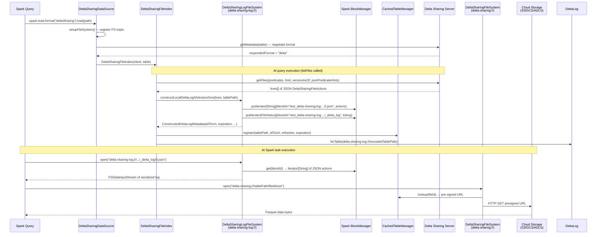
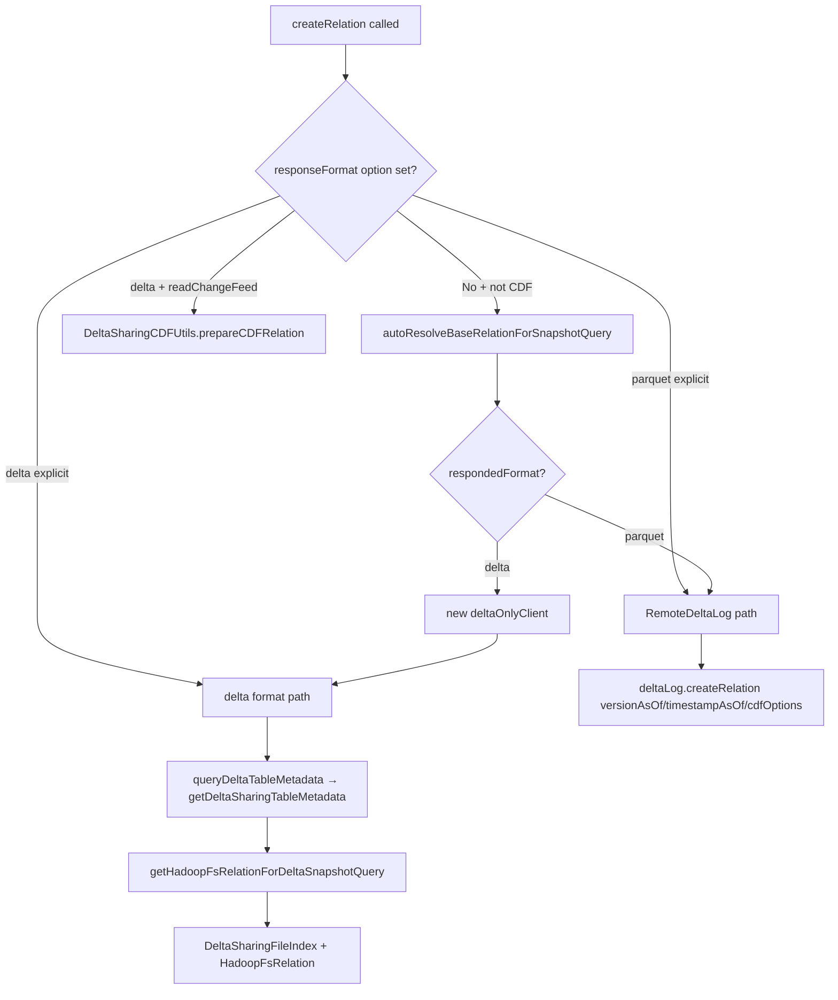
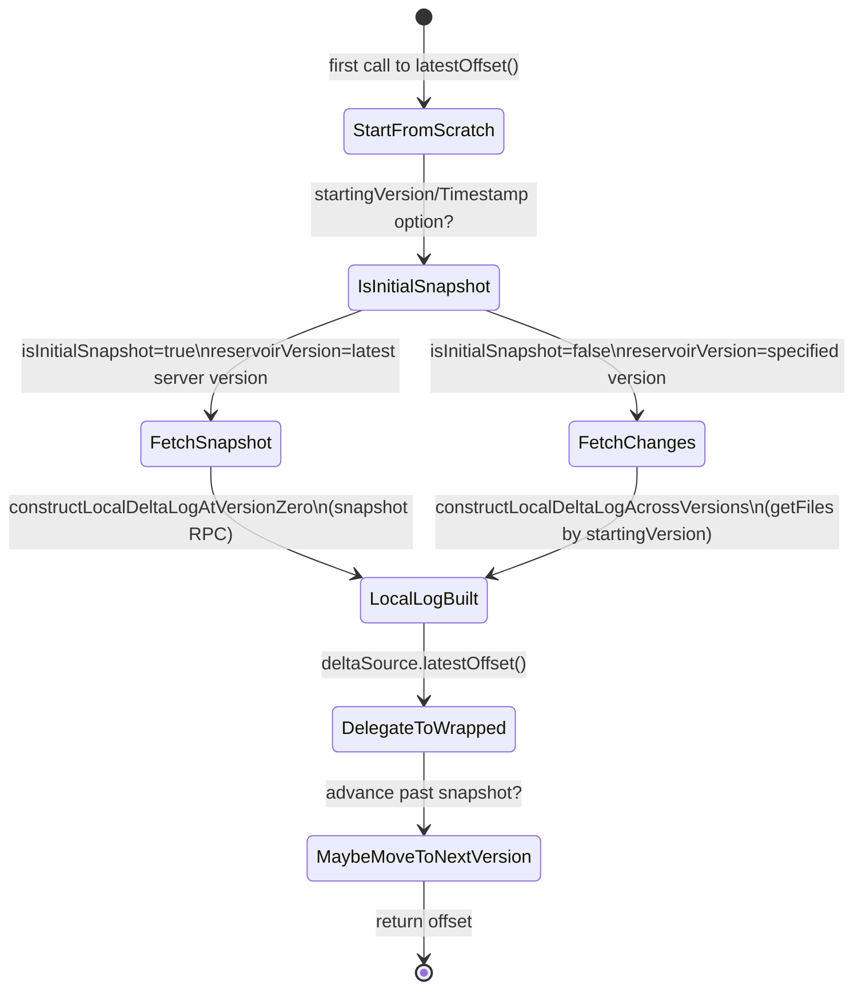

# delta-sharing-spark

## Purpose

Delta Sharing client for Apache Spark. Mounts shared Delta tables published by a Delta Sharing server as transparent Spark DataSource relations, supporting batch reads, time travel, Change Data Feed, and structured streaming — all without requiring the reader to have direct cloud storage access. Data files are served via short-lived pre-signed URLs vended by the sharing server.

## What is Delta Sharing?

Delta Sharing is an open protocol (https://github.com/delta-io/delta-sharing) for securely sharing live Delta tables across organizations without copying data. A **Delta Sharing server** hosts tables and authenticates clients via bearer tokens, returning pre-signed cloud storage URLs. The client reads data through those URLs, never needing direct cloud credentials.

The Spark client in this module integrates with `delta-spark` by constructing a **virtual local DeltaLog** from server responses, then delegating all the real Delta reading logic (`DeltaSource`, `TahoeFileIndex`, `DeltaTableV2`, etc.) to the standard Delta Spark connector.

---

## Two Response Formats

The protocol supports two wire formats, selected per-request by negotiation:

| Format | Description | When Used |
|---|---|---|
| `parquet` | Server returns pre-signed URLs for Parquet files directly | Tables without advanced Delta features (no DVs, no column mapping) |
| `delta` | Server returns serialized Delta log actions (JSON lines); client reconstructs a local DeltaLog | Tables with deletion vectors, column mapping, type widening, variant type, etc. |

In auto-resolution mode (no explicit `responseFormat` option), the client advertises `"parquet,delta"` and the server picks based on the table's features. If the server responds in delta format, the client re-creates a dedicated `delta`-only client to avoid repeated negotiation overhead.

---

## Public Interface

| Symbol | Type | Description |
|---|---|---|
| `DeltaSharingDataSource` | class | Spark DataSource v1 entry point; `shortName = "deltaSharing"` |
| `DeltaSharingLogFileSystem` | class | Hadoop FileSystem (`delta-sharing-log://`) backed by Spark BlockManager |
| `DeltaSharingFileIndex` | case class | Spark `FileIndex` for delta-format batch queries |
| `DeltaSharingCDFUtils.prepareCDFRelation` | object method | Prepares `BaseRelation` for CDF batch queries |
| `DeltaFormatSharingSource` | case class | Structured Streaming `Source` for delta-format streaming |
| `PrepareDeltaSharingScan` | class | Spark Catalyst optimizer rule for filter/limit pushdown |
| `DeltaFormatSharingLimitPushDown` | object | Spark Catalyst extra-optimization rule for limit pushdown |
| `DeltaSharingUtils` | object | Shared utilities: BlockManager helpers, refresher factories, hash IDs |
| `model.DeltaSharingFileAction` | case class | Wire model: file action from sharing RPC with pre-signed URL + DV info |
| `model.DeltaSharingMetadata` | case class | Wire model: metadata from sharing RPC with version/size/numFiles |
| `model.DeltaSharingProtocol` | case class | Wire model: protocol action from sharing RPC |
| `ConstructedDeltaLogMetadata` | case class | Result of local DeltaLog construction (idToUrl map, expiration, version range) |

---

## Key Dependencies

- **[[spark]] (`delta-spark`)**: Provides `DeltaLog`, `DeltaSource`, `TahoeLogFileIndex`, `DeltaTableV2`, `DeltaDataSource`, `OptimisticTransaction`, `DeltaSourceOffset`, `Snapshot`, `SnapshotDescriptor`, `SchemaTrackingLog`, `PrepareDeltaScan`, and all Delta action types (`AddFile`, `RemoveFile`, `AddCDCFile`, etc.).
- **`io.delta:delta-sharing-client:1.3.9`** (external Maven artifact): Provides `DeltaSharingRestClient`, `DeltaSharingClient` (interface), `DeltaSharingFileSystem` (scheme `delta-sharing://` — serves data files), `CachedTableManager` (pre-signed URL cache + refresh), `PreSignedUrlCache`, `ConfUtils`, `DeltaSharingOptions`, `RemoteDeltaLog` (parquet-format path), `DeltaSharingSource` (parquet-format streaming source).
- **Apache Spark** (`spark-sql`, provided): `FileIndex`, `HadoopFsRelation`, `LogicalPlan`, `Rule`, Catalyst expressions.
- **Google Guava** (`Hashing.sha256`): Query parameter hash IDs for deduplicating delta log construction.

## Modules That Depend On This

None — this is a leaf module in the dependency graph.

---

## Architecture Diagram



_The two virtual filesystems collaborate: `delta-sharing-log://` serves the synthesized delta transaction log from Spark BlockManager; `delta-sharing://` serves the actual Parquet data files by resolving pre-signed URLs from `CachedTableManager`._

---

## Component: FileSystem Registration (`DeltaSharingDataSource.setupFileSystem`)

**Source**: `DeltaSharingDataSource.scala` lines 480–489

```scala
// sharing/src/main/scala/io/delta/sharing/spark/DeltaSharingDataSource.scala:480-489
def setupFileSystem(sqlContext: SQLContext): Unit = {
  sqlContext.sparkContext.hadoopConfiguration
    .setIfUnset("fs.delta-sharing.impl", "io.delta.sharing.client.DeltaSharingFileSystem")
  sqlContext.sparkContext.hadoopConfiguration
    .setIfUnset("fs.delta-sharing-log.impl",
      "io.delta.sharing.spark.DeltaSharingLogFileSystem")
  PreSignedUrlCache.registerIfNeeded(SparkEnv.get)
}
```

This registers two Hadoop FileSystem implementations on first call (`setIfUnset` prevents re-registration):
- `fs.delta-sharing.impl` → `DeltaSharingFileSystem` (from client library) handles `delta-sharing://` paths — resolves file IDs to pre-signed URLs via `CachedTableManager`.
- `fs.delta-sharing-log.impl` → `DeltaSharingLogFileSystem` handles `delta-sharing-log://` paths — serves the synthetic delta log from Spark BlockManager.

---

## Component: DeltaSharingLogFileSystem

**Source**: `DeltaSharingLogFileSystem.scala` (937 lines)

### Role

A **read-only** Hadoop FileSystem (`scheme = "delta-sharing-log"`) that serves a synthetically constructed Delta transaction log. Log content lives exclusively in Spark's **BlockManager** (not on disk or any real filesystem), keyed by block IDs of the form `test_delta-sharing-log:<path>`.

> [!NOTE] Why BlockManager?
> Log files need to be accessible from both the driver (where log replay happens) and executors (where `DeltaLog` may be re-read for task-level file listing). Spark's BlockManager with `MEMORY_AND_DISK_SER` and `tellMaster = true` provides this cross-node visibility without requiring a writable distributed filesystem.

### Block ID Scheme

```
BlockId = "test_<path>"   →  e.g. "test_delta-sharing-log:///my-table-abc123/_delta_log/0.json"
```

The prefix `test_` is required because block IDs in Spark use a naming convention; delta sharing reuses `TestBlockId` semantics while being careful to namespace under `delta-sharing-log:` to avoid collisions.

### The Fake Checkpoint Trick

Delta's log replay requires a valid Parquet checkpoint file whenever `minVersion > 0` (e.g., streaming/CDF queries that start mid-history). The module embeds a **constant base64-encoded empty Parquet byte array** (`FAKE_CHECKPOINT_BYTE_ARRAY`) in `DeltaSharingUtils`. When `constructLocalDeltaLogAcrossVersions` needs a checkpoint at `minVersion - 1`, it registers this fake checkpoint in the directory listing and serves it directly from memory — bypassing any network or storage call.

```scala
// sharing/src/main/scala/io/delta/sharing/spark/DeltaSharingLogFileSystem.scala:54-79
override def open(f: Path, bufferSize: Int): FSDataInputStream = {
  if (FileNames.isCheckpointFile(f)) {
    new FSDataInputStream(
      new SeekableByteArrayInputStream(DeltaSharingUtils.FAKE_CHECKPOINT_BYTE_ARRAY)
    )
  } else if (FileNames.isDeltaFile(f)) {
    val iterator = SparkEnv.get.blockManager
      .get[String](getDeltaSharingLogBlockId(f.toString)) match {
      case Some(block) => block.data.asInstanceOf[Iterator[String]]
      case _ => throw new FileNotFoundException(s"Failed to open delta log file: $f.")
    }
    // Materialize into byte array (OOM risk acknowledged in comment)
    val arrayBuilder = Array.newBuilder[Byte]
    while (iterator.hasNext) {
      arrayBuilder ++= iterator.next().getBytes(StandardCharsets.UTF_8)
    }
    new FSDataInputStream(new SeekableByteArrayInputStream(arrayBuilder.result()))
  } ...
}
```

> [!WARNING] OOM Risk
> The code comment acknowledges that materializing the full log file in memory for `open()` exposes an OOM risk. For very large batches with thousands of files, the JSON log file could be large.

### Three Log Construction Methods

| Method | Used By | What It Builds |
|---|---|---|
| `constructLocalDeltaLogAtVersionZero(lines, tablePath)` | `DeltaSharingFileIndex` (batch) | All protocol + metadata + file actions go into a single `0.json`; time travel queries all map to version 0 |
| `constructLocalDeltaLogAcrossVersions(lines, tablePath, startVer, endVer)` | `DeltaSharingCDFUtils`, `DeltaFormatSharingSource` | Files organized into per-version `N.json` files; fake checkpoint at `minVersion - 1` if `minVersion > 0` |
| `constructDeltaLogWithMetadataAtVersionZero(tablePath, metadata)` | `DeltaSharingUtils.getDeltaLogAndSnapshotDescriptor` (streaming init) | Only protocol + metadata in `0.json`, no data files; used to bootstrap `DeltaSource` before first RPC |

### Path Encoding

The log filesystem uses URL-encoded table paths as the authority component:

```scala
// sharing/src/main/scala/io/delta/sharing/spark/DeltaSharingLogFileSystem.scala:266-269
def encode(tablePath: String): Path = {
  val encodedTablePath = URLEncoder.encode(tablePath, "UTF-8")
  new Path(s"$SCHEME:///$encodedTablePath")
}
```

Each query gets a unique table path (with UUID or query-hash suffix) to prevent BlockManager collisions between concurrent queries on the same table.

### File Action Path Rewriting

When building the JSON log content, server-returned `DeltaSharingFileAction.path` (a pre-signed URL) is replaced with a stable `delta-sharing://` path:

```scala
// sharing/src/main/scala/io/delta/sharing/spark/model.scala:192-206
def getDeltaSharingPath(tablePath: String): String = {
  DeltaSharingFileSystem
    .DeltaSharingPath(
      URLEncoder.encode(tablePath, "UTF-8"),
      URLEncoder.encode(id, "UTF-8"),
      size
    )
    .toPath.toString
  // → "delta-sharing:///urlEncodedTablePath/urlEncodedFileId/fileSize"
}
```

The `id` (a hash of the original file path) + `size` combination forms a unique, stable key that `DeltaSharingFileSystem` resolves to the actual pre-signed URL via `CachedTableManager`. Deletion vector paths get the same treatment but encode the DV file ID and include `offset + sizeInBytes` to allow partial file reads.

### Cleanup

Two cleanup mechanisms prevent BlockManager exhaustion:
- **`tryToCleanUpDeltaLog(deltaLogPath)`**: Full cleanup on query stop — removes all blocks matching the log path prefix.
- **`tryToCleanUpPreviousBlocks(deltaLogPath, maxVersion)`**: Incremental cleanup on `commit()` — adds a new fake checkpoint at `maxVersion`, updates the listing, then removes all JSON log blocks ≤ `maxVersion`.

---

## Component: DeltaSharingDataSource

**Source**: `DeltaSharingDataSource.scala` (501 lines)

Implements Spark DataSource v1 interfaces:
- `RelationProvider.createRelation()` → batch reads
- `StreamSourceProvider.createSource()` / `sourceSchema()` → streaming reads
- `DataSourceRegister.shortName()` → `"deltaSharing"`

### Batch Read Flow (createRelation)



Key detail in `getHadoopFsRelationForDeltaSnapshotQuery`: internal Delta metadata (writer metadata, column mapping metadata) is stripped from partition and data schemas before wrapping in `HadoopFsRelation`, then `DeltaFileFormat.fileFormat()` is passed the sharing server's protocol/metadata for column-mapping-aware format selection.

### Streaming Read Flow (createSource / sourceSchema)

For delta format (`responseFormat=delta`):
1. Parse profile file path from `path` option.
2. Create `DeltaSharingRestClient` with streaming mode and `readerFeatures = STREAMING_SUPPORTED_READER_FEATURES`.
3. Get metadata from server; construct a local `DeltaLog` at version 0 (metadata only, no data files) via `DeltaSharingUtils.getDeltaLogAndSnapshotDescriptor`.
4. Set up `DeltaDataSource.getMetadataTrackingLogForDeltaSource` for schema evolution tracking.
5. Return `DeltaFormatSharingSource` wrapping a standard `DeltaSource`.

> [!NOTE] CDF Streaming Restriction
> CDF streaming with `responseFormat=delta` is explicitly blocked with an `UnsupportedOperationException`. Only CDF batch queries are supported in delta format.

### Credential Redaction

`DeltaSharingDataSource.redactOptions` masks `bearerToken`, `clientId`, `clientSecret`, `scope` from log output.

---

## Component: DeltaSharingFileIndex

**Source**: `DeltaSharingFileIndex.scala` (280 lines)

Implements Spark's `FileIndex` + `SupportsRowIndexFilters` + `DeltaFileFormat`. Used only in the **delta-format batch** query path.

### RPC Deduplication Cache

A per-`FileIndex` instance cache (`queriedTableQueryIdToDeltaLog: mutable.Map[String, DeltaLog]`) keyed by a hash of query parameters. Spark calls `listFiles()` more than once per query plan, so without this cache, duplicate expensive RPCs would occur.

Cache key is `SHA-256(versionAsOf + timestampAsOf + partitionFilters + dataFilters + jsonPredicateHints + limitHint + metadataVersion)` via `DeltaSharingUtils.getQueryParamsHashId`.

### Batch File Fetch Flow

```scala
// sharing/src/main/scala/io/delta/sharing/spark/DeltaSharingFileIndex.scala:139-209
private def createDeltaLog(jsonPredicateHints, queryParamsHashId, overrideLimit): DeltaLog = {
  // 1. RPC: getFiles(table, predicates=Nil, limit, versionAsOf, timestampAsOf,
  //                  jsonPredicateHints, refreshToken)
  val deltaTableFiles = client.getFiles(...)

  // 2. Build unique table path with hash suffix for isolation
  val tablePathWithHashIdSuffix = getTablePathWithIdSuffix(customTablePath, queryParamsHashId)

  // 3. Construct virtual delta log in BlockManager
  val deltaLogMetadata = DeltaSharingLogFileSystem.constructLocalDeltaLogAtVersionZero(
    deltaTableFiles.lines, tablePathWithHashIdSuffix
  )

  // 4. Register id→URL mapping + refresher function in CachedTableManager
  CachedTableManager.INSTANCE.register(
    tablePath, idToUrl, refs=[WeakReference(this)], profileProvider,
    refresher=getRefresherForGetFiles(..., useRefreshToken=true),
    expirationTimestamp, refreshToken
  )

  // 5. Return DeltaLog pointing at the virtual log filesystem path
  DeltaLog.forTable(spark, DeltaSharingLogFileSystem.encode(tablePathWithHashIdSuffix))
}
```

The `WeakReference(this)` passed to `CachedTableManager` is critical: when the `DeltaSharingFileIndex` is garbage collected (query completes), the `CachedTableManager` knows it can stop refreshing pre-signed URLs for that table.

### JSON Predicate Hints

`convertToJsonPredicate()` converts Spark `Expression` trees to the Delta Sharing JSON predicate format:
- **V1** (partition only): converts `partitionFilters` only
- **V2** (if `jsonPredicatesV2Enabled` conf): converts both partition + data filters, combines via `AndOp`

The server is not required to apply all hints — they are advisory. Client-side filtering always occurs as a fallback.

### Filter Pushdown to Server

The overall `listFiles(partitionFilters, dataFilters)` flow:

```scala
// sharing/src/main/scala/io/delta/sharing/spark/DeltaSharingFileIndex.scala:219-224
override def listFiles(partitionFilters, dataFilters): Seq[PartitionDirectory] = {
  // asTahoeFileIndex fetches files from server, builds local DeltaLog, returns TahoeLogFileIndex
  asTahoeFileIndex(partitionFilters, dataFilters).listFiles(partitionFilters, dataFilters)
}
```

Filters are sent to the server as JSON predicate hints (best-effort server-side filtering) AND applied locally by the standard `TahoeLogFileIndex` after the fact (guaranteed correctness).

### PrepareDeltaSharingScan Integration

`PrepareDeltaSharingScan` extends `PrepareDeltaScan` (from delta-spark) and intercepts `DeltaSharingTableScan` nodes:
1. Classifies filters as partition vs data filters.
2. Calls `dsFileIndex.fetchFilesAndConstructDeltaLog(partitionFilters, dataFilters, limit)`.
3. Runs `snapshot.filesForScan(limit, filters)` on the local delta log for stats-based data skipping.
4. Replaces the `DeltaSharingFileIndex` with a `PreparedDeltaFileIndex` containing the pre-computed scan.

Limit pushdown: `DeltaFormatSharingLimitPushDown` is a Catalyst extra-optimization rule that intercepts `LocalLimit(n, LogicalRelationWithTable(..., DeltaSharingFileIndex))` nodes and injects the limit into `DeltaSharingFileIndex.limitHint`. This limit is then passed to the server as a hint to reduce files returned.

---

## Component: DeltaSharingCDFUtils

**Source**: `DeltaSharingCDFUtils.scala` (113 lines)

Handles batch Change Data Feed queries (`readChangeFeed=true` with delta format).

### Flow

```scala
// sharing/src/main/scala/io/delta/sharing/spark/DeltaSharingCDFUtils.scala:55-111
def prepareCDFRelation(sqlContext, options, table, client): BaseRelation = {
  // 1. Fetch all CDF files — includeHistoricalMetadata=true to detect schema changes
  val deltaTableFiles = client.getCDFFiles(table, options.cdfOptions,
    includeHistoricalMetadata = true)

  // 2. Construct delta log across versions (not at version 0, since CDF spans multiple commits)
  val deltaLogMetadata = DeltaSharingLogFileSystem.constructLocalDeltaLogAcrossVersions(
    lines = deltaTableFiles.lines,
    customTablePath = tablePathWithHashIdSuffix,
    startingVersionOpt = None,
    endingVersionOpt = None
  )

  // 3. Register id→URL mapping in CachedTableManager
  CachedTableManager.INSTANCE.register(..., refresher = getRefresherForGetCDFFiles(...))

  // 4. Return DeltaTableV2.toBaseRelation with CDF read options
  val localDeltaCdfOptions = Map(
    CDF_START_VERSION -> deltaLogMetadata.minVersion.toString,
    CDF_END_VERSION -> deltaLogMetadata.maxVersion.toString,
    CDF_READ_OPTION -> "true"
  )
  DeltaTableV2(spark, DeltaSharingLogFileSystem.encode(tablePathWithHashIdSuffix),
    options = localDeltaCdfOptions).toBaseRelation
}
```

> [!NOTE] Why includeHistoricalMetadata?
> The delta library's CDF reader (`CDCReader`) throws an error when it detects schema changes (especially column mapping changes) between CDF versions. By requesting `includeHistoricalMetadata=true`, the sharing server includes intermediate `Metadata` actions in the response, which get written into the per-version `.json` log files, allowing delta's conflict detection to surface any problematic schema evolution.

CDF data files (`AddCDCFile`) are handled by `getActionWithDeltaSharingPath` just like `AddFile` and `RemoveFile` — they receive the same `delta-sharing://` path encoding.

---

## Component: DeltaFormatSharingSource (Structured Streaming)

**Source**: `DeltaFormatSharingSource.scala` (578 lines)

### Architecture

`DeltaFormatSharingSource` is a **wrapper** around the standard `DeltaSource` (from `delta-spark`). It intercepts offset management and file fetching, constructing a progressively-updated local delta log in BlockManager, then delegates all schema tracking and batch generation to the wrapped `DeltaSource`.

### Initialization

Each streaming query creates a **uniquely-named** local delta log using a `timestamp + UUID` suffix to prevent conflicts when the same table is referenced multiple times in a single job:

```scala
// sharing/src/main/scala/io/delta/sharing/spark/DeltaFormatSharingSource.scala:83-89
private val timestampWithUUID = DeltaSharingUtils.getFormattedTimestampWithUUID()
private val customTablePathWithUUIDSuffix = DeltaSharingUtils.getTablePathWithIdSuffix(
  client.getProfileProvider.getCustomTablePath(tablePath),
  timestampWithUUID
)
// → "myTable_20260302_143022_a1b2c3d4"
```

`initDeltaSource()` constructs a minimal delta log (protocol + metadata only, no files), creates a `DeltaLog` pointing at it, sets up schema tracking, and wraps in a standard `DeltaSource`.

### Streaming Offset Management

Offsets are `DeltaSourceOffset(reservoirId, reservoirVersion, index, isInitialSnapshot)`.



**`maybeMoveToNextVersion`** handles a subtle issue: `DeltaSource` does not automatically advance the offset past a snapshot scan. When `index == numFileActionsInStartingSnapshot - 1` (last file in snapshot), `DeltaFormatSharingSource` manually advances to `(reservoirVersion + 1, BASE_INDEX, isInitialSnapshot=false)`. This is necessary for subsequent streaming iterations to fetch new version-based changes from the server.

### Rate Limiting for Version Polling

```scala
// sharing/src/main/scala/io/delta/sharing/spark/DeltaFormatSharingSource.scala:208-226
private def getOrUpdateLatestTableVersion: Long = {
  val currentTimeMillis = System.currentTimeMillis()
  if ((currentTimeMillis - lastTimestampForGetVersionFromServer) >=
    QUERY_TABLE_VERSION_INTERVAL_MILLIS) {
    val serverVersion = client.getTableVersion(table)
    latestTableVersionOnServer = serverVersion
    lastTimestampForGetVersionFromServer = currentTimeMillis
  }
  latestTableVersionOnServer
}
```

`QUERY_TABLE_VERSION_INTERVAL_MILLIS` is configured via `ConfUtils.streamingQueryTableVersionIntervalSeconds` with a hard floor of `ConfUtils.MINIMUM_TABLE_VERSION_INTERVAL_SECONDS`. This prevents the streaming engine from hammering the sharing server with version polls between micro-batches.

### maxVersionsPerRpc

To prevent server timeouts on large backlogs, each RPC for incremental changes fetches at most `maxVersionsPerRpc` (default: `MAX_VERSIONS_PER_RPC_DEFAULT`) versions at a time:

```scala
// sharing/src/main/scala/io/delta/sharing/spark/DeltaFormatSharingSource.scala:288-308
private def getEndingVersionForRpc(startingOffset, latestTableVersion): Long = {
  if (startingOffset.isInitialSnapshot) return startingOffset.reservoirVersion
  val endingVersionForQuery = latestTableVersion.min(
    startingOffset.reservoirVersion + maxVersionsPerRpc - 1
  )
  endingVersionForQuery
}
```

### needNewFilesFromServer Logic

A new server RPC is issued only when **both** conditions are true:
1. All files currently in the local delta log have been processed (`latestTableVersionInLocalDeltaLog < startingOffset.reservoirVersion`).
2. The server has newer versions than the local log (`latestTableVersionInLocalDeltaLog < latestTableVersion`).

This prevents re-fetching the same files during recovery from failures or checkpoint reload.

### BlockManager Cleanup

`commit(end: Offset)` delegates to `DeltaSource.commit()` (for schema tracking) and then calls `tryToCleanUpPreviousBlocks(deltaLogPath, endOffset.reservoirVersion - 1)` to release BlockManager memory for processed log versions. `stop()` calls `tryToCleanUpDeltaLog(deltaLogPath)` for full cleanup.

---

## Component: model.scala — Wire Format DTOs

**Source**: `model.scala` (210 lines)

### DeltaSharingFileAction

The central wire model for file entries returned from sharing RPCs:

```scala
// sharing/src/main/scala/io/delta/sharing/spark/model.scala:111-118
case class DeltaSharingFileAction(
    id: String,               // SHA-256 hash of original file path — stable key in CachedTableManager
    version: java.lang.Long,  // commit version (null for snapshot queries)
    timestamp: java.lang.Long, // commit timestamp (used in delta log modificationTime)
    expirationTimestamp: java.lang.Long, // when presigned URL expires (→ CachedTableManager TTL)
    deletionVectorFileId: String, // null unless PATH-type DV
    deltaSingleAction: SingleAction) // wrapped delta action (AddFile/RemoveFile/AddCDCFile)
```

Key path-building methods:
- `getDeltaSharingPath(tablePath)` → `delta-sharing:///urlEncoded(tablePath)/urlEncoded(id)/size` — used for data files
- `getDeltaSharingDeletionVectorDescriptor(customTablePath)` → creates a new `DeletionVectorDescriptor` with path replaced by `delta-sharing://` URL that includes `offset + sizeInBytes` for partial reads

### DeltaSharingMetadata

```scala
// sharing/src/main/scala/io/delta/sharing/spark/model.scala:82-97
case class DeltaSharingMetadata(
    version: java.lang.Long,   // null for snapshot, set for CDF/streaming
    size: java.lang.Long,      // table size estimate (used in DeltaSharingFileIndex.sizeInBytes)
    numFiles: java.lang.Long,  // file count estimate
    deltaMetadata: Metadata)   // standard Delta Metadata action
```

`version` is `null` for snapshot queries but set for CDF/streaming responses — this distinction drives the branching logic in `constructLocalDeltaLogAcrossVersions`.

### DeltaSharingSingleAction

The envelope type for JSON deserialization. An action line is deserialized to `DeltaSharingSingleAction` then `.unwrap` extracts the concrete type. This mirrors the pattern of `SingleAction` in `delta-spark`.

---

## Schema Evolution in Sharing Context

Schema changes in shared tables surface differently by query type:

| Query Type | Schema Evolution Mechanism |
|---|---|
| **Batch (delta format)** | `SchemaUtils.dropNullTypeColumns` applied to metadata schema; internal writer metadata stripped via `TahoeDeltaTableUtils.removeInternalWriterMetadata` |
| **CDF Batch** | `includeHistoricalMetadata=true` brings intermediate `Metadata` actions into the constructed delta log; delta's `CDCReader` detects column mapping changes and throws |
| **Streaming (delta format)** | Full `DeltaDataSource.getMetadataTrackingLogForDeltaSource` + `SchemaTrackingLog`; `DELTA_STREAMING_ENABLE_SCHEMA_TRACKING_MERGE_CONSECUTIVE_CHANGES` conf controls merge behavior; schema is analyzed once in `sourceSchema()` using the tracking log |
| **Streaming (parquet format)** | `DeltaSharingSource` in the client library handles schema (not in this module) |

The `removeInternalWriterMetadata` call is especially important for column-mapped tables: it strips the `delta.columnMapping.id` and `delta.columnMapping.physicalName` metadata from field definitions before exposing the schema to Spark, since those are implementation details of the storage format.

---

## Supported Reader Features

Declared in `DeltaSharingUtils` as two feature sets (identical as of this codebase):

```scala
// sharing/src/main/scala/io/delta/sharing/spark/DeltaSharingUtils.scala:41-63
val STREAMING_SUPPORTED_READER_FEATURES: Seq[String] = Seq(
  DeletionVectorsTableFeature.name,
  ColumnMappingTableFeature.name,
  TimestampNTZTableFeature.name,
  TypeWideningPreviewTableFeature.name,
  TypeWideningTableFeature.name,
  VariantTypePreviewTableFeature.name,
  VariantTypeTableFeature.name,
  VariantShreddingPreviewTableFeature.name
)
// SUPPORTED_READER_FEATURES is identical
```

These are sent as a comma-separated `readerFeatures` parameter in each HTTP request, telling the server which Delta reader features the client can handle. If the server's table requires features not in this list, the server should decline to serve in delta format (falling back to parquet if possible).

---

## Configuration Reference

All options are parsed from the DataSource parameters map:

| Option | Type | Default | Description |
|---|---|---|---|
| `path` | String | (required) | `profile_file#share_name.schema_name.table_name` |
| `responseFormat` | String | auto-negotiated | `"parquet"` or `"delta"`; if unset, server decides |
| `bearerToken` | String | (from profile file) | Override bearer token for auth (redacted in logs) |
| `versionAsOf` | Long | None | Time travel to specific version |
| `timestampAsOf` | String | None | Time travel to timestamp |
| `startingVersion` | Long or "latest" | None | Streaming starting version |
| `startingTimestamp` | String | None | Streaming starting timestamp |
| `maxVersionsPerRpc` | Int | `MAX_VERSIONS_PER_RPC_DEFAULT` | Max versions per streaming getFiles RPC |
| `readChangeFeed` | Boolean | false | Enable CDF read mode |
| `startingVersion` (CDF) | Long | (required) | CDF range start version |
| `endingVersion` (CDF) | Long | None | CDF range end version (inclusive) |
| `startingTimestamp` (CDF) | String | None | CDF range start timestamp |
| `endingTimestamp` (CDF) | String | None | CDF range end timestamp |

Spark SQL configurations (from `delta-spark`):
- `spark.databricks.delta.sharing.forceDeltaFormat` (`DeltaSQLConf.DELTA_SHARING_FORCE_DELTA_FORMAT`) — force delta format in tests.
- `spark.databricks.delta.limitPushdown.enabled` (`DeltaSQLConf.DELTA_LIMIT_PUSHDOWN_ENABLED`) — enable limit pushdown (must be true for sharing).
- `io.delta.sharing.streaming.queryTableVersionIntervalSeconds` (`ConfUtils`) — polling interval floor for streaming version checks.
- `io.delta.sharing.jsonPredicateHints.enabled` / `io.delta.sharing.jsonPredicateHints.v2.enabled` — enable partition/data filter hints.
- `io.delta.sharing.limitPushdown.enabled` (`ConfUtils.limitPushdownEnabled`) — enable limit pushdown in `DeltaFormatSharingLimitPushDown`.

---

## Test Coverage

| Test File | Coverage Area |
|---|---|
| `DeltaSharingDataSourceDeltaSuite.scala` | End-to-end batch reads in delta format: snapshot, time travel, deletion vectors, column mapping, type widening, filter pushdown |
| `DeltaSharingDataSourceTypeWideningSuite.scala` | Type widening feature reads over sharing |
| `DeltaSharingDataSourceCMSuite.scala` | Column mapping reads |
| `DeltaFormatSharingSourceSuite.scala` | Streaming: initial snapshot, incremental changes, schema evolution, offset management, rate limiting |
| `DeltaSharingLogFileSystemSuite.scala` | Virtual FS: `constructLocalDeltaLogAtVersionZero`, `constructLocalDeltaLogAcrossVersions`, cleanup, checkpoint fake, path encoding |
| `DeltaSharingFileIndexSuite.scala` | File index: RPC deduplication, JSON predicate hints, limit pushdown, filter classification |
| `DeltaSharingCDFUtilsSuite.scala` | CDF batch queries: version ranges, schema changes |
| `DeltaSharingUtilsSuite.scala` | Utilities: hash IDs, BlockManager helpers, refresher functions |
| `TestClientForDeltaFormatSharing.scala` | Mock `DeltaSharingClient` for in-process testing |
| `TestDeltaSharingFileSystem.scala` | Test helper for fake `DeltaSharingFileSystem` |

Testing approach: Spark local mode with `TestClientForDeltaFormatSharing` which directly injects pre-signed URLs as local file paths — no real sharing server needed. Integration tests against real data use golden table fixtures.

**Known gap**: No tests for `PrepareDeltaSharingScan` stats-based data skipping path directly; covered indirectly through `DeltaSharingFileIndexSuite`.

---

## Key Classes Reference

| Class / Object | File | Key Responsibility |
|---|---|---|
| `DeltaSharingDataSource` | `DeltaSharingDataSource.scala` | DataSource v1 entry point; routes to parquet vs delta path |
| `DeltaSharingLogFileSystem` | `DeltaSharingLogFileSystem.scala:47` | Read-only FS; serves synthetic delta log from BlockManager |
| `DeltaSharingLogFileSystem` (object) | `DeltaSharingLogFileSystem.scala:238` | Log construction: `constructLocalDeltaLogAtVersionZero`, `constructLocalDeltaLogAcrossVersions`, `constructDeltaLogWithMetadataAtVersionZero`, cleanup helpers |
| `DeltaSharingFileIndex` | `DeltaSharingFileIndex.scala:48` | Batch file fetching; RPC dedup cache; JSON predicate conversion |
| `DeltaSharingCDFUtils` | `DeltaSharingCDFUtils.scala:33` | CDF batch BaseRelation construction |
| `DeltaFormatSharingSource` | `DeltaFormatSharingSource.scala:58` | Streaming source; wraps `DeltaSource`; offset mgmt; rate limiting |
| `DeltaSharingUtils` | `DeltaSharingUtils.scala:39` | BlockManager put/remove helpers; refresher factories; hash IDs; `getDeltaLogAndSnapshotDescriptor` |
| `PrepareDeltaSharingScan` | `PrepareDeltaSharingScan.scala:34` | Catalyst rule: filter + limit pushdown for sharing scans |
| `DeltaFormatSharingLimitPushDown` | `DeltaFormatSharingLimitPushDown.scala:29` | Catalyst extra-optimization rule: inject limit into `DeltaSharingFileIndex` |
| `model.DeltaSharingFileAction` | `model.scala:111` | Wire DTO: file action + pre-signed URL + DV info |
| `model.DeltaSharingMetadata` | `model.scala:82` | Wire DTO: metadata action + version/size estimates |
| `ConstructedDeltaLogMetadata` | `DeltaSharingLogFileSystem.scala:225` | Result of log construction: idToUrl map, URL expiration, version range |
| `DeltaSharingLogFileStatus` | `DeltaSharingLogFileSystem.scala:938` | Lightweight FileStatus stored in BlockManager for `listStatus()` |
| `SeekableByteArrayInputStream` | `DeltaSharingLogFileSystem.scala:894` | `ByteArrayInputStream` implementing `Seekable + PositionedReadable` for Hadoop FS compatibility |

---

## Diagram Opportunity Flag

> FLAG FOR ORCHESTRATOR: The interaction between the `delta-sharing-spark` module and the external `delta-sharing-client` library (artifact `io.delta:delta-sharing-client:1.3.9`) is architecturally significant but opaque because the client library is an external dependency not in this repo. A diagram in the manifest showing the split of responsibilities — which components live in this module vs the client library (`DeltaSharingRestClient`, `DeltaSharingFileSystem`, `CachedTableManager`, `PreSignedUrlCache`, `RemoteDeltaLog`, `DeltaSharingSource`) — would clarify the module boundary for future maintainers. Suggested diagram type: `graph LR` or `sequenceDiagram`. Relevant files: `sharing/src/main/scala/io/delta/sharing/spark/DeltaSharingDataSource.scala:29-32` (imports), `DeltaSharingFileIndex.scala:174-201` (CachedTableManager registration).
