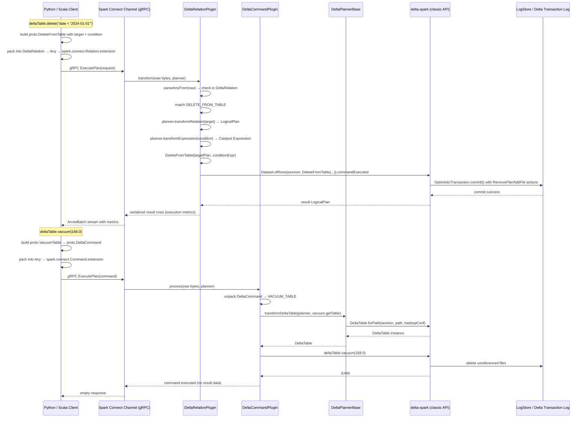

# Delta Spark Connect

## Purpose

Delta Spark Connect is a three-component extension to Apache Spark Connect that enables Delta Lake operations over the Spark Connect gRPC protocol. It allows Python (and other thin clients) to invoke Delta-specific DML commands — `delete`, `update`, `merge`, `optimize`, `vacuum`, `clone`, `restore`, and more — across a network boundary against a remote Spark server, without embedding Delta logic on the client side.

The core architectural challenge this module solves: Spark Connect's generic `Relation`/`Command` protobuf extensions are not sufficient to express Delta-specific operations (merge clauses, Z-order, shallow clone, time-travel, protocol upgrades). Delta therefore defines its own protobuf schema that extends Spark Connect's extension point mechanism (`google.protobuf.Any` packed inside `spark.connect.Relation.extension` or `spark.connect.Command.extension`).

---

## Three-Component Architecture

| Component | SBT Project | Role |
|---|---|---|
| `delta-connect-common` | `spark-connect/common` | Shared proto schema + generated Java stubs + `ImplicitProtoConversions` |
| `delta-connect-client` | `spark-connect/client` | Client-side `DeltaTable` API — translates calls into proto messages and sends via Spark Connect channel |
| `delta-connect-server` | `spark-connect/server` | Server-side plugin — receives proto messages and dispatches to the classic `delta-spark` command set |

Dependencies: `delta-connect-common` ← `delta-connect-client`; `delta-connect-common` + `delta-spark` ← `delta-connect-server`.

---

## Public Interface

| Symbol | Module | Type | Description |
|---|---|---|---|
| `DeltaTable` | client | class | Connect-native API mirror of classic `DeltaTable`; since 4.0.0 |
| `DeltaMergeBuilder` | client | class | Builder for MERGE INTO with schema evolution support |
| `DeltaMergeMatchedActionBuilder` | client | class | Specifies actions for matched rows |
| `DeltaMergeNotMatchedActionBuilder` | client | class | Specifies actions for unmatched source rows |
| `DeltaMergeNotMatchedBySourceActionBuilder` | client | class | Specifies actions for unmatched target rows |
| `DeltaOptimizeBuilder` | client | class | Builder for OPTIMIZE (compaction / Z-order) |
| `DeltaTableBuilder` | client | class | Builder for CREATE / REPLACE TABLE |
| `DeltaColumnBuilder` | client | class | Builder for column definitions (generated, identity, nullable) |
| `DeltaRelationPlugin` | server | class | Spark Connect `RelationPlugin` — resolves `DeltaRelation` extensions |
| `DeltaCommandPlugin` | server | class | Spark Connect `CommandPlugin` — processes `DeltaCommand` extensions |
| `DeltaPlannerBase` | server | trait | Shared helper: `transformDeltaTable(proto.DeltaTable) → DeltaTable` |
| `SimpleDeltaConnectService` | server | object | Runnable Spark Connect server for client integration tests |
| `ImplicitProtoConversions` | common | object | Scala implicit conversions between Delta proto and Spark proto types |

---

## Key Dependencies

- **`delta-spark` (`delta-spark-unified`)**: The server plugin delegates every operation to the classic Spark-based DeltaTable API — `DeltaTable.forPath`, `DeleteCommand`, `MergeIntoCommand`, etc. The server is a thin translation layer over the full delta-spark module.
- **`spark-connect-common` (Spark, provided)**: Provides `RelationPlugin`, `CommandPlugin`, `SparkConnectPlanner`, and the base `spark.connect.*` proto definitions that Delta's proto schema imports from.
- **`grpc-java` (1.62.2) + `protobuf-java` (3.25.1)**: RPC transport and message serialization. Version specified in `build.sbt`.
- **`spark-connect-client-jvm` (Spark, provided)**: Client-side channel and `sparkSession.execute(sparkCommand)` / `sparkSession.newDataFrame(...)` APIs used by the client module.

---

## Modules That Depend On This

- **[[python]]**: The Python `delta.connect.tables.DeltaTable` wraps this client module via PySpark's Spark Connect Python channel. All Python Delta Connect operations ultimately serialize to the same `delta.connect.proto` protobuf messages.

---

---

## Component: delta-connect-common (Proto Schema)

### Overview

The `common` submodule owns the canonical protobuf schema for all Delta Connect protocol messages. The schema lives at `spark-connect/common/src/main/protobuf/delta/connect/` and consists of three files. SBT runs `sbt protoc` to generate Java stubs into `spark-connect/common/src/main/java/` (these generated files are excluded from KG documentation but are used by both client and server at compile time).

Package namespace for generated Java classes: `io.delta.connect.proto`.

---

### base.proto — DeltaTable Identifier

**File**: `spark-connect/common/src/main/protobuf/delta/connect/base.proto`

`DeltaTable` is the shared message used by every command and relation to identify a Delta table. It is a `oneof` between path-based and catalog-name-based access:

```proto
// spark-connect/common/src/main/protobuf/delta/connect/base.proto:26-39
message DeltaTable {
  oneof access_type {
    Path path = 1;
    string table_or_view_name = 2;
  }
  message Path {
    string path = 1;
    map<string, string> hadoop_conf = 2;  // fs.* / dfs.* options for cloud FS access
  }
}
```

The `hadoop_conf` map allows passing `fs.s3a.access.key` etc. per-request without polluting the global SparkSession configuration. This is the only place per-request filesystem credentials are expressed in the protocol.

---

### commands.proto — DML Commands (fire-and-forget)

**File**: `spark-connect/common/src/main/protobuf/delta/connect/commands.proto`

`DeltaCommand` is a top-level `oneof` wrapper dispatching to seven distinct command types. These are operations that produce no data output on the wire — they fire-and-forget (or return an empty DataFrame on the client side).

```proto
// spark-connect/common/src/main/protobuf/delta/connect/commands.proto:28-38
message DeltaCommand {
  oneof command_type {
    CloneTable clone_table = 1;
    VacuumTable vacuum_table = 2;
    UpgradeTableProtocol upgrade_table_protocol = 3;
    Generate generate = 4;
    CreateDeltaTable create_delta_table = 5;
    AddFeatureSupport add_feature_support = 6;
    DropFeatureSupport drop_feature_support = 7;
  }
}
```

#### CloneTable (field 1)
Creates a shallow copy of a source table at a target path. Supports time-travel (version or timestamp). `is_shallow` is always `true` in current usage (comments indicate this field "should always be set to true", implying deep clone via Connect is not yet supported).

```proto
message CloneTable {
  DeltaTable table = 1;             // source
  string target = 2;                // target path or name
  oneof version_or_timestamp {
    int32 version = 3;
    string timestamp = 4;
  }
  bool is_shallow = 5;
  bool replace = 6;
  map<string, string> properties = 7;  // override source properties
}
```

#### VacuumTable (field 2)
Runs VACUUM. `retention_hours` is optional — when omitted the server uses the table's configured default (7 days).

#### UpgradeTableProtocol (field 3)
Sets minimum reader/writer version on the table's Protocol action.

#### Generate (field 4)
Generates manifest files. `mode` is a string (e.g. `"symlink_format_manifest"` for Presto/Athena support).

#### CreateDeltaTable (field 5)
The most complex command. Encodes CREATE / CREATE IF NOT EXISTS / REPLACE / CREATE OR REPLACE semantics via a `Mode` enum. Supports the full column definition vocabulary: data type (as `spark.connect.DataType`), nullable, generated-always-as expression, identity column (start/step/allowExplicitInsert), comment. Also supports liquid clustering columns in addition to partition columns.

```proto
message CreateDeltaTable {
  enum Mode { MODE_UNSPECIFIED=0; MODE_CREATE=1; MODE_CREATE_IF_NOT_EXISTS=2;
              MODE_REPLACE=3; MODE_CREATE_OR_REPLACE=4; }
  message Column {
    message IdentityInfo { int64 start=1; int64 step=2; bool allow_explicit_insert=3; }
    string name = 1;
    spark.connect.DataType data_type = 2;
    bool nullable = 3;
    optional string generated_always_as = 4;
    optional string comment = 5;
    optional IdentityInfo identity_info = 6;
  }
  Mode mode = 1;
  optional string table_name = 2;
  optional string location = 3;
  optional string comment = 4;
  repeated Column columns = 5;
  repeated string partitioning_columns = 6;
  map<string, string> properties = 7;
  repeated string clustering_columns = 8;  // liquid clustering
}
```

#### AddFeatureSupport / DropFeatureSupport (fields 6–7)
Thin wrappers around table + feature name string. `DropFeatureSupport` has an optional `truncate_history` flag for protocol downgrade scenarios.

---

### relations.proto — Delta Relations (return data)

**File**: `spark-connect/common/src/main/protobuf/delta/connect/relations.proto`

`DeltaRelation` wraps operations that return data (as a Spark `Relation` / logical plan). The critical design comment in the proto explains the choice to make DML operations (delete, update, merge, optimize) relations rather than commands: **they return a row containing execution metrics**. Using a `Relation` allows the result to flow back as a DataFrame.

```proto
// spark-connect/common/src/main/protobuf/delta/connect/relations.proto:30-43
message DeltaRelation {
  oneof relation_type {
    Scan scan = 1;
    DescribeHistory describe_history = 2;
    DescribeDetail describe_detail = 3;
    ConvertToDelta convert_to_delta = 4;
    RestoreTable restore_table = 5;
    IsDeltaTable is_delta_table = 6;
    DeleteFromTable delete_from_table = 7;
    UpdateTable update_table = 8;
    MergeIntoTable merge_into_table = 9;
    OptimizeTable optimize_table = 10;
  }
}
```

#### Scan (field 1)
Wraps a `DeltaTable` reference as a readable Spark relation. This is the primitive used by `DeltaTable.forPath/forName` on the client side to construct a DataFrame.

#### DescribeHistory / DescribeDetail (fields 2–3)
Simple wrappers: just a `DeltaTable` reference. Server calls `deltaTable.history()` or `deltaTable.detail()` on the classic API.

#### ConvertToDelta (field 4)
Converts a Parquet table to Delta. Takes a parquet identifier string plus optional partition schema (either DDL string or `spark.connect.DataType` struct). Needs to be a Relation because it returns the new identifier string — which differs from the input when the input was a path-based identifier (the server rewrites `parquet.\`path\`` to `delta.\`path\``).

#### RestoreTable (field 5)
Restores to a prior version or timestamp (`oneof version_or_timestamp`). Returns metrics as a DataFrame. Note: the client code calls `.collectResult()` and re-wraps the result — it doesn't stream the result.

#### IsDeltaTable (field 6)
Returns a single-row, single-boolean DataFrame. Uses `path` string (not `DeltaTable` wrapper).

#### DeleteFromTable (field 7)
DML delete. `target` is a `spark.connect.Relation` (not `DeltaTable`), allowing the target to be expressed as a `SubqueryAlias` (i.e. `deltaTable.as("alias")`). `condition` is an optional `spark.connect.Expression`.

#### UpdateTable (field 8)
DML update. `target` + optional `condition` + `repeated Assignment`. `Assignment` maps a field `Expression` to a value `Expression`.

#### MergeIntoTable (field 9)
The most expressive operation. Full MERGE INTO semantics:

```proto
message MergeIntoTable {
  spark.connect.Relation target = 1;
  spark.connect.Relation source = 2;
  spark.connect.Expression condition = 3;
  repeated Action matched_actions = 4;
  repeated Action not_matched_actions = 5;
  repeated Action not_matched_by_source_actions = 6;
  optional bool with_schema_evolution = 7;

  message Action {
    spark.connect.Expression condition = 1;  // per-clause condition
    oneof action_type {
      DeleteAction delete_action = 2;
      UpdateAction update_action = 3;         // with assignments list
      UpdateStarAction update_star_action = 4;
      InsertAction insert_action = 5;         // with assignments list
      InsertStarAction insert_star_action = 6;
    }
    message UpdateAction { repeated Assignment assignments = 1; }
    message InsertAction { repeated Assignment assignments = 1; }
    message DeleteAction {}
    message UpdateStarAction {}
    message InsertStarAction {}
  }
}
```

The `not_matched_by_source_actions` list implements the `WHEN NOT MATCHED BY SOURCE` clause (target row exists, no matching source row) — only delete and update actions are valid here.

#### OptimizeTable (field 10)
Compaction or Z-order. Empty `zorder_columns` means pure compaction; non-empty triggers Z-order. `partition_filters` are SQL strings.

---

### ImplicitProtoConversions

**File**: `spark-connect/common/src/main/scala/org/apache/spark/sql/connect/delta/ImplicitProtoConversions.scala`

This Scala object provides Scala implicit conversions between Delta's internal copy of Spark proto classes (`io.delta.connect.spark.proto.*`) and the live Spark proto classes (`org.apache.spark.connect.proto.*`). The conversion is done by serializing to bytes and re-parsing via `ConnectProtoUtils.parse*WithRecursionLimit`. The recursion limit (from `SparkEnv.get.conf.get(Connect.CONNECT_GRPC_MARSHALLER_RECURSION_LIMIT)`) prevents stack overflows on deeply nested plans.

> [!NOTE] Why two proto copies?
> Delta's client module cannot import Spark Connect's proto classes directly as a regular compile dependency because of classloader and shading concerns. Delta vendors a copy of the Spark Connect protobuf definitions (in `spark-connect/common/src/main/protobuf/spark/connect/`) for compilation, then converts between the two representations at runtime. This is a conscious trade-off: the conversion adds a small serialization round-trip but avoids a hard compile-time dependency on Spark internals.

---

---

## Component: delta-connect-client

### Overview

The client module lives at `spark-connect/client/src/main/scala/io/delta/connect/tables/`. It provides a Connect-native `DeltaTable` class in the `io.delta.tables` package — the **same package** as the classic Spark `io.delta.tables.DeltaTable` — meaning Python/Scala users interact with the identical import path regardless of whether they are using classic Spark or Spark Connect.

The client has no knowledge of Delta internals (Delta Log, transactions, etc.). It only knows how to construct proto messages and how to send them via the Spark Connect channel.

---

### DeltaTable (Connect API)

**File**: `spark-connect/client/src/main/scala/io/delta/connect/tables/DeltaTable.scala`

`DeltaTable` wraps two fields: a `Dataset[Row]` (the DataFrame scan of the table) and a `proto.DeltaTable` (the identifier used for commands that need to address the table directly).

#### Constructor / Factory Methods

```scala
// spark-connect/client/src/main/scala/io/delta/connect/tables/DeltaTable.scala:1179-1187
private def forTable(sparkSession: SparkSession, table: proto.DeltaTable): DeltaTable = {
  val relation = proto.DeltaRelation
    .newBuilder()
    .setScan(proto.Scan.newBuilder().setTable(table))
    .build()
  val extension = com.google.protobuf.Any.pack(relation)
  val sparkRelation = spark_proto.Relation.newBuilder().setExtension(extension).build()
  val df = sparkSession.newDataFrame(_.mergeFrom(sparkRelation))
  new DeltaTable(df, table)
}
```

The `Scan` relation is packed into `google.protobuf.Any` and placed in the `extension` field of a `spark.connect.Relation`. When `SparkSession.newDataFrame` is called, Spark Connect sends this relation to the server, which then calls `DeltaRelationPlugin.transform` to resolve it into a `LogicalPlan`.

#### How Relations (data-returning DML) Are Sent

All relation-based operations follow the same pattern: build a `proto.DeltaRelation`, pack it into `Any`, wrap in `spark_proto.Relation.extension`, call `sparkSession.newDataFrame(_.mergeFrom(sparkRelation))`, then call `.collect()` to force execution:

```scala
// spark-connect/client/src/main/scala/io/delta/connect/tables/DeltaTable.scala:188-197
private def executeDelete(condition: Option[Column]): Unit = {
  val delete = proto.DeleteFromTable
    .newBuilder()
    .setTarget(df.plan.getRoot)  // the current DataFrame's root plan
  condition.foreach(c => delete.setCondition(toExpr(c)))
  val relation = proto.DeltaRelation.newBuilder().setDeleteFromTable(delete).build()
  val extension = com.google.protobuf.Any.pack(relation)
  val sparkRelation = spark_proto.Relation.newBuilder().setExtension(extension).build()
  sparkSession.newDataFrame(_.mergeFrom(sparkRelation)).collect()  // force execution
}
```

`df.plan.getRoot` extracts the root `spark_proto.Relation` of the table's DataFrame — this is how the target relation (potentially a `SubqueryAlias` if `.as("alias")` was called) flows into the DeleteFromTable message.

#### How Commands (fire-and-forget DML) Are Sent

Commands go through `sparkSession.execute(sparkCommand)` instead of `newDataFrame`:

```scala
// spark-connect/client/src/main/scala/io/delta/connect/tables/DeltaTable.scala:1021-1028
private def execute(command: proto.DeltaCommand): Unit = {
  val extension = com.google.protobuf.Any.pack(command)
  val sparkCommand = spark_proto.Command
    .newBuilder()
    .setExtension(extension)
    .build()
  sparkSession.execute(sparkCommand)
}
```

#### Classic DeltaTable vs. Connect DeltaTable — API Compatibility

Both classes live in package `io.delta.tables` and expose the same method signatures. The Connect version was introduced at `@since 4.0.0`. Key differences:

| Aspect | Classic (`spark/src/main/scala/io/delta/tables/`) | Connect (`spark-connect/client/src/main/scala/io/delta/connect/tables/`) |
|---|---|---|
| Dependency | `DeltaLog`, `OptimisticTransaction` | `proto.DeltaTable`, `sparkSession.execute` |
| `vacuum()` return | `DataFrame` (metrics) | `sparkSession.emptyDataFrame` — no metrics returned |
| `restoreToVersion()` | Returns metrics DataFrame | Collects result server-side, returns reconstructed DataFrame |
| `merge().execute()` return | `Unit` (historically) | `DataFrame` with result data; forces `.collect()` internally |
| DML result | Executed in driver | Executed on server; result rows streamed back |

> [!NOTE] `vacuum()` discards metrics
> `DeltaTable.vacuum()` / `vacuum(retentionHours)` on the Connect client calls `execute(command)` and then returns `sparkSession.emptyDataFrame`. The server executes vacuum and returns no data. This means **vacuum metrics are silently discarded** on the Connect path, unlike the classic path which returns a DataFrame with file counts. Line reference: `DeltaTable.scala:89-91`.

---

### DeltaMergeBuilder

**File**: `spark-connect/client/src/main/scala/io/delta/connect/tables/DeltaMergeBuilder.scala`

`DeltaMergeBuilder` is an immutable builder: each `whenMatched`/`whenNotMatched`/`whenNotMatchedBySource` call returns a new builder instance with the new clause appended to the relevant `Seq[proto.MergeIntoTable.Action]`. Clauses are accumulated as proto messages as they are built; there is no intermediate Scala representation.

```scala
// spark-connect/client/src/main/scala/io/delta/connect/tables/DeltaMergeBuilder.scala:148-155
class DeltaMergeBuilder private(
    private val targetTable: DeltaTable,
    private val source: DataFrame,
    private val onCondition: Column,
    private val whenMatchedClauses: Seq[proto.MergeIntoTable.Action],
    private val whenNotMatchedClauses: Seq[proto.MergeIntoTable.Action],
    private val whenNotMatchedBySourceClauses: Seq[proto.MergeIntoTable.Action],
    private val schemaEvolutionEnabled: Boolean)
```

`execute()` flattens all three clause lists, builds a `MergeIntoTable` proto, and calls `.collect()` to force execution:

```scala
// spark-connect/client/src/main/scala/io/delta/connect/tables/DeltaMergeBuilder.scala:295-316
def execute(): DataFrame = {
  val merge = proto.MergeIntoTable.newBuilder()
    .setTarget(targetTable.toDF.plan.getRoot)
    .setSource(source.plan.getRoot)
    .setCondition(toExpr(onCondition))
    .addAllMatchedActions(whenMatchedClauses.asJava)
    .addAllNotMatchedActions(whenNotMatchedClauses.asJava)
    .addAllNotMatchedBySourceActions(whenNotMatchedBySourceClauses.asJava)
    .setWithSchemaEvolution(schemaEvolutionEnabled)
  // ... pack into DeltaRelation extension, collect result ...
  val result = resultDf.collect()
  sparkSession.createDataFrame(Arrays.asList(result: _*), resultSchema)
}
```

> [!NOTE] Forced collection
> `execute()` explicitly calls `.collect()` even though it returns a DataFrame. The comment in the source explains why: "The return type used to be Unit so dropping is likely common." This ensures merge always executes even if the caller ignores the return value. Line: `DeltaMergeBuilder.scala:311-314`.

---

### DeltaOptimizeBuilder

**File**: `spark-connect/client/src/main/scala/io/delta/connect/tables/DeltaOptimizeBuilder.scala`

A mutable builder (the only mutable builder in the client module). `where(partitionFilter)` appends to a `var partitionFilters: Seq[String]`.

`executeCompaction()` calls `execute(Seq.empty)` — empty `zorderColumns` list.
`executeZOrderBy(columns*)` calls `execute(columns)` — non-empty list triggers Z-order on server.

Both execution paths pack an `OptimizeTable` into a `DeltaRelation` extension, call `.collectResult()`, and re-build a DataFrame from the collected rows. Unlike `collect()`, `collectResult()` returns an `ArrowBatchResult` that must be explicitly closed in a `finally` block.

---

### DeltaTableBuilder

**File**: `spark-connect/client/src/main/scala/io/delta/connect/tables/DeltaTableBuilder.scala`

Mutable builder for CREATE / REPLACE TABLE. Accumulates `columns: mutable.Seq[StructField]`. On `execute()`:

1. Validates that at least one of `tableName` or `location` is set (throws `AnalysisException` otherwise).
2. Maps `DeltaTableBuilderOptions` (sealed trait: `CreateTableOptions(ifNotExists)` or `ReplaceTableOptions(orCreate)`) to `proto.CreateDeltaTable.Mode`.
3. Converts each `StructField` to `proto.CreateDeltaTable.Column`, extracting Delta-specific metadata keys:
   - `delta.generationExpression` → `generated_always_as`
   - `delta.identity.allowExplicitInsert` + `delta.identity.start` + `delta.identity.step` → `identity_info`
   - `comment` → column comment
4. Sends via `spark.execute(sparkCommand)`.
5. Returns `DeltaTable.forPath(location)` or `DeltaTable.forName(identifier)`.

---

---

## Component: delta-connect-server

### Overview

The server module lives at `spark-connect/server/src/main/scala/io/delta/connect/`. It registers two Spark Connect plugin interfaces — `RelationPlugin` and `CommandPlugin` — that Spark invokes when it encounters an `extension` field in a received relation or command proto message.

Package: `org.apache.spark.sql.connect.delta` (not `io.delta.connect` — the server lives in Spark's package namespace to access internal Spark Connect planner APIs like `SparkConnectPlanner`).

---

### DeltaPlannerBase

**File**: `spark-connect/server/src/main/scala/io/delta/connect/DeltaPlannerBase.scala`

A lightweight trait shared by both plugins. Its sole method resolves a `proto.DeltaTable` into a live `io.delta.tables.DeltaTable` (the classic Spark API), dispatching on `access_type`:

```scala
// spark-connect/server/src/main/scala/io/delta/connect/DeltaPlannerBase.scala:28-37
trait DeltaPlannerBase {
  protected def transformDeltaTable(
      planner: SparkConnectPlanner, deltaTable: proto.DeltaTable): DeltaTable = {
    deltaTable.getAccessTypeCase match {
      case proto.DeltaTable.AccessTypeCase.PATH =>
        DeltaTable.forPath(
          planner.session, deltaTable.getPath.getPath, deltaTable.getPath.getHadoopConfMap)
      case proto.DeltaTable.AccessTypeCase.TABLE_OR_VIEW_NAME =>
        DeltaTable.forName(planner.session, deltaTable.getTableOrViewName)
    }
  }
}
```

The resulting classic `DeltaTable` instance is what all subsequent server operations operate on.

---

### DeltaRelationPlugin

**File**: `spark-connect/server/src/main/scala/io/delta/connect/DeltaRelationPlugin.scala`

Implements `RelationPlugin` — invoked by Spark Connect's `SparkConnectPlanner` when it encounters a relation with an `extension` field.

#### Entry Point

```scala
// spark-connect/server/src/main/scala/io/delta/connect/DeltaRelationPlugin.scala:49-62
override def transform(raw: Array[Byte], planner: SparkConnectPlanner): Optional[LogicalPlan] = {
  val relation = parseAnyFrom(raw,
    SparkEnv.get.conf.get(Connect.CONNECT_GRPC_MARSHALLER_RECURSION_LIMIT))
  if (relation.is(classOf[proto.DeltaRelation])) {
    Optional.of(transform(parseRelationFrom(relation.getValue, ...), planner))
  } else {
    Optional.empty()  // not a Delta relation — let another plugin handle it
  }
}
```

The `Optional.empty()` return tells Spark Connect to try other registered relation plugins. This is how the plugin chain works in Spark Connect.

#### Dispatch Table

| Proto case | Server action | Return type |
|---|---|---|
| `SCAN` | `deltaTable.toDF.queryExecution.analyzed` | `LogicalPlan` |
| `DESCRIBE_HISTORY` | `deltaTable.history().queryExecution.analyzed` | `LogicalPlan` |
| `DESCRIBE_DETAIL` | `deltaTable.detail().queryExecution.analyzed` | `LogicalPlan` |
| `CONVERT_TO_DELTA` | Parse identifier + partition schema, run `ConvertToDeltaCommand`, return new identifier string as single-row dataset | `LogicalPlan` |
| `RESTORE_TABLE` | `deltaTable.restoreToVersion/Timestamp()`, return `.commandExecuted` | `LogicalPlan` |
| `IS_DELTA_TABLE` | `DeltaTable.isDeltaTable(spark, path)`, return bool as dataset | `LogicalPlan` |
| `DELETE_FROM_TABLE` | Transform target + condition, construct `DeleteFromTable(target, condition)`, return `.commandExecuted` | `LogicalPlan` |
| `UPDATE_TABLE` | Transform target + condition + assignments, construct `UpdateTable(...)`, return `.commandExecuted` | `LogicalPlan` |
| `MERGE_INTO_TABLE` | Transform target/source/condition + all action lists, construct `DeltaMergeInto(...)`, return `.commandExecuted` | `LogicalPlan` |
| `OPTIMIZE_TABLE` | `deltaTable.optimize().where(...).executeCompaction/ZOrderBy()`, return `.commandExecuted` | `LogicalPlan` |

#### Merge Action Transformation

The merge case is the most involved. Each `proto.MergeIntoTable.Action` is dispatched based on `ActionTypeCase`:

```scala
// spark-connect/server/src/main/scala/io/delta/connect/DeltaRelationPlugin.scala:217-231
private def transformMergeWhenMatchedAction(...): DeltaMergeIntoMatchedClause = {
  protoAction.getActionTypeCase match {
    case DELETE_ACTION  => DeltaMergeIntoMatchedDeleteClause(condition)
    case UPDATE_ACTION  => DeltaMergeIntoMatchedUpdateClause(condition, actions)
    case UPDATE_STAR_ACTION => DeltaMergeIntoMatchedUpdateClause(condition, Seq(UnresolvedStar(None)))
  }
}
```

`UnresolvedStar(None)` is how `updateAll()` / `UPDATE *` is represented in Spark's logical plan — the star is resolved to all columns during analysis. `DeltaMergeInto` is the Spark catalyst logical plan node for MERGE INTO.

#### Proto Parsing Safety

The companion object provides `parseAnyFrom` and `parseRelationFrom` with explicit recursion limits and `checkLastTagWas(0)` validation:

```scala
// spark-connect/server/src/main/scala/io/delta/connect/DeltaRelationPlugin.scala:298-333
private def parseAnyFrom(ba: Array[Byte], recursionLimit: Int): protobuf.Any = {
  val cis = bs.newCodedInput()
  cis.setSizeLimit(Integer.MAX_VALUE)
  cis.setRecursionLimit(recursionLimit)
  val plan = protobuf.Any.parseFrom(cis)
  cis.checkLastTagWas(0)  // validates complete parse — throws if truncated
  plan
}
```

---

### DeltaCommandPlugin

**File**: `spark-connect/server/src/main/scala/io/delta/connect/DeltaCommandPlugin.scala`

Implements `CommandPlugin` — invoked when Spark Connect processes a command with an `extension` field. Returns `true` if the extension was a `DeltaCommand` (consumed), `false` otherwise (pass to next plugin).

```scala
// spark-connect/server/src/main/scala/io/delta/connect/DeltaCommandPlugin.scala:35-43
override def process(raw: Array[Byte], planner: SparkConnectPlanner): Boolean = {
  val command = protobuf.Any.parseFrom(raw)
  if (command.is(classOf[proto.DeltaCommand])) {
    process(command.unpack(classOf[proto.DeltaCommand]), planner)
    true
  } else {
    false
  }
}
```

#### Command Dispatch Table

| Proto case | Server action |
|---|---|
| `CLONE_TABLE` | `transformDeltaTable(...)`, then `deltaTable.clone / cloneAtVersion / cloneAtTimestamp` depending on `hasVersion` / `hasTimestamp` |
| `VACUUM_TABLE` | `deltaTable.vacuum(retentionHours)` or `deltaTable.vacuum()` |
| `UPGRADE_TABLE_PROTOCOL` | `deltaTable.upgradeTableProtocol(reader, writer)` |
| `GENERATE` | `deltaTable.generate(mode)` |
| `CREATE_DELTA_TABLE` | Maps `Mode` to `DeltaTable.create/createIfNotExists/replace/createOrReplace(spark)`, then calls `tableBuilder` methods iteratively, then `tableBuilder.execute()` |
| `ADD_FEATURE_SUPPORT` | `deltaTable.addFeatureSupport(featureName)` |
| `DROP_FEATURE_SUPPORT` | `deltaTable.dropFeatureSupport(featureName[, truncateHistory])` |

The `CREATE_DELTA_TABLE` handler is notably verbose: it iterates over the column list and builds `DeltaColumnBuilder` instances for each column, extracting `generatedAlwaysAs`, `identity_info`, and `comment` fields. Data type is decoded via `DataTypeProtoConverter.toCatalystType` or, if the type is `UNPARSED`, via `colBuilder.dataType(dataTypeString)` (DDL string path).

---

### SimpleDeltaConnectService

**File**: `spark-connect/server/src/main/scala/io/delta/connect/SimpleDeltaConnectService.scala`

A test-only `main` object that starts a Spark Connect server configured with Delta extensions. Used for integration tests that test the full client↔server round trip.

```scala
// spark-connect/server/src/main/scala/io/delta/connect/SimpleDeltaConnectService.scala:62-66
val conf = new SparkConf()
  .set("spark.plugins", "org.apache.spark.sql.connect.SparkConnectPlugin")
  .set("spark.sql.extensions", "io.delta.sql.DeltaSparkSessionExtension")
  .set("spark.sql.catalog.spark_catalog", "org.apache.spark.sql.delta.catalog.DeltaCatalog")
```

The three required configs for a Delta Connect server: the Spark Connect plugin, the Delta SQL extension (for `VACUUM`, `OPTIMIZE` SQL syntax), and the Delta catalog. The service blocks on stdin and stops cleanly when it reads the string `"q"`.

---

### DeltaConnectPlannerSuite (Tests)

**File**: `spark-connect/server/src/test/scala/io/delta/connect/DeltaConnectPlannerSuite.scala`

The test suite registers `DeltaRelationPlugin` and `DeltaCommandPlugin` via Spark conf keys:

```scala
// spark-connect/server/src/test/scala/io/delta/connect/DeltaConnectPlannerSuite.scala:63-66
.set(Connect.CONNECT_EXTENSIONS_RELATION_CLASSES.key, classOf[DeltaRelationPlugin].getName)
.set(Connect.CONNECT_EXTENSIONS_COMMAND_CLASSES.key, classOf[DeltaCommandPlugin].getName)
```

Tests directly construct proto messages and call the planner, without running a full gRPC server. Coverage includes: scan by name/path, describe history/detail, convert to delta, delete, update, merge (all action types), optimize (compaction + z-order), vacuum, clone, restore, create table (generated columns, identity columns), add/drop feature support, protocol upgrade.

---

## End-to-End Flow



---

## Operation Coverage Matrix

| Delta Operation | Proto Message | Message Type | Since |
|---|---|---|---|
| Table scan / read | `Scan` | `DeltaRelation` | 4.0.0 |
| Delete | `DeleteFromTable` | `DeltaRelation` | 4.0.0 |
| Update | `UpdateTable` | `DeltaRelation` | 4.0.0 |
| Merge into | `MergeIntoTable` | `DeltaRelation` | 4.0.0 |
| Optimize (compaction) | `OptimizeTable` (zorder_columns empty) | `DeltaRelation` | 4.0.0 |
| Optimize (Z-order) | `OptimizeTable` (zorder_columns non-empty) | `DeltaRelation` | 4.0.0 |
| Restore to version | `RestoreTable` | `DeltaRelation` | 4.0.0 |
| Restore to timestamp | `RestoreTable` | `DeltaRelation` | 4.0.0 |
| Describe history | `DescribeHistory` | `DeltaRelation` | 4.0.0 |
| Describe detail | `DescribeDetail` | `DeltaRelation` | 4.0.0 |
| Convert to delta | `ConvertToDelta` | `DeltaRelation` | 4.0.0 |
| Is delta table | `IsDeltaTable` | `DeltaRelation` | 4.0.0 |
| Shallow clone | `CloneTable` (is_shallow=true) | `DeltaCommand` | 4.0.0 |
| Vacuum | `VacuumTable` | `DeltaCommand` | 4.0.0 |
| Upgrade protocol | `UpgradeTableProtocol` | `DeltaCommand` | 4.0.0 |
| Generate manifest | `Generate` | `DeltaCommand` | 4.0.0 |
| Create table | `CreateDeltaTable` | `DeltaCommand` | 4.0.0 |
| Add feature support | `AddFeatureSupport` | `DeltaCommand` | 4.0.0 |
| Drop feature support | `DropFeatureSupport` | `DeltaCommand` | 4.0.0 |
| Deep clone | not supported via Connect | — | — |
| REORG TABLE | not supported via Connect | — | — |
| Liquid clustering (OPTIMIZE FULL) | not supported via Connect | — | — |

---

## Key Design Decisions

### 1. DML Operations as Relations, Not Commands

Delete, update, merge, optimize, restore, and convert-to-delta are all encoded as `DeltaRelation` cases rather than `DeltaCommand` cases. The proto comments explain this directly: they "need to be a Relation, as [they return] a row containing the execution metrics." Only fire-and-forget operations (vacuum, clone, create, protocol management) are `DeltaCommand`.

This mirrors how Spark Connect itself handles `INSERT INTO` and other DML: they are relations because the result set (metrics, new identifier) must flow back to the client as a DataFrame.

### 2. Extension-Point Mechanism

Rather than modifying Spark Connect's core protobuf schema, Delta uses the `google.protobuf.Any` extension point provided by `spark.connect.Relation.extension` and `spark.connect.Command.extension`. This means Delta's proto schema is entirely additive and does not require changes to Spark itself. The server registers its plugins via `SparkConf` keys (`CONNECT_EXTENSIONS_RELATION_CLASSES`, `CONNECT_EXTENSIONS_COMMAND_CLASSES`), enabling loose coupling and optional loading.

### 3. Server Delegates to Classic delta-spark API

The server plugins (`DeltaRelationPlugin`, `DeltaCommandPlugin`) are deliberately thin. They decode proto messages and call the existing `io.delta.tables.DeltaTable` classic API (which in turn calls the Spark-based `DeleteCommand`, `MergeIntoCommand`, etc.). There is no separate Delta execution engine in the server plugin — it reuses the full delta-spark stack. This avoids code duplication and ensures all existing Delta engine features (conflict detection, OCC, deletion vectors, column mapping, etc.) work identically over the Connect protocol.

### 4. Recursion Limit on Proto Parsing

All server-side proto deserialization uses `cis.setRecursionLimit(recursionLimit)` sourced from `SparkEnv.get.conf.get(Connect.CONNECT_GRPC_MARSHALLER_RECURSION_LIMIT)`. This matches how Spark Connect itself parses plans, preventing stack overflows from deeply-nested plans (e.g. a merge with many clauses, each with complex expressions). The client side has `TODO` comments noting that recursion limits are not yet applied to Delta-to-Spark proto conversions in `ImplicitProtoConversions`.

### 5. Vendor-Copy of Spark Proto Definitions

Delta's common module vendors a copy of Spark Connect's proto files under `spark-connect/common/src/main/protobuf/spark/connect/`. This allows the Delta client to compile proto stubs against the Spark proto schema without a hard compile-time JAR dependency on Spark Connect internals. At runtime, `ImplicitProtoConversions` serializes between the two generated-class hierarchies.

---

## Test Coverage

| Suite | Location | What it tests |
|---|---|---|
| `DeltaConnectPlannerSuite` | `server/src/test/scala/io/delta/connect/` | Unit-level planner tests: all relation types, all command types, column definitions (generated + identity), merge action combinations, schema evolution, feature add/drop, optimize, vacuum, clone, restore. Runs against a local SparkSession with Delta extensions enabled. |
| `DeltaTableSuite` | `client/src/test/scala/io/delta/connect/tables/` | End-to-end client tests (requires `SimpleDeltaConnectService`) |
| `DeltaMergeBuilderSuite` | `client/src/test/scala/io/delta/connect/tables/` | Client-side merge builder construction tests |
| `DeltaTableBuilderSuite` | `client/src/test/scala/io/delta/connect/tables/` | Client-side table builder tests |

Notable gap: `VacuumTable` on the client side returns `emptyDataFrame` rather than metrics; there is no assertion in the test suite checking that metrics are absent (vs. the classic API returning metrics).

---

## Diagram Opportunity Flag

> FLAG FOR ORCHESTRATOR: The `ImplicitProtoConversions` serialization round-trip (Delta proto → bytes → Spark proto, and vice versa) between the client module and the server module's `DeltaRelationPlugin` parsing paths is a subtle but important protocol boundary. A sequence diagram illustrating the two-stage deserialization on the server side (Spark Connect unmarshals the outer `spark.connect.Relation`, then `DeltaRelationPlugin` unmarshals the inner `proto.DeltaRelation` from the `extension` bytes) would clarify why both recursion limits exist and how they interlock. Suggested diagram type: `sequenceDiagram`. Relevant files: `spark-connect/server/src/main/scala/io/delta/connect/DeltaRelationPlugin.scala:49-91`, `spark-connect/common/src/main/scala/.../ImplicitProtoConversions.scala:25-68`.
