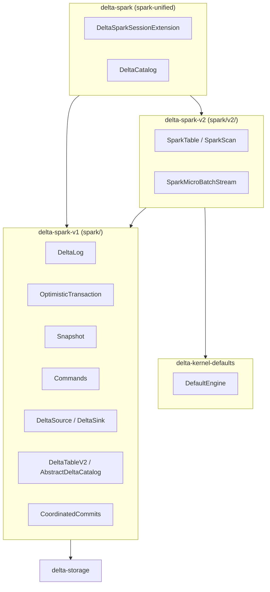
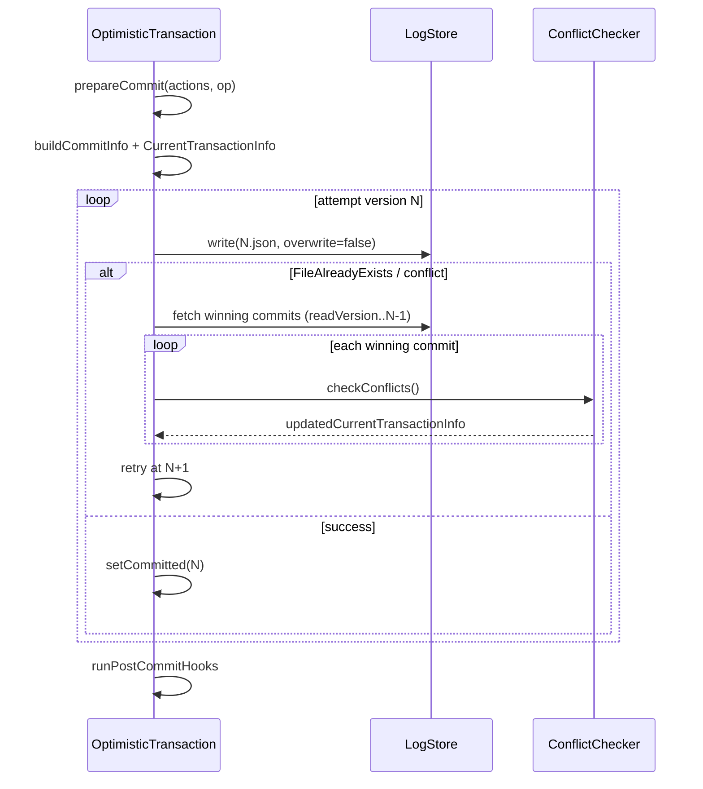
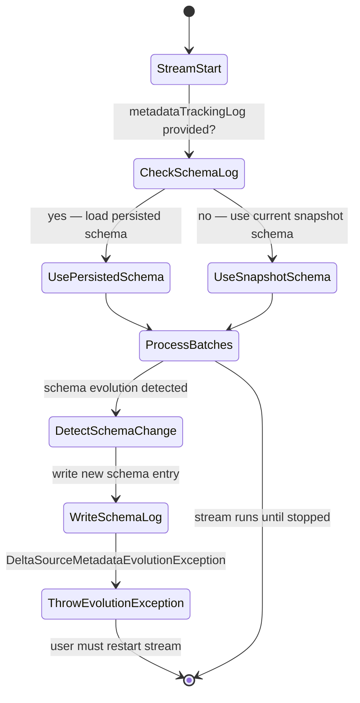
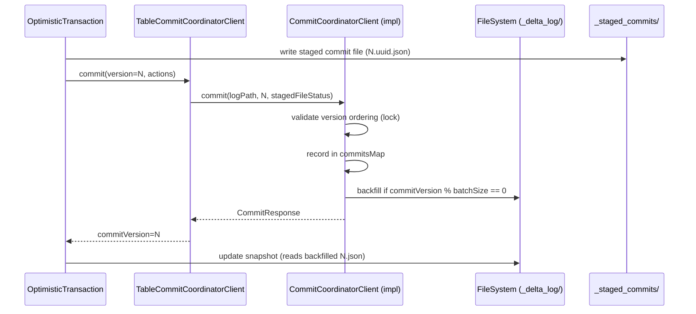
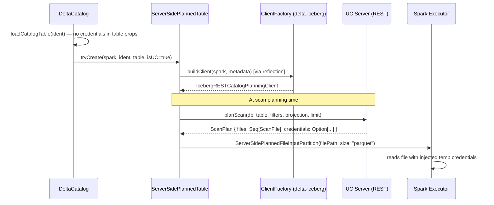
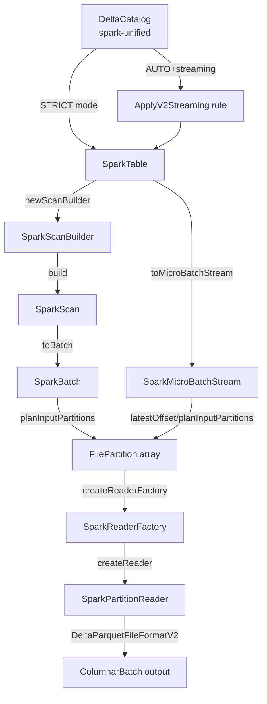
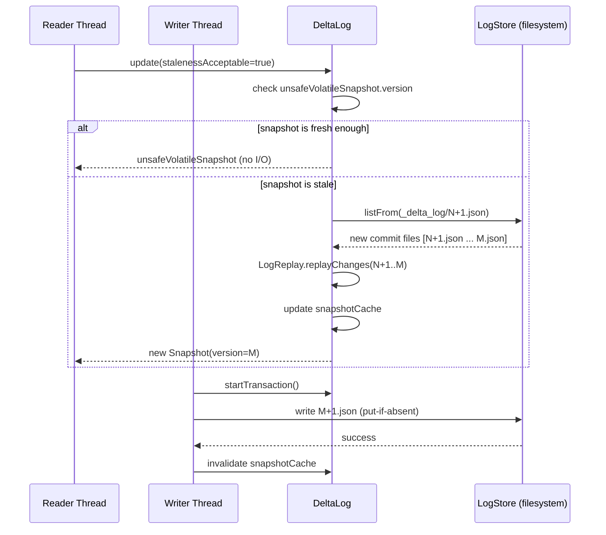
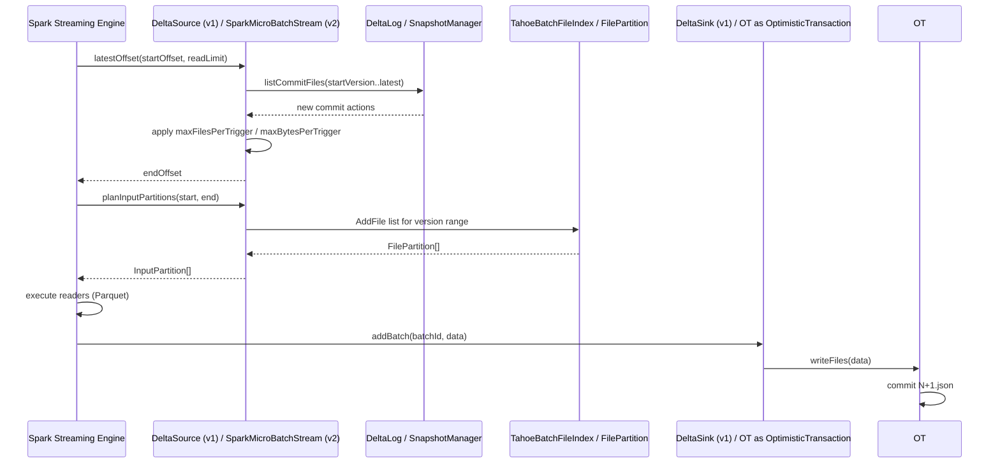
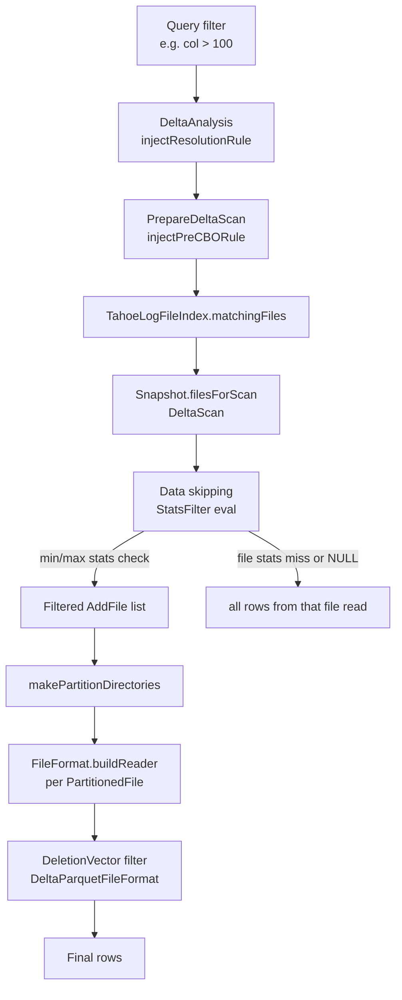

# Delta Spark Module Group

#spark #delta-spark #L3

## Overview

The Delta Spark connector is structured as three SBT projects that compose into a single published artifact (`delta-spark`):

1. **`delta-spark-v1`** (`spark/`) — The primary Scala implementation: `DeltaLog`, `OptimisticTransaction`, `Snapshot`, all DML commands, streaming source/sink, CDC, schema evolution, catalog integration, coordinated commits, and the SQL parser extension. This is the large core (~150+ source files).

2. **`delta-spark-v2`** (`spark/v2`) — A kernel-backed DataSource V2 read path. Implements `SparkTable`, `SparkScan`, `SparkMicroBatchStream` using the Kernel API as the underlying engine for DV-aware reads.

3. **`delta-spark-unified`** (`spark-unified/`) — The published `delta-spark` facade. Aggregates v1 + v2 + storage. Contains the user-visible `DeltaCatalog` (in `spark-unified/src/main/java/.../catalog/DeltaCatalog.java`) and `DeltaSparkSessionExtension`.

The v1 code path handles all writes and the classic Spark DataSource V1 read path. The v2 path provides a Kernel-based read path (deletion-vector-aware, Unity Catalog snapshot aware) accessed through the unified facade.

## Module Architecture Diagram



_`delta-spark-unified` exports both code paths. Writes always go through the v1 path (`OptimisticTransaction`). Reads can use v1 (classic DataSource) or v2 (kernel-backed, via `SparkTable`)._

---

## Component: spark.core

The core table management classes live in `spark/src/main/scala/org/apache/spark/sql/delta/`.

### DeltaLog

**Source**: `spark/src/main/scala/org/apache/spark/sql/delta/DeltaLog.scala`

`DeltaLog` is the per-table singleton that holds the current `Snapshot`, the `LogStore`, and the `DeltaHistoryManager`. It provides the entry points for reading the table state and initiating writes.

#### Singleton Cache

A Guava `Cache<DeltaLogCacheKey, DeltaLog>` is maintained at the JVM level (in the companion object). The cache key is `(canonicalized table path, filesystem options)`:

```scala
// spark/src/main/scala/org/apache/spark/sql/delta/DeltaLog.scala:712-716
case class DeltaLogCacheKey(
  path: Path,
  fsOptions: Map[String, String]
)
```

The cache is sized/expired by `DeltaSQLConf.DELTA_LOG_CACHE_SIZE` and `DELTA_LOG_CACHE_RETENTION_MINUTES`. On eviction, `log.unsafeVolatileSnapshot.uncache()` is called to free the in-memory RDD:

```scala
// spark/src/main/scala/org/apache/spark/sql/delta/DeltaLog.scala:736-746
.removalListener(
  (removalNotification: RemovalNotification[DeltaLogCacheKey, DeltaLog]) => {
    val log = removalNotification.getValue
    try log.unsafeVolatileSnapshot.uncache() catch {
      case _: java.lang.NullPointerException =>
      // Various layers will throw null pointer if the RDD is already gone.
    }
  })
```

> [!NOTE]
> The cache holds `WeakReference` to the `SparkContext`. If the SparkContext is stopped, cached `DeltaLog` instances become invalid and are pruned.

#### `forTable` Overloads (Lines 797–869)

Multiple `forTable` overloads convert various identifiers (path string, `Path`, `TableIdentifier`, `CatalogTable`) into a log path and delegate to the private `apply()` method, which performs the cache lookup/create:

```scala
// spark/src/main/scala/org/apache/spark/sql/delta/DeltaLog.scala:797-804
def forTable(spark: SparkSession, dataPath: String): DeltaLog = {
  apply(
    spark,
    logPathFor(dataPath),
    options = Map.empty,
    initialCatalogTable = None,
    new SystemClock)
}
```

The `logPathFor` helper appends `_delta_log` to the data path:
```scala
// spark/src/main/scala/org/apache/spark/sql/delta/DeltaLog.scala:722-723
private[delta] def logPathFor(dataPath: Path): Path =
  DeltaTableUtils.safeConcatPaths(dataPath, LOG_DIR_NAME) // LOG_DIR_NAME = "_delta_log"
```

`forTableWithSnapshot` variants also exist and use a `withFreshSnapshot` clock trick to ensure the returned snapshot is at least as fresh as `System.currentTimeMillis()`.

#### Transaction API

```scala
// spark/src/main/scala/org/apache/spark/sql/delta/DeltaLog.scala:216-222
def startTransaction(
    catalogTableOpt: Option[CatalogTable],
    snapshotOpt: Option[Snapshot] = None): OptimisticTransaction = {
  TransactionExecutionObserver.getObserver.startingTransaction {
    new OptimisticTransaction(this, catalogTableOpt, snapshotOpt)
  }
}
```

`withNewTransaction` is a convenience wrapper that sets the new transaction as thread-local active and ensures `clearActive()` in a `finally` block (lines 242–265).

#### `update()` / Snapshot Caching

`DeltaLog.update()` is provided by the `SnapshotManagement` mixin. It checks if the current snapshot is stale (by listing `_delta_log/` for new files), and if so, loads a new `Snapshot`. The snapshot is stored in a `volatile` field (`unsafeVolatileSnapshot`) for non-transactional reads and in a per-transaction copy for conflict-safe reads.

#### `getChanges()` / `getChangeLogFiles()`

```scala
// spark/src/main/scala/org/apache/spark/sql/delta/DeltaLog.scala:303-311
def getChanges(
    startVersion: Long,
    catalogTableOpt: Option[CatalogTable] = None,
    failOnDataLoss: Boolean = false): Iterator[(Long, Seq[Action])] = {
  getChangeLogFiles(startVersion, catalogTableOpt, failOnDataLoss)
    .map { case (version, status) =>
      (version, store.read(status, newDeltaHadoopConf()).map(Action.fromJson(_)))
    }
}
```

Used by `DeltaSource` to fetch incremental commit changes for streaming micro-batches. The JSON commit parser uses `FailFastMode` (hard-wired; cannot be overridden) to reject malformed log entries (line 794).

#### Key Fields

| Field | Type | Description |
|---|---|---|
| `logPath` | `Path` | Path to `_delta_log/` directory |
| `dataPath` | `Path` | Path to the table data root |
| `store` | `LogStore` | Atomic file I/O (lazy val) |
| `history` | `DeltaHistoryManager` | Version/commit history queries (lazy val) |
| `sidecarDirPath` | `Path` | Path to `_delta_log/_sidecars/` (lazy val) |
| `clock` | `Clock` | Time source, injectable for tests |
| `options` | `Map[String,String]` | FS options used for Hadoop configuration |
| `allOptions` | `Map[String,String]` | All user-provided options (superset of `options`) |

---

### OptimisticTransaction

**Source**: `spark/src/main/scala/org/apache/spark/sql/delta/OptimisticTransaction.scala`

`OptimisticTransaction` is the write gate for all Delta mutations. It implements Optimistic Concurrency Control (OCC): reads are done at a snapshot version, writes are checked for conflicts against any intervening commits, and then the new version file is written atomically.

The main class (`OptimisticTransaction`) extends `OptimisticTransactionImpl` (the large trait) plus `DeltaLogging`. The impl is a `TransactionalWrite` (file writing logic), `DeltaScanGenerator` (for read tracking), and `SQLMetricsReporting`.

#### Key State Fields

```scala
// spark/src/main/scala/org/apache/spark/sql/delta/OptimisticTransaction.scala:319-402
// Read tracking:
protected val readTxn = new ArrayBuffer[String]     // appIds seen
protected val readPredicates = new ConcurrentLinkedQueue[DeltaTableReadPredicate]
protected val readFiles = new HashSet[AddFile]       // specific files read
protected var readTheWholeTable = false

// Write state:
protected var newMetadata: Option[Metadata] = None
protected var newProtocol: Option[Protocol] = None
protected var committed: Option[CommittedTransaction] = None

// Post-commit hooks registered at construction:
// ChecksumHook, UpdateCatalogHook (if CatalogTable), CheckpointHook,
// IcebergConverterHook, HudiConverterHook
```

#### `commit()` / `commitImpl()` (Lines 1477–1721)

The public `commit()` delegates to `commitImpl()`, which:

1. Performs pre-commit validation: redirect check, CDC metadata check, SetTransaction dedup, IDENTITY column high-water mark schema update.
2. Calls `prepareCommit(finalActions, op)` — adds `Metadata` + `Protocol` actions if changed, validates new protocols, emits protocol change logs.
3. Determines `IsolationLevel` (`Serializable` or `SnapshotIsolation`) based on whether the operation depends on data predicates.
4. Builds `CommitInfo` (operation name, timestamp, isolation level, blind-append flag, metrics, txnId).
5. Calls `doCommitRetryIteratively(firstAttemptVersion, currentTransactionInfo, isolationLevelToUse)`.

```scala
// spark/src/main/scala/org/apache/spark/sql/delta/OptimisticTransaction.scala:1699-1703
val (commitVersion, postCommitSnapshot, updatedCurrentTransactionInfo) =
  doCommitRetryIteratively(firstAttemptVersion, currentTransactionInfo, isolationLevelToUse)
setCommitted(commitVersion, postCommitSnapshot, updatedCurrentTransactionInfo.actions)
```

6. Runs post-commit hooks (checksum, catalog update, checkpoint if needed, UniForm converters, symlink manifest).

#### `doCommitRetryIteratively` / OCC Retry Loop

The retry loop attempts to write commit version N. If `FileAlreadyExistsException` or `CommitFailedException(conflict=true)` is raised, it:

1. Fetches all winning commit files since `readVersion`.
2. Creates a `ConflictChecker` for each winning commit and calls `checkConflicts()`.
3. If conflicts are resolvable, updates `currentTransactionInfo` with any re-assigned row IDs etc. and retries at the next version.
4. If the conflict is unresolvable, throws the appropriate `DeltaConcurrentModificationException`.



#### `commitLarge()` (Line 1807)

A special path for bulk operations (CONVERT, CLONE, RESTORE) that bypasses the OCC retry loop and writes directly to the log. It does not check for concurrent modifications. The `nonProtocolMetadataActions` parameter is an `Iterator[Action]` (never materialized for large tables).

#### Coordinated Commits Integration (Lines 1750–1779)

When the table is being converted to coordinated commits (`updateMetadataWithCoordinatedCommitsConfs()`), the transaction registers the table with the commit coordinator and stores the returned `coordinatedCommitsTableConf` in `Metadata.configuration`. Subsequently, `doCommitRetryIteratively` routes commit requests through the `TableCommitCoordinatorClient` instead of writing directly to the log path.

#### `CoordinatedCommitType` Enum (Line 69)

```scala
// spark/src/main/scala/org/apache/spark/sql/delta/OptimisticTransaction.scala:69-73
object CoordinatedCommitType extends Enumeration {
  type CoordinatedCommitType = Value
  val FS_COMMIT, CC_COMMIT, CO_COMMIT,
    FS_TO_CC_UPGRADE_COMMIT, FS_TO_CO_UPGRADE_COMMIT, CC_TO_FS_DOWNGRADE_COMMIT = Value
}
```

Tracks the commit coordination mode for metrics and logging.

---

### Snapshot

**Source**: `spark/src/main/scala/org/apache/spark/sql/delta/Snapshot.scala`

`Snapshot` represents an immutable, point-in-time view of the Delta table state. It is the product of log replay (checkpoint + delta files) and provides all table state queries.

#### Class Hierarchy

```scala
// spark/src/main/scala/org/apache/spark/sql/delta/Snapshot.scala:95-108
class Snapshot(
    val path: Path,
    override val version: Long,
    val logSegment: LogSegment,
    override val deltaLog: DeltaLog,
    val checksumOpt: Option[VersionChecksum])
  extends SnapshotDescriptor     // version, metadata, protocol, schema
  with SnapshotStateManager      // reconstructedProtocolMetadata from log replay
  with StateCache                // caches the reconstructed file set as a Spark RDD
  with StatisticsCollection      // stat collection helpers
  with DataSkippingReader        // data skipping predicate pushdown
  with ValidateChecksum          // checksum validation logic
  with DeltaLogging
```

#### `SnapshotDescriptor` (Lines 60–76)

The lightweight `SnapshotDescriptor` trait exposes `version`, `metadata`, `protocol`, `schema`. The `isCatalogOwned` predicate checks `CatalogOwnedTableFeature` in protocol features.

#### Timestamp Handling (Lines 130–150)

```scala
// spark/src/main/scala/org/apache/spark/sql/delta/Snapshot.scala:130-131
def timestamp: Long =
  getInCommitTimestampOpt.getOrElse(logSegment.lastCommitFileModificationTimestamp)
```

When `InCommitTimestampTableFeature` is enabled, `getInCommitTimestampOpt` does an IO read of the latest commit's `CommitInfo.inCommitTimestamp`. This is a lazy val; subsequent calls do not re-read.

#### Key Derived State

`Snapshot` exposes data file queries through `DataSkippingReader`:
- **`filesForScan(filters)`** — returns `AddFile` list after applying data skipping predicates.
- **`allFiles`** — a `DataFrame` of all `AddFile` actions (from log replay/checkpoint).
- **`deltaFilesForScan`** — incremental log files (used by streaming).
- **`numOfFiles`** / `sizeInBytes` — aggregated from CRC (version checksum file) when available; otherwise computed from log replay.

#### `LogSegment`

A `LogSegment` describes which checkpoint and which delta files compose this snapshot's log replay input:
- `checkpoint`: list of checkpoint file(s) (multi-part or V2 sidecar)
- `deltas`: sorted list of `N.json` delta files from checkpoint version+1 to snapshot version
- `checkpointProvider`: abstraction for reading the checkpoint

---

### ConflictChecker

**Source**: `spark/src/main/scala/org/apache/spark/sql/delta/ConflictChecker.scala`

`ConflictChecker` implements the per-winning-commit conflict detection algorithm. A new instance is created for each winning commit seen during an OCC retry.

#### Inputs

```scala
// spark/src/main/scala/org/apache/spark/sql/delta/ConflictChecker.scala:187-192
private[delta] class ConflictChecker(
    spark: SparkSession,
    initialCurrentTransactionInfo: CurrentTransactionInfo,
    winningCommitSummary: WinningCommitSummary,
    isolationLevel: IsolationLevel)
```

- `CurrentTransactionInfo`: the losing transaction's read predicates, read files, actions, metadata.
- `WinningCommitSummary`: parsed actions + metadata from the winning commit file.

#### `checkConflicts()` Algorithm (Lines 208–244)

```scala
// spark/src/main/scala/org/apache/spark/sql/delta/ConflictChecker.scala:208-244
def checkConflicts(): CurrentTransactionInfo = {
  checkProtocolCompatibility()
  if (conf.FEATURE_ENABLEMENT_CONFLICT_RESOLUTION_ENABLED) {
    attemptToResolveMetadataConflicts()
  } else {
    checkNoMetadataUpdates()
  }
  checkIfDomainMetadataConflict()
  checkForUpdatedApplicationTransactionIdsThatCurrentTxnDependsOn()
  resolveRowTrackingBackfillConflicts()
  resolveRowTrackingUnBackfillConflicts()
  reassignOverlappingRowIds()
  reassignRowCommitVersions()
  updateTypeWideningMetadata()
  checkForAddedFilesThatShouldHaveBeenReadByCurrentTxn()
  checkForDeletedFilesAgainstCurrentTxnReadFiles()
  checkForDeletedFilesAgainstCurrentTxnDeletedFiles()
  resolveTimestampOrderingConflicts()
  logMetrics()
  currentTransactionInfo
}
```

Checks run in order. Earlier checks validate protocol/metadata compatibility; file-level checks run last. The checker mutates `currentTransactionInfo` for resolvable conflicts (row ID reassignment, type widening metadata update, backfill file removal) and throws for unresolvable ones.

#### Key Checks Explained

| Check | Conflict | Resolution |
|---|---|---|
| `checkProtocolCompatibility` | Winning commit changed protocol | Fail if winning dropped features; update `currentTransactionInfo.protocol` otherwise |
| `checkNoMetadataUpdates` | Both txns changed table metadata | Fail (or attempt partial resolution if `FEATURE_ENABLEMENT_CONFLICT_RESOLUTION_ENABLED`) |
| `checkIfDomainMetadataConflict` | Both txns updated same `DomainMetadata` domain | Fail |
| `checkForAddedFilesThatShouldHaveBeenReadByCurrentTxn` | Winner added data files in partitions the loser read | Fail with `ConcurrentAppendException` |
| `checkForDeletedFilesAgainstCurrentTxnReadFiles` | Winner deleted files the loser read | Fail with `ConcurrentDeleteReadException` |
| `checkForDeletedFilesAgainstCurrentTxnDeletedFiles` | Both txns deleted the same file | Fail with `ConcurrentDeleteDeleteException` |
| `resolveRowTrackingBackfillConflicts` | Backfill txn vs concurrent write | Remove already-written files from backfill; copy row IDs from winning backfill to current |
| `reassignOverlappingRowIds` | Row IDs overlap between winning and losing commits | Reassign row IDs in losing txn's AddFiles to avoid duplicates |

#### `WinningCommitSummary` (Lines 118–160)

```scala
// spark/src/main/scala/org/apache/spark/sql/delta/ConflictChecker.scala:118-160
private[delta] class WinningCommitSummary(...) {
  val removedFiles: Seq[RemoveFile] = actions.collect { case a: RemoveFile => a }
  val addedFiles: Seq[AddFile]      = actions.collect { case a: AddFile => a }
  val blindAppendAddedFiles: Seq[AddFile] = if (isBlindAppend) addedFiles else Seq.empty
  val changedDataAddedFiles: Seq[AddFile] = if (isBlindAppend) Seq.empty else addedFiles
  val onlyAddFiles: Boolean = actions.collect { case f: FileAction => f }
    .forall(_.isInstanceOf[AddFile])
  val identityOnlyMetadataUpdate: Boolean = ...
}
```

`isBlindAppend` (from `CommitInfo`) is used to fast-path: a blind append can never conflict with another append on disjoint partitions.

---

### DeltaHistoryManager

**Source**: `spark/src/main/scala/org/apache/spark/sql/delta/DeltaHistoryManager.scala` (referenced via `DeltaLog.history` lazy val)

Provides time-travel queries:
- `getActiveCommitAtTime(timestamp)` — binary search over commit files to find the version at a given timestamp.
- `getHistory(limit)` — returns `CommitInfo` entries (DESCRIBE HISTORY).
- `checkVersionExists(version)` — validates that a specific version is available (not vacuumed).

Used by `DeltaDataSource` to resolve `versionAsOf` and `timestampAsOf` options.

---

### DeltaConfig

**Source**: `spark/src/main/scala/org/apache/spark/sql/delta/DeltaConfig.scala`

`DeltaConfig[T]` is a typed table property descriptor:

```scala
// spark/src/main/scala/org/apache/spark/sql/delta/DeltaConfig.scala:36-43
case class DeltaConfig[T](
    key: String,           // e.g. "delta.checkpointInterval"
    defaultValue: String,
    fromString: String => T,
    validationFunction: T => Boolean,
    helpMessage: String,
    editable: Boolean = true,
    alternateKeys: Seq[String] = Seq.empty)
```

`fromMetaData(metadata)` reads from `metadata.configuration` (the `Metadata` action), falling through to `alternateKeys` then `defaultValue`.

`DeltaConfigs` trait (`DeltaConfigsBase`) holds all registered configs and provides `validateConfigurations()` (called during every transaction that updates metadata) and `mergeGlobalConfigs()` (merges session-level `spark.databricks.delta.properties.defaults.*` SQL confs into new table metadata).

#### Key Table Properties

| Config Key | Default | Description |
|---|---|---|
| `delta.logRetentionDuration` | `interval 30 days` | How long to keep delta log files before vacuuming |
| `delta.deletedFileRetentionDuration` | `interval 1 week` | How long to keep tombstoned data files (VACUUM threshold) |
| `delta.checkpointRetentionDuration` | `interval 2 days` | How long to keep old checkpoint files |
| `delta.checkpointInterval` | `10` | Write a checkpoint every N commits |
| `delta.appendOnly` | `false` | Prevent DELETE/UPDATE/MERGE on the table |
| `delta.enableDeletionVectors` | `false` | Allow DV creation during writes |
| `delta.dataSkippingNumIndexedCols` | `32` | Number of columns to collect statistics for |
| `delta.dataSkippingStatsColumns` | `null` | Explicit column list for statistics (overrides count) |
| `delta.columnMapping.mode` | `none` | Column mapping: `none`, `id`, `name` |
| `delta.minReaderVersion` | (current) | Minimum reader protocol version |
| `delta.minWriterVersion` | (current) | Minimum writer protocol version |
| `delta.enableExpiredLogCleanup` | `true` | Whether to clean up expired logs |
| `delta.enableFullRetentionRollback` | `true` | Allow point-in-time restore within log retention window |
| `delta.randomizeFilePrefixes` | `false` | Use random path prefix (for S3 high-throughput) |
| `delta.autoOptimize.autoCompact` | `null` | Auto-compaction trigger: `null`, `true`, `false`, `legacy` |
| `delta.checkpoint.writeStatsAsJson` | `true` | Write file statistics as JSON string in checkpoint |
| `delta.checkpoint.writeStatsAsStruct` | (version dep.) | Write file statistics as struct in checkpoint |
| `delta.coordinatedCommits.coordinatorName` | `null` | Name of the commit coordinator (e.g. `unity-catalog`) |
| `delta.coordinatedCommits.coordinatorConf` | `null` | JSON config for the commit coordinator |
| `delta.coordinatedCommits.tableConf` | `null` | JSON table-specific config returned by coordinator at registration |
| `delta.ignoreProtocolDefaults` | `false` | Ignore session-level protocol defaults on CREATE TABLE |
| `delta.enableVariantShredding` | `false` | Enable Variant shredding support |

---

## Component: spark.actions

**Source**: `spark/src/main/scala/org/apache/spark/sql/delta/actions/actions.scala`

All Delta protocol actions are Scala case classes implementing the `sealed trait Action`. Each has a `wrap: SingleAction` method for JSON serialization/deserialization via `JsonUtils.mapper` (Jackson). The `SingleAction` envelope is the actual JSON root object containing exactly one non-null field.

```scala
// spark/src/main/scala/org/apache/spark/sql/delta/actions/actions.scala:151-154
sealed trait Action {
  def wrap: SingleAction
  def json: String = JsonUtils.toJson(wrap)
}
```

### Action Type Reference

| Class | JSON Key | Key Fields | Notes |
|---|---|---|---|
| `Protocol` | `protocol` | `minReaderVersion`, `minWriterVersion`, `readerFeatures: Option[Set[String]]`, `writerFeatures: Option[Set[String]]` | `readerFeatures`/`writerFeatures` only present when version ≥ 3/7 respectively. Validated: writer must be table features if reader is. |
| `Metadata` | `metaData` | `id`, `name`, `description`, `format: Format`, `schemaString`, `partitionColumns`, `configuration: Map[String,String]`, `createdTime` | Only the last `Metadata` in a version is kept. `schema` and `partitionSchema` are expensive lazy vals (JSON parse). |
| `AddFile` | `add` | `path` (URL-encoded), `partitionValues`, `size`, `modificationTime`, `dataChange`, `stats`, `tags`, `deletionVector`, `baseRowId`, `defaultRowCommitVersion`, `clusteringProvider` | Path must be non-empty. `stats` is a JSON string of per-file statistics. `deletionVector` tracks DV for this file. `baseRowId`/`defaultRowCommitVersion` for Row Tracking. |
| `RemoveFile` | `remove` | `path`, `deletionTimestamp`, `dataChange`, `extendedFileMetadata`, `partitionValues`, `size`, `tags`, `deletionVector`, `baseRowId`, `defaultRowCommitVersion`, `stats` | Tombstone for deleted data. `extendedFileMetadata=true` required to read `partitionValues`/`size`/`tags`. Old writers may not set this flag. |
| `AddCDCFile` | `cdc` | `path` (URL-encoded), `partitionValues`, `size`, `tags` | CDC change data file. `dataChange=false` always. Non-CDC readers ignore these actions; CDC readers scan them instead of computing from AddFile/RemoveFile deltas. |
| `CommitInfo` | `commitInfo` | `version`, `inCommitTimestamp`, `timestamp`, `userId`, `userName`, `operation`, `operationParameters`, `readVersion`, `isolationLevel`, `isBlindAppend`, `operationMetrics`, `userMetadata`, `tags`, `engineInfo`, `txnId` | Not stored in checkpoint. `inCommitTimestamp` only set when `InCommitTimestampTableFeature` enabled. First in every commit file (enables fast metadata extraction). |
| `SetTransaction` | `txn` | `appId`, `version`, `lastUpdated` | Records committed version per `appId` (streaming idempotency). Read by streaming sink to prevent duplicate commits. |
| `DomainMetadata` | `domainMetadata` | `domain`, `configuration`, `removed` | Named metadata domain; string-string config. Two overlapping transactions conflict if they both touch the same domain. `removed=true` acts as tombstone. |
| `CheckpointMetadata` | `checkpointMetadata` | `version`, `tags` | V2 checkpoint: stored in the sidecar-manifest file. Marks the checkpoint version. |
| `SidecarFile` | `sidecar` | `path`, `sizeInBytes`, `modificationTime`, `tags` | V2 checkpoint: references a sidecar Parquet file containing the actual AddFile/RemoveFile actions. |

### `FileAction` and `HasNumRecords` (Lines 636–754)

`FileAction` is the common base for `AddFile`, `RemoveFile`, `AddCDCFile`. Provides:
- `pathAsUri`: URL-decodes `path` into a `URI` (throws for opaque URIs).
- `absolutePath(deltaLog)`: resolves relative URL-encoded path against `dataPath`.
- `sparkPath`: returns `SparkPath` (Spark's path abstraction).

`HasNumRecords` (mixed into `AddFile` and `RemoveFile`) computes:
- `numLogicalRecords`: `numRecords - numDeletedRecords` (from DV cardinality).
- `numPhysicalRecords`: raw `numRecords` from stats.
- `tightBounds`: `true` if stats are tight (exact), `false` if widened (after DV update).
- `estLogicalFileSize`: estimates logical file size by `numLogicalRecords/numPhysicalRecords * fileSize`.

```scala
// spark/src/main/scala/org/apache/spark/sql/delta/actions/actions.scala:705-717
protected lazy val parsedStatsFields: Option[ParsedStatsFields] = Option(stats).collect {
  case stats if stats.nonEmpty =>
    val node = new ObjectMapper().readTree(stats)
    val numLogicalRecords = if (node.has("numRecords")) {
      Some(node.get("numRecords")).filterNot(_.isNull).map(_.asLong())
        .map(_ - numDeletedRecords)
    } else None
    ...
}
```

> [!NOTE]
> `parsedStatsFields` deserializes the JSON `stats` string on first access using `ObjectMapper.readTree`. This happens per-`AddFile` per-task, so it should be considered expensive. Avoid calling it in tight loops.

### `AddFile.Tags` (Lines 1001–1034)

```scala
object Tags {
  object ZCUBE_ID           // OPTIMIZE ZORDER BY job ID
  object ZCUBE_ZORDER_BY    // ZOrdering key columns
  object ZCUBE_ZORDER_CURVE // Clustering strategy ("hilbert" or "z2")
  object INSERTION_TIME     // Microseconds when data was inserted
  object PARTITION_ID       // RDD partition ID (transient, not stored in log)
  object OPTIMIZE_TARGET_SIZE // Target file size used during OPTIMIZE
  object ICEBERG_COMPAT_VERSION // IcebergCompat version for this file
}
```

### `Protocol` Feature Negotiation

The `Protocol.forNewTable(spark, metadataOpt)` method (lines 288–328) is the canonical protocol allocation path for new tables. It:
1. Collects protocol-related session defaults (`spark.databricks.delta.properties.defaults.*`).
2. Calls `minProtocolComponentsFromMetadata` to determine the minimum reader/writer versions and feature set required by the table metadata.
3. Normalizes the protocol to the weakest possible form (legacy version if all features are implicit in that version).

---

## Component: spark.streaming

### DeltaSource

**Source**: `spark/src/main/scala/org/apache/spark/sql/delta/sources/DeltaSource.scala`

`DeltaSource` is the Structured Streaming micro-batch source for Delta. It implements Spark's `Source` interface plus `SupportsAdmissionControl` (rate limiting) and `SupportsTriggerAvailableNow` (bounded processing).

The class is split into two parts:
- `DeltaSourceBase` trait (lines 112–399): base methods for getting file changes, rate limiting, DataFrame creation, schema read options.
- `DeltaSource` class: extends `DeltaSourceBase` plus `DeltaSourceCDCSupport` and `DeltaSourceMetadataEvolutionSupport`.

#### Key Constructor Parameters

```scala
class DeltaSource(
    spark: SparkSession,
    deltaLog: DeltaLog,
    options: DeltaOptions,
    snapshotAtSourceInit: Snapshot,
    metadataTrackingLog: Option[DeltaSourceMetadataTrackingLog],
    catalogTable: Option[CatalogTable] = None)
```

#### Schema Tracking

When `metadataTrackingLog` is provided (user has set a schema tracking location), `DeltaSource` uses `persistedMetadataAtSourceInit` (the schema log's latest entry) to override the schema for reading. This enables schema evolution across streaming restarts:

```scala
// spark/src/main/scala/org/apache/spark/sql/delta/sources/DeltaSource.scala:157-186
protected lazy val readSnapshotDescriptor: SnapshotDescriptor =
  persistedMetadataAtSourceInit.map { customMetadata =>
    new SnapshotDescriptor {
      val metadata: Metadata = snapshotAtSourceInit.metadata.copy(
        schemaString = customMetadata.dataSchemaJson,
        partitionColumns = customMetadata.partitionSchema.fieldNames,
        configuration = customMetadata.tableConfigurations.getOrElse(...)
      )
      val protocol: Protocol = customMetadata.protocol.getOrElse(...)
      ...
    }
  }.getOrElse(snapshotAtSourceInit)
```

#### `getFileChangesWithRateLimit()` (Lines 251–280)

Rate limiting is applied to the index file iterator:

```scala
// spark/src/main/scala/org/apache/spark/sql/delta/sources/DeltaSource.scala:251-280
protected def getFileChangesWithRateLimit(...): ClosableIterator[IndexedFile] = {
  val iter = if (options.readChangeFeed) {
    getFileChangesForCDC(...).flatMap(_._2).toClosable
  } else {
    val changes = getFileChanges(fromVersion, fromIndex, isInitialSnapshot)
    if (limits.isEmpty) changes
    else changes.withClose { it =>
      it.takeWhile { admissionControl.admit(_) }
    }
  }
  stopIndexedFileIteratorAtSchemaChangeBarrier(iter) // Stop at schema change index
}
```

`AdmissionLimits` enforces `maxFilesPerTrigger` and `maxBytesPerTrigger` constraints. Files are admitted until either limit is exceeded, then the batch is cut.

#### DV-aware DataFrame Creation (Lines 332–367)

When AddFiles in a batch have deletion vectors, they must be read per-version (because the DV broadcast map is version-scoped):

```scala
// spark/src/main/scala/org/apache/spark/sql/delta/sources/DeltaSource.scala:336-366
if (hasDeletionVectors) {
  // Read AddFiles from different versions in different scans.
  addFiles
    .groupBy(_.version)
    .values
    .map { addFilesList =>
      deltaLog.createDataFrame(readSnapshotDescriptor, addFilesList.map(_.add), isStreaming = true)
    }
    .reduceOption(_ union _)
    .getOrElse(...)
} else {
  deltaLog.createDataFrame(readSnapshotDescriptor, addFiles.map(_.add), isStreaming = true)
}
```

> [!NOTE]
> The multi-scan approach for DVs avoids a correctness issue where the same physical file with different DV states at different versions would be broadcast with only one DV state. When DVs are present, files are batched by version and unioned — this means DV-heavy tables produce more Spark jobs per micro-batch.

#### `Trigger.AvailableNow` Support (Lines 219–245)

```scala
// spark/src/main/scala/org/apache/spark/sql/delta/sources/DeltaSource.scala:219-244
override def prepareForTriggerAvailableNow(): Unit = {
  isTriggerAvailableNow = true
}

protected def initLastOffsetForTriggerAvailableNow(...): Unit = {
  val offset = latestOffsetInternal(startOffsetOpt, ReadLimit.allAvailable())
  lastOffsetForTriggerAvailableNow = offset
  // The query processes micro-batches until it reaches this fixed upper bound,
  // then stops itself.
}
```

When `Trigger.AvailableNow` is used, `lastOffsetForTriggerAvailableNow` is set once and used as an immutable upper bound across all micro-batches in the run.

#### CDF Streaming (`options.readChangeFeed = true`)

CDC streaming is implemented in `DeltaSourceCDCSupport` mixin. Key differences from regular streaming:
- Uses `getFileChangesForCDC()` which also emits `RemoveFile` and `AddCDCFile` actions.
- Results include `_change_type`, `_commit_version`, `_commit_timestamp` columns.
- Rate limiting accounts for CDC file sizes.

---

### DeltaSourceOffset

**Source**: `spark/src/main/scala/org/apache/spark/sql/delta/sources/DeltaSourceOffset.scala`

The serializable offset type for Delta streaming. Current serialization version: **VERSION_3**.

```scala
// spark/src/main/scala/org/apache/spark/sql/delta/sources/DeltaSourceOffset.scala:55-60
case class DeltaSourceOffset private(
    reservoirId: String,        // Table UUID (detects table changes on restart)
    reservoirVersion: Long,     // Delta log commit version
    index: Long,                // File action index within the version
    isInitialSnapshot: Boolean  // Whether still processing the initial snapshot
)
```

#### Special Index Values

| Constant | Value | Meaning |
|---|---|---|
| `BASE_INDEX` | `-100` (V3) / `-1` (V1) | Before all changes in a version; start position |
| `METADATA_CHANGE_INDEX` | `-20` | Index of the metadata change barrier file |
| `POST_METADATA_CHANGE_INDEX` | `-19` | Index immediately after a metadata change barrier |
| `END_INDEX` | `Long.MaxValue - 100` | End of a version; never serialized |

The custom `Serializer`/`Deserializer` (Jackson) handles backward compatibility:
- V1 `BASE_INDEX = -1` is upgraded to V3 `BASE_INDEX = -100` on read.
- V3 schema-change index values serialize as `VERSION_3`; non-schema-change offsets serialize as `VERSION_1` for backward compat with older Delta.

> [!NOTE]
> `reservoirId` is validated on deserialization — if the serialized ID differs from the current table UUID, Delta throws `differentDeltaTableReadByStreamingSource`, preventing accidental reuse of offsets from a different table.

---

### DeltaSink

**Source**: `spark/src/main/scala/org/apache/spark/sql/delta/sources/DeltaDataSource.scala` (the sink is instantiated via `DeltaDataSource.createSink()`)

`DeltaSink` implements Spark's `Sink` interface for streaming writes to Delta. It uses `WriteIntoDelta` (the same batch write command) with `OutputMode.Append` or `OutputMode.Complete`. Each micro-batch is wrapped in a transaction that records a `SetTransaction(appId, batchId)` for idempotency.

Key behavior:
- `addBatch(batchId, data)`: checks if `batchId` was already committed (via `txnVersion(appId)`). If already committed, skips. Otherwise, calls `WriteIntoDelta.run()`.
- Supports `Trigger.Continuous` via `ContinuousExecution` path (separate from micro-batch).

---

### Schema Evolution Tracking

**Source**: `spark/src/main/scala/org/apache/spark/sql/delta/streaming/SchemaTrackingLog.scala`  
**Source**: `spark/src/main/scala/org/apache/spark/sql/delta/sources/DeltaSourceMetadataTrackingLog.scala`

`SchemaTrackingLog[T]` is a generic `HDFSMetadataLog` subclass that tracks schema changes as a sequence of serialized `PartitionAndDataSchema` entries. It uses a line-based format:

```
v{serdeVersion}
{JSON of schema entry}
```

The log provides:
- `getCurrentTrackedSchema`: the latest persisted schema entry.
- `getCurrentTrackedSeqNum`: the latest batch sequence number.
- Concurrent write detection: attempts to write to an existing sequence number fail with `ConcurrentSchemaLogUpdate`.

`DeltaSourceMetadataTrackingLog` is the Delta-specific specialization:
- Stores `PersistedMetadata` entries containing `dataSchemaJson`, `partitionSchema`, `tableConfigurations`, `protocol`, `deltaCommitVersion`.
- Initialized lazily when `DeltaSource` detects a schema change it cannot evolve through safely.
- The `initializeMetadataTrackingAndExitStream()` trick: when a fresh stream needs schema initialization, it writes the current schema and immediately throws `DeltaSourceMetadataEvolutionException` to stop the stream, forcing the user to restart so the schema log takes effect.



_When schema changes require a stream restart, DeltaSource writes the new schema to the log then throws to force the user to restart. On restart, the persisted schema is loaded and the stream continues reading with the new schema._

---

## Component: spark.catalog

### DeltaTableV2

**Source**: `spark/src/main/scala/org/apache/spark/sql/delta/catalog/DeltaTableV2.scala`

`DeltaTableV2` is the DataSource V2 `Table` implementation that bridges Delta tables to Spark's V2 catalog and `SupportsWrite` API.

```scala
// spark/src/main/scala/org/apache/spark/sql/delta/catalog/DeltaTableV2.scala:63-73
class DeltaTableV2 private(
    val spark: SparkSession,
    val path: Path,
    val catalogTable: Option[CatalogTable],
    val tableIdentifier: Option[String],
    val timeTravelOpt: Option[DeltaTimeTravelSpec],
    val options: Map[String, String])
  extends Table with SupportsWrite with V2TableWithV1Fallback
```

#### Lazy `deltaLog` Initialization (Lines 109–131)

The `DeltaLog` is loaded lazily to avoid FileSystem calls in scan-planning paths that may ultimately fall back to V1:

```scala
// spark/src/main/scala/org/apache/spark/sql/delta/catalog/DeltaTableV2.scala:109-131
lazy val deltaLog: DeltaLog = {
  DeltaTableV2.withEnrichedUnsupportedTableException(catalogTable, tableIdentifier) {
    val dataSourceOptions = if (catalogTable.isDefined) {
      val fileSystemOptions = catalogTable.get.storage.properties.filter { case (k, _) =>
        DeltaTableUtils.validDeltaTableHadoopPrefixes.exists(k.startsWith)
      }
      fileSystemOptions ++ options
    } else {
      options
    }
    DeltaLog.forTable(spark, rootPath, dataSourceOptions, catalogTable)
  }
}
```

This merges filesystem options from the Hive `CatalogTable.storage.properties` (e.g., Unity Catalog may inject additional storage properties) with the user-provided options.

#### `PathInfo` and Path Parsing

For path-based tables, `pathInfo` calls `DeltaDataSource.parsePathIdentifier()` to extract:
- `rootPath`: the canonical data path.
- `partitionFilters`: any partition filters embedded in the path spec.
- `timeTravelByPath`: any time-travel spec in the path (e.g., `@v5` or `@2023-01-01`).

For catalog tables, `catalogTable.location` is used directly (fast path).

#### Time Travel

`timeTravelOpt` (from constructor) overrides `timeTravelByPath` (from path parsing). The resolved time travel spec is passed to `deltaLog.getSnapshotAt()` or `DeltaHistoryManager.getActiveCommitAtTime()`.

#### Capabilities

`DeltaTableV2` supports: `ACCEPT_ANY_SCHEMA`, `BATCH_READ`, `BATCH_WRITE`, `OVERWRITE_BY_FILTER`, `TRUNCATE`, `OVERWRITE_DYNAMIC`. The `newWriteBuilder` method returns a `WriteIntoDeltaBuilder` that produces V1Write delegates to `WriteIntoDelta.run()`.

#### `V2TableWithV1Fallback`

`DeltaTableV2` implements `V2TableWithV1Fallback`, which means Spark can fall back to V1 `HadoopFsRelation` when needed. `toV1Table` produces a `LogicalRelation`.

---

### Catalog Integration — `AbstractDeltaCatalog`

**Source**: `spark/src/main/scala/org/apache/spark/sql/delta/catalog/AbstractDeltaCatalog.scala`

`AbstractDeltaCatalog` is the base class for Delta catalog implementations. The concrete `DeltaCatalog` (in `spark-unified/src/main/java/.../catalog/DeltaCatalog.java`) extends this.

Key responsibilities:
- `createTable()` / `createDeltaTable()`: delegates to `CreateDeltaTableCommand`.
- `alterTable()`: handles `ADD COLUMN`, `DROP COLUMN`, `RENAME COLUMN`, `ALTER COLUMN`, `SET TBLPROPERTIES`, `UNSET TBLPROPERTIES`.
- `loadTable()`: returns a `DeltaTableV2` (catalog-backed) or delegates to `super.loadTable()` for non-Delta tables.
- `dropTable()` / `renameTable()`.

**Registration**: `DeltaCatalog` is registered as a Spark SQL catalog implementation via:
```
spark.sql.catalog.spark_catalog = org.apache.spark.sql.delta.catalog.DeltaCatalog
```
or when `DeltaSparkSessionExtension` is used.

`DeltaSparkSessionExtension` (in `spark-unified/`) registers:
- The `DeltaCatalog` catalog implementation.
- The `DeltaAnalysis` analyzer rule (resolves Delta-specific logical nodes).
- `DeltaSqlParser` / `DeltaSparkSqlExtensions` for the extended SQL grammar.
- Various optimizer rules for data skipping, CDC, column mapping.

---

### `IcebergTablePlaceHolder`

**Source**: `spark/src/main/scala/org/apache/spark/sql/delta/catalog/IcebergTablePlaceHolder.scala`

A placeholder `Table` implementation returned during UniForm Iceberg conversion. When a table is being converted to Iceberg-compatible format (`REORG TABLE ... UPGRADE UNIFORM`), this placeholder prevents reads until the conversion completes.

---

## Component: spark.coordinatedcommits

Coordinated commits decouple the Delta commit from direct filesystem writes. Instead of writing `N.json` directly to `_delta_log/`, the writer stages the commit to a `_staged_commits/` directory and then calls the commit coordinator to ratify it. The coordinator then backfills the staged commit to the canonical log path.

### Architecture Overview



### CommitCoordinatorClient (Spark-side)

**Source**: `spark/src/main/scala/org/apache/spark/sql/delta/coordinatedcommits/CommitCoordinatorClient.scala`

This file contains:
1. `CommitCoordinatorClient` companion object — `semanticEquals` helper.
2. `CommitCoordinatorBuilder` trait — builder interface with `getName: String` and `build(spark, conf)`.
3. `CatalogOwnedCommitCoordinatorBuilder` — extended builder with `buildForCatalog(spark, catalogName)` for CatalogOwned tables.
4. `CommitCoordinatorProvider` — the JVM-level registry of `CommitCoordinatorBuilder`s.
5. `CatalogOwnedCommitCoordinatorProvider` — registry for catalog-specific builders.

```scala
// spark/src/main/scala/org/apache/spark/sql/delta/coordinatedcommits/CommitCoordinatorClient.scala:113-117
private val initialCommitCoordinatorBuilders = Seq[CommitCoordinatorBuilder](
  UCCommitCoordinatorBuilder,
  new DynamoDBCommitCoordinatorClientBuilder()
)
initialCommitCoordinatorBuilders.foreach(registerBuilder)
```

Built-in registrations: `UCCommitCoordinatorBuilder` ("unity-catalog") and `DynamoDBCommitCoordinatorClientBuilder` from `io.delta.dynamodbcommitcoordinator`.

> [!NOTE]
> The `CommitCoordinatorClient` interface itself is defined in `delta-storage` (`io.delta.storage.commit.CommitCoordinatorClient`). The Spark-side `CommitCoordinatorClient.scala` is a thin wrapper/companion providing the builder registry. The storage-level interface defines the protocol methods (`commit`, `getCommits`, `backfillToVersion`, etc.).

---

### InMemoryCommitCoordinator

**Source**: `spark/src/main/scala/org/apache/spark/sql/delta/coordinatedcommits/InMemoryCommitCoordinator.scala`

A fully in-memory commit coordinator used for testing. Implements `AbstractBatchBackfillingCommitCoordinatorClient`.

#### Internal State

```scala
// spark/src/main/scala/org/apache/spark/sql/delta/coordinatedcommits/InMemoryCommitCoordinator.scala:61-83
private[coordinatedcommits] class PerTableData(
  var maxCommitVersion: Long = -1,  // Max version known; init to currentVersion+1 at pre-registration
  var active: Boolean = false       // Whether any commit has been ratified
) {
  val commitsMap: mutable.SortedMap[Long, JCommit] = mutable.SortedMap.empty
  val lock: ReentrantReadWriteLock = new ReentrantReadWriteLock()
}

private[coordinatedcommits] val perTableMap = new ConcurrentHashMap[Path, PerTableData]()
```

#### `commitImpl()` — The Core Algorithm (Lines 114–148)

```scala
// spark/src/main/scala/org/apache/spark/sql/delta/coordinatedcommits/InMemoryCommitCoordinator.scala:125-148
private[sql] def addToMap(logPath, commitVersion, commitFile, commitTimestamp): CommitResponse = {
  withWriteLock[CommitResponse](logPath) {
    val tableData = perTableMap.get(logPath)
    val expectedVersion = tableData.maxCommitVersion + 1
    if (commitVersion != expectedVersion && tableData.maxCommitVersion != -1) {
      throw new JCommitFailedException(
        commitVersion < expectedVersion,    // conflict = true if version is behind
        commitVersion < expectedVersion,    // retryable = true if version is behind
        s"Commit version $commitVersion is not valid. Expected version: $expectedVersion.")
    }
    val commit = new JCommit(commitVersion, commitFile, commitTimestamp)
    tableData.commitsMap(commitVersion) = commit
    tableData.updateLastRatifiedCommit(commitVersion)
    new CommitResponse(commit)
  }
}
```

The write lock serializes concurrent commit attempts. A commit version that is "behind" expected (already committed) throws `CommitFailedException(conflict=true, retryable=true)` — the caller (OptimisticTransaction) will retry.

#### `AbstractBatchBackfillingCommitCoordinatorClient` (Abstract Superclass)

Provides the `commit()` override that:
1. If `batchSize <= 1`: backfills all previous versions first.
2. Writes the staged commit file to `_staged_commits/` via `JCoordinatedCommitsUtils.writeUnbackfilledCommitFile()`.
3. Calls the concrete `commitImpl()`.
4. If `commitVersion % batchSize == 0`: triggers `backfillToVersion(commitVersion)`.

Backfill copies staged commit files from `_staged_commits/` to the canonical `_delta_log/N.json` paths using `logStore.write()` (atomic put-if-absent).

---

### UCCommitCoordinatorBuilder

**Source**: `spark/src/main/scala/org/apache/spark/sql/delta/coordinatedcommits/UCCommitCoordinatorBuilder.scala`

Implements `CatalogOwnedCommitCoordinatorBuilder` for Unity Catalog-backed commits. Name: `"unity-catalog"`.

#### Key Logic

`build(spark, conf)` creates a `UCCommitCoordinatorClient` (from `delta-storage`) keyed by `UC_METASTORE_ID_KEY`:

```scala
// spark/src/main/scala/org/apache/spark/sql/delta/coordinatedcommits/UCCommitCoordinatorBuilder.scala:69-78
override def build(spark: SparkSession, conf: Map[String, String]): CommitCoordinatorClient = {
  val metastoreId = conf.getOrElse(
    UCCommitCoordinatorClient.UC_METASTORE_ID_KEY,
    throw new IllegalArgumentException(...))
  commitCoordinatorClientCache.computeIfAbsent(
    metastoreId,
    _ => new UCCommitCoordinatorClient(conf.asJava, getMatchingUCClient(spark, metastoreId)))
}
```

`getMatchingUCClient()` iterates all UC-typed catalogs in the SparkSession (identified by `io.unitycatalog.spark.UCSingleCatalog` connector class), creates `UCClient` instances, and matches on `metastoreId` obtained via `ucClient.getMetastoreId`. The matching result is cached to avoid repeated RPC calls.

`buildForCatalog(spark, catalogName)` looks up the catalog by name and creates a `UCCommitCoordinatorClient` with an empty conf (the catalog name drives routing on the UC side).

#### Authentication

Supports both new `auth.*` format and legacy `token` format:
- New: `spark.sql.catalog.<name>.auth.type`, `spark.sql.catalog.<name>.auth.token`
- Legacy: `spark.sql.catalog.<name>.token` → auto-converted to `{type=static, token=<value>}`

`UCTokenBasedRestClientFactory` creates `UCTokenBasedRestClient` using `TokenProvider.create(authConfig)` from the UC client library.

---

### `InMemoryUCCommitCoordinator` / `InMemoryUCClient`

**Source**: `spark/src/main/scala/org/apache/spark/sql/delta/coordinatedcommits/InMemoryUCCommitCoordinator.scala`

A test double for the UC commit coordinator backed by `InMemoryCommitCoordinator`. Uses `InMemoryUCClient` to simulate UC catalog responses without a real UC endpoint. Used in integration tests in `spark/unitycatalog/`.

---

## Diagram Opportunity Flag

> FLAG FOR ORCHESTRATOR: The interaction between `OptimisticTransaction` (v1 write path) and `SparkTable`/`SparkScan` (v2 read path) via the `delta-spark-v1-filtered` interface warrants a dependency diagram in the manifest. The v2 module imports a filtered subset of v1 (excluding write-only classes) to avoid circular dependencies while sharing snapshot + file index types.
> Suggested diagram type: `graph TD`.
> Relevant files: `spark/v2/build.sbt`, `spark-unified/src/main/java/.../catalog/DeltaCatalog.java`.

> FLAG FOR ORCHESTRATOR: The coordinated commits state machine (FS_COMMIT → FS_TO_CC_UPGRADE_COMMIT → CC_COMMIT, and the reverse downgrade path) across `OptimisticTransaction` + `AbstractBatchBackfillingCommitCoordinatorClient` + `backfillToVersion` warrants a state machine diagram.
> Suggested diagram type: `stateDiagram-v2`.
> Relevant files: `spark/src/main/scala/org/apache/spark/sql/delta/OptimisticTransaction.scala:69-73`, `spark/src/main/scala/org/apache/spark/sql/delta/coordinatedcommits/AbstractBatchBackfillingCommitCoordinatorClient.scala:64-197`.

---

---

## Component: spark.files

**Source directory**: `spark/src/main/scala/org/apache/spark/sql/delta/files/`

**Files**: `TahoeFileIndex.scala`, `TahoeChangeFileIndex.scala`, `TahoeRemoveFileIndex.scala`, `CdcAddFileIndex.scala`, `DeltaSourceSnapshot.scala`, `TransactionalWrite.scala`, `DelayedCommitProtocol.scala`, `DeltaFileFormatWriter.scala`, `SQLMetricsReporting.scala`

---

### TahoeFileIndex

**Source**: `spark/src/main/scala/org/apache/spark/sql/delta/files/TahoeFileIndex.scala`

`TahoeFileIndex` is the abstract Spark `FileIndex` base for all Delta file listings. It implements `SupportsRowIndexFilters` (for DV-aware reads) and `SnapshotDescriptor`. Its primary function is to bridge Spark's partition-pruning / file-listing API with Delta's `AddFile`-based log.

#### Class hierarchy

- `TahoeFileIndex` (abstract) — holds `DeltaLog`, `path`, implements `listFiles(partitionFilters, dataFilters) → Seq[PartitionDirectory]`
  - `TahoeFileIndexWithSnapshotDescriptor` — binds a fixed `SnapshotDescriptor`
    - `TahoeBatchFileIndex` — wraps a pre-computed `Seq[AddFile]` (used by DML commands that already resolved which files to read, e.g., DELETE, MERGE)
  - `TahoeLogFileIndex` — live-snapshot index; calls `deltaLog.update()` at scan time for non-time-travel queries

#### Key logic: TahoeLogFileIndex

```scala
// spark/src/main/scala/org/apache/spark/sql/delta/files/TahoeFileIndex.scala:293-329
protected def getSnapshotToScan: Snapshot = {
  if (isTimeTravelQuery) snapshotAtAnalysis.asInstanceOf[Snapshot]
  else deltaLog.update(stalenessAcceptable = true, catalogTableOpt = catalogTableOpt)
}

def getSnapshot: Snapshot = {
  val snapshotToScan = getSnapshotToScan
  if (checkSchemaOnRead) {
    if (!SchemaUtils.isReadCompatible(snapshotAtAnalysis.schema, snapshotToScan.metadata.schema) ||
        !DeltaColumnMapping.hasNoColumnMappingSchemaChanges(...))
      throw DeltaErrors.schemaChangedSinceAnalysis(...)
  }
  snapshotToScan
}

override def matchingFiles(partitionFilters, dataFilters): Seq[AddFile] = {
  getSnapshot.filesForScan(this.partitionFilters ++ partitionFilters ++ dataFilters).files
}
```

> [!NOTE] Time-travel vs live snapshot
> For non-time-travel queries, `snapshotAtAnalysis` is a `ShallowSnapshotDescriptor` that defers actual state reconstruction; the real `Snapshot` is only fetched when `matchingFiles` is called during scan planning. For time-travel queries, the analysis-time snapshot is locked in and never refreshed.

#### DV-aware file listing

`fileStatusWithMetadataFromAddFile` embeds deletion vector metadata into each `FileStatusWithMetadata`:

```scala
// spark/src/main/scala/org/apache/spark/sql/delta/files/TahoeFileIndex.scala:117-141
if (addFile.deletionVector != null) {
  metadata.put(DeltaParquetFileFormat.FILE_ROW_INDEX_FILTER_ID_ENCODED,
    addFile.deletionVector.serializeToBase64())
  val filterType = rowIndexFilters.getOrElse(Map.empty)
    .getOrElse(addFile.path, RowIndexFilterType.IF_CONTAINED)
  metadata.put(DeltaParquetFileFormat.FILE_ROW_INDEX_FILTER_TYPE, filterType)
}
```

The filter type defaults to `IF_CONTAINED` (skip rows in the DV), but CDC reads override it to `IF_NOT_CONTAINED` (keep deleted rows).

---

### TransactionalWrite

**Source**: `spark/src/main/scala/org/apache/spark/sql/delta/files/TransactionalWrite.scala`

`TransactionalWrite` is a Scala trait mixed into `OptimisticTransactionImpl`. It owns the entire write staging pipeline: data normalization → constraint injection → file format writing → stats collection → `AddFile` action construction.

#### Core method: `writeFiles`

```scala
// spark/src/main/scala/org/apache/spark/sql/delta/files/TransactionalWrite.scala:402-558
def writeFiles(inputData, writeOptions, isOptimize, additionalConstraints): Seq[FileAction] = {
  hasWritten = true
  val (data, partitionSchema) = performCDCPartition(inputData)   // (1)
  val (queryExecution, output, genColConstraints, trackHWM) =
    normalizeData(deltaLog, writeOptions, data)                   // (2)
  val committer = getCommitter(outputPath)                        // (3)
  val (optionalStatsTracker, _) = getOptionalStatsTrackerAndStatsCollection(...)  // (4)
  val constraints = Constraints.getAll(metadata, spark) ++ genColConstraints ++ additionalConstraints
  val physicalPlan =
    if (!isOptimize && shouldOptimizeWrite(...))
      DeltaOptimizedWriterExec(DeltaInvariantCheckerExec(empty2NullPlan, constraints), ...)
    else DeltaInvariantCheckerExec(empty2NullPlan, constraints)  // (5)
  DeltaFileFormatWriter.write(sparkSession, physicalPlan, ...)    // (6)
  committer.addedStatuses.map { a =>
    a.copy(stats = optionalStatsTracker.map(_.recordedStats(a.toPath.getName)).getOrElse(a.stats))
  } ++ committer.changeFiles                                      // (7)
}
```

Steps:
1. **CDC partition**: if CDF is enabled and `__is_cdc` column present, adds a virtual `__is_cdc` partition column to route rows to `_change_data/`.
2. **Schema normalization**: `normalizeData` → `SchemaUtils.normalizeColumnNames`, column mapping rewrite, generated column constraint extraction, NULL-type column removal.
3. **Committer**: creates a `DelayedCommitProtocol` with optional random prefix for column-mapping tables.
4. **Stats tracking**: instantiates `DeltaJobStatisticsTracker` + `StatisticsCollection` for per-file min/max/null-count stats.
5. **Plan wrapping**: inserts `DeltaInvariantCheckerExec` for CHECK/NOT NULL constraints; optionally wraps with `DeltaOptimizedWriterExec` (auto-compaction-style write optimization).
6. **Physical write**: delegates to `DeltaFileFormatWriter.write`.
7. **Stats injection**: merges per-file stats from tracker back into `AddFile.stats`.

#### Key side effects

- `registerPostCommitHook(AutoCompact)` is called when result files are non-empty and it is not an OPTIMIZE run.
- Identity column high-water marks (`updatedIdentityHighWaterMarks`) are updated from `identityTrackerOpt`.
- IcebergCompat tags (`ICEBERG_COMPAT_VERSION`) are added to `AddFile.tags` when IcebergCompatV2+ is enabled.
- Partition columns are written **into** data files when `IcebergCompat` or `MaterializePartitionColumns` is active (via `WRITE_PARTITION_COLUMNS` option).

---

### DelayedCommitProtocol

**Source**: `spark/src/main/scala/org/apache/spark/sql/delta/files/DelayedCommitProtocol.scala`

Implements Spark's `FileCommitProtocol`. Unlike Spark's default `HadoopMapReduceCommitProtocol`, it does **not** rename staged files; instead it collects `(partitionValues, relativePath)` tuples during executor-side `newTaskTempFile()` calls and materializes them into `AddFile` / `AddCDCFile` actions at driver-side `commitJob()`.

Key responsibilities:
- **Path generation**: supports random prefix (`randomPrefixLength`) for column-mapped tables; routes CDC rows (partition `__is_cdc=true`) to `_change_data/` with `cdc-` filename prefix instead of `part-`.
- **Partition parsing**: `parsePartitions(dir, taskContext)` extracts partition key/value pairs from directory paths, with optional UTC timestamp normalization for `TimestampType` partition columns.
- **Job commit**: `commitJob()` receives `TaskCommitMessage` objects from all executors, partitions results into `addedStatuses: ArrayBuffer[AddFile]` vs `changeFiles: ArrayBuffer[AddCDCFile]` based on whether the CDC partition flag was set.

---

### DeltaFileFormatWriter

**Source**: `spark/src/main/scala/org/apache/spark/sql/delta/files/DeltaFileFormatWriter.scala`

A near-copy of Spark 3.5's `FileFormatWriter`, with one surgical addition: when the option `WRITE_PARTITION_COLUMNS=true` is set (by `TransactionalWrite` for IcebergCompat/MaterializePartitionColumns tables), partition columns are appended to `dataColumns` before calling `fileFormat.prepareWrite()`. This ensures partition column values land in the Parquet row groups alongside data columns, satisfying the Iceberg spec requirement.

The writer implements the full driver/executor lifecycle: `setupJob → executeTask (per partition) → commitTask/abortTask → commitJob/abortJob → processStats`.

---

## Component: spark.schema

**Source directory**: `spark/src/main/scala/org/apache/spark/sql/delta/schema/`

---

### SchemaUtils

**Source**: `spark/src/main/scala/org/apache/spark/sql/delta/schema/SchemaUtils.scala` (~1,700 lines)

Central utility object for all schema-related logic in delta-spark-v1. Key method groups:

#### Read compatibility

```scala
// spark/src/main/scala/org/apache/spark/sql/delta/schema/SchemaUtils.scala:460-531
def isReadCompatible(existingSchema, readSchema,
    forbidTightenNullability, allowMissingColumns,
    typeWideningMode, newPartitionColumns, oldPartitionColumns): Boolean
```

Rules: existing schema columns must be a subset of read schema (no dropped columns), types must match modulo allowed widening (`typeWideningMode`), and nullability cannot be tightened. Used by `TahoeLogFileIndex.getSnapshot` to guard against concurrent schema changes after analysis.

#### Column-level operations

| Method | Purpose |
|---|---|
| `normalizeColumnNames(deltaLog, schema, data)` | Case-insensitive name matching between write DataFrame and table schema; resolves top-level and nested column name mismatches |
| `typeAsNullable(dt)` | Recursively makes all fields nullable (required before Parquet write) |
| `dropNullTypeColumns(df/schema)` | Removes `NullType` columns which Parquet cannot encode |
| `findColumnPosition(column, schema)` | Returns the position path `Seq[Int]` for a nested column by name |
| `addColumn(parent, column, position)` | Immutably inserts a `StructField` at a given nested position |
| `dropColumn(parent, position)` | Immutably removes a `StructField` at a given nested position |
| `findNestedFieldIgnoreCase(schema, path)` | Looks up a potentially-nested field by case-insensitive path |

#### Generated column and default expression handling

`checkSchemaCompatibility` and `checkDeltaSchemaCompatibility` enforce write-time schema compatibility, including detecting implicit schema evolution scenarios. The `checkUnenforceableNotNullConstraints` method raises an error when a `NOT NULL` constraint is declared on a partition column (Delta cannot enforce these at write time).

#### Type widening integration

`isReadCompatible` accepts a `typeWideningMode: TypeWideningMode` parameter. When `TypeWidening` table feature is enabled and the mode is `TypeWideningPreview` or `TypeWideningStable`, `shouldWidenTo(fromType, toType)` permits the read to proceed even when column types evolved (e.g., `INT → LONG`).

---

### SchemaMergingUtils

**Source**: `spark/src/main/scala/org/apache/spark/sql/delta/schema/SchemaMergingUtils.scala`

Handles schema *merging* (schema evolution on write). Key methods:

| Method | Purpose |
|---|---|
| `mergeSchemas(tableSchema, dataSchema, ...)` | Merges write DataFrame schema into existing table schema, adding new columns / widening types as permitted |
| `explode(schema)` | Flattens nested schema to `Seq[(Seq[String], StructField)]` path tuples |
| `toFieldMap(schema)` | Case-insensitive field name → `StructField` map |
| `checkColumnNameDuplication(schema, ...)` | Validates no duplicate column names in a case-insensitive sense |

Used by `ImplicitMetadataOperation` (which mixes in `SchemaUtils` and `SchemaMergingUtils`) to evolve the table schema when `mergeSchema` write option or `delta.autoMerge` is enabled.

---

## Component: spark.skipping

**Source directory**: `spark/src/main/scala/org/apache/spark/sql/delta/skipping/`

---

### Z-Order Clustering (MultiDimClustering)

**Source**: `spark/src/main/scala/org/apache/spark/sql/delta/skipping/MultiDimClustering.scala`

The `MultiDimClustering` trait defines the clustering contract: `cluster(df, colNames, approxNumPartitions, randomizationExpressionOpt) → DataFrame`. The factory object `MultiDimClustering.cluster(df, approxNumPartitions, colNames, curve)` dispatches to either `ZOrderClustering` or `HilbertClustering`.

**`ZOrderClustering`** uses the Z-order space-filling curve:

```scala
// spark/src/main/scala/org/apache/spark/sql/delta/skipping/MultiDimClustering.scala:103-110
object ZOrderClustering extends SpaceFillingCurveClustering {
  override protected[skipping] def getClusteringExpression(cols, numRanges): Column = {
    val rangeIdCols = cols.map(range_partition_id(_, numRanges))
    interleave_bits(rangeIdCols: _*).cast(StringType)
  }
}
```

Steps in `SpaceFillingCurveClustering.cluster`:
1. Each column is mapped to a range ID in `[0, numRanges)` via `range_partition_id` (percentile-based bucketing; default `numRanges = 4096` from `MDC_NUM_RANGE_IDS`).
2. Range IDs are interleaved bit-by-bit via `interleave_bits` to produce a Z-order key string.
3. `df.repartitionByRange(approxNumPartitions, mdcCol [, randByteCol])` shuffles rows into partitions.
4. Optionally, rows within each partition are sorted by the MDC key (`MDC_SORT_WITHIN_FILES`).
5. A random noise byte (`randByteCol`) is mixed in when `MDC_ADD_NOISE=true` to avoid degenerate clustering on highly skewed data.

---

### Hilbert Curve Clustering

**Source**: `spark/src/main/scala/org/apache/spark/sql/delta/skipping/MultiDimClustering.scala:112-119`

```scala
object HilbertClustering extends SpaceFillingCurveClustering {
  override protected def getClusteringExpression(cols, numRanges): Column = {
    val rangeIdCols = cols.map(range_partition_id(_, numRanges))
    val numBits = Integer.numberOfTrailingZeros(Integer.highestOneBit(numRanges)) + 1
    hilbert_index(numBits, rangeIdCols: _*)
  }
}
```

Used when `curve = "hilbert"` **and** `colNames.size > 1`. For a single column, `hilbert` degrades to Z-order (both are equivalent in 1D). Hilbert curves preserve locality better than Z-order for multi-dimensional data (fewer "jumps" in the space-filling order), reducing false positives when a query predicate covers a rectangular region in high-dimensional space. The `numBits` computation ensures the Hilbert index fits in a power-of-two range.

> [!NOTE] When Hilbert vs Z-order is chosen
> The routing in `MultiDimClustering.cluster`: `"hilbert"` with >1 column → `HilbertClustering`; `"hilbert"` with 1 column or `"zorder"` → `ZOrderClustering`. Users specify the curve via the `OPTIMIZE ... ZORDER BY` SQL command (always Z-order) or via the `ClusteredTableUtils` liquid clustering path (defaults to Hilbert for multi-column CLUSTER BY).

---

### Liquid Clustering

**Source**: `spark/src/main/scala/org/apache/spark/sql/delta/skipping/clustering/`

Liquid clustering is Delta's next-generation auto-clustering mechanism, replacing manual Z-ORDER BY OPTIMIZE runs with an ongoing, incremental approach.

#### ClusteredTableUtils / ClusteredTableUtilsBase

**Source**: `spark/src/main/scala/org/apache/spark/sql/delta/skipping/clustering/ClusteredTableUtils.scala`

Central utility for clustered tables. Key responsibilities:

| Method | Purpose |
|---|---|
| `isSupported(protocol)` | Checks whether the `ClusteringTableFeature` table feature is enabled |
| `getClusterBySpecOptional(snapshot)` | Extracts the `ClusterBySpec` (logical clustering column names) from snapshot's `ClusteringMetadataDomain` |
| `getDomainMetadataFromTransaction(clusterBySpecOpt, txn)` | Creates `DomainMetadata` actions recording clustering columns for CREATE/REPLACE TABLE |
| `getClusteringDomainMetadataForAlterTableClusterBy(newLogicalCols, txn)` | Creates updated `DomainMetadata` for ALTER TABLE … CLUSTER BY |
| `validateClusteringColumnsInStatsSchema(snapshot/protocol/metadata, ...)` | Validates that stats will be collected for all clustering columns (requires `SkippingEligibleDataType`) |
| `validateNumClusteringColumns(cols, deltaLogOpt)` | Enforces the limit `DELTA_NUM_CLUSTERING_COLUMNS_LIMIT` |

#### Clustering metadata storage

Clustering columns are stored in a `DomainMetadata` action with `domain = "delta.clustering"` (see `ClusteringMetadataDomain`). The logical column names are also stored in `CatalogTable.properties` under `"clusteringColumns"` for Spark Catalog interop (pending upstream integration). At write time, `AddFile.clusteringProvider = "liquid"` tags files produced by a liquid clustering run.

#### CLUSTER BY syntax

`temp/AlterTableClusterBy.scala`, `temp/ClusterBySpec.scala`, and `temp/ClusterByTransform.scala` contain the Spark DSL / catalog bridge for the `CLUSTER BY (col1, col2)` clause in DDL. These are in a `temp/` package indicating they are placeholders pending upstream Spark integration via `CatalogTable.PROP_CLUSTERING_COLUMNS`.

#### ZCube

**Source**: `spark/src/main/scala/org/apache/spark/sql/delta/skipping/clustering/ZCube.scala`

Models a "Z-cube" — a unit of spatial locality in the Z-order key space. Used by the OPTIMIZE command's liquid clustering path to select which files need re-clustering: files whose Z-order keys fall in the same cube are candidates for compaction. `ClusteringStats` records per-commit clustering metrics.

---

## Component: spark.uniform

**Source**: `spark/src/main/scala/org/apache/spark/sql/delta/uniform/ParquetIcebergCompatV2Utils.scala`

This single file is the only UniForm-related code within `delta-spark-v1`. It provides **Parquet footer inspection** utilities for the `IcebergCompatV2` compliance check, which must run per-file at write time.

### ParquetIcebergCompatV2Utils

Two public methods:

| Method | Purpose |
|---|---|
| `isParquetIcebergCompatV2(footer: ParquetMetadata): Boolean` | Inspects all fields in the Parquet footer schema: returns `false` if any field stores `TIMESTAMP` as `INT96` (Iceberg requires `INT64`), or if any field (including nested LIST/MAP children) is missing a `field_id`. |
| `getParquetFooter(parquetPath: String): ParquetMetadata` | Reads the Parquet footer from the filesystem using `ParquetFooterReaderShims`. |

> [!NOTE] Scope boundary
> The *conversion* logic (generating Iceberg metadata files, Iceberg manifest files, catalog registration) lives in the `delta-iceberg` module (`iceberg/src/main/scala/org/apache/spark/sql/delta/icebergShaded/`). `ParquetIcebergCompatV2Utils` only validates that an already-written Parquet file satisfies the IcebergCompatV2 field-id and timestamp constraints — it does not generate any Iceberg artifacts.

---

## Component: spark.serverSidePlanning

**Source directory**: `spark/src/main/scala/org/apache/spark/sql/delta/serverSidePlanning/`

**Files**: `ServerSidePlannedTable.scala`, `ServerSidePlanningClient.scala`, `ServerSidePlanningMetadata.scala`, `UnityCatalogMetadata.scala`

Server-side planning (SSP) is a read path for Unity Catalog tables where **the UC server, not the Spark driver, decides which files to read**. This enables UC to enforce fine-grained access control (e.g., row/column filtering) and avoids requiring direct cloud storage credentials on the Spark driver.

### When server-side planning is activated

```scala
// spark/src/main/scala/org/apache/spark/sql/delta/serverSidePlanning/ServerSidePlannedTable.scala:62-67
def shouldUseServerSidePlanning(
    isUnityCatalog: Boolean, hasCredentials: Boolean,
    enableServerSidePlanning: Boolean, skipUCRequirementForTests: Boolean): Boolean = {
  ((isUnityCatalog && !hasCredentials) || skipUCRequirementForTests) && enableServerSidePlanning
}
```

The key condition: the table is **UC-managed AND the driver has no storage credentials** (UC did not inject `option.fs.*` properties into the table's `properties()` map). When this fires, `DeltaCatalog.loadCatalogTable` wraps the table in a `ServerSidePlannedTable` instead of returning a `DeltaTableV2` or `SparkTable`. Guarded behind `ENABLE_SERVER_SIDE_PLANNING` SQL conf (default `false`).

### ServerSidePlannedTable

A Spark `Table` + `SupportsRead` that only supports `BATCH_READ`. Its `newScanBuilder()` creates a `ServerSidePlannedScanBuilder`.

### ServerSidePlannedScanBuilder / ServerSidePlannedScan

Implements `SupportsPushDownFilters`, `SupportsPushDownRequiredColumns`, `SupportsPushDownLimit`. Push-down strategy:

- If **all** filters are convertible to the server's native format → return empty residuals (Spark applies no local filter; enables LIMIT pushdown).
- If **any** filter fails conversion → return all filters as residuals (safety mode).

At scan time, `ServerSidePlannedScan.planInputPartitions()` calls `planningClient.planScan(...)` which returns a `ScanPlan` containing `Seq[ScanFile]` and optional `ScanPlanStorageCredentials`. Each `ScanFile` becomes a `ServerSidePlannedFileInputPartition`. Credentials (if returned) are injected into the Hadoop `Configuration` before the Parquet reader is built.

### ServerSidePlanningClient (trait)

```scala
// spark/src/main/scala/org/apache/spark/sql/delta/serverSidePlanning/ServerSidePlanningClient.scala:38-63
trait ServerSidePlanningClient {
  def planScan(databaseName, table, filterOption, projectionOption, limitOption): ScanPlan
  def canConvertFilters(filters: Array[Filter]): Boolean
}
```

The implementation is **not in delta-spark-v1**. `ServerSidePlanningClientFactory` uses reflection to load `IcebergRESTCatalogPlanningClientFactory` from the `delta-iceberg` JAR (class must be on classpath). This means SSP is only functional when `delta-iceberg` is present.

### UnityCatalogMetadata

**Source**: `spark/src/main/scala/org/apache/spark/sql/delta/serverSidePlanning/UnityCatalogMetadata.scala`

Data class extracting catalog name, schema name, table name, and other UC-specific identifiers from the table properties/catalog identifier. Used by `ServerSidePlanningMetadata.fromTable()` to build the metadata payload sent to the client factory.



_Server-side planning flow: DeltaCatalog detects missing credentials, creates ServerSidePlannedTable via reflection-loaded client, delegates file list to UC server, executes on executor with server-provided credentials._

---

## Component: spark.sql-parser

**Source**: `spark/src/main/scala/io/delta/sql/parser/DeltaSqlParser.scala`, `spark/src/main/antlr4/io/delta/sql/parser/DeltaSqlBase.g4`, `spark/src/main/scala/io/delta/sql/AbstractDeltaSparkSessionExtension.scala`

### SQL Extensions Added

The ANTLR4 grammar `DeltaSqlBase.g4` adds these Delta-specific SQL commands on top of Spark SQL:

| SQL Command | ANTLR Rule | Scala Handler |
|---|---|---|
| `VACUUM [path\|table] [LITE\|FULL] [USING INVENTORY ...] [RETAIN n HOURS] [DRY RUN]` | `#vacuumTable` | `VacuumTableCommand` |
| `DESCRIBE DETAIL [path\|table]` | `#describeDeltaDetail` | `DescribeDeltaDetailsCommand` |
| `GENERATE mode FOR TABLE table` | `#generate` | `DeltaGenerateCommand` |
| `DESCRIBE HISTORY [path\|table] [LIMIT n]` | `#describeDeltaHistory` | `DescribeDeltaHistoryCommand` |
| `CONVERT TO DELTA table [NO STATISTICS] [PARTITIONED BY ...]` | `#convert` | `ConvertToDeltaCommand` |
| `RESTORE [TABLE] table TO [VERSION\|TIMESTAMP] AS OF ...` | `#restore` | `RestoreTableCommand` |
| `ALTER TABLE table ADD CONSTRAINT name CHECK (expr)` | `#addTableConstraint` | `AlterTableAddConstraintDeltaCommand` |
| `ALTER TABLE table DROP CONSTRAINT [IF EXISTS] name` | `#dropTableConstraint` | `AlterTableDropConstraintDeltaCommand` |
| `ALTER TABLE table DROP FEATURE featureName [TRUNCATE HISTORY]` | `#alterTableDropFeature` | `AlterTableDropFeatureDeltaCommand` |
| `ALTER TABLE table CLUSTER BY (cols) \| CLUSTER BY NONE` | `#alterTableClusterBy` | `AlterTableClusterByDeltaCommand` |
| `ALTER TABLE table ALTER COLUMN col SYNC IDENTITY` | `#alterTableSyncIdentity` | `AlterTableSyncIdentityDeltaCommand` |
| `OPTIMIZE [path\|table] [FULL] [WHERE predicate] [ZORDER BY (cols)]` | `#optimizeTable` | `OptimizeTableCommand` |
| `REORG TABLE table (WHERE predicate)? APPLY (PURGE)` | `#reorgTable` | `DeltaReorgTableCommand` |
| `REORG TABLE table APPLY (UPGRADE UNIFORM (ICEBERG_COMPAT_VERSION = n))` | `#reorgTable` | `DeltaReorgTableCommand` |
| `[CREATE [OR REPLACE] \| REPLACE] TABLE ... SHALLOW CLONE source [AT ...]` | `#clone` | `CloneTableCommand` |
| DDL with `CLUSTER BY (cols)` clause | `#clusterBy` | intercepted by `DeltaAnalysis` |
| Any other SQL (pass-through) | `#passThrough` | forwarded to Spark SQL parser |

The grammar uses a "catch-all" `.*?` rule (`#passThrough`) to forward unrecognized statements to the delegate Spark SQL parser. `DeltaSqlParser` wraps the Spark parser and first attempts to parse using the Delta grammar; on failure or `#passThrough` match, it falls back to the delegate.

#### temporal clause (time travel)

```antlr4
// spark/src/main/antlr4/io/delta/sql/parser/DeltaSqlBase.g4:132-135
temporalClause
    : FOR? (SYSTEM_VERSION | VERSION) AS OF version=(INTEGER_VALUE | STRING)
    | FOR? (SYSTEM_TIME | TIMESTAMP) AS OF timestamp=STRING
    ;
```

Shared by `RESTORE`, `DESCRIBE HISTORY`, `CLONE`, and also intercepted in Spark's `SELECT … VERSION AS OF` through the `PreprocessTimeTravel` analyzer rule (not the grammar).

### Extension Mechanism

`AbstractDeltaSparkSessionExtension.apply(extensions)` registers:

| Hook | Purpose |
|---|---|
| `injectParser` | Wraps Spark SQL parser with `DeltaSqlParser` |
| `injectResolutionRule` — `ResolveDeltaPathTable` | Resolves `delta./path/to/table` table references |
| `injectResolutionRule` — `PreprocessTimeTravel` | Rewrites `SELECT ... VERSION AS OF n` to a time-travel scan |
| `injectResolutionRule` — `DeltaAnalysis` | Main Delta analyzer rule (DDL/DML command resolution); also enables `PARQUET_FIELD_ID_READ_ENABLED` and `PARQUET_FIELD_ID_WRITE_ENABLED` |
| `injectCheckRule` — `CheckUnresolvedRelationTimeTravel` | Fixes SPARK-45383 for non-existent time-travel tables |
| `injectCheckRule` — `DeltaUnsupportedOperationsCheck` | Blocks unsupported operations on Delta tables |
| `injectOptimizerRule` — `RangePartitionIdRewrite` | Rewrites `range_partition_id` placeholder to actual `RangePartitioner` |
| `injectOptimizerRule` — `OptimizeConditionalIncrementMetric` | Constant-folds metric increment guards |
| `injectPostHocResolutionRule` × 3 | `PreprocessTableUpdate`, `PreprocessTableMerge`, `PreprocessTableDelete` |
| `injectPostHocResolutionRule` — `PostHocResolveUpCast` | Resolves UpCast introduced by update/merge preprocessing |
| `injectPlanNormalizationRule` — `GenerateRowIDs` | Inserts row-ID generation for row-tracking tables |
| `injectPreCBORule` — `PrepareDeltaScan` | Pre-CBO data skipping optimization |
| `injectPlannerStrategy` — `PreprocessTableWithDVsStrategy` | Injects deletion vector skip-row column |
| `injectTableFunction` × N | Registers `delta_table_changes`, etc. as table-valued functions |

`DeltaSparkSessionExtension` (in `spark-unified`) extends `AbstractDeltaSparkSessionExtension`, adding one more rule:

| Hook | Purpose |
|---|---|
| `injectResolutionRule` — `ApplyV2Streaming` | Rewrites V1 `StreamingRelation` for Delta catalog tables to V2 `StreamingRelationV2` backed by `SparkTable` when V2 streaming mode is enabled |

---

## Component: spark.public-api

**Source directory**: `spark/src/main/scala/io/delta/tables/`

### DeltaTable (Scala/Java API)

**Source**: `spark/src/main/scala/io/delta/tables/DeltaTable.scala`

`DeltaTable` is the primary user-facing entry point for programmatic Delta operations. Internally it holds a `DeltaTableV2` (for `deltaLog` access) and a `Dataset[Row]` (for `toDF`).

#### Static factory methods (companion object)

| Method | Description |
|---|---|
| `DeltaTable.forPath(spark, path)` | Opens a Delta table at the given filesystem path |
| `DeltaTable.forPath(path)` | Same, uses active `SparkSession` |
| `DeltaTable.forName(spark, tableName)` | Opens a Delta table by catalog name |
| `DeltaTable.forName(tableName)` | Same, uses active `SparkSession` |
| `DeltaTable.isDeltaTable(spark, path)` | Returns `true` if path contains a Delta table |
| `DeltaTable.isDeltaTable(path)` | Same, uses active `SparkSession` |
| `DeltaTable.create(spark)` | Returns a `DeltaTableBuilder` for table creation (fluent DSL) |
| `DeltaTable.createIfNotExists(spark)` | Same, with `IF NOT EXISTS` semantics |
| `DeltaTable.replace(spark)` | Returns a `DeltaTableBuilder` for `REPLACE TABLE` |
| `DeltaTable.createOrReplace(spark)` | Returns a `DeltaTableBuilder` for `CREATE OR REPLACE TABLE` |

#### Instance methods

| Method | Description |
|---|---|
| `as(alias)` / `alias(alias)` | Applies a table alias (like SQL `AS`) |
| `toDF` | Returns the table as `Dataset[Row]` |
| `vacuum(retentionHours?)` | Runs VACUUM, returns DataFrame of deleted files |
| `history(limit?)` | Returns commit history as DataFrame |
| `detail()` | Returns table detail (size, partitioning, etc.) as DataFrame |
| `generate(mode)` | Generates a manifest (e.g., `"symlink_format_manifest"`) |
| `delete(condition?)` | Deletes rows matching condition |
| `update(condition?, set)` | Updates rows matching condition with column assignments |
| `updateExpr(condition?, set)` | Same, with SQL string expressions |
| `merge(source, condition)` | Returns `DeltaMergeBuilder` for MERGE INTO |
| `optimize()` | Returns `DeltaOptimizeBuilder` for OPTIMIZE (compaction / Z-order) |
| `restoreToVersion(version)` | Restores table to a given version |
| `restoreToTimestamp(timestamp)` | Restores table to a timestamp |
| `upgradeTableProtocol(reader, writer)` | Upgrades min reader/writer versions |
| `addFeatureSupport(featureName)` | Adds a table feature to the protocol |
| `dropFeatureSupport(featureName, truncateHistory?)` | Drops a table feature |
| `clone(target, isShallow, replace, properties?)` | Clones table to a new location |

Implementation delegates to `DeltaTableOperations` (`execution/DeltaTableOperations.scala`) which runs the underlying command via `toDataset(sparkSession, command)`.

---

### DeltaMergeBuilder

**Source**: `spark/src/main/scala/io/delta/tables/DeltaMergeBuilder.scala`

Fluent builder for `MERGE INTO target USING source ON condition` with arbitrarily many matched/not-matched clauses.

```scala
deltaTable.as("t")
  .merge(source.as("s"), "t.id = s.id")
  .whenMatched("s.op = 'delete'").delete()
  .whenMatched().updateAll()
  .whenNotMatched().insertAll()
  .whenNotMatchedBySource("t.created < '2020-01-01'").delete()
  .execute()
```

Builder methods:

| Method | Description |
|---|---|
| `whenMatched(condition?)` | Returns `DeltaMergeMatchedActionBuilder`; matches source+target rows satisfying join condition (and optional extra condition) |
| `whenNotMatched(condition?)` | Returns `DeltaMergeNotMatchedActionBuilder`; matches source rows with no target match |
| `whenNotMatchedBySource(condition?)` | Returns `DeltaMergeNotMatchedBySourceActionBuilder`; matches target rows with no source match |

Each action builder exposes: `.update(set)` / `.updateExpr(set)` / `.updateAll()`, `.insert(set)` / `.insertExpr(set)` / `.insertAll()`, `.delete()`. Returns `DeltaMergeBuilder` to allow chaining.

`execute()` resolves the logical plan against the Spark analyzer (via `ResolveDeltaMergeInto` + `PreprocessTableMerge` rules) and runs `MergeIntoCommand`.

> [!NOTE] Order of clauses matters
> For `whenMatched` and `whenNotMatchedBySource`, if multiple clauses match a row, only the **first** matching clause is executed. The last clause in each group may omit its condition.

---

### DeltaTableBuilder

**Source**: `spark/src/main/scala/io/delta/tables/DeltaTableBuilder.scala`

Fluent DSL for DDL table creation, invoked through `DeltaTable.create(spark)` etc.

| Method | Description |
|---|---|
| `tableName(name)` | Sets the catalog table name |
| `location(path)` | Sets the table path (LOCATION) |
| `comment(text)` | Sets the table comment |
| `addColumn(col: StructField)` | Adds a column |
| `addColumn(name, type, nullable?, comment?, generatedAlwaysAs?)` | Adds a column with metadata |
| `partitionedBy(columns...)` | Sets partitioning |
| `clusterBy(columns...)` | Sets liquid clustering columns |
| `property(key, value)` | Adds a table property |
| `execute()` | Executes the DDL, returns `DeltaTable` |

Internally builds a `CreateTableCommand` or `ReplaceTableCommand` that is run via `CreateDeltaTableCommand`.

---

## delta-spark-v2 (Kernel-Backed Read Path)

**Source directory**: `spark/v2/src/main/java/io/delta/spark/internal/v2/`

### Architecture

`delta-spark-v2` is the kernel-backed DataSource V2 read implementation. It depends on `delta-spark-v1-filtered` (a subset of v1 excluding write-only classes to avoid circular dependencies), `delta-kernel-defaults` (the Hadoop/Parquet engine), and `delta-kernel-unitycatalog`. All Parquet I/O and log replay is delegated to `DefaultEngine` from kernel-defaults; the v2 connector does not directly call `DeltaLog`.



### Key Classes

#### SparkTable (`catalog/SparkTable.java`)

The DSv2 `Table` implementation. At construction time it:
1. Merges catalog storage properties + user options (user takes precedence).
2. Creates `DefaultEngine` from the merged Hadoop configuration.
3. Instantiates a `DeltaSnapshotManager` (either `PathBasedSnapshotManager` or `UCManagedTableSnapshotManager` depending on whether a UC catalog table is present).
4. Loads the initial kernel `Snapshot` via `snapshotManager.loadLatestSnapshot()`.
5. Lazily computes and caches schema in a `SchemaProvider` inner class: raw Kernel schema → Spark schema → public schema (internal metadata stripped), data schema, partition schema, Column array, and partition Transform array.

Capabilities: `BATCH_READ`, `MICRO_BATCH_READ`, `BATCH_WRITE` (write is advertised but not yet implemented; `newWriteBuilder` throws `UnsupportedOperationException`).

#### SparkScan (`read/SparkScan.java`)

Implements `Scan`, `SupportsReportStatistics`, `SupportsRuntimeV2Filtering`. Holds a reference to the kernel `Scan` object (produced by `Snapshot.getScanBuilder().withFilter(...).build()`). At `planInputPartitions()` time it calls `kernelScan.getScanFiles()` to obtain the filtered `AddFile` list from the kernel log replay, then converts each `AddFile` → `PartitionedFile` → `FilePartition`. Supports runtime V2 filtering (dynamic partition pruning).

Unsupported streaming options (CDC, schema tracking, etc.) are explicitly blocked at construction time to prevent silent silencing of v1-only features.

#### SparkBatch (`read/SparkBatch.java`)

Standard DSv2 `Batch`. Returns the pre-planned `FilePartition[]` from `SparkScan`.

#### SparkMicroBatchStream (`read/SparkMicroBatchStream.java`)

Implements `MicroBatchStream`, `SupportsAdmissionControl`, `SupportsTriggerAvailableNow`. Re-uses `DeltaSourceOffset` from delta-spark-v1 for offset serialization, ensuring checkpoint compatibility between v1 and v2 streaming readers. Core loop:

1. `latestOffset(startOffset, readLimit)` — asks `snapshotManager` for commits since the last offset, applies `maxFilesPerTrigger` / `maxBytesPerTrigger` admission control.
2. `planInputPartitions()` — enumerates `AddFile` actions between start and end offsets using kernel's `CommitActions` iterator.
3. Returns `FilePartition[]` for `SparkReaderFactory` to process.

Type widening compatibility is verified at stream start: if the table uses `TYPE_WIDENING_RW_FEATURE` or its preview variant, an `UnsupportedTableFeatureException` is thrown (not yet supported in v2 streaming).

#### SparkReaderFactory / SparkPartitionReader (`read/SparkReaderFactory.java`, `SparkPartitionReader.java`)

`SparkReaderFactory` creates `SparkPartitionReader` instances per `FilePartition`. `SparkPartitionReader` uses `DeltaParquetFileFormatV2` (a shim around v1's `DeltaParquetFileFormat`) to read Parquet files with deletion vector support, row tracking, and column mapping.

### When v2 is Used vs v1

Controlled by `DeltaV2Mode` (SQL conf `spark.databricks.delta.v2.enableMode`):

| Mode | Batch Read | Streaming Read | Write |
|---|---|---|---|
| `NONE` (default) | v1 `DeltaTableV2` | v1 `DeltaSource` | v1 `TransactionalWrite` |
| `AUTO` | v1 `DeltaTableV2` | v2 `SparkMicroBatchStream` (UC-managed only, via `ApplyV2Streaming`) | v1 |
| `STRICT` | v2 `SparkTable` | v2 `SparkMicroBatchStream` | v1 (not yet impl) |

### Unity Catalog Snapshot Integration

`snapshot/unitycatalog/UCManagedTableSnapshotManager.java` is instantiated when a `CatalogTable` with Unity Catalog markers is detected. It fetches the Delta table location and table version from UC metadata (`UCTableInfo`, `UCUtils`) rather than performing log replay from scratch, reducing unnecessary storage access for UC-managed tables.

---

## delta-spark-unified (Published Facade)

**Source directory**: `spark-unified/src/main/`

**Files**: `java/org/apache/spark/sql/delta/catalog/DeltaCatalog.java`, `scala/io/delta/sql/DeltaSparkSessionExtension.scala`, `scala/io/delta/internal/ApplyV2Streaming.scala`

### DeltaCatalog (V2 Entry Point)

**Source**: `spark-unified/src/main/java/org/apache/spark/sql/delta/catalog/DeltaCatalog.java`

The **published** `DeltaCatalog` is in `spark-unified`, not in `delta-spark-v1`. It extends `AbstractDeltaCatalog` (from v1) and overrides two loading methods:

```java
// spark-unified/src/main/java/org/apache/spark/sql/delta/catalog/DeltaCatalog.java:80-133
public Table loadCatalogTable(Identifier ident, CatalogTable catalogTable) {
  return loadTableInternal(
    () -> new SparkTable(ident, catalogTable, new HashMap<>()),  // v2 path
    () -> super.loadCatalogTable(ident, catalogTable));          // v1 path
}

public Table loadPathTable(Identifier ident) {
  return loadTableInternal(
    () -> new SparkTable(ident, ident.name()),                   // v2 path
    () -> super.loadPathTable(ident));                           // v1 path
}

private Table loadTableInternal(v2Supplier, v1Supplier) {
  DeltaV2Mode mode = new DeltaV2Mode(spark().sessionState().conf());
  return mode.shouldCatalogReturnV2Tables() ? v2Supplier.get() : v1Supplier.get();
}
```

`DeltaCatalog` is registered as `spark.sql.catalog.spark_catalog = org.apache.spark.sql.delta.catalog.DeltaCatalog` by users.

### DeltaSparkSessionExtension

**Source**: `spark-unified/src/main/scala/io/delta/sql/DeltaSparkSessionExtension.scala`

Extends `AbstractDeltaSparkSessionExtension` (from v1). Adds one additional resolution rule:

```scala
// spark-unified/src/main/scala/io/delta/sql/DeltaSparkSessionExtension.scala:74-86
override def apply(extensions: SparkSessionExtensions): Unit = {
  super.apply(extensions)          // all v1 rules
  extensions.injectResolutionRule { session =>
    new ApplyV2Streaming(session)  // v2 streaming rewrite
  }
}
```

This is the **published extension class** users configure via `spark.sql.extensions = io.delta.sql.DeltaSparkSessionExtension`. The v1-only variant `DeltaSparkSessionExtensionV1` (also registered as `AbstractDeltaSparkSessionExtension` subclass) exists for backward compatibility but is not the primary entry point.

### io.delta.internal Compatibility Layer

**Source**: `spark-unified/src/main/scala/io/delta/internal/ApplyV2Streaming.scala`

The `io.delta.internal` package in `spark-unified` currently contains only `ApplyV2Streaming`. This package is the extension point for unified connector logic that needs to cross the v1/v2 boundary (accessing both `DeltaTableV2`/`DeltaLog` from v1 and `SparkTable` from v2) — which is only possible from the `spark-unified` module that depends on both.

`ApplyV2Streaming` rewrites `StreamingRelation` (V1 streaming plan for a Delta catalog table) to `StreamingRelationV2` backed by `SparkTable`:

```scala
// spark-unified/src/main/scala/io/delta/internal/ApplyV2Streaming.scala:74-104
override def apply(plan: LogicalPlan): LogicalPlan = plan.resolveOperators {
  case s: StreamingRelation if shouldApplyV2Streaming(s) =>
    val catalogTable = s.dataSource.catalogTable.get
    val table = new SparkTable(ident, catalogTable, ScalaUtils.toJavaMap(s.dataSource.options))
    StreamingRelationV2(source=None, sourceName=DeltaSourceUtils.NAME, table=table, ...)
}
```

The `shouldApplyV2Streaming` check uses `DeltaV2Mode.isStreamingReadsEnabled(catalogTable)` which is `true` for `AUTO` mode with UC-managed tables, or always true in `STRICT` mode.

---

## Data Flow Diagrams

### DeltaLog Snapshot Cache Update



_Concurrent readers use a volatile snapshot reference for staleness-acceptable reads; writers invalidate the cache post-commit. Schema-on-read compatibility is checked by `TahoeLogFileIndex.getSnapshot` if the snapshot version advanced since analysis._

---

### Structured Streaming Micro-Batch Flow



_v1 path uses `DeltaSource` + `DeltaSink`; v2 path uses `SparkMicroBatchStream` (backed by kernel) + v1 `DeltaSink` (write is still v1). Offsets are `DeltaSourceOffset` in both paths for checkpoint compatibility._

---

### Data Skipping Predicate Pushdown



_`PrepareDeltaScan` extracts pushable predicates and attaches them to the `DeltaScan`. `Snapshot.filesForScan` evaluates column stats (min/max/null-count stored in `AddFile.stats` JSON) to prune files. DV-tagged files go through a row-index filter in `DeltaParquetFileFormat` to null out deleted rows._

---

## Key Configuration Properties

### `delta.*` Table Properties (DeltaConfig)

These are set via `ALTER TABLE ... SET TBLPROPERTIES` or at `CREATE TABLE ... TBLPROPERTIES`.

| Property | Type | Default | Description |
|---|---|---|---|
| `delta.minReaderVersion` | Int | 1 | Minimum Delta reader protocol version |
| `delta.minWriterVersion` | Int | 2 | Minimum Delta writer protocol version |
| `delta.logRetentionDuration` | CalendarInterval | `interval 30 days` | How long to retain Delta log files |
| `delta.deletedFileRetentionDuration` | CalendarInterval | `interval 1 week` | VACUUM retention threshold |
| `delta.checkpointInterval` | Int | 10 | Number of commits between auto-checkpoints |
| `delta.autoOptimize.autoCompact` | Option[String] | none | Enable auto-compaction (`"auto"` or target file size) |
| `delta.autoOptimize.optimizeWrite` | Option[Boolean] | none | Enable write optimization (coalescing small writes) |
| `delta.enableDeletionVectors` | Boolean | false | Enables DV creation for DELETE/MERGE/UPDATE |
| `delta.dataSkippingNumIndexedCols` | Int | 32 | Number of columns to collect min/max stats for |
| `delta.dataSkippingStatsColumns` | Option[String] | none | Explicit list of columns to collect stats for |
| `delta.dataSkippingStringPrefixLength` | Option[Int] | none | String prefix length for skipping stats |
| `delta.enableChangeDataFeed` | Boolean | false | Enables Change Data Feed |
| `delta.columnMapping.mode` | DeltaColumnMappingMode | `none` | Column mapping: `none`, `id`, `name` |
| `delta.isolationLevel` | IsolationLevel | `Serializable` | Conflict detection: `Serializable` or `WriteSerializable` |
| `delta.checkpointPolicy` | CheckpointPolicy | `classic` | Checkpoint format: `classic` or `v2` |
| `delta.enableRowTracking` | Boolean | false | Enables stable row IDs |
| `delta.universalFormat.enabledFormats` | Seq[String] | `[]` | UniForm formats: `["iceberg"]`, `["iceberg", "hudi"]` |
| `delta.enableTypeWidening` | Boolean | false | Allows safe type evolution (INT → LONG, etc.) |
| `delta.enableVariantShredding` | Boolean | false | Enables Variant shredding table feature |
| `delta.coordinatedCommits.commitCoordinator-name` | Option[String] | none | Coordinator name for coordinated commits |
| `delta.coordinatedCommits.commitCoordinator-conf` | Map | `{}` | Coordinator configuration |
| `delta.inCommitTimestamp.enablement.version` | Option[Long] | none | Version when ICT was enabled |
| `delta.requireCheckpointProtectionBeforeVersion` | Long | `Long.MaxValue` | Prevents checkpoint deletion before this version |

---

### `spark.databricks.delta.*` SQL Configuration (DeltaSQLConf)

These are session-scoped SQL configurations set via `spark.conf.set(...)` or `SET ...`.

#### Transaction / Commit

| Config Key | Default | Description |
|---|---|---|
| `spark.databricks.delta.retryCommit.maxRetries` | 10 | Max OCC retry attempts |
| `spark.databricks.delta.retryCommit.maxWaitSecs` | 30 | Max backoff seconds between retries |
| `spark.databricks.delta.stalenessAcceptable.interval` | (none) | Max staleness to accept for non-time-travel reads |
| `spark.databricks.delta.history.metricsEnabled` | true | Write operation metrics to commit info |

#### Schema Evolution

| Config Key | Default | Description |
|---|---|---|
| `spark.databricks.delta.schema.autoMerge.enabled` | false | Auto-merge write schema into table schema |
| `spark.databricks.delta.schema.onRead.checkEnabled` | true | Validate schema compatibility at scan time |
| `spark.databricks.delta.schema.typeCheck.enabled` | true | Enforce strict type checking on writes |

#### Streaming

| Config Key | Default | Description |
|---|---|---|
| `spark.databricks.delta.streaming.maxBytesPerTrigger` | (none) | Max bytes to process per micro-batch |
| `spark.databricks.delta.streaming.maxFilesPerTrigger` | (none) | Max files to process per micro-batch |
| `spark.databricks.delta.streaming.schemaTracking.enabled` | false | Enable schema tracking log for streaming |

#### Compaction / Optimize

| Config Key | Default | Description |
|---|---|---|
| `spark.databricks.delta.optimize.maxFileSize` | 1 GB | Target file size for OPTIMIZE compaction |
| `spark.databricks.delta.optimize.minFileSize` | 512 MB | Files smaller than this are candidates for compaction |
| `spark.databricks.delta.optimize.maxDeletedRowsFraction` | 0.05 | Max DV-deleted fraction before a file is compacted |
| `spark.databricks.delta.optimize.overlappingPartitionEnabled` | true | Allow OPTIMIZE to compact across partition overlaps |
| `spark.databricks.delta.write.optimizeWrite.enabled` | false | Default for auto-optimized write per session |

#### Liquid Clustering

| Config Key | Default | Description |
|---|---|---|
| `spark.databricks.delta.clusteredTable.numClusteringColumnsLimit` | 4 | Max number of clustering columns |
| `spark.databricks.delta.mdc.numRangeIds` | 4096 | Number of range buckets for MDC key computation |
| `spark.databricks.delta.mdc.addNoise` | true | Add random noise byte to avoid degenerate clustering |
| `spark.databricks.delta.mdc.sortWithinFiles` | true | Sort rows within each partition by MDC key |

#### Coordinated Commits

| Config Key | Default | Description |
|---|---|---|
| `spark.databricks.delta.coordinatedCommits.commitCoordinatorClient.name` | (none) | Default coordinator client for new tables |
| `spark.databricks.delta.coordinatedCommits.defaultCoordinatorConf` | `{}` | Default coordinator config |

#### delta-spark-v2 Routing

| Config Key | Default | Description |
|---|---|---|
| `spark.databricks.delta.v2.enableMode` | `NONE` | V2 connector mode: `NONE`, `AUTO`, `STRICT` |

#### Data Skipping / Statistics

| Config Key | Default | Description |
|---|---|---|
| `spark.databricks.delta.stats.collect` | true | Whether to collect file-level statistics |
| `spark.databricks.delta.stats.collect.using.tableSchema` | true | Collect stats using table schema (vs DataFrame output schema) |
| `spark.databricks.delta.stats.limitPushdown.enabled` | true | Enable limit pushdown via data skipping |

#### Server-Side Planning

| Config Key | Default | Description |
|---|---|---|
| `spark.databricks.delta.serverSidePlanning.enabled` | false | Enable server-side scan planning (UC tables without credentials) |
