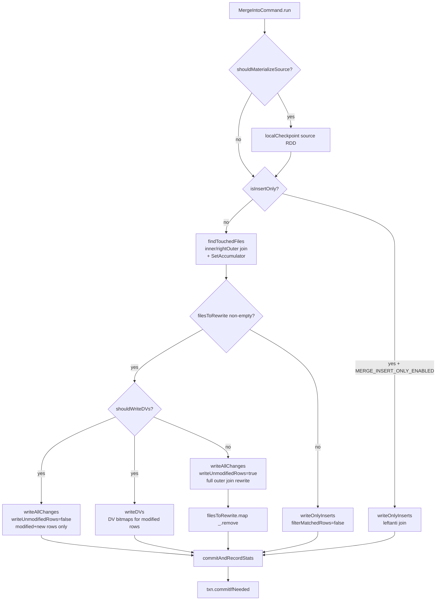
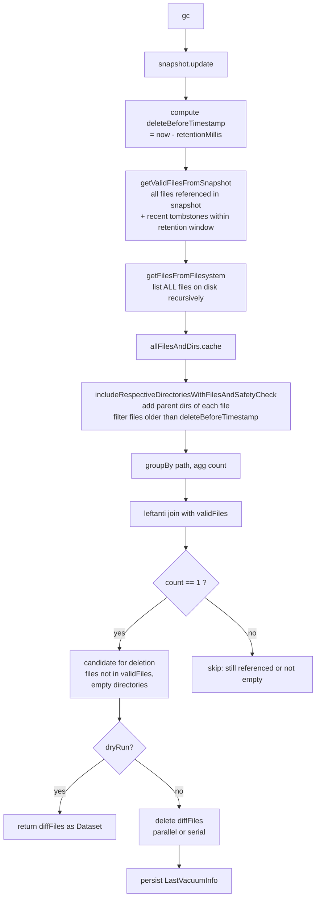
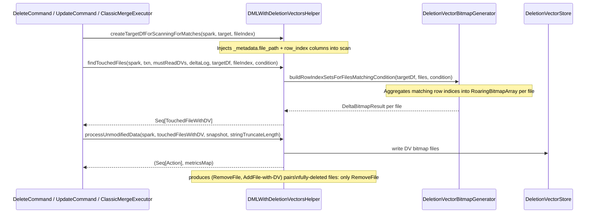
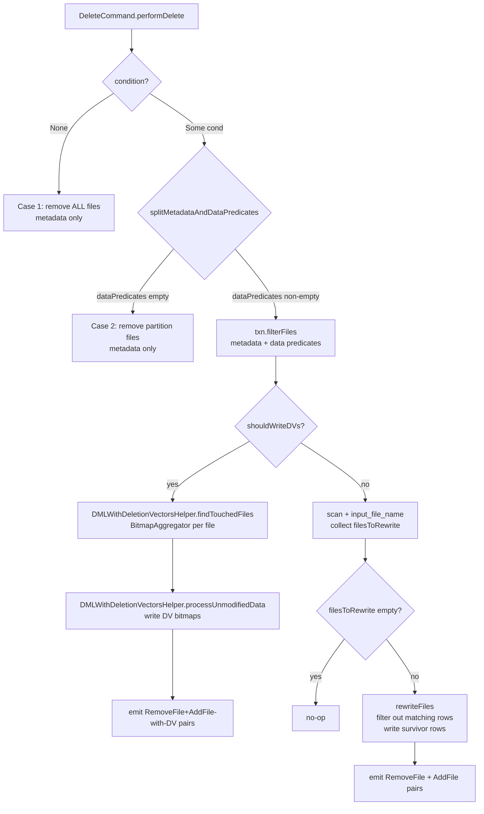
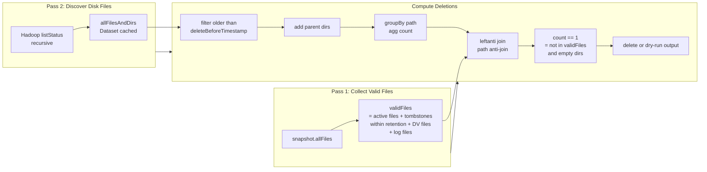

# spark.commands

## Purpose

`spark.commands` is the DML/DDL execution layer of the Delta Spark connector. Every user-visible write or administrative operation — INSERT, DELETE, UPDATE, MERGE, OPTIMIZE, VACUUM, RESTORE, CLONE, CONVERT TO DELTA, CREATE TABLE, REORG, and the metadata introspection commands — is implemented here as a Spark `RunnableCommand` (or `LeafRunnableCommand`). Commands acquire an `OptimisticTransaction` from `DeltaLog`, compute new `Action` lists (AddFile/RemoveFile/AddCDCFile/DeletionVector), and commit them atomically. Sub-packages provide the execution strategies for complex operations (MERGE join phases, OPTIMIZE bin-packing strategy, CDC file routing, DV helper utilities, row-tracking backfill).

---

## File Inventory

| File | Category |
|---|---|
| `WriteIntoDelta.scala` | Core write path |
| `DeleteCommand.scala` | DML – row-level delete |
| `UpdateCommand.scala` | DML – row-level update |
| `MergeIntoCommand.scala` | DML – MERGE orchestrator |
| `MergeIntoCommandBase.scala` | DML – MERGE base trait |
| `DMLWithDeletionVectorsHelper.scala` | DML – shared DV helpers |
| `DeletionVectorUtils.scala` | DML – DV utilities |
| `OptimizeTableCommand.scala` | Maintenance – OPTIMIZE |
| `OptimizeTableStrategy.scala` | Maintenance – strategy enum/traits |
| `VacuumCommand.scala` | Maintenance – VACUUM |
| `DeltaReorgTableCommand.scala` | Maintenance – REORG TABLE |
| `RestoreTableCommand.scala` | Lifecycle – RESTORE |
| `ConvertToDeltaCommand.scala` | Lifecycle – CONVERT TO DELTA |
| `CloneTableCommand.scala` + `CloneTableBase.scala` | Lifecycle – CLONE |
| `CreateDeltaTableCommand.scala` + `CreateDeltaTableLike.scala` | Lifecycle – CREATE TABLE / CTAS |
| `DeltaGenerateCommand.scala` | Utility – GENERATE |
| `DescribeDeltaDetailsCommand.scala` | Utility – DESCRIBE DETAIL |
| `DescribeDeltaHistoryCommand.scala` | Utility – DESCRIBE HISTORY |
| `ShowDeltaTableColumnsCommand.scala` | Utility – SHOW COLUMNS |
| `DeltaCommand.scala` | Base trait |
| `DMLUtils.scala` | Shared DML utilities |
| `alterDeltaTableCommands.scala` | ALTER TABLE command set |
| `ReorgTableHelper.scala` / `ReorgTableForUpgradeUniformHelper.scala` | REORG helpers |
| `DeltaCommandInvariants.scala` | Invariant checking |
| `WriteIntoDeltaLike.scala` | Write abstraction trait |
| `CreateDeltaTableLike.scala` | Create abstraction trait |
| **merge/** | |
| `ClassicMergeExecutor.scala` | MERGE – 2-phase join executor |
| `InsertOnlyMergeExecutor.scala` | MERGE – insert-only fast path |
| `MergeOutputGeneration.scala` | MERGE – output column generation |
| `MergeIntoMaterializeSource.scala` | MERGE – source materialization |
| `MergeStats.scala` | MERGE – stats reporting |
| **optimize/** | |
| `OptimizeStats.scala` | OPTIMIZE stats structs |
| `ZCubeFileStatsCollector.scala` | Liquid clustering ZCube stats |
| `ZOrderMetrics.scala` | Z-order metrics |
| `AddFileWithNumRecords.scala` | File record count helper |
| **cdc/** | |
| `CDCReader.scala` + `CDCReaderBase.scala` | CDF read path and column routing |
| **backfill/** | |
| `BackfillExecutor.scala` / `BackfillCommand.scala` | Backfill base |
| `RowTrackingBackfillCommand.scala` / `RowTrackingBackfillExecutor.scala` | Row ID backfill |
| `RowTrackingUnBackfillCommand.scala` / `RowTrackingUnBackfillExecutor.scala` | Row ID un-backfill |
| `BackfillBatch.scala` / `BackfillBatchStats.scala` / `BackfillCommandStats.scala` / `BackfillExecutionObserver.scala` | Backfill infrastructure |
| **columnmapping/** | |
| `RemoveColumnMappingCommand.scala` | Column mapping removal rewrite |
| **convert/** | |
| `ConvertUtils.scala` | Convert utility helpers |
| `interfaces.scala` | ConvertTargetTable / ConvertTargetFileManifest |
| `ParquetTable.scala` | Parquet-specific convert source |
| `ParquetFileManifest.scala` | File listing manifest |

---

## How Commands Fit Into the Spark Plan Lifecycle

All Delta commands extend `LeafRunnableCommand` (or `RunnableCommand`). They are produced by `DeltaAnalysis` — the Spark analyzer rule — which replaces Spark's generic logical nodes (`DeleteFromTable`, `UpdateTable`, `MergeIntoTable`, etc.) with Delta-specific command objects. The commands never execute until Spark's `QueryExecution.executedPlan.executeTake()` fires their `run(sparkSession)` method.

The canonical lifecycle within `run()`:
1. Open `deltaLog.withNewTransaction(catalogTable) { txn => ... }` — starts an `OptimisticTransaction`, pinning a `Snapshot`.
2. Compute `Action` list: scan files, apply expressions, write new Parquet files via `txn.writeFiles()`, build `AddFile`/`RemoveFile` lists.
3. Call `txn.commitIfNeeded(actions, operation, tags)` — OCC write with conflict detection.
4. Post-commit: re-cache any Spark cached plans that referenced this table.

Commands that produce large action sets (RESTORE, CLONE, CONVERT TO DELTA) use `txn.commitLarge()` to bypass per-action overhead.

---

## Component: Write Operations

### WriteIntoDelta

**Source**: `commands/WriteIntoDelta.scala`

`WriteIntoDelta` is the entry point for all DataFrame write operations to Delta: `df.write.format("delta").save()`, `df.writeTo().append()`, and the CTAS path from `CreateDeltaTableCommand`. It extends `LeafRunnableCommand`, `ImplicitMetadataOperation` (for schema evolution), and `DeltaCommand`.

#### Constructor Parameters

| Parameter | Purpose |
|---|---|
| `deltaLog: DeltaLog` | Target table |
| `mode: SaveMode` | Append / Overwrite / ErrorIfExists / Ignore |
| `options: DeltaOptions` | replaceWhere, partitionOverwriteMode, rearrangeOnly, etc. |
| `partitionColumns: Seq[String]` | Partition columns for new tables |
| `configuration: Map[String,String]` | Table properties for the commit |
| `data: DataFrame` | Data to write |
| `schemaInCatalog: Option[StructType]` | Schema override for CTAS path |

#### Write Modes Decision Tree

```scala
// WriteIntoDelta.scala:247-351
val (newFiles, addFiles, deletedFiles) = (mode, replaceWhere) match {
  case (SaveMode.Overwrite, Some(predicates)) if !replaceWhereOnDataColsEnabled =>
    // CASE A: replaceWhere on partition cols only (legacy)
    // Write new files, validate they match predicates, remove matching old files
    ...
  case (SaveMode.Overwrite, Some(conditions)) if txn.snapshot.version >= 0 =>
    // CASE B: replaceWhere with data column support (REPLACEWHERE_DATACOLUMNS_ENABLED)
    // Uses DeleteCommand.performDelete internally for the remove path
    // CDF packing: if CDF + containsDataFilters + cdcExistsInRemoveOp → pack CDC events inline
    ...
  case (SaveMode.Overwrite, None) =>
    // CASE C: full overwrite or dynamic partition overwrite
    // dynamic: only remove partitions touched by new data
    ...
  case _ =>
    // CASE D: append (or ErrorIfExists/Ignore already handled)
    ...
}
```

Key non-obvious behavior:
- `rearrangeOnly = true` (used by OPTIMIZE internal writes) sets `dataChange = false` on all `AddFile`/`RemoveFile` actions to suppress CDF generation.
- **IDENTITY columns**: `IdentityColumn.blockExplicitIdentityColumnInsert` is called before writing to reject explicit values for `GENERATED ALWAYS AS IDENTITY` columns. High-water marks are tracked via `txn.setTrackHighWaterMarks()`.
- **Schema handling**: CHAR vs VARCHAR handling — when `READ_SIDE_CHAR_PADDING` is off, CHAR is effectively normalized to VARCHAR before writing the schema to the transaction log.
- **CDF in replaceWhere**: When CDF is enabled, `containsDataFilters = true`, and the remove operation already produced CDC files, the insert path packs each new row as two `struct` entries (`_change_type=insert` and `_change_type=null`) in an `array(struct(...))`, then uses `explode()` to produce both the data row and the CDC row in a single scan — avoiding re-evaluation of non-deterministic expressions.

#### Schema Evolution

`updateMetadata()` (from `ImplicitMetadataOperation`) is called before writing. It:
- Checks `canMergeSchema` (option `mergeSchema=true`) — adds new columns from `data` schema to the table schema.
- Checks `canOverwriteSchema` (option `overwriteSchema=true`) — replaces the table schema entirely (only valid with full Overwrite, not replaceWhere).

---

### CreateDeltaTableCommand

**Source**: `commands/CreateDeltaTableCommand.scala`

Single entry point for all DDL writes to Delta by name: `CREATE TABLE`, `CREATE TABLE AS SELECT` (CTAS), `CREATE OR REPLACE TABLE`, and `saveAsTable`. Extends `LeafRunnableCommand` + `CreateDeltaTableLike`.

**Key behaviors**:
- **CTAS**: delegates to `WriteIntoDelta.run()` with the query as the data source. `schemaInCatalog` is passed to preserve the catalog-declared schema over the inferred query schema.
- **CREATE OR REPLACE**: called as `SaveMode.Overwrite` with `isTableReplace=true`, which prevents dynamic partition overwrite mode from applying.
- **Protocol allocation**: if `protocol` parameter is provided (by internal callers), that protocol is applied directly. Otherwise, `DeltaLog.upgradeProtocol` routes via table features.
- **Post-commit hooks**: `IcebergConverterHook` and `HudiConverterHook` are registered with the transaction when UniForm is enabled, triggering async metadata conversion after commit.
- **CatalogOwned tables**: `CatalogOwnedTableUtils` writes `CATALOG_OWNED_COORDINATED_COMMITS_CONFIG` into the table properties to designate the table as catalog-managed with coordinated commits.

---

## Component: Row-Level Mutations

### DeleteCommand

**Source**: `commands/DeleteCommand.scala`

`DeleteCommand` performs `DELETE FROM <table> WHERE <condition>`. It is produced by `DeltaAnalysis` from `DeltaDelete` logical nodes. It extends `LeafRunnableCommand`, `DeltaCommand`, and the `DeleteCommandMetrics` mixin.

#### Three-Case Algorithm

```
performDelete():
  CASE 1: condition = None  →  metadata-only: remove ALL files
  CASE 2: condition is partition-only  →  metadata-only: remove matching partition files
  CASE 3: condition has data predicates  →
    3a: shouldWriteDVs = true  →  DV path (findTouchedFiles + processUnmodifiedData)
    3b: shouldWriteDVs = false →  scan + rewrite path (2-phase: find files, then copy survivors)
```

**Case 1 & 2** are pure metadata operations — they produce `RemoveFile` actions without scanning any Parquet data. If `DELTA_DML_METRICS_FROM_METADATA` is set, row counts are read from `AddFile.numLogicalRecords` stats rather than scanning rows.

**Case 3 without DVs** (lines 309–377):
1. **Phase 1 (scan)**: scan candidate files, apply `WHERE condition` to collect `input_file_name()`, deduplicate → `filesToRewrite: Array[String]`. Uses `IncrementMetric` expression to count deleted rows as a side effect of the scan.
2. **Phase 2 (rewrite)**: for each touched file, read rows with `filterCondition = NOT(condition)` and write survivors. With CDF enabled, rows matching the delete condition are written with `_change_type=delete` as CDC events rather than being dropped.

**Case 3 with DVs** (lines 272–305):
- `DMLWithDeletionVectorsHelper.findTouchedFiles()` builds a `RoaringBitmapArray` per file via the `BitmapAggregator` aggregation function over row indices — no file is read twice.
- `DMLWithDeletionVectorsHelper.processUnmodifiedData()` writes the DV bitmaps to the DV store and produces `(RemoveFile, AddFile)` pairs with the DV descriptor attached. Files that are fully deleted (100% rows matched) get only a `RemoveFile` with no new `AddFile`.

#### Metrics Tracked
`numDeletedRows`, `numCopiedRows`, `numRemovedFiles`, `numAddedFiles`, `numDeletionVectorsAdded`, `numDeletionVectorsRemoved`, `numDeletionVectorsUpdated`, `scanTimeMs`, `rewriteTimeMs`, plus file-size and partition-level breakdowns.

#### Record Count Invariant
After commit, `validateNumRecords()` checks: `numAddedRecords ≤ numRemovedRecords`. Uses `NumRecordsStats.fromActions()` to read per-file stats rather than SQL metrics (metrics are unreliable with task retries). A secondary metric-based invariant (`numRowsDeleted + numRowsCopied + numRecordsNotCopied == numRemovedRecords`) is checked when `COMMAND_INVARIANT_CHECKS_USE_UNRELIABLE=true`.

---

### UpdateCommand

**Source**: `commands/UpdateCommand.scala`

`UpdateCommand` performs `UPDATE <table> SET col=expr WHERE condition`. Extends `LeafRunnableCommand`, `DeltaCommand`.

#### Three-Case Algorithm

```
performUpdate():
  Classify condition → (metadataPredicates, dataPredicates)
  CASE 1: candidateFiles = empty  →  no-op
  CASE 2: dataPredicates = empty  →  metadata-only: all candidate files need rewriting
  CASE 3: dataPredicates non-empty  →
    3.1: shouldWriteDVs = true  →  DV path
    3.2: shouldWriteDVs = false →  scan → collect touched file paths → rewriteFiles()
```

**Case 2** (partition-only predicate): `filesToRewrite` is set to all `candidateFiles` as `TouchedFileWithDV(path, addFile, newDeletionVector=null, deletedRows=0L)` without a data scan. All rows in all candidate files are re-written. Metrics for `numUpdatedRows` come from `txn.getMetric("numOutputRows")` (BasicWriteStatsTracker), not from the row counter expression.

**Case 3 without DVs**: scan files, collect `input_file_name()` for rows satisfying `updateCondition`, then in `rewriteFiles()`:
- Adds a boolean column `__condition__` to each row.
- Applies update expressions conditionally: `IF(__condition__, updateExpr, originalCol)`.
- With CDF: packs `[preimage, postimage, updatedData]` as an `array(struct(...))` and `explode()`s it to produce the final rows + CDC events in one pass.

**Case 3 with DVs**: `DMLWithDeletionVectorsHelper.findTouchedFiles()` returns `Seq[TouchedFileWithDV]`. Files with `newDeletionVector != null` undergo `processUnmodifiedData()` to write DV bitmaps. `rewriteFiles()` is still called for updated files (to produce the new rows with updated values), but `copyUnmodifiedRows=false` and `generateRemoveFileActions=false` — only the updated rows are written as new AddFiles; the original file is handled by the DV path.

#### Row-Tracking Preservation
`UpdateCommand.preserveRowTrackingColumns()` injects `_row_id` and `_row_commit_version` columns into the target scan. The commit version column is set to `null` in update expressions (it will be assigned by the new commit), while the row ID is passthrough (preserved).

```scala
// UpdateCommand.scala:612-629
def preserveRowTrackingColumns(...): (DataFrame, Seq[Attribute], Seq[Expression]) = {
  val targetDf = RowTracking.preserveRowTrackingColumns(targetDfWithoutRowTrackingColumns, snapshot)
  val rowIdAttrOpt = MaterializedRowId.getAttribute(snapshot, targetDf)
  val rowCommitVersionAttrOpt = MaterializedRowCommitVersion.getAttribute(snapshot, targetDf)
  val finalUpdateExpressions = updateExpressions ++
    rowIdAttrOpt ++
    rowCommitVersionAttrOpt.map(_ => Literal(null, LongType))  // commit version always nulled
  ...
}
```

---

### MergeIntoCommand, MergeIntoCommandBase, ClassicMergeExecutor, InsertOnlyMergeExecutor

**Sources**: `commands/MergeIntoCommand.scala`, `commands/MergeIntoCommandBase.scala`, `commands/merge/ClassicMergeExecutor.scala`, `commands/merge/InsertOnlyMergeExecutor.scala`

`MergeIntoCommand` mixes in both `ClassicMergeExecutor` and `InsertOnlyMergeExecutor` traits (both extend `MergeOutputGeneration`, which extends `MergeIntoCommandBase`). `MergeIntoCommandBase` holds all shared state: source/target plans, clause lists, metrics, schema evolution helpers.

#### Key Flags Computed at Initialization

| Flag | Condition | Optimization effect |
|---|---|---|
| `isInsertOnly` | only `NOT MATCHED` clauses, no MATCHED/NOT MATCHED BY SOURCE | use `InsertOnlyMergeExecutor.writeOnlyInserts()` |
| `isMatchedOnly` | only `MATCHED` clauses, no NOT MATCHED | use inner join in Phase 2 instead of outer join |
| `isDeleteOnly` | all clauses are DELETE clauses | allow multiple source rows to match same target |
| `isOnlyOneUnconditionalDelete` | exactly `WHEN MATCHED THEN DELETE` with no condition | ditto |
| `shouldWriteDVs` | `MERGE_USE_PERSISTENT_DELETION_VECTORS` + table writable | use DV path |

#### Source Materialization

Before entering the transaction, `MergeIntoMaterializeSource.shouldMaterializeSource()` decides whether to materialize the source:
- Materializes if the source plan contains non-deterministic expressions, contains streaming relations, or is explicitly configured via `MERGE_SOURCE_MATERIALIZATION`.
- Materialization uses **local checkpointing** (`Dataset.localCheckpoint()`) — saves to executor-local disk as a `LogicalRDD`.
- Retry loop: if the materialized RDD data is lost (executor failure), the entire merge restarts. On retry, replication factor increases from 1 to 2 (`MERGE_SOURCE_MATERIALIZATION_RDD_STORAGE_LEVEL_RETRY`).

#### Insert-Only Fast Path (`InsertOnlyMergeExecutor`)

When `isInsertOnly && MERGE_INSERT_ONLY_ENABLED`:
1. Applies `leftanti` join between source and target (skipping only target files matching target-only predicates).
2. Generates insert output columns using `generateInsertsOnlyOutputDF()`:
   - If single `NOT MATCHED` clause: simple `select` of resolved action expressions.
   - If multiple `NOT MATCHED` clauses: `CaseWhen` expression per output column to route to the correct clause, with `ROW_DROPPED_COL=true` for unmatched rows.
3. Writes result, no second source scan.

```scala
// InsertOnlyMergeExecutor.scala:79-98
val preparedSourceDF = if (filterMatchedRows) {
  // leftanti: only keep source rows that have NO match in target
  val targetOnlyPredicates = conjunctivePredicates.filter(_.references.subsetOf(target.outputSet))
  dataSkippedFiles = Some(deltaTxn.filterFiles(targetOnlyPredicates))
  val targetDF = DataFrameUtils.ofRows(spark, buildTargetPlanWithFiles(..., dataSkippedFiles.get, ...))
  sourceDF.join(targetDF, Column(condition), "leftanti")
} else {
  sourceDF  // no match found in Phase 1, so all source rows are inserts
}
```

#### Classic Path — Phase 1: `findTouchedFiles()` (ClassicMergeExecutor)

Goal: find the set of target `AddFile`s that contain rows matching the merge condition.

```scala
// ClassicMergeExecutor.scala:72-215
val touchedFilesAccum = new SetAccumulator[String]()  // spark accumulator collects file paths
val joinType = if (notMatchedBySourceClauses.isEmpty) "inner" else "right_outer"
// Join source × target to find matches
val joinToFindTouchedFiles = sourceDF.join(targetDF, Column(condition), joinType)
// UDF side-effect: record fileName into accumulator for matched rows
val recordTouchedFileName = DeltaUDF.intFromStringBoolean { (fileName, shouldRecord) =>
  if (shouldRecord) touchedFilesAccum.add(fileName)
  1
}.asNondeterministic()
val matchedRowCounts = collectTouchedFiles.groupBy(ROW_ID_COL).agg(sum("one").as("count"))
val (multipleMatchCount, multipleMatchSum) = matchedRowCounts.filter("count > 1").collect().head
// Check for multiple source rows matching same target row (error unless isOnlyOneUnconditionalDelete)
throwErrorOnMultipleMatches(hasMultipleMatches, spark)
```

Data skipping in Phase 1:
- If no `NOT MATCHED BY SOURCE` clauses: applies `getTargetOnlyPredicates()` — extracts conjuncts that only reference target columns — to filter files before the join.
- If `NOT MATCHED BY SOURCE` clauses exist: no predicate pushdown (must scan all target files).
- For `isMatchedOnly`: additionally filters on the disjunction of all `MATCHED` clause conditions after the join.

#### Classic Path — Phase 2: `writeAllChanges()` (ClassicMergeExecutor)

Goal: re-read the touched files with source, apply all clauses, write output.

Join type selection:
| Condition | Join Type |
|---|---|
| `writeUnmodifiedRows && isMatchedOnly` | `rightOuter` |
| `writeUnmodifiedRows` (default) | `fullOuter` |
| `!writeUnmodifiedRows && isMatchedOnly` | `inner` |
| `!writeUnmodifiedRows && notMatchedBySourceClauses empty` | `leftOuter` |
| `!writeUnmodifiedRows && notMatchedClauses empty` | `rightOuter` |
| `!writeUnmodifiedRows` (both clause types) | `fullOuter` |

Output column construction:
- N target columns + optional `_row_id` + optional `_row_commit_version` + `ROW_DROPPED_COL` + (if CDF) `_change_type`.
- Rows with `ROW_DROPPED_COL=true` are filtered out before writing.
- `generateWriteAllChangesOutputCols()` (in `MergeOutputGeneration`) produces `CaseWhen` expressions that evaluate each clause condition in priority order and emit the correct action expressions.

DV path when `writeUnmodifiedRows=false`:
1. `writeAllChanges(writeUnmodifiedRows=false)` writes only modified rows and new inserts (no copies).
2. `writeDVs()` separately joins source × touched files to compute which original target rows are modified (using `DeletionVectorBitmapGenerator`), writes DV bitmaps, produces `(RemoveFile, AddFile-with-DV)` pairs.

#### `checkNonDeterministicSource()`

After Phase 2, compares `numSourceRows` (Phase 1 count) with `numSourceRowsInSecondScan` (Phase 2 count). If they differ, logs a warning and throws `DeltaErrors.sourceNotDeterministicInMergeException` if `MERGE_FAIL_IF_SOURCE_CHANGED=true`.

---

#### MERGE INTO Execution Flow Diagram



---

## Component: Maintenance Commands

### OptimizeTableCommand / OptimizeExecutor

**Sources**: `commands/OptimizeTableCommand.scala`, `commands/OptimizeTableStrategy.scala`

`OptimizeTableCommand` validates inputs, rejects Z-order on clustered tables and partition predicates on clustered tables, then instantiates `OptimizeExecutor` and calls `optimize()`.

`OptimizeExecutor.optimize()` is the actual workhorse:

#### Strategy Selection

| `optimizeStrategy` type | When | `curve` | `maxBinSize` |
|---|---|---|---|
| `CompactionStrategy` | no zOrderBy, not clustered | N/A | `DELTA_OPTIMIZE_MAX_FILE_SIZE` |
| `ZOrderStrategy` | zOrderBy specified | `hilbert` | `∞` (entire partition per bin) |
| `ClusteringStrategy` | clustered table (liquid clustering) | `hilbert` | `DELTA_OPTIMIZE_CLUSTERING_TARGET_CUBE_SIZE` |

#### Bin-packing Algorithm

```
optimize():
  candidateFiles = snapshot.filesForScan(partitionPredicate)
  filesToProcess = filterCandidateFileList(candidateFiles)  // size + DV ratio filter
  partitionsToCompact = filesToProcess.groupBy(_.partitionValues)
  jobs = groupFilesIntoBins(partitionsToCompact)
  // groupFilesIntoBins: sort by size, greedily pack until currentBinSize > maxBinSize
  batches = BinPackingUtils.binPackBySize(jobs, binSize, DELTA_OPTIMIZE_BATCH_SIZE)
  batchResults = batches.map(batch => runOptimizeBatch(batch, maxFileSize))
```

`filterCandidateFileList()` selects files for compaction:
- For non-clustering modes: files with `size < minFileSize` OR `deletedToPhysicalRecordsRatio > maxDeletedRowsRatio`.
- For clustering modes: all files are selected (clustering always rewrites everything).
- For REORG context: `DeltaReorgOperation.filterFilesToReorg()` determines the candidate set (see REORG section).

#### `runOptimizeBinJob()`

For each bin:
1. Read via `txn.deltaLog.createDataFrame(txn.snapshot, bin)`.
2. Preserve row tracking columns.
3. **Compaction**: `coalesce(1)` or `repartition(1)`.
4. **ZOrder/Clustering**: `MultiDimClustering.cluster(input, approxNumFiles, clusteringColumns, curve)` — Hilbert curve space-filling sort, range-partitioned into `approxNumFiles` output files.
5. Write via `txn.writeFiles(repartitionDF, isOptimize=true)`.
6. Tag each `AddFile` via `optimizeStrategy.tagAddFile()` — for clustering, adds `ZCUBE_ID` and `ZCUBE_ZORDER_CURVE` tags.

#### `commitAndRetry()`

On `ConcurrentModificationException`, re-opens a new transaction and checks that all original input files are still present in the new snapshot (candidate set is a subset check). If all files still present, retries; otherwise aborts.

---

### VacuumCommand

**Source**: `commands/VacuumCommand.scala`

`VacuumCommand.gc()` is the entry point. Two operation modes:

| Mode | File Discovery | When |
|---|---|---|
| `VacuumType.FULL` | Filesystem listing via Hadoop `listStatus` (recursive, parallel) | default |
| `VacuumType.LITE` | Delta log scan — reads removed files from commit range | `LITE_VACUUM_ENABLED=true` |

#### VACUUM Two-Pass Algorithm (FULL mode)



**`getValidFilesFromSnapshot()`**: collects the set of files that must not be deleted:
- All currently-active `AddFile`s from the snapshot.
- Tombstone (`RemoveFile`) entries within the retention window (files still within retention are kept for time travel).
- Delta log files (`_delta_log/` contents).
- DV files referenced by any live `AddFile`.
- Iceberg metadata files (if UniForm Iceberg is enabled).

**Retention safety check**: prevents VACUUM from running with a retention shorter than `DELTA_VACUUM_RETENTION_WINDOW_IGNORE_ENABLED` (unless explicitly set to 0). The `retentionDurationCheck` in `DeltaLog` also enforces `delta.deletedFileRetentionDuration >= 0` and logs a warning if set below 7 days.

**LITE mode**: calls `getFilesFromDeltaLog()` — scans `RemoveFile` actions from commits in the range `[eligibleStart, eligibleEnd]` instead of listing the filesystem. Far faster for large tables.

**Inventory mode**: caller can provide a pre-built DataFrame matching `INVENTORY_SCHEMA` (path, length, isDir, modificationTime) to replace the filesystem listing — useful for cloud storage inventory reports (S3/GCS/Azure blob manifests).

---

### DeltaReorgTableCommand

**Source**: `commands/DeltaReorgTableCommand.scala`

`DeltaReorgTableCommand` is a targeted re-optimization command with three distinct modes:

| Mode | Enum | Action |
|---|---|---|
| `PURGE` | `DeltaReorgTableMode.PURGE` | Rewrite files with DVs (materialize soft-deletes) and/or files with dropped columns |
| `UNIFORM_ICEBERG` | `DeltaReorgTableMode.UNIFORM_ICEBERG` | Upgrade Iceberg compat version tag for all files not at target version |
| `REWRITE_TYPE_WIDENING` | `DeltaReorgTableMode.REWRITE_TYPE_WIDENING` | Rewrite files whose physical schema has different types (for dropping the type-widening feature) |

For `PURGE` and `REWRITE_TYPE_WIDENING`, `DeltaReorgTableCommand` creates an `OptimizeTableCommand` with `DeltaOptimizeContext(reorg=Some(reorgOperation), minFileSize=0, maxDeletedRowsRatio=0)`. The `minFileSize=0` and `maxDeletedRowsRatio=0` force all selected files to be considered regardless of size or DV ratio.

`DeltaPurgeOperation.filterFilesToReorg()` identifies candidates:
1. Files with dropped columns: `filterParquetFilesOnExecutors()` opens each Parquet file header on executors and calls `fileHasExtraColumns(schema, physicalSchema, protocol, metadata)`.
2. Files with DVs: `file.deletionVector != null && file.numPhysicalRecords.isEmpty` (no stats → always rewrite) OR `file.numDeletedRecords > 0`.

`DeltaUpgradeUniformOperation.filterFilesToReorg()` selects files whose `ICEBERG_COMPAT_VERSION` tag differs from the target version.

`DeltaRewriteTypeWideningOperation.filterFilesToReorg()` uses `fileHasDifferentTypes(schema, physicalSchema)` to find files with changed column types.

---

## Component: Table Lifecycle Commands

### RestoreTableCommand

**Source**: `commands/RestoreTableCommand.scala`

`RESTORE TABLE <table> TO VERSION AS OF N` or `TO TIMESTAMP AS OF ts`.

#### Algorithm

```
1. Resolve versionToRestore (from version or timestamp via DeltaHistoryManager.getActiveCommitAtTime)
2. Verify versionToRestore < latestVersion
3. Open transaction
4. latestSnapshotFiles = latestSnapshot.allFiles (Dataset[AddFile])
5. snapshotToRestoreFiles = snapshotToRestore.allFiles (Dataset[AddFile])
6. Join key: (path, deletionVectorId) — DV-aware dedup
7. filesToAdd = snapshotToRestoreFiles leftanti latestSnapshotFiles (files in restore not in latest)
8. filesToRemove = latestSnapshotFiles leftanti snapshotToRestoreFiles (files in latest not in restore)
9. If !IGNORE_MISSING_FILES: checkSnapshotFilesAvailability (verify filesToAdd exist on disk)
10. txn.updateMetadata(snapshotToRestore.metadata)  // restore schema, properties
11. Protocol: sourceProtocol.merge(targetProtocol)  // never downgrade by default
12. commitLarge(addActions + removeActions + domainMetadataActions, DeltaOperations.Restore)
```

**Protocol handling**: protocol is never downgraded unless `RESTORE_TABLE_PROTOCOL_DOWNGRADE_ALLOWED=true`. This is critical — a table with deletion vectors enabled cannot be safely restored to a version that pre-dates DVs by downgrading the protocol.

**Identity column high-water marks**: `IdentityColumn.copySchemaWithMergedHighWaterMarks()` takes the schema being restored but merges in the latest high-water marks from the current snapshot. This prevents re-assigning IDENTITY values that have already been used.

**DomainMetadata**: `DomainMetadataUtils.handleDomainMetadataForRestoreTable()` restores domain metadata from the target snapshot, removing domains that were added after the restore point.

---

### ConvertToDeltaCommand

**Source**: `commands/ConvertToDeltaCommand.scala`

Converts an existing Parquet (or Iceberg) table to Delta format in-place by writing a Delta log for the existing files.

#### Conversion Pipeline

```
1. resolveConvertTarget() → ConvertProperties (provider, targetDir)
   - Supports: parquet path, parquet table identifier, iceberg (if DELTA_CONVERT_ICEBERG_ENABLED)
   - Idempotent: if already Delta, return immediately
2. ConvertTargetTable abstraction:
   - ParquetTable (convert/ParquetTable.scala): Spark Parquet source
   - IcebergTable (if Iceberg enabled): Iceberg catalog source
3. fileManifest.getFiles() → Iterator[ConvertTargetFile]
   - ParquetFileManifest: lists files with Spark job, infers schema in batches
4. Schema inference (batched): groups file iterator into sequential batches,
   launches Spark jobs to read Parquet footers and merge schemas
5. Stats collection (batched): if collectStats=true, groups files into batches,
   reads column stats (min/max/nullCount) per file
6. Commit: writes a single Delta commit with all AddFile actions
   - Bypasses normal transaction protocol (first commit)
   - Handles partition discovery from directory structure
7. Catalog update: updates the table provider in the Spark catalog to "delta"
```

**sub-package `convert/`**:
- `interfaces.scala` — `ConvertTargetTable` (schema, partition discovery) and `ConvertTargetFileManifest` (file listing iterator) traits.
- `ParquetTable.scala` — implements `ConvertTargetTable` for Parquet sources.
- `ParquetFileManifest.scala` — parallel file listing using `DeltaFileOperations.recursiveListDirs`.
- `ConvertUtils.scala` — schema merging, stats collection helpers.

---

### CloneTableCommand / CloneTableBase

**Sources**: `commands/CloneTableCommand.scala`, `commands/CloneTableBase.scala`

`CLONE <source> [SHALLOW|DEEP] TO <target>`.

**`CloneSource` trait** abstracts the source format:

| Implementation | Format | File Listing |
|---|---|---|
| `DeltaSnapshotSource` | Delta | `snapshot.allFiles` |
| `IcebergTableSource` | Iceberg | Iceberg scan file list |
| `ParquetTableSource` | Parquet | Spark file listing |

**Shallow vs Deep** (controlled by `CloneTableBase.isShallowClone`):
- **Shallow**: `AddFile` records are copied to the target Delta log with their original absolute paths unchanged. No data files are copied. The target table points to source files; any VACUUM on the source can break the clone.
- **Deep**: `CloneTableBase.runCopy()` physically copies each file to the target directory, updating paths in `AddFile` records to relative target paths.

**`CloneTableBase.handleClone()`**:
1. Open transaction on target.
2. Copy (or reference) source files.
3. Set target metadata = source metadata (schema, partition columns, configuration).
4. Protocol: `extractAutomaticallyEnabledFeatures(sourceProtocol, targetMetadata)` to pick up any auto-enabled features.
5. `txn.commitLarge()` with all `AddFile` actions + new `Metadata` + `Protocol`.

**CDF support**: if the source table has CDF enabled, the clone propagates the `delta.enableChangeDataFeed` property. Streaming sources that reference the clone can read CDC from the clone independently of the source.

---

## Component: CDF/CDC Helpers

### CDCReader (`cdc/CDCReader.scala`, `cdc/CDCReaderBase.scala`)

The `CDCReader` module defines the protocol for Change Data Feed (CDF) — how DML operations annotate, store, and expose row-level change events.

#### Column Protocol

| Column | Purpose |
|---|---|
| `_change_type` (`CDC_TYPE_COLUMN_NAME`) | Emitted by writers: `"insert"`, `"delete"`, `"update_preimage"`, `"update_postimage"`, or `null` (not-CDC) |
| `__is_cdc` (`CDC_PARTITION_COL`) | Virtual partition column: routes CDC rows to `_change_data/` and non-CDC rows to table data path |
| `_commit_version` | Inferred by reader from log |
| `_commit_timestamp` | Inferred by reader from log |

The sentinel value `CDC_TYPE_NOT_CDC = Literal(null, StringType)` partitions main data rows away from change events inside `DelayedCommitProtocol` — rows with a null `_change_type` go to the normal Parquet files while rows with a non-null type go to `_change_data/` as `AddCDCFile` actions.

#### How DML Commands Produce CDC

| Command | CDC production mechanism |
|---|---|
| DELETE (non-DV) | `rewriteFiles()`: `withColumn(_change_type, If(filterCondition, CDC_NOT_CDC, CDC_DELETE))` |
| UPDATE (non-DV) | `withUpdatedColumns()`: packs `[preimage, postimage, updatedData]` as array struct, explode |
| WriteIntoDelta replaceWhere | packs `[insert-event, data-row]` as array struct, explode |
| MERGE | `generateCdcAndOutputRows()` in `MergeOutputGeneration` produces per-clause CDC events |

#### DV + CDF Interaction

When DVs are enabled, the primary data file is **not** rewritten. Instead the DV marks deleted rows, and a separate `AddCDCFile` must be written for any DELETE/UPDATE to satisfy the CDF contract. The `CDCReader` handles this during read: it looks for `AddCDCFile` entries in commits; if none exist, it deduces changes from `AddFile`/`RemoveFile` pairs. The combination `DV + explicit CDF file` is needed when the caller needs full CDF semantics with DVs.

#### `isCDCEnabledOnTable()`

```scala
// CDCReader.scala (object CDCReader)
def isCDCEnabledOnTable(metadata: Metadata, spark: SparkSession): Boolean =
  DeltaConfigs.CHANGE_DATA_FEED.fromMetaData(metadata)
```

Writers check this before emitting CDC columns. Disabled tables skip CDC entirely, saving the extra array-pack + explode overhead.

#### `CDCReaderBase.changesToBatchDF()`

Reads a version range and produces a unified CDF DataFrame. For each commit in range:
- Scans `AddCDCFile` entries (explicit CDC files from DML operations).
- Scans `AddFile`/`RemoveFile` pairs (implicit inserts/deletes for non-row-level operations like OVERWRITE).
- Handles DV-based deletes by reconstructing deleted rows.
- Returns a `DataFrame` with `_change_type`, `_commit_version`, `_commit_timestamp` columns appended.

---

## Component: DV Integration (Shared DELETE/UPDATE/MERGE Pattern)

### DMLWithDeletionVectorsHelper

**Source**: `commands/DMLWithDeletionVectorsHelper.scala`

This helper consolidates the DV-based execution path shared by DELETE, UPDATE, and MERGE.

#### Core Flow



#### `findTouchedFiles()`

1. Constructs a scan with `ROW_INDEX_COLUMN_NAME` (either via `_metadata.row_index` when predicate pushdown is available, or a custom column when not) and `_metadata.file_path`.
2. Runs a Spark job: filters rows matching `condition`, aggregates row indices per file into a `RoaringBitmapArray` using `BitmapAggregator`.
3. Handles existing DVs: if `mustReadDeletionVectors=true`, the scan uses `DeltaParquetFileFormat` with DV-aware reading to skip already-deleted rows before applying the new condition.
4. Returns `Seq[TouchedFileWithDV]` — each entry has the original `AddFile` and the new `DeletionVectorDescriptor` for the matching rows.

#### `processUnmodifiedData()`

1. For each `TouchedFileWithDV`:
   - If new DV covers all rows (`isFullyReplaced()`): emit only `RemoveFile`.
   - If new DV merges with existing DV: merge bitmaps (existing OR new), write merged DV, emit `(RemoveFile, AddFile-with-merged-DV)`.
   - If new DV is fresh: write to DV store, emit `(RemoveFile, AddFile-with-new-DV)`.
2. Updates stats: new `AddFile` gets updated `numDeletedRecords` from the merged DV cardinality. String stats truncation via `StatsCollectionUtils.getDataSkippingStringPrefixLength()`.

#### `DeletionVectorUtils`

`DeletionVectorUtils.deletionVectorsWritable(snapshot)` returns true if `DeletionVectors` table feature is supported AND the table property `delta.enableDeletionVectors=true`. This is the single guard checked by DELETE, UPDATE, and MERGE before taking the DV path.

---

## Component: Column Mapping Commands

### RemoveColumnMappingCommand

**Source**: `commands/columnmapping/RemoveColumnMappingCommand.scala`

Triggered when removing column mapping mode (e.g., via REORG TABLE during a UniForm upgrade downgrade). It:
1. Opens a transaction.
2. Reads all existing files via `txn.filterFiles()`.
3. Builds a DataFrame from the data using physical (mapped) column names.
4. Drops column mapping metadata from the schema (`DeltaColumnMapping.dropColumnMappingMetadata()`).
5. Verifies no invalid column names would result.
6. Rewrites all files using `txn.writeFiles()` with the new schema.
7. Removes old files and commits.

> [!NOTE] Impact
> This is a full-table rewrite — all Parquet files are rewritten with logical column names instead of physical UUIDs/IDs. The operation is expensive for large tables. It is triggered by `REORG TABLE ... UPGRADE UNIFORM ICEBERG_COMPAT_VERSION=1` when downgrading from a higher compat version that required column mapping.

---

## Component: Backfill

### RowTrackingBackfillCommand, BackfillExecutor

**Sources**: `commands/backfill/`

Row tracking backfill assigns `_row_id` base values to all existing `AddFile` entries in a table that does not yet have row tracking enabled. This is a prerequisite for enabling `delta.enableRowTracking=true` on an existing table.

#### Backfill Algorithm

```
RowTrackingBackfillCommand.run():
  1. upgradeProtocolIfRequired()  // add RowTrackingFeature to Protocol if not present
  2. BackfillExecutor.run(maxNumFilesPerCommit)
     - loop:
       snapshot = deltaLog.update()
       files = filesToBackfill(snapshot)  // AddFiles without baseRowId
       batch = files.take(maxNumFilesPerCommit)
       batch.commit()  // re-commit with baseRowId assigned
     - exit when batch.size < maxNumFilesPerCommit (or totalFilesProcessed > maxFilesToProcess)
  3. caller must separately set delta.enableRowTracking=true in metadata
```

`RowTrackingBackfillBatch.commit()` re-commits each `AddFile` in the batch with a fresh `baseRowId` assigned (monotonically increasing across batches, starting from the current high-water mark). Each batch is a separate `OptimisticTransaction`.

`RowTrackingUnBackfillCommand` is the inverse — strips `baseRowId` from `AddFile` entries (used when disabling the feature).

**Live-lock protection**: `maxFilesToProcess = totalFileCount * factor` (`factor` from `DELTA_BACKFILL_MAX_NUM_FILES_FACTOR`). If competing concurrent transactions keep adding files, the backfill loop exits after processing `factor` times the original file count.

---

## Utility Commands

### DeltaGenerateCommand

**Source**: `commands/DeltaGenerateCommand.scala`

`GENERATE <mode> FOR TABLE <table>`. Currently only one mode:
- `symlink_format_manifest`: calls `GenerateSymlinkManifest.generateFullManifest()` — writes a Hive-compatible symlink manifest under `_symlink_format_manifest/` for use with Presto/Athena/Trino catalogs that don't natively read Delta format.

### DescribeDeltaDetailsCommand

**Source**: `commands/DescribeDeltaDetailsCommand.scala`

Returns `TableDetail` case class fields from the snapshot: `format="delta"`, `id` (table GUID from `Metadata.id`), `name` (catalog identifier), `location`, `createdAt`/`lastModified` (from commit history), `partitionColumns`, `clusteringColumns` (from `ClusteredTableUtils`), `numFiles`, `sizeInBytes`, `properties` (table config), `minReaderVersion`/`minWriterVersion`, `tableFeatures` (from `Protocol`).

### DescribeDeltaHistoryCommand

**Source**: `commands/DescribeDeltaHistoryCommand.scala`

`DESCRIBE HISTORY <table>` — reads `CommitInfo` actions from the Delta log, returning a `DataFrame` of commit history entries. Supports `LIMIT` clause via `DeltaHistoryManager.getHistory(limit)`. Returns: `version`, `timestamp`, `userId`, `userName`, `operation`, `operationParameters`, `operationMetrics`, `userMetadata`, `engineInfo`.

---

## Key Command Summary Table

| SQL Command | Main Class | Key Algorithm | DV Support | CDF Support |
|---|---|---|---|---|
| `INSERT INTO` / DataFrame write | `WriteIntoDelta` | `txn.writeFiles(data)` + schema evolution | N/A | Via inline CDC pack+explode |
| `CREATE TABLE [AS SELECT]` | `CreateDeltaTableCommand` | Delegates to `WriteIntoDelta`; CTAS runs query | N/A | Hooks registered post-commit |
| `DELETE` | `DeleteCommand` | 3-case: unconditional / metadata-only / row-level (DV or rewrite) | Yes | Yes |
| `UPDATE` | `UpdateCommand` | 3-case: no files / partition-only / row-level (DV or rewrite) | Yes | Yes |
| `MERGE INTO` | `MergeIntoCommand` | Insert-only: leftanti join; Classic: Phase1(inner join+accumulator) + Phase2(outer join rewrite or DV) | Yes | Yes |
| `OPTIMIZE` | `OptimizeTableCommand` → `OptimizeExecutor` | Bin-pack → coalesce (Compaction) or MultiDimClustering.cluster (ZOrder/Clustering) | Removes DVs | No (rearrangeOnly) |
| `VACUUM` | `VacuumCommand.gc()` | Valid files set, diff against disk listing, delete orphans | Preserves DV files | N/A |
| `REORG TABLE PURGE` | `DeltaReorgTableCommand` | Runs OptimizeExecutor with DeltaPurgeOperation filter (DV files + dropped columns) | Yes (materializes) | No |
| `REORG TABLE UPGRADE UNIFORM` | `DeltaReorgTableCommand` | Runs upgradeUniformIcebergCompatVersion; rewrites files without target iceberg compat tag | N/A | N/A |
| `RESTORE TABLE` | `RestoreTableCommand` | leftanti join on (path, dvId) → filesToAdd + filesToRemove, commitLarge | DV-aware | No |
| `CONVERT TO DELTA` | `ConvertToDeltaCommand` | File listing → batched schema inference → batched stats collection → direct commit | No | No |
| `CLONE` | `CloneTableCommand` | Shallow: copy AddFile records only; Deep: copy data files to target | Propagated | Propagated |
| `GENERATE symlink_format_manifest` | `DeltaGenerateCommand` | Writes `_symlink_format_manifest/` via `GenerateSymlinkManifest` | N/A | N/A |
| `DESCRIBE DETAIL` | `DescribeDeltaDetailsCommand` | Reads snapshot metadata fields → `TableDetail` | N/A | N/A |
| `DESCRIBE HISTORY` | `DescribeDeltaHistoryCommand` | Reads `CommitInfo` actions from log | N/A | N/A |

---

## DELETE with/without DVs Flow



---

## VACUUM 2-Pass Algorithm



---

## Public Interface

| Symbol | Type | Description |
|---|---|---|
| `WriteIntoDelta` | case class (RunnableCommand) | DataFrame write path — entry point for all Delta DataFrame writes |
| `DeleteCommand` | case class (RunnableCommand) | DELETE FROM execution |
| `UpdateCommand` | case class (RunnableCommand) | UPDATE SET execution |
| `MergeIntoCommand` | case class (RunnableCommand) | MERGE INTO execution |
| `OptimizeTableCommand` | case class (RunnableCommand) | OPTIMIZE execution |
| `OptimizeExecutor` | class | Actual bin-pack and write logic for OPTIMIZE |
| `DeltaOptimizeContext` | case class | Context flags for OPTIMIZE: reorg, minFileSize, maxFileSize, isFull |
| `VacuumCommand.gc()` | object method | VACUUM entry point |
| `DeltaReorgTableCommand` | case class (RunnableCommand) | REORG TABLE execution |
| `RestoreTableCommand` | case class (RunnableCommand) | RESTORE TABLE execution |
| `ConvertToDeltaCommand` | abstract class (RunnableCommand) | CONVERT TO DELTA execution |
| `CloneTableCommand` | case class (RunnableCommand) | CLONE execution |
| `CreateDeltaTableCommand` | case class (RunnableCommand) | CREATE TABLE / CTAS / CREATE OR REPLACE |
| `DeltaGenerateCommand` | case class (RunnableCommand) | GENERATE mode |
| `DescribeDeltaDetailsCommand` | class (RunnableCommand) | DESCRIBE DETAIL |
| `DescribeDeltaHistoryCommand` | class (RunnableCommand) | DESCRIBE HISTORY |
| `CDCReader` | object | CDC read path and column protocol constants |
| `DMLWithDeletionVectorsHelper` | object | Shared DV helper for DELETE/UPDATE/MERGE |
| `MergeIntoCommandBase` | trait | MERGE shared state and invariant checking |
| `ClassicMergeExecutor` | trait | MERGE Phase 1+2 join execution |
| `InsertOnlyMergeExecutor` | trait | MERGE insert-only leftanti optimization |
| `MergeIntoMaterializeSource` | trait | MERGE source local-checkpoint materialization |
| `RowTrackingBackfillCommand` | case class (RunnableCommand) | Row tracking backfill |
| `RemoveColumnMappingCommand` | class | Column mapping removal rewrite |

---

## Key Dependencies

- **[[spark.core]]** (`OptimisticTransaction`, `DeltaLog`, `Snapshot`, `DeltaErrors`): all commands open transactions via `deltaLog.withNewTransaction()`.
- **[[spark.files]]** (`TransactionalWrite`, `TahoeBatchFileIndex`, `DelayedCommitProtocol`): commands write via `txn.writeFiles()` which routes through `TransactionalWrite` and `DelayedCommitProtocol` (which handles CDF routing).
- **[[spark.skipping]]** (`MultiDimClustering`, `ClusteredTableUtils`): OPTIMIZE clustering path.
- **[[spark.schema]]** (`SchemaUtils`, `ImplicitMetadataOperation`): schema evolution in write operations.
- **[[concepts/deletion_vectors]]** (`DeletionVectorStore`, `RoaringBitmapArray`): DV write path.
- **[[concepts/change_data_feed]]** (`CDCReader`): CDC column routing.
- **`delta-storage`** (`LogStore`): underlying atomic file writes during commit.

---

## Modules That Depend On spark.commands

- **[[delta-connect-server]]**: `DeltaCommandPlugin.execute()` dispatches Spark Connect commands directly to `DeleteCommand.run()`, `UpdateCommand.run()`, `MergeIntoCommand.run()`, etc.
- **[[delta-iceberg]]**: `IcebergConverterHook` is registered by `CreateDeltaTableCommand` and fires post-commit.
- **[[delta-hudi]]**: `HudiConverterHook` analogous to Iceberg.
- **[[delta-sharing-spark]]**: reads CDF via `CDCReader`.

---

## Test Coverage

Tests live in the `spark` module under `src/test/scala/org/apache/spark/sql/delta/`:
- `DeleteSuite` / `DeleteSuiteBase` — all 3 delete paths, DV variants.
- `UpdateSuite` / `UpdateSuiteBase` — all 3 update paths, DV variants.
- `MergeIntoSuite` / `MergeIntoSuiteBase` — exhaustive clause combinations, schema evolution, source materialization, non-determinism detection.
- `OptimizeMetricsSuite`, `OptimizeSuite` — bin-packing, ZOrder, clustering metrics.
- `VacuumSuite` — retention, dry-run, parallel delete, LITE mode.
- `RestoreTableSuiteBase` — version/timestamp restore, missing files handling.
- `ConvertToDeltaSuite` — partition discovery, schema inference, stats.
- `CloneTableSuiteBase` — shallow/deep, Delta/Parquet sources, CDF propagation.
- `CreateTableSuite`, `CreateTableByPathSuite` — DDL variations.

Notable gaps: REORG TABLE REWRITE_TYPE_WIDENING tests are primarily in `TypeWideningDropFeatureSuite`. `RowTrackingBackfillSuite` covers backfill. Column mapping removal is tested in `DeltaColumnMappingTestMixin`.

---

## Diagram Opportunity Flag

> FLAG FOR ORCHESTRATOR: The `WriteIntoDelta.removeFiles()` path (lines 391–410) internally instantiates a `DeleteCommand` and calls `performDelete()`, creating an unexpected recursive dependency between the write path and the delete path. This internal delegation means that `replaceWhere` with data column support actually executes a DELETE under the hood. A data-flow diagram showing `WriteIntoDelta → DeleteCommand.performDelete()` as an internal call (not a user-visible sequence) would clarify this non-obvious coupling in the manifest.
> Suggested diagram type: sequenceDiagram.
> Relevant files: `spark/src/main/scala/org/apache/spark/sql/delta/commands/WriteIntoDelta.scala:391-410`.
