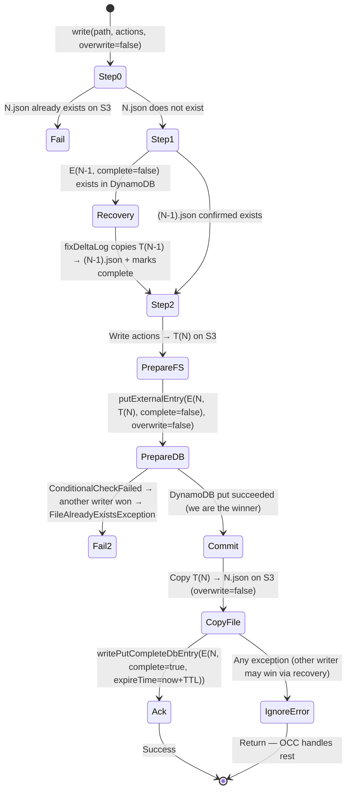
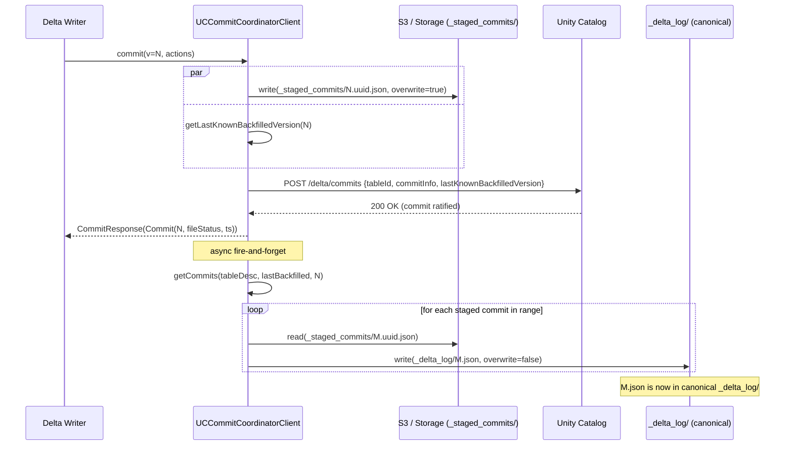

# delta-storage + delta-storage-s3-dynamodb

## Module Overview

`delta-storage` (`storage/`) is the foundation of all Delta Lake I/O. It defines two orthogonal
abstractions:

1. **`LogStore`** — a pluggable, storage-system-aware file I/O interface that provides the three
   invariants Delta correctness depends on: *atomic visibility*, *mutual exclusion on new-file
   creation*, and *consistent listing*. Every Delta writer calls `LogStore.write()` to land a commit
   file; every reader calls `LogStore.read()` and `LogStore.listFrom()` to discover and replay log
   entries.

2. **`CommitCoordinatorClient`** — an optional, higher-level commit routing interface that allows a
   third-party commit coordinator (e.g. Unity Catalog) to own version assignment, staging, and
   backfill for a Delta table. When a table is marked as a "coordinated-commit table", all commits
   are routed through this interface instead of going directly to the file system via `LogStore`.

`delta-storage-s3-dynamodb` (`storage-s3-dynamodb/`) is a separately published extension artifact
that adds a DynamoDB-backed `LogStore` implementation for multi-cluster S3 environments where S3
itself cannot provide cross-JVM mutual exclusion.

**Published artifact names:** `io.delta:delta-storage`, `io.delta:delta-storage-s3-dynamodb`

---

## Component: LogStore

### Interface Contract (`LogStore.java`)

`LogStore` is an abstract Java class (not an interface, so it can hold the `initHadoopConf` field).
Every subclass must accept a single `Configuration` constructor argument — this is how the Delta
runtime instantiates a LogStore reflectively.

```java
// storage/src/main/java/io/delta/storage/LogStore.java:57-143
public abstract class LogStore {
  public LogStore(Configuration initHadoopConf)  // required reflective constructor

  // Read: returns line-by-line iterator; caller must close
  public abstract CloseableIterator<String> read(Path path, Configuration hadoopConf) throws IOException;

  // Write: put-if-absent when overwrite=false; MUST throw FileAlreadyExistsException on conflict
  // MUST be atomic when isPartialWriteVisible() == false
  public abstract void write(Path path, Iterator<String> actions, Boolean overwrite,
                             Configuration hadoopConf) throws IOException;

  // List: returns FileStatus iterator for all files >= path (lexicographic), sorted ascending
  public abstract Iterator<FileStatus> listFrom(Path path, Configuration hadoopConf) throws IOException;

  // Resolve path to fully-qualified form on the physical FS
  public abstract Path resolvePathOnPhysicalStorage(Path path, Configuration hadoopConf) throws IOException;

  // Whether the storage system can expose partial writes to readers (true=yes, false=all-or-nothing)
  public abstract Boolean isPartialWriteVisible(Path path, Configuration hadoopConf) throws IOException;
}
```

The three correctness guarantees required of any `LogStore` implementation:
1. **Atomic visibility**: if `isPartialWriteVisible()` returns `false`, the file must not become
   visible until fully written (e.g. GCS preconditions, S3 all-or-nothing writes).
2. **Mutual exclusion**: only one writer may create a given file name; concurrent losers must see
   `FileAlreadyExistsException` (or be serialized so only one wins).
3. **Consistent listing**: once a file is written, all future `listFrom()` calls must include it.

### Class Hierarchy

```
LogStore (abstract)
└── HadoopFileSystemLogStore (abstract) — provides read() + listFrom() via Hadoop FileSystem API
    ├── HDFSLogStore              — HDFS with FileContext.rename() atomicity
    ├── AzureLogStore             — Azure ADLS with FileSystem.rename() atomicity
    ├── GCSLogStore               — GCS with precondition-based puts (written in new thread)
    ├── LocalLogStore             — Local FS with synchronized rename (test use only)
    ├── S3SingleDriverLogStore    — S3 single-JVM, PathLock-based exclusive writes
    └── BaseExternalLogStore (abstract, in delta-storage-s3-dynamodb)
        └── S3DynamoDBLogStore    — S3 multi-cluster, DynamoDB-backed mutual exclusion
```

### `HadoopFileSystemLogStore` — Shared Base

`HadoopFileSystemLogStore` (`storage/.../HadoopFileSystemLogStore.java`) provides the shared
implementations of `read()` and `listFrom()` using the Hadoop `FileSystem` API (not `FileContext`).

- **`read()`**: Opens a `FSDataInputStream`, wraps it in `BufferedReader`, returns a
  `LineCloseableIterator`.
- **`listFrom(path, hadoopConf)`**: Lists the parent directory, filters to entries whose name is
  lexicographically `>= path.getName()`, sorts, returns as an iterator.
- **`writeWithRename()`**: A protected helper for subclasses needing atomic-rename semantics.
  Writes to a temp path (`.{name}.{uuid}.tmp`), then renames to target. Throws
  `FileAlreadyExistsException` on `overwrite=false` conflict.

### `HDFSLogStore` — HDFS Implementation

`HDFSLogStore.java` extends `HadoopFileSystemLogStore` and uses the Hadoop `FileContext` API
(not `FileSystem`) for `write()` because `FileContext.rename()` is truly atomic for HDFS, whereas
`FileSystem.rename()` is not guaranteed to be.

Key behaviors:
- **`isPartialWriteVisible() → true`**: HDFS can expose partial writes during streaming, so callers
  must handle this.
- **Write algorithm**: write to temp path via `FileContext.create()`, then `FileContext.rename()`
  with `Rename.NONE` or `Rename.OVERWRITE`. On rename failure, deletes the temp file.
- **`RawLocalFileSystem` guard**: if the path resolves to a local FS (e.g. in tests),
  the entire `write()` call is `synchronized(this)` to compensate for the fact that
  `RawLocalFileSystem.rename()` does not throw when the target exists.
- **`msyncIfSupported()`**: After a successful rename, reflectively calls `DistributedFileSystem.msync()`
  via reflection to force consistency between the `FileContext` write client and the `FileSystem`
  read client (workaround for HDFS Observer NameNode setups). Failures in `msync` are silently
  swallowed since it is best-effort.
- **CRC cleanup**: Removes `.<filename>.crc` sidecar files left by HDFS checksumming after
  rename (workaround for HADOOP-16255).

```java
// storage/src/main/java/io/delta/storage/HDFSLogStore.java:83-143
// Key pattern: write temp → rename to target (FileContext, so atomic for HDFS)
private void writeInternal(Path path, Iterator<String> actions, Boolean overwrite,
                           Configuration hadoopConf) throws IOException {
    final FileContext fc = FileContext.getFileContext(path.toUri(), hadoopConf);
    if (!overwrite && fc.util().exists(path)) throw new FileAlreadyExistsException(path.toString());
    final Path tempPath = createTempPath(path);
    final FSDataOutputStream stream = fc.create(tempPath, EnumSet.of(CreateFlag.CREATE), ...);
    // ... write actions ...
    stream.close();
    fc.rename(tempPath, path, overwrite ? Rename.OVERWRITE : Rename.NONE);
    tryRemoveCrcFile(fc, tempPath);  // HADOOP-16255 workaround
    msyncIfSupported(path, hadoopConf);  // Observer NameNode sync
}
```

### `AzureLogStore` — Azure ADLS Implementation

`AzureLogStore.java` simply delegates `write()` to the shared `writeWithRename()` from
`HadoopFileSystemLogStore`. Azure ADLS supports atomic rename without overwrite, so this is
sufficient. `isPartialWriteVisible() → true`.

### `GCSLogStore` — Google Cloud Storage Implementation

`GCSLogStore.java` uses GCS's native precondition mechanism (HTTP 412) for mutual exclusion instead
of rename. Key differences from HDFS/Azure:

- **Write is dispatched to a new thread** via `ThreadUtils.runInNewThread()`. This is a workaround
  for a GCS Hadoop connector bug where the current thread being interrupted causes an incomplete
  file upload. The new thread cannot be interrupted.
- GCS's connector throws `org.apache.hadoop.fs.FileAlreadyExistsException` from `fs.create()` if
  the object already exists and overwrite=false. A subsequent concurrent write during `stream.close()`
  returns HTTP 412 "Precondition Failed" — both are mapped to `java.nio.file.FileAlreadyExistsException`.
- **`isPartialWriteVisible() → false`**: GCS object writes are all-or-nothing.

```java
// storage/src/main/java/io/delta/storage/GCSLogStore.java:86-121
Callable body = () -> {
    FSDataOutputStream stream = fs.create(path, overwrite);  // may throw FileAlreadyExists
    while (actions.hasNext()) { stream.write(...); }
    stream.close();  // HTTP 412 thrown here if raced by concurrent writer
    return "";
};
ThreadUtils.runInNewThread("delta-gcs-logstore-write", true, body);
```

### `S3SingleDriverLogStore` — S3 Single-JVM Implementation

`S3SingleDriverLogStore.java` provides atomic commit semantics for S3 within a **single JVM**
(single Spark driver). It does NOT work for multi-cluster scenarios.

Key implementation details:
- **`PathLock`** (a `ConcurrentHashMap<Path, Object>` with wait/notify): acquired before each write,
  ensures only one thread per JVM writes to a given path at a time.
- S3's Hadoop connectors (S3A) do not expose atomic rename. S3SingleDriverLogStore relies on S3's
  **all-or-nothing object PUT semantics**: an `fs.create(path, overwrite)` with `overwrite=false`
  will throw `FileAlreadyExistsException` if the object already exists.
- **Fast `listFrom`**: if `delta.enableFastS3AListFrom=true` in Hadoop conf, uses `S3LogStoreUtil.s3ListFromArray()`
  which passes a `startAfter` parameter to S3 LIST to avoid listing from the beginning of the
  directory.
- **User-info stripping**: paths are normalized by removing any `userInfo` from the URI (avoids lock
  misses due to credential-embedded URIs).
- **`isPartialWriteVisible() → false`**: S3 PUTs are all-or-nothing.

```java
// storage/src/main/java/io/delta/storage/S3SingleDriverLogStore.java:147-180
public void write(Path path, Iterator<String> actions, Boolean overwrite, Configuration conf)
    throws IOException {
    final Path resolvedPath = resolvePath(fs, path);  // strips userInfo
    pathLock.acquire(resolvedPath);  // JVM-wide per-path exclusive lock
    try {
        if (fs.exists(resolvedPath) && !overwrite)
            throw new FileAlreadyExistsException(...);
        CountingOutputStream stream = new CountingOutputStream(fs.create(resolvedPath, overwrite));
        // ... write lines ...
        stream.close();
    } finally {
        pathLock.release(resolvedPath);
    }
}
```

> [!NOTE] Why S3SingleDriverLogStore is not safe for multi-cluster
> The `PathLock` only serializes writers within the same JVM. With multiple Spark drivers (e.g. in
> a shared cluster), two JVMs can each acquire their JVM-local lock for the same path, then race on
> the actual S3 PUT. The loser does not get a reliable `FileAlreadyExistsException` in all S3
> connector versions. Use `S3DynamoDBLogStore` for multi-cluster S3 deployments.

### `LocalLogStore` — Local FileSystem (Test Use Only)

`LocalLogStore.java` wraps `writeWithRename()` with `synchronized(this)` for the same reason
`HDFSLogStore` does: `RawLocalFileSystem.rename()` doesn't throw on target-already-exists.
Documented as not suitable for production.

### LogStore Configuration and Instantiation

LogStore implementations are selected at runtime via Hadoop configuration properties. The Spark
connector (`delta-spark-v1`) reads these properties during `DeltaLog` initialization.

| Config Key | Description |
|---|---|
| `spark.delta.logStore.class` | Global default LogStore class (legacy) |
| `spark.delta.logStore.<scheme>.impl` | Per-scheme override, e.g. `spark.delta.logStore.s3a.impl` |
| `spark.delta.logStore.gs.impl` | GCS scheme override |
| `spark.delta.logStore.abfs.impl` | Azure scheme override |

The Kernel (`delta-kernel-defaults`) instantiates LogStore via `LogStoreProvider` which follows
the same precedence rules. Both paths use reflection to call the `Configuration`-arg constructor.

Default scheme mappings (from Spark connector defaults):
- `s3`, `s3a`, `s3n` → `S3SingleDriverLogStore`
- `gs` → `GCSLogStore`
- `abfs`, `abfss`, `adl`, `wasb`, `wasbs` → `AzureLogStore`
- `hdfs`, `viewfs` → `HDFSLogStore`
- `file` → `LocalLogStore`

---

## Component: CommitCoordinator API (`storage/src/main/java/io/delta/storage/commit/`)

### Purpose

The `CommitCoordinatorClient` API enables **coordinated commits**: a mode where version assignment
and commit acknowledgment are handled by a third-party service rather than being determined purely
by file-system put-if-absent semantics. This allows catalog systems (like Unity Catalog) to:
- Assign commit versions centrally (no version-namespace collisions across writers)
- Stage commits (`_staged_commits/*.uuid.json`) before they appear in the canonical log
- Control when staged commits are *backfilled* into the canonical `_delta_log/N.json` path

This is an opt-in protocol feature (`delta.coordinatedCommits.commitCoordinator-preview` metadata
property). Tables without this property continue to use direct LogStore commits.

### `CommitCoordinatorClient` Interface

```java
// storage/src/main/java/io/delta/storage/commit/CommitCoordinatorClient.java:42-161
public interface CommitCoordinatorClient {

  // Register table with coordinator during conversion from FS-table to coordinated-commit table.
  // Returns tableConf (Map<String,String>) to be stored in table metadata.
  Map<String, String> registerTable(
    Path logPath, Optional<TableIdentifier> tableIdentifier,
    long currentVersion, AbstractMetadata currentMetadata, AbstractProtocol currentProtocol);

  // Stage a new commit file at _staged_commits/N.uuid.json and notify coordinator.
  CommitResponse commit(
    LogStore logStore, Configuration hadoopConf, TableDescriptor tableDescriptor,
    long commitVersion, Iterator<String> actions, UpdatedActions updatedActions)
    throws CommitFailedException;

  // Return unbackfilled commits in [startVersion, endVersion] range tracked by coordinator.
  GetCommitsResponse getCommits(
    TableDescriptor tableDescriptor, Long startVersion, Long endVersion);

  // Copy staged commit files from _staged_commits/ into _delta_log/N.json (the canonical log).
  void backfillToVersion(
    LogStore logStore, Configuration hadoopConf, TableDescriptor tableDescriptor,
    long version, Long lastKnownBackfilledVersion) throws IOException;

  // True if two client instances are semantically equivalent (same endpoint/config).
  boolean semanticEquals(CommitCoordinatorClient other);
}
```

### DTOs

**`Commit`** (`Commit.java`):

| Field | Type | Description |
|---|---|---|
| `version` | `long` | Delta commit version number |
| `fileStatus` | `FileStatus` | Hadoop FileStatus of the staged commit file |
| `commitTimestamp` | `long` | Wall-clock timestamp at commit time (milliseconds) |

Immutable; `withFileStatus()` and `withCommitTimestamp()` return new instances.

**`CommitResponse`** (`CommitResponse.java`): Wraps a `Commit`. Returned by `commit()`.

**`GetCommitsResponse`** (`GetCommitsResponse.java`):

| Field | Type | Description |
|---|---|---|
| `commits` | `List<Commit>` | Unbackfilled commits in the requested range, ascending version order |
| `latestTableVersion` | `long` | Max version ratified by coordinator; `-1` if none ever ratified |

**`UpdatedActions`** (`UpdatedActions.java`): Passed to `commit()` to carry delta metadata/protocol
changes alongside the actions iterator. Fields: `commitInfo`, `newMetadata`, `newProtocol`,
`oldMetadata`, `oldProtocol`.

**`TableDescriptor`** (`TableDescriptor.java`): Uniquely identifies a table for coordinator calls.
Fields: `logPath` (Path), `tableIdentifier` (Optional), `tableConf` (Map — the coordinator's own
opaque key-value pairs stored in table metadata).

**`TableIdentifier`** (`TableIdentifier.java`): Catalog identity `(namespace[], name)`.

**`CommitFailedException`** (`CommitFailedException.java`): Two boolean flags control retry semantics:

| retryable | conflict | Meaning |
|---|---|---|
| false | false | Fatal error (auth failure, bad config) |
| false | true | Permanent conflict (multi-table transaction) |
| true | false | Transient error (network hiccup) — retry same version |
| true | true | Physical conflict — rebase on latest and retry |

### `CoordinatedCommitsUtils` — Path Helpers

`CoordinatedCommitsUtils.java` is a pure-static utility class with no constructor.

Key constants:
- `COMMIT_SUBDIR = "_staged_commits"` — subdirectory for unbackfilled commit files
- `COORDINATED_COMMITS_COORDINATOR_NAME_KEY = "delta.coordinatedCommits.commitCoordinator-preview"`
- `COORDINATED_COMMITS_COORDINATOR_CONF_KEY = "delta.coordinatedCommits.commitCoordinatorConf-preview"`
- `COORDINATED_COMMITS_TABLE_CONF_KEY = "delta.coordinatedCommits.tableConf-preview"`

Key methods:

| Method | Description |
|---|---|
| `generateUnbackfilledDeltaFilePath(logPath, version)` | Returns `_staged_commits/00000N.uuid.json` |
| `getBackfilledDeltaFilePath(logPath, version)` | Returns `_delta_log/00000N.json` |
| `writeUnbackfilledCommitFile(logStore, conf, logPath, version, actions, uuid)` | Writes staged file via `logStore.write(overwrite=true)` — UUID uniqueness eliminates write conflicts |
| `getCoordinatorName(metadata)` | Extracts `commitCoordinator-preview` from metadata config |
| `getCoordinatorConf(metadata)` | Parses `commitCoordinatorConf-preview` JSON map |
| `getTableConf(metadata)` | Parses `tableConf-preview` JSON map |
| `isCoordinatedCommitsToFSConversion(version, updatedActions)` | True if old metadata had a coordinator and new metadata does not (downgrade commit) |

> [!NOTE] Staged commits are written with `overwrite=true`
> Unlike canonical `N.json` commits (which use `overwrite=false` for mutual exclusion), staged
> commit files are written with `overwrite=true`. This is safe because the UUID suffix makes
> collisions statistically impossible. The coordinator (not the file system) provides mutual
> exclusion on version assignment.

### Coordinated Commit vs. Direct LogStore Commit

```mermaid
graph TD
    W[Delta Writer / OptimisticTransaction] -->|"isCoordinatedCommitsTable?"| BRANCH{Branch}
    BRANCH -->|No: standard table| LS[LogStore.write(N.json, overwrite=false)]
    BRANCH -->|Yes: coordinated-commit table| CC[CommitCoordinatorClient.commit()]
    CC -->|Step 1| SF[Write to _staged_commits/N.uuid.json via LogStore]
    CC -->|Step 2| UC[Register commit with coordinator service]
    UC -->|Async| BF[backfillToVersion: copy N.uuid.json → N.json via LogStore]
    LS --> DONE[Commit visible in _delta_log/N.json]
    BF --> DONE
```

In the coordinated path:
- Writers never write directly to `_delta_log/N.json`.
- Readers must check `_staged_commits/` for any unbackfilled commits (via `getCommits()`) to get
  the full picture of the table's history.
- Backfill eventually copies staged commits to `_delta_log/N.json`, making them visible to standard
  FileSystem-based readers.

---

## Component: UCCommitCoordinatorClient (`storage/.../uccommitcoordinator/`)

### Purpose

`UCCommitCoordinatorClient` is the concrete `CommitCoordinatorClient` implementation that routes
Delta commits through Unity Catalog's REST control plane. Used for UC-managed tables in both the
Spark connector (`UCCommitCoordinatorBuilder` in `delta-spark-v1`) and the Kernel path
(`UCCatalogManagedClient` in `delta-kernel-unitycatalog`).

### Key Constants and Configuration

| Constant | Value | Description |
|---|---|---|
| `UC_TABLE_ID_KEY` | `io.unitycatalog.tableId` | UC table UUID stored in `tableConf` |
| `UC_METASTORE_ID_KEY` | `ucMetastoreId` | UC metastore UUID stored in `coordinatorConf` |
| `SUPPORTED_READ_VERSION` | 0 | Protocol read version this client supports |
| `SUPPORTED_WRITE_VERSION` | 0 | Protocol write version this client supports |
| `MAX_RETRIES_ON_TRANSIENT_ERROR` | 15 | Max retries on `IOException` from UC REST |
| `TRANSIENT_ERROR_RETRY_INITIAL_WAIT_MS` | 100ms | Initial exponential backoff delay |
| `TRANSIENT_ERROR_RETRY_MAX_WAIT_MS` | 60,000ms (1 min) | Max backoff cap (~8 min total) |
| `BACKFILL_LISTING_OFFSET` | 100 | Look back this many versions during last-backfilled discovery |
| `THREAD_POOL_SIZE` | 20 | Daemon thread pool for async backfill |

### `registerTable()` — UC-Specific Behavior

For UC, `registerTable()` is a **no-op registration**. UC tables are pre-configured during table
creation (the UC table ID is injected into metadata before the first `registerTable` call). This
method only validates that `UC_TABLE_ID_KEY` and `UC_METASTORE_ID_KEY` are present in metadata —
throws `IllegalStateException` if either is missing.

### `commit()` — Multi-Step Async Commit Algorithm

The `commitImpl()` method executes a 4-step parallel commit:

```mermaid
sequenceDiagram
    participant W as Delta Writer (Spark/Kernel)
    participant UCC as UCCommitCoordinatorClient
    participant LS as LogStore
    participant UC as Unity Catalog REST
    participant BF as Async Backfill Thread

    W->>UCC: commit(logStore, conf, tableDesc, version, actions, updatedActions)
    Note over UCC: version 0 rejected — must go via filesystem
    par Parallel execution
        UCC->>LS: writeUnbackfilledCommitFile(_staged_commits/N.uuid.json, overwrite=true)
        Note over LS: UUID ensures no conflict
    and
        UCC->>UCC: getLastKnownBackfilledVersion(version)
        Note over UCC: lists last 100 commits; falls back to UC getCommits if not found
    end
    UCC->>UC: commit(tableId, tableUri, commitFile, lastKnownBackfilledVersion, disown, ...)
    Note over UC: Assigns version N, responds 200 OK or error
    alt UC returns 409 Conflict + retryable=true
        UCC->>LS: read(backfilledPath) & read(unbackfilledPath)
        Note over UCC: hasSameContent() check — prevents duplicate data on retry
        alt content matches → already committed
            UCC->>UCC: break (idempotent success)
        else content differs → real conflict
            UCC->>W: throw CommitFailedException(retryable=true, conflict=true)
        end
    else UC returns 429 Too Many Requests (CommitLimitReachedException)
        UCC->>UCC: attemptFullBackfill() — sync backfill all staged commits
        UCC->>UC: commit(..., disown=true) — notify UC of backfill, free space
        UCC->>UC: retry original commit
    end
    UCC->>BF: executeAsync(backfillToVersion)
    Note over BF: copies all staged N.uuid.json → N.json via LogStore.write(overwrite=false)
    UCC->>W: CommitResponse(Commit(version, fileStatus, timestamp))
```

**Idempotency under network failures** (`hasSameContent()`): If the client writes commit V
but the network breaks before receiving UC's acknowledgment, a retry will get a 409 conflict
(because V was already committed by a concurrent writer who built on it). The `hasSameContent()`
check compares the size and content of `N.json` (the backfilled file) against the staged
`N.uuid.json` file. If they match, the original commit succeeded silently — no rebase needed.
This prevents duplicate data from being written.

### `backfillToVersion()` — Backfill Algorithm

1. Validate that `lastKnownBackfilledVersion.json` exists on the file system.
2. Call `getCommits(tableDesc, lastKnownBackfilledVersion, version)` to get staged commit list from UC.
3. For each staged commit, call `backfillSingleCommit()`:
   - Read staged file via `logStore.read(fileStatus.getPath())`.
   - Write to canonical path via `logStore.write(N.json, overwrite=false)` (put-if-absent).
   - `FileAlreadyExistsException` is silently ignored (another writer already backfilled).
   - On any other exception: log warning, stop backfilling, return false (best-effort).

### `getLastKnownBackfilledVersion()` — Discovery Algorithm

Finding the last backfilled version avoids O(all-versions) listing:

1. List delta log files starting from `max(0, commitVersion - 100)` via `logStore.listFrom()`.
2. Filter to files matching the canonical `N.json` pattern; take the highest version found.
3. If no backfilled files found in the last 100 versions (unusual), fall back to `getCommits(null, null)`
   and find the minimum unbackfilled version — the version just before that must be backfilled.

### `UCClient` Interface and `UCTokenBasedRestClient`

`UCClient` is the seam between `UCCommitCoordinatorClient` and the actual HTTP transport. Its three
methods:

```java
// storage/src/main/java/io/delta/storage/commit/uccommitcoordinator/UCClient.java
String getMetastoreId() throws IOException;
void commit(String tableId, URI tableUri, Optional<Commit> commit,
            Optional<Long> lastKnownBackfilledVersion, boolean disown,
            Optional<AbstractMetadata> newMetadata, Optional<AbstractProtocol> newProtocol,
            Optional<UniformMetadata> uniform) throws IOException, CommitFailedException, UCCommitCoordinatorException;
GetCommitsResponse getCommits(String tableId, URI tableUri,
            Optional<Long> startVersion, Optional<Long> endVersion)
            throws IOException, UCCommitCoordinatorException;
void close() throws IOException;  // releases connection pool
```

`UCTokenBasedRestClient` (`UCTokenBasedRestClient.java`) is the production implementation:
- Uses the Unity Catalog Java SDK (`io.unitycatalog.client`): `DeltaCommitsApi` + `MetastoresApi`.
- Authentication: `TokenProvider` (bearer token, dynamically refreshed per-request).
- HTTP status → exception mapping:

| HTTP Status | Exception Type | `retryable` | `conflict` |
|---|---|---|---|
| 400 Bad Request | `CommitFailedException` | false | false |
| 404 Not Found | `InvalidTargetTableException` | — | — |
| 409 Conflict | `CommitFailedException` | true | true |
| 429 Too Many Requests | `CommitLimitReachedException` | — | — |
| other | `CommitFailedException` | true | false |

Metadata translation: `AbstractMetadata → DeltaMetadata` (description + configuration properties).
Schema conversion from Delta schema string to UC `ColumnInfo` objects is explicitly noted as **not
implemented** in the current code (`UCTokenBasedRestClient.java:292-294`).

UniForm (Iceberg) metadata: `IcebergMetadata → DeltaUniformIceberg` — carries
`metadataLocation`, `convertedDeltaVersion`, `convertedDeltaTimestamp`.

`close()` nulls out both API instances, allowing the underlying connection pool GC to free
resources.

---

## Component: S3 DynamoDB Multi-Cluster Store (`storage-s3-dynamodb/`)

### Problem Statement

S3 does not provide cross-JVM mutual exclusion for object creation. `S3SingleDriverLogStore` solves
this within one JVM via `PathLock`, but multiple Spark drivers (e.g. separate cluster nodes) can
race on the same commit path. `S3DynamoDBLogStore` externalizes the mutual exclusion to a
DynamoDB table that all writers share.

### `BaseExternalLogStore` — Three-Phase Commit Protocol

`BaseExternalLogStore` (`storage-s3-dynamodb/.../BaseExternalLogStore.java`) is an abstract class
implementing the prepare-commit-acknowledge (PCA) protocol over any external coordination store:

**Write algorithm** (notation: N = target version, T(N) = temp file, E(N) = DynamoDB entry):



**Key invariants:**
- The DynamoDB `putItem` with `expected(fileName=not_exists)` acts as the distributed mutex.
  Only one writer across all JVMs/clusters wins; losers get `ConditionalCheckFailedException` →
  `FileAlreadyExistsException`.
- If the winner crashes after writing T(N) but before writing N.json, the `complete=false` entry
  in DynamoDB signals recovery. Any subsequent reader or writer that sees this entry calls
  `fixDeltaLog()` to complete the copy.
- `isPartialWriteVisible() → false`.

**TTL / expiration delay**: Completed entries are given a 1-day TTL (`DEFAULT_EXTERNAL_ENTRY_EXPIRATION_DELAY_SECONDS = 86400`).
This prevents a race where (1) the entry is deleted too early, (2) a subsequent writer checks for
`N.json` before S3 consistency propagates, and (3) erroneously re-writes it with different content.

**`listFrom()` recovery**: Before delegating to `super.listFrom()`, the `BaseExternalLogStore`
checks DynamoDB for the latest entry for the table. If `complete=false`, it calls `fixDeltaLog()`
to ensure the staged commit is visible before the list result is returned. This is critical for
readers that need to see all committed versions.

```java
// storage-s3-dynamodb/src/main/java/io/delta/storage/BaseExternalLogStore.java:129-152
public Iterator<FileStatus> listFrom(Path path, Configuration hadoopConf) throws IOException {
    if (isDeltaLogPath(resolvedPath)) {
        Optional<ExternalCommitEntry> entry = getLatestExternalEntry(tablePath);
        if (entry.isPresent() && !entry.get().complete) {
            fixDeltaLog(fs, entry.get());  // recover incomplete write before listing
        }
    }
    return super.listFrom(path, hadoopConf);  // consistent list after recovery
}
```

### `S3DynamoDBLogStore` — DynamoDB Implementation

`S3DynamoDBLogStore.java` implements the three abstract methods of `BaseExternalLogStore`:
`putExternalEntry()`, `getExternalEntry()`, `getLatestExternalEntry()`.

**DynamoDB table schema:**

| Attribute | Type | Role |
|---|---|---|
| `tablePath` | String (HASH key) | Absolute S3 path to the Delta table root |
| `fileName` | String (RANGE key) | Commit file name, e.g. `00000000000000000010.json` |
| `tempPath` | String | Relative path of temp file under `_delta_log/` |
| `complete` | String (`"true"` / `"false"`) | Whether copy T(N) → N.json has completed |
| `expireTime` | Number | Unix epoch seconds for TTL (DynamoDB native TTL field) |

**`putExternalEntry(entry, overwrite=false)`**: Issues a DynamoDB `PutItem` with
`Expected: {fileName: {Exists: false}}` for exclusive creation. `ConditionalCheckFailedException`
is caught and re-thrown as `FileAlreadyExistsException`.

**`getExternalEntry(tablePath, fileName)`**: `GetItem` with consistent read for the exact
`(tablePath, fileName)` key.

**`getLatestExternalEntry(tablePath)`**: `Query` with `scanIndexForward=false, limit=1` — returns
the lexicographically last entry for the table (which is the highest version number due to
zero-padded file names).

**`read()` — retry wrapper**: S3 concurrent recovery operations can cause `ETag` changes on `N.json`
(the file is re-uploaded by the recovery path). `S3DynamoDBLogStore` wraps `super.read()` with
`RetryableCloseableIterator` to transparently retry on `RemoteFileChangedException` (configurable
via `read.retries`, default = `RetryableCloseableIterator.DEFAULT_MAX_RETRIES`).

**Table auto-creation**: On construction, `tryEnsureTableExists()` calls `describeTable()` and if
not found, calls `createTable()` with provisioned throughput (defaults 5 RCU / 5 WCU). Polls until
status = `ACTIVE` or times out after 20 retries × 1 second.

### `ExternalCommitEntry` DTO

```java
// storage-s3-dynamodb/src/main/java/io/delta/storage/ExternalCommitEntry.java
public final class ExternalCommitEntry {
    public final Path tablePath;     // absolute path to Delta table root
    public final String fileName;    // e.g. "00000000000000000010.json"
    public final String tempPath;    // relative to _delta_log/, e.g. ".tmp/N.json.uuid"
    public final boolean complete;   // true iff T(N) has been copied to N.json
    public final Long expireTime;    // epoch seconds for TTL; null if incomplete

    public ExternalCommitEntry asComplete(long delaySeconds); // returns new instance with complete=true
    public Path absoluteFilePath();  // -> tablePath/_delta_log/fileName
    public Path absoluteTempPath();  // -> tablePath/_delta_log/tempPath
}
```

### When to Use `S3DynamoDBLogStore` vs. `S3SingleDriverLogStore`

| Scenario | Recommended Store |
|---|---|
| Single Spark driver writing a Delta table on S3 | `S3SingleDriverLogStore` |
| Multiple Spark drivers / concurrent writers on S3 | `S3DynamoDBLogStore` |
| HDFS, Azure ADLS, GCS | Use the dedicated LogStore for those file systems |
| UC-managed tables (coordinated commits) | `CommitCoordinatorClient` (UC path); LogStore still used for backfill |

---

## Data Flow Diagrams

### LogStore Atomic Write Flow (put-if-absent semantics)

```mermaid
graph TD
    W[Writer: OptimisticTransaction.commit()] -->|"write(N.json, overwrite=false)"| LS[LogStore impl]
    LS --> IMPL{Storage system?}
    IMPL -->|HDFS| FC["FileContext.rename(temp → N.json)\nAtomic HDFS rename"]
    IMPL -->|Azure| FSR["FileSystem.rename(temp → N.json)\nAtomic Azure rename"]
    IMPL -->|GCS| GCS_PUT["fs.create(N.json, overwrite=false)\nHTTP 412 = concurrent conflict"]
    IMPL -->|S3 single-JVM| S3LOCK["PathLock.acquire(N.json)\nfs.create(N.json, overwrite=false)"]
    IMPL -->|S3 multi-cluster| DDB["DynamoDB putItem(E(N), expected=not_exists)\n+ copy T(N) → N.json"]
    FC --> WIN{Win?}
    FSR --> WIN
    GCS_PUT --> WIN
    S3LOCK --> WIN
    DDB --> WIN
    WIN -->|Yes| OK[N.json is canonical commit\nSnapshot cache updated]
    WIN -->|No: FileAlreadyExistsException| RETRY[OCC retry: increment version, conflict-check]
```

### Coordinated Commit Lifecycle (staged → backfilled)



---

## Key APIs — Function Signatures Table

### `LogStore`

| Method | Signature | Throws |
|---|---|---|
| `read` | `CloseableIterator<String> read(Path path, Configuration conf)` | `IOException` |
| `write` | `void write(Path path, Iterator<String> actions, Boolean overwrite, Configuration conf)` | `IOException`, `FileAlreadyExistsException` |
| `listFrom` | `Iterator<FileStatus> listFrom(Path path, Configuration conf)` | `IOException` |
| `resolvePathOnPhysicalStorage` | `Path resolvePathOnPhysicalStorage(Path path, Configuration conf)` | `IOException` |
| `isPartialWriteVisible` | `Boolean isPartialWriteVisible(Path path, Configuration conf)` | `IOException` |

### `CommitCoordinatorClient`

| Method | Signature | Throws |
|---|---|---|
| `registerTable` | `Map<String,String> registerTable(Path logPath, Optional<TableIdentifier> tableId, long currentVersion, AbstractMetadata meta, AbstractProtocol proto)` | — |
| `commit` | `CommitResponse commit(LogStore ls, Configuration conf, TableDescriptor td, long version, Iterator<String> actions, UpdatedActions ua)` | `CommitFailedException` |
| `getCommits` | `GetCommitsResponse getCommits(TableDescriptor td, Long startVersion, Long endVersion)` | — |
| `backfillToVersion` | `void backfillToVersion(LogStore ls, Configuration conf, TableDescriptor td, long version, Long lastKnownBackfilled)` | `IOException` |
| `semanticEquals` | `boolean semanticEquals(CommitCoordinatorClient other)` | — |

### `UCClient`

| Method | Signature | Throws |
|---|---|---|
| `getMetastoreId` | `String getMetastoreId()` | `IOException` |
| `commit` | `void commit(String tableId, URI tableUri, Optional<Commit> commit, Optional<Long> lastBackfilled, boolean disown, Optional<AbstractMetadata> meta, Optional<AbstractProtocol> proto, Optional<UniformMetadata> uniform)` | `IOException`, `CommitFailedException`, `UCCommitCoordinatorException` |
| `getCommits` | `GetCommitsResponse getCommits(String tableId, URI tableUri, Optional<Long> startVersion, Optional<Long> endVersion)` | `IOException`, `UCCommitCoordinatorException` |
| `close` | `void close()` | `IOException` |

---

## Configuration Reference

### LogStore Selection (Spark + Kernel)

| Property | Description | Default |
|---|---|---|
| `spark.delta.logStore.class` | Global LogStore class (overridden by per-scheme setting) | Scheme-based default |
| `spark.delta.logStore.<scheme>.impl` | Per-scheme LogStore, e.g. `spark.delta.logStore.s3a.impl` | See defaults above |
| `delta.enableFastS3AListFrom` | Enable S3A `startAfter` listing optimization in `S3SingleDriverLogStore` | `false` |

### S3DynamoDBLogStore Configuration

All keys can be prefixed with `spark.io.delta.storage.S3DynamoDBLogStore.` or `io.delta.storage.S3DynamoDBLogStore.`
(having both with different values throws `IllegalArgumentException`).

| Short Key | Full Key (base prefix example) | Default | Description |
|---|---|---|---|
| `ddb.tableName` | `io.delta.storage.S3DynamoDBLogStore.ddb.tableName` | `delta_log` | DynamoDB table name for coordination |
| `ddb.region` | `io.delta.storage.S3DynamoDBLogStore.ddb.region` | `us-east-1` | AWS region for DynamoDB client |
| `credentials.provider` | `io.delta.storage.S3DynamoDBLogStore.credentials.provider` | `DefaultAWSCredentialsProviderChain` | AWS credentials provider class |
| `ddb.ttl` | `io.delta.storage.S3DynamoDBLogStore.ddb.ttl` | 86400 (1 day) | TTL in seconds for completed DDB entries |
| `provisionedThroughput.rcu` | `io.delta.storage.S3DynamoDBLogStore.provisionedThroughput.rcu` | `5` | Read capacity units (table auto-creation only) |
| `provisionedThroughput.wcu` | `io.delta.storage.S3DynamoDBLogStore.provisionedThroughput.wcu` | `5` | Write capacity units (table auto-creation only) |
| `read.retries` | `io.delta.storage.S3DynamoDBLogStore.read.retries` | `RetryableCloseableIterator.DEFAULT_MAX_RETRIES` | Retries on ETag change during read |

### Coordinated Commits Table Properties (stored in Delta table metadata)

| Property | Description |
|---|---|
| `delta.coordinatedCommits.commitCoordinator-preview` | Name of coordinator (e.g. `unity-catalog`) |
| `delta.coordinatedCommits.commitCoordinatorConf-preview` | JSON map of coordinator config (e.g. `{"ucMetastoreId": "..."}`) |
| `delta.coordinatedCommits.tableConf-preview` | JSON map of table-specific config (e.g. `{"io.unitycatalog.tableId": "..."}`) |

### UCCommitCoordinatorClient Retry Parameters

| Constant | Value | Configurable |
|---|---|---|
| `MAX_RETRIES_ON_TRANSIENT_ERROR` | 15 | No (source constant) |
| `TRANSIENT_ERROR_RETRY_INITIAL_WAIT_MS` | 100ms | No |
| `TRANSIENT_ERROR_RETRY_MAX_WAIT_MS` | 60,000ms | No |
| `THREAD_POOL_SIZE` | 20 daemon threads | No (static initializer) |
| `BACKFILL_LISTING_OFFSET` | 100 | No (source constant) |

---

## Cross-Cutting Concerns

### Dual Integration: Spark and Kernel

`delta-storage` ships as a standalone JAR and is consumed by both:

- **`delta-spark-v1`**: The Spark connector's `DeltaLog` holds a `LogStore` instance per table.
  `LogStore` selection is determined by `LogStoreProvider` based on the table path scheme.
  The `coordinatedcommits/` component in `delta-spark-v1` wraps `CommitCoordinatorClient` in a
  Spark-specific adapter layer (`TableCommitCoordinatorClient`).

- **`delta-kernel-defaults`**: `DefaultEngine` uses `DefaultFileSystemClient` (backed by `LogStore`)
  for all delta log I/O. Kernel-based writers go through `UCCatalogManagedCommitter` for
  UC-managed tables, or the default filesystem-based commit path for unmanaged tables.

- **`delta-flink`**: Uses `DefaultEngine` → `delta-kernel-defaults` → `delta-storage`. No direct
  dependency on `delta-spark-v1` at all.

### `PathLock` — Intra-JVM Serialization

`PathLock` (`storage/src/main/java/io/delta/storage/internal/PathLock.java`) is a
`ConcurrentHashMap<Path, Object>` used as a per-path mutex. `acquire()` uses `putIfAbsent()` to
atomically claim a slot; on contention, waits on the existing lock object. `release()` removes the
entry and calls `notifyAll()`. Used by:
- `S3SingleDriverLogStore` — exclusive per-path writes
- `BaseExternalLogStore` — prevents concurrent recovery operations from conflicting within one JVM

The two use sites use separate `pathLock` static instances. There is no deadlock risk because
`BaseExternalLogStore` uses different path keys for the write lock (N.json) and the recovery lock
(N-1.json).

### Error Handling Philosophy

| Layer | Error | Behavior |
|---|---|---|
| `LogStore.write(overwrite=false)` | File already exists | Throw `java.nio.file.FileAlreadyExistsException` (callers detect conflict) |
| `HDFSLogStore.write()` | Temp write fails | Delete temp file in `finally` block |
| `GCSLogStore.write()` | Write thread interrupted | Propagate as `InterruptedIOException` |
| `BaseExternalLogStore.write()` | Step 3/4 fails | Silently caught — recovery handles it; errors only stop the current writer |
| `UCCommitCoordinatorClient.commit()` | `CommitLimitReachedException` | Attempt full sync backfill to free UC space, then retry |
| `UCCommitCoordinatorClient.backfillSingleCommit()` | Non-fatal exception | Log warning, stop backfilling (best-effort); fatal exceptions propagate |
| `S3DynamoDBLogStore.read()` | `RemoteFileChangedException` | Transparent retry via `RetryableCloseableIterator` |

---

## Diagram Opportunity Flag

> FLAG FOR ORCHESTRATOR: The interaction between [[delta-storage]] (`CommitCoordinatorClient`) and
> [[delta-spark-v1]] (`spark.coordinatedcommits` component) — specifically how
> `TableCommitCoordinatorClient` wraps `CommitCoordinatorClient` and how the Spark `OptimisticTransaction`
> decides to route through it — warrants a sequence diagram in the module manifest or spark module doc.
> Suggested diagram type: sequenceDiagram.
> Relevant files: spark/src/main/scala/org/apache/spark/sql/delta/coordinatedcommits/TableCommitCoordinatorClient.scala,
> storage/src/main/java/io/delta/storage/commit/CommitCoordinatorClient.java.

> FLAG FOR ORCHESTRATOR: The interaction between [[delta-kernel-defaults]] (`DefaultEngine`'s internal commit coordinator wiring)
> and [[delta-storage]] (`CommitCoordinatorClient`) is a bridging adapter pattern that may warrant
> a diagram showing how the Kernel engine SPI maps to the storage-level commit API.
> Suggested diagram type: graph TD.
> Relevant files: kernel/kernel-defaults/src/main/java/io/delta/kernel/defaults/internal/ (commit coordinator adapter).
