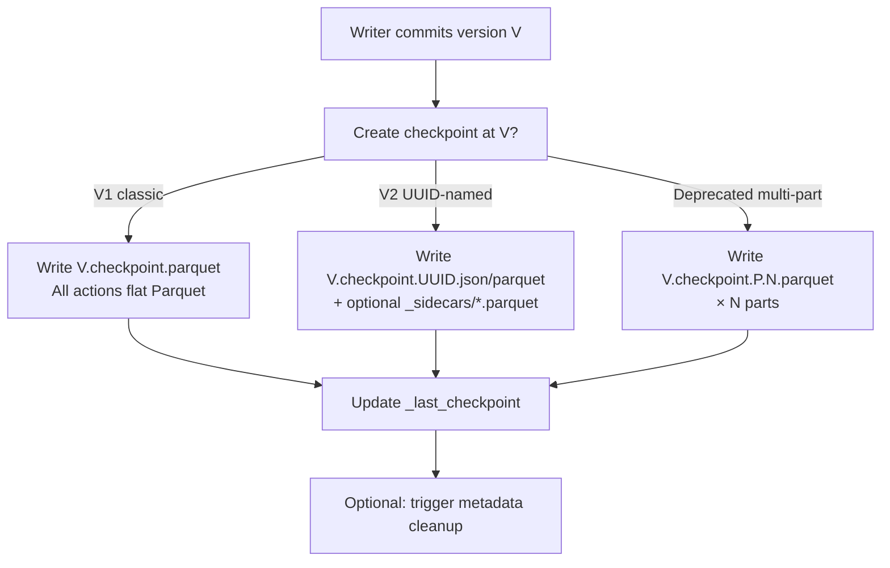
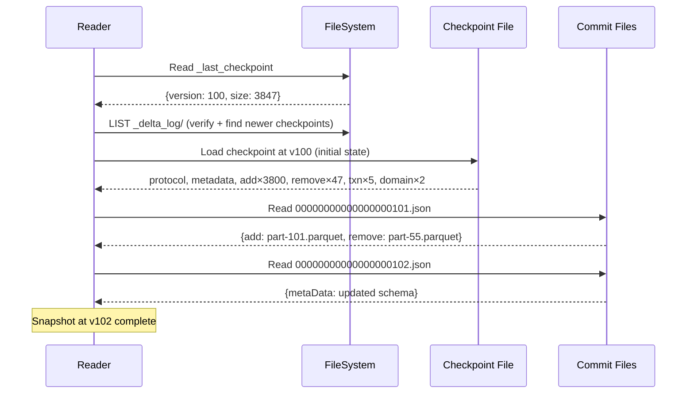

# Checkpoint Formats

## Purpose

Checkpoints are periodic snapshots of the full table state that allow readers to short-cut the cost of replaying the entire transaction log from version 0. Without checkpoints, reading a table at version N would require replaying all N+1 commit files. Checkpoints also enable metadata cleanup (deletion of old commit files).

---

## Checkpoint Fundamentals

A checkpoint contains the **complete replay of all actions** up to and including the checkpointed version, with invalid actions removed via [Action Reconciliation](transaction_log.md#action-reconciliation-rules). This includes:

- The single `protocol` action
- The single `metaData` action
- All live `add` actions (files present in the table)
- Active `remove` tombstones (not yet expired)
- All `txn` (SetTransaction) actions with unique `appId`s
- All `domainMetadata` actions with unique domains (tombstones excluded)
- `checkpointMetadata` — **V2 only**
- `sidecar` references — **V2 only**

**Not included** in checkpoints:
- `commitInfo` (provenance)
- `cdc` (Change Data files)

A checkpoint may only be created **after** the associated commit file (`<v>.json`) has been successfully written.

---

## Checkpoint Specs

Delta defines two checkpoint content specifications: V1 and V2.

### V1 Spec

The classic, flat format. All actions stored in the checkpoint body itself. Does not support sidecar files or `checkpointMetadata`.

Structure: Parquet file containing one row per action. All action types stored as named struct columns; missing/inapplicable columns are null.

**Schema notes**:
- `add` struct may include `partitionValues_parsed` (when `delta.checkpoint.writeStatsAsStruct=true`), `stats` (JSON string, when `delta.checkpoint.writeStatsAsJson=true`, the default), and `stats_parsed` (struct form, optional).
- `remove` struct does **not** include `stats` or `tags` (tombstones only need path+timestamp for VACUUM).

### V2 Spec

Introduced by the `v2Checkpoint` table feature. Separates non-file actions from file actions:

- Each V2 checkpoint contains **exactly one `checkpointMetadata` action**.
- All non-file actions (`protocol`, `metaData`, `txn`, `domainMetadata`) **must** be in the checkpoint body.
- File actions (`add`, `remove`) may be:
  - **Embedded** in the checkpoint body (same as V1), OR
  - **In sidecar files** referenced by `sidecar` actions in the checkpoint body.
- Partial embedding is **not allowed**: either all file actions are inline, or all are in sidecars.
- A V2 checkpoint may reference zero or more sidecar files.

**V2 checkpoint body (JSON format, with sidecars)**:
```
{"checkpointMetadata":{"version":364475,"tags":{}}}
{"metaData":{...}}
{"protocol":{...}}
{"txn":{"appId":"3ba13872-2d47-4e17-86a0-21afd2a22395","version":364475}}
{"sidecar":{"path":"3a0d65cd-4056-49b8-937b-95f9e3ee90e5.parquet","sizeInBytes":2341330,"modificationTime":1512909768000,"tags":{}}}
{"sidecar":{"path":"016ae953-37a9-438e-8683-9a9a4a79a395.parquet","sizeInBytes":8468120,"modificationTime":1512909848000,"tags":{}}}
```

**V2 checkpoint body (without sidecars, file actions inline)**:
```
{"checkpointMetadata":{"version":364475,"tags":{}}}
{"metaData":{...}}
{"protocol":{...}}
{"add":{"path":"date=2017-12-10/part-000.parquet",...}}
{"add":{"path":"date=2017-12-09/part-001.parquet",...}}
{"remove":{"path":"date=2017-12-08/part-002.parquet",...}}
```

---

## Checkpoint Naming Schemes

Delta supports three naming schemes. The allowed combinations of spec and naming are:

| Spec | UUID-named | Classic | Multi-part |
|---|---|---|---|
| V1 | ✗ Invalid | ✓ Valid | ✓ Valid |
| V2 | ✓ Valid | ✓ Valid | ✗ Invalid (forbidden) |

### 1. Classic Checkpoint

**Name**: `<v>.checkpoint.parquet`  
**Format**: Parquet  
**Spec**: V1 or V2 (V2 only if `v2Checkpoint` feature enabled)

Example:
```
_delta_log/00000000000000000100.checkpoint.parquet
```

Rules:
- If two writers race and create the same classic checkpoint, the latest writer wins. Since both contain the same information, either is safe to use.
- Can follow V2 spec when `v2Checkpoint` is enabled (includes `checkpointMetadata`, may have sidecars).

### 2. UUID-named Checkpoint

**Name**: `<v>.checkpoint.<uuid>.{json,parquet}`  
**Format**: JSON or Parquet  
**Spec**: V2 only (requires `v2Checkpoint` table feature)

Examples:
```
# JSON UUID checkpoint with sidecars
_delta_log/00000000000000000020.checkpoint.80a083e8-7026-4e79-81be-64bd76c43a11.json
_delta_log/_sidecars/016ae953-37a9-438e-8683-9a9a4a79a395.parquet
_delta_log/_sidecars/3a0d65cd-4056-49b8-937b-95f9e3ee90e5.parquet

# Parquet UUID checkpoint without sidecars
_delta_log/00000000000000000112.checkpoint.80a083e8-7026-4e79-81be-64bd76c43a11.parquet
```

Rules:
- Must contain a `checkpointMetadata` action.
- UUID guarantees uniqueness: multiple racing writers produce distinct files, avoiding overwrite races.
- UUID-named checkpoints may be created only after `v2Checkpoint` feature is enabled.

### 3. Multi-part Checkpoint (Deprecated)

**Name**: `<v>.checkpoint.<part>.<total>.parquet` (0-padded 10-digit `part` and `total`)  
**Format**: Parquet  
**Spec**: V1 only

Example:
```
_delta_log/00000000000000000100.checkpoint.0000000001.0000000003.parquet
_delta_log/00000000000000000100.checkpoint.0000000002.0000000003.parquet
_delta_log/00000000000000000100.checkpoint.0000000003.0000000003.parquet
```

Constraints:
- Partitioned by spark-style hash on `(path, dvId)` if DVs are present, or just `path` otherwise.
- Readers must ignore multi-part checkpoints with any missing parts (cannot be written atomically).
- **Forbidden** when `v2Checkpoint` table feature is enabled.
- **Deprecated**: use UUID-named V2 checkpoints instead.

**Problems with multi-part checkpoints** (from the protocol):
1. Cannot validate content before readers start using it.
2. Concurrent writers can interleave checkpoint part files, producing corrupt snapshots.
3. No mechanism to store skipping stats for parts or reuse part files.
4. Bloats `_delta_log` and slows LIST operations.

---

## Sidecar Files

Sidecar files contain only `add` and `remove` file actions in Parquet format. They live in the `_delta_log/_sidecars/` directory and have unique names (typically UUIDs):

```
_delta_log/_sidecars/016ae953-37a9-438e-8683-9a9a4a79a395.parquet
```

Properties:
- Referenced only from V2 checkpoint bodies via `sidecar` actions.
- May be reused across multiple checkpoints (e.g. if the file list hasn't changed).
- Protected from deletion during metadata cleanup: all sidecars referenced by any surviving checkpoint must be retained. Additionally, sidecars less than 1 day old are protected (to avoid deleting in-progress checkpoint writes).

---

## `_last_checkpoint` File

The `_last_checkpoint` file in `_delta_log/` provides a hint to readers, allowing them to skip listing the entire log directory to find the newest checkpoint.

**Location**: `_delta_log/_last_checkpoint`  
**Format**: JSON (single line)

Schema (`LastCheckpointV2` / `CheckpointMetaData` in kernel code):

| Field | Type | Required | Description |
|---|---|---|---|
| `version` | Long | ✓ | Version of the most recent checkpoint |
| `size` | Long | ✓ | Number of actions in the checkpoint |
| `parts` | Int | optional | Number of parts (multi-part only) |
| `sizeInBytes` | Long | optional | Total size in bytes of checkpoint files |
| `numOfAddFiles` | Long | optional | Number of `add` actions in the checkpoint |
| `checkpointSchema` | StructType | optional | Schema of the checkpoint for quick reads |
| `v2Checkpoint` | V2CheckpointPointer | optional | Pointer to V2 checkpoint metadata |
| `checksum` | JSON checksum | optional | Integrity checksum for the `_last_checkpoint` file itself |

**V2CheckpointPointer** (embedded when writing V2 checkpoints):

| Field | Type | Description |
|---|---|---|
| `path` | String | Path to V2 checkpoint file |
| `fileFormat` | String | `"JSON"` or `"PARQUET"` |
| `metadata` | CheckpointMetadataAction | Embedded `checkpointMetadata` action to avoid reading the checkpoint file |

Writers may **embed** the V2 checkpoint metadata in `_last_checkpoint` so readers can avoid reading the checkpoint file entirely for common operations.

**Example (V1 checkpoint pointer)**:
```json
{"version":100,"size":3847,"sizeInBytes":15682312,"numOfAddFiles":3800}
```

**Backward compatibility note**: When UUID-named V2 checkpoints are enabled, writers should occasionally also create a V2 classic checkpoint (`<v>.checkpoint.parquet`) to allow older readers (that don't recognize UUID names) to discover the protocol and fail gracefully with a version error.

---

## Checkpoint Selection Algorithm

When a reader needs to reconstruct a snapshot at version `V`, it selects the best checkpoint to start from:

```
1. Read _last_checkpoint → hints at the newest checkpoint
2. If _last_checkpoint.version > V (time travel), ignore it
3. LIST _delta_log/ to enumerate checkpoint files
4. Filter: keep only checkpoints with version ≤ V
5. Prefer: newest version first; prefer single-file over multi-part
6. For multi-part: validate all parts are present; skip incomplete ones
7. If v2Checkpoint feature enabled: prefer UUID-named or V2 classic over V1
8. Load selected checkpoint; replay remaining commit files from checkpoint.version+1 to V
```

The Kernel `Checkpointer.java` uses `CheckpointInstance` to represent and compare checkpoint candidates. Checkpoints for the same version may exist in multiple formats; any valid, complete checkpoint is acceptable.

---

## Checkpoint Writing (Kernel)

The Kernel `Checkpointer.checkpoint()` method (`kernel/kernel-api/src/main/java/io/delta/kernel/internal/checkpoints/Checkpointer.java:60`):

1. Validates the engine can write to the table's protocol version/features.
2. Determines the checkpoint file path via `FileNames.checkpointFileSingular(logPath, version)`.
3. Iterates through `snapshot.getCreateCheckpointIterator(engine)` which yields all actions in checkpoint order.
4. Writes the Parquet file atomically via `engine.getParquetHandler().writeParquetFileAtomically(...)`.
5. Handles `FileAlreadyExistsException` → throws `CheckpointAlreadyExistsException`.
6. Updates `_last_checkpoint` file with the new checkpoint metadata.
7. Optionally triggers metadata cleanup (`cleanupExpiredLogs`) if configured.

The current Kernel implementation writes **V1 classic checkpoints** (single-file Parquet). V2 checkpoint writing is the responsibility of the Spark connector.

---

## When Checkpoints Are Triggered

The protocol does not mandate a specific checkpoint frequency. Writers are encouraged to checkpoint "reasonably frequently" to avoid excessive log replay costs.

The Spark connector (`DeltaLog`) checkpoints every 10 commits by default (configurable via `delta.checkpointInterval`). The Kernel `Checkpointer` is called explicitly by the table writer after a successful commit.

**Rule**: Metadata cleanup (log truncation) **must** provide a checkpoint at the oldest kept version to cover all deleted commit files.

---

## Checkpoint Schema

The checkpoint Parquet schema mirrors `SingleAction` from the Delta protocol. Each row represents one action; unused columns are null:

```
root
 |-- txn: struct (nullable = true)
 |    |-- appId: string (nullable = true)
 |    |-- version: long (nullable = true)
 |    |-- lastUpdated: long (nullable = true)
 |-- add: struct (nullable = true)
 |    |-- path: string (nullable = true)
 |    |-- partitionValues: map<string,string> (nullable = true)
 |    |-- size: long (nullable = true)
 |    |-- modificationTime: long (nullable = true)
 |    |-- dataChange: boolean (nullable = true)
 |    |-- stats: string (nullable = true)          [when writeStatsAsJson=true]
 |    |-- tags: map<string,string> (nullable = true)
 |    |-- deletionVector: struct (nullable = true)
 |    |-- baseRowId: long (nullable = true)
 |    |-- defaultRowCommitVersion: long (nullable = true)
 |    |-- stats_parsed: struct (nullable = true)   [when writeStatsAsStruct=true]
 |    |-- partitionValues_parsed: struct (nullable = true) [when writeStatsAsStruct=true + partitioned]
 |-- remove: struct (nullable = true)
 |    |-- path: string (nullable = true)
 |    |-- deletionTimestamp: long (nullable = true)
 |    |-- dataChange: boolean (nullable = true)
 |    |-- extendedFileMetadata: boolean (nullable = true)
 |    |-- partitionValues: map<string,string> (nullable = true)
 |    |-- size: long (nullable = true)
 |    |-- deletionVector: struct (nullable = true)
 |    |-- baseRowId: long (nullable = true)
 |    |-- defaultRowCommitVersion: long (nullable = true)
 |    [NOTE: remove does NOT include stats or tags in checkpoints]
 |-- metaData: struct (nullable = true)
 |    |-- id: string ...
 |-- protocol: struct (nullable = true)
 |    |-- minReaderVersion: integer ...
 |-- domainMetadata: struct (nullable = true)
 |    |-- domain: string ...
 |-- checkpointMetadata: struct (nullable = true)  [V2 only]
 |    |-- version: long ...
 |-- sidecar: struct (nullable = true)             [V2 only]
 |    |-- path: string ...
```

> [!NOTE]
> Any missing column in the checkpoint Parquet should be treated as `null`. This provides forward compatibility: new fields added to actions in future protocol versions will not break existing checkpoint readers.

---

## Diagrams



_Checkpoint creation flow: writer decides format based on enabled table features._



_Checkpoint-assisted log replay: load checkpoint, then replay only the delta files after it._
