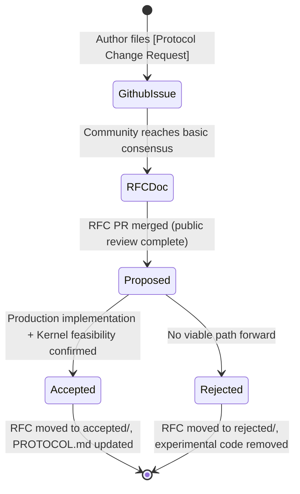
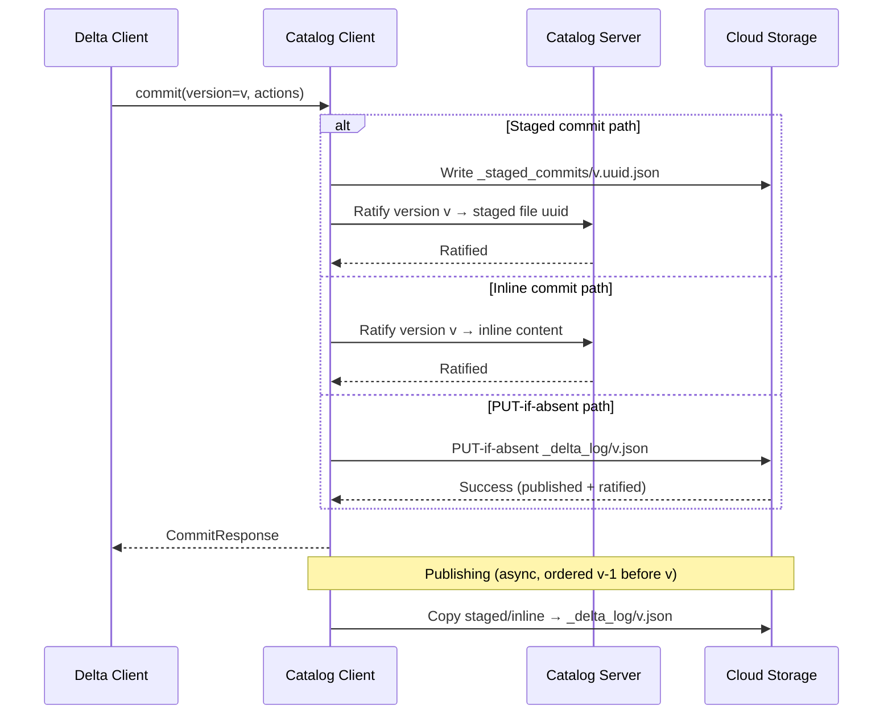
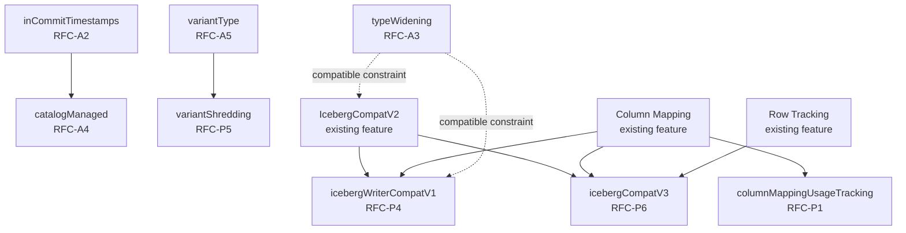

# Delta Protocol RFCs

## Purpose

This document catalogues and analyses every Delta Lake protocol RFC — proposed, accepted, and rejected — tracked in `protocol_rfcs/`. RFCs are the formal mechanism through which protocol-level changes to the Delta format are proposed, discussed, and ratified. Each accepted RFC produces one or more new **table features** that become part of `PROTOCOL.md`.

---

## RFC Process Overview

The RFC process was adopted on **2024-02-06**. All protocol changes proposed after that date follow this lifecycle:

### Key Process Rules
1. **Issue first**: A GitHub issue of type `[Protocol Change Request]` serves as the discussion hub.
2. **RFC before code**: Code must not merge to `main` until the RFC has at least "Proposed" status. During proposal, code must be isolated behind feature flags.
3. **Temporary feature name**: Experimental feature names should carry a `-dev` suffix until the RFC is accepted.
4. **Acceptance criteria**: (a) Production implementation in `delta-spark`, thoroughly tested; (b) Kernel feasibility confirmed (prototype preferred).
5. **Acceptance PR must**: update `protocol.md`, move RFC to `accepted/`, close the tracking issue, and remove `-dev` suffix from feature names throughout the code.
6. **Rejection PR must**: move RFC to `rejected/`, close the issue, and remove all experimental code.

---

## Accepted RFCs

These RFCs have been formally accepted; their protocol changes are live in `PROTOCOL.md`.

> [!NOTE] README discrepancy
> `protocol_rfcs/accepted/variant-type.md` exists in the `accepted/` directory and its header confirms it was folded into `PROTOCOL.md`, but it is **not listed** in the README's accepted table. It is documented here as de-facto accepted.

---

### RFC-A1 — Vacuum Protocol Check

| Field | Value |
|---|---|
| **File** | `protocol_rfcs/accepted/vacuum-protocol-check.md` |
| **Table feature** | `vacuumProtocolCheck` (ReaderWriter) |
| **GitHub issue** | [#2630](https://github.com/delta-io/delta/issues/2630) |
| **Proposed** | 2023-02-28 |
| **Accepted** | 2023-03-26 |
| **Protocol version** | Reader v3, Writer v7 |

#### Summary
Addresses an implementation gap where some Delta engines performing `VACUUM` skipped the writer protocol check, creating a data corruption risk: an older writer could delete files still referenced by a newer reader feature it didn't understand.

#### Design Decision
Introduced as a **ReaderWriter** feature (unusual for what is purely a write-time operation) so that readers can verify that any writer performing VACUUM on the table has correctly validated the write protocol. Writers that do not implement VACUUM need not change anything. Writers that do implement VACUUM must perform an unconditional write protocol check before proceeding.

#### Protocol Impact
- New section: `# VACUUM Protocol Check`
- Writers: must check write protocol before any VACUUM operation
- Readers: only need to acknowledge the feature exists; no behavioral change

---

### RFC-A2 — In-Commit Timestamps

| Field | Value |
|---|---|
| **File** | `protocol_rfcs/accepted/in-commit-timestamps.md` |
| **Table feature** | `inCommitTimestamps` (Writer) |
| **GitHub issue** | [#2532](https://github.com/delta-io/delta/issues/2532) |
| **Proposed** | 2023-02-02 |
| **Accepted** | 2023-07-24 |
| **Protocol version** | Writer v7 |
| **Table property** | `delta.enableInCommitTimestamps = true` |

#### Summary
Solves a fundamental unreliability in Delta time travel: the existing protocol derived commit timestamps from filesystem file modification times, which are not guaranteed to be monotonically increasing and can be altered by cloud storage operations (e.g., copy/move/replication).

#### Design Decisions
1. **Monotonically increasing guarantee**: `inCommitTimestamp` = `max(writer_clock, prev_inCommitTimestamp + 1ms)`. This ensures strict monotonicity even across concurrent writers.
2. **`commitInfo` becomes mandatory**: When enabled, every commit must include a `commitInfo` action (it was previously optional), and it must be the **first action** in the commit.
3. **Enablement tracking**: Two table properties (`delta.inCommitTimestampEnablementVersion` and `delta.inCommitTimestampEnablementTimestamp`) record when the feature was turned on, enabling correct hybrid time travel across the transition boundary.
4. **Hybrid reader rules**: For versions after enablement, use `inCommitTimestamp`; for versions before, fall back to file modification time. Readers must also scope timestamp-based time travel to the appropriate version range.
5. **Required by `catalogManaged`**: Because catalog-managed tables delay publishing commits to the filesystem (making file modification times meaningless), `inCommitTimestamps` is a mandatory dependency of the `catalogManaged` feature.

#### Protocol Impact
- Modified: `Commit Provenance Information` (commitInfo now conditionally required)
- Modified: `Reader Requirements for AddCDCFile` (_commit_timestamp derivation updated)
- New section: `# In-Commit Timestamps`

---

### RFC-A3 — Type Widening

| Field | Value |
|---|---|
| **File** | `protocol_rfcs/accepted/type-widening.md` |
| **Table feature** | `typeWidening` (ReaderWriter) |
| **GitHub issue** | [#2623](https://github.com/delta-io/delta/issues/2623) |
| **Proposed** | 2023-02-09 |
| **Accepted** | 2025-01-28 |
| **Protocol version** | Reader v3, Writer v7 |
| **Table property** | `delta.enableTypeWidening = true` |

#### Summary
Enables schema evolution without full table rewrites: columns can be promoted to wider compatible types (e.g., `Int → Long`, `Float → Double`, `Date → TimestampNTZ`). This was a long-standing ergonomics gap in Delta compared to some SQL databases.

#### Supported Type Changes
- **Integer widening**: `Byte → Short → Int → Long`
- **Float widening**: `Float → Double`, `{Byte,Short,Int} → Double`
- **Date widening**: `Date → TimestampNTZ`
- **Decimal widening**: `Decimal(p,s) → Decimal(p+k1, s+k2)` where `k1 ≥ k2 ≥ 0`; also `{Byte,Short,Int} → Decimal`, `Long → Decimal`

#### Design Decisions
1. **Type change metadata**: Each type change is recorded in the `delta.typeChanges` metadata key of the nearest ancestor `StructField`. This allows readers to reconstruct the schema evolution history and apply correct physical-to-logical type conversions when reading old files.
2. **Iceberg compatibility constraint**: Type changes that would break Iceberg V2 compatibility are blocked when `icebergCompatV1` or `icebergCompatV2` is active. Blocked: decimal scale increase, `{Byte,Short,Int} → Double`, `Date → TimestampNTZ`, `{Byte,Short,Int,Long} → Decimal`.
3. **Feature removal path**: When removing `typeWidening` from the protocol, writers must: (a) ensure all data files use the current wide types (may require rewrite), and (b) strip all `delta.typeChanges` metadata.
4. **Reader obligation**: Readers must convert values in old files to the current wider type on read. They must fail on unsupported type changes.

#### Protocol Impact
- New section: `# Type Widening`
- New column metadata key: `delta.typeChanges` (JSON list of `{fromType, toType, fieldPath?}`)
- Modified: Writer requirements for IcebergCompatV1 and IcebergCompatV2 (constraint additions)

---

### RFC-A4 — Catalog-Managed Tables

| Field | Value |
|---|---|
| **File** | `protocol_rfcs/accepted/catalog-managed.md` |
| **Table feature** | `catalogManaged` (ReaderWriter) |
| **GitHub issue** | [#4381](https://github.com/delta-io/delta/issues/4381) |
| **Proposed** | 2025-04-07 |
| **Accepted** | 2026-02-17 |
| **Protocol version** | Reader v3, Writer v7 |
| **Mandatory dep** | `inCommitTimestamps` |

#### Summary
Supersedes the rejected [[#RFC-R1 — Managed Commits|Managed Commits]] RFC. Makes the managing catalog—rather than the filesystem—the authoritative source for whether a commit attempt succeeded. This is a foundational shift enabling richer catalog integrations, multi-table transactions, and more efficient cloud storage usage.

#### Motivation (six advantages over filesystem-based commit)
1. Catalog can **broker and validate** all commits (reject unauthorized schema changes, enforce foreign key constraints)
2. Opens path to **multi-table transactions** involving catalog-side updates
3. Catalog can **host small commits inline**, avoiding cloud storage round-trips
4. Catalog can **vend storage credentials** and serve up table state for efficient reads
5. Catalog becomes the **authoritative source for latest version**, eliminating expensive `_delta_log` LIST operations (critical for S3 Express One Zone which lacks ordered LIST)
6. Catalog can **trigger followup actions** (VACUUM, OPTIMIZE, UniForm conversion, ETL listeners)

#### Key Concepts

**Commit lifecycle types:**
- **Proposed commit**: staged (written to `_delta_log/_staged_commits/<v>.<uuid>.json`) or inline (sent to catalog server directly)
- **Ratified commit**: a proposed commit the catalog has committed to as version `v`; must be stored by catalog until published
- **Published commit**: a ratified commit copied to `_delta_log/<v>.json` (normal Delta file)

**`_delta_log/_staged_commits/` directory**: New staging area using filename pattern `<version>.<uuid>.json`. Version number in the filename is authoritative. The catalog, not filesystem listing, determines which staged commits are ratified.

**Three commit options for catalog implementations:**
1. Write staged commit → ratify server-side (atomic record in catalog storage)
2. Inline commit → catalog stores content directly as version `v`
3. PUT-if-absent → ratify + publish atomically (backward-compatible with filesystem clients)

#### Design Decisions
1. **Table discovery before protocol read**: Clients discover whether a table is catalog-managed via the catalog's name-resolution response, before reading the Delta protocol. This avoids a chicken-and-egg problem.
2. **Publishing order must be sequential**: Version `v-1` must be published before `v`.
3. **`inCommitTimestamps` mandatory**: File modification times of published commits are meaningless for catalog-managed tables (publish happens asynchronously), so ICT must be active.
4. **`txnId` mandatory**: `commitInfo` must include a unique transaction ID to enable idempotency.
5. **Filesystem-based access blocked**: The feature is primarily a guard: readers/writers that don't go through the catalog will encounter the feature in the protocol and reject access.
6. **Maintenance operations restricted**: VACUUM, OPTIMIZE, REORG require explicit catalog permission; only checkpoints, log compaction, and version checksum are always allowed.
7. **Sample API (not normative)**: RFC provides a sample `CatalogManagedTable` Scala interface with `commit()` and `getRatifiedCommits()` methods to illustrate what Delta clients need from catalog clients.

#### Protocol Impact
- Modified: `Delta Log Entries` (staged commits, `_delta_log/_staged_commits/`)
- Modified: `Commit Provenance Information` (txnId field requirement)
- Modified: `Metadata Cleanup` (staged commit files cleanup rules)
- New section: `# Catalog-managed tables` (terminology, commit protocol, reading, publishing, maintenance, creation/dropping, discovery)

_[Catalog-managed commit protocol: three ratification options, with async publishing to `_delta_log`]_

---

### RFC-A5 — Variant Data Type

| Field | Value |
|---|---|
| **File** | `protocol_rfcs/accepted/variant-type.md` |
| **Table feature** | `variantType` (ReaderWriter) |
| **GitHub issue** | [#2864](https://github.com/delta-io/delta/issues/2864) |
| **Proposed** | 2023-04-24 (listed as "proposed" in README, moved to accepted/ in practice) |
| **Status** | Accepted — folded into PROTOCOL.md |
| **Protocol version** | Reader v3, Writer v7 |

> [!WARNING] README discrepancy
> This RFC is physically located in `accepted/` and its header explicitly states it is "Folded into PROTOCOL.md", but it does **not appear** in the README's "Accepted RFCs" table. It is treated here as accepted.

#### Summary
Introduces a new primitive data type `variant` for storing and processing semi-structured (JSON-like) data. Uses the Spark Variant binary encoding specification.

#### Physical Representation
Variant is stored as a **two-field Parquet struct**:
- `value` (binary): binary-encoded Variant value
- `metadata` (binary): binary-encoded Variant metadata

Writers must **not** write a `typed_value` field (reserved for [[#RFC-P5 — Variant Shredding|Variant Shredding]]).

#### Feature Compatibility Matrix
| Delta Feature | Variant Support |
|---|---|
| Partition columns | Not allowed as partition column (not comparable) |
| Clustering | Not allowed as clustering column |
| Column statistics | `nullCount` only; no min/max |
| Generated columns | May be *source* but not *result type* |
| CHECK constraints | Supported |
| Default column values | Supported |
| Change Data Feed | Supported |

#### Protocol Impact
- New section: `# Variant Data Type`
- New schema type: `variant` (serialized as `{"type": "variant"}`)

---

## In-Flight / Proposed RFCs

These RFCs have been filed and merged to `main` in proposed status. Implementation code exists but is feature-flagged or experimental.

---

### RFC-P1 — Column Mapping Usage Tracking

| Field | Value |
|---|---|
| **File** | `protocol_rfcs/column-mapping-usage-tracking.md` |
| **Table feature** | `columnMappingUsageTracking` (Writer) |
| **GitHub issue** | [#2682](https://github.com/delta-io/delta/issues/2682) |
| **Proposed** | 2023-02-26 |

#### Summary
Extension to [[column_mapping|Column Mapping]] that tracks whether any column has ever been dropped or renamed. The `delta.columnMapping.hasDroppedOrRenamed` table property is `false` when the table is clean and `true` once any drop/rename has occurred (and is irreversible).

#### Design Decisions
1. **Purpose**: Enables using the logical column name as the physical column name for new columns (avoiding UUID-based physical names) — but only while no drop/rename has occurred, because after a drop/rename logical names may collide with previously-used physical names.
2. **When `hasDroppedOrRenamed = false`**: New columns use logical name as physical name (human-readable Parquet files).
3. **When `hasDroppedOrRenamed = true`**: New columns revert to UUID-based physical names (safe from collision).
4. **Enablement path**: The property is initialized to `false` on new tables; set to `true` on enablement if the existing table already had column mapping active.
5. **Relevance to column mapping disablement**: This tracking is specifically needed when disabling column mapping altogether (issue #2481): with accurate tracking, disabling CM on a "clean" table simply reverts to `name: none` without a full table rewrite.

#### Protocol Impact
- New subsection: `## Usage Tracking` within `Column Mapping`
- Modified: `Writer Requirements for Column Mapping` (physical name assignment logic updated)
- New subsection: `### Writer Requirements for Usage Tracking`

---

### RFC-P2 — Collated String Type

| Field | Value |
|---|---|
| **File** | `protocol_rfcs/collated-string-type.md` |
| **Table feature** | `collations` (Writer) |
| **GitHub issue** | [#2894](https://github.com/delta-io/delta/issues/2894) |
| **Proposed** | 2024-04-30 |

#### Summary
Adds support for locale-sensitive string comparison (collations) in Delta table schemas. Enables case-insensitive comparisons, locale-aware sort orders, etc. Does not affect storage; only affects comparison semantics.

#### Three Protocol Changes
1. **Collations in schema**: String columns (including nested map keys/values and array elements) can specify a collation identifier in the `__COLLATIONS` metadata key of the nearest ancestor `StructField`.
2. **Versioned statistics**: Per-file min/max statistics for collated string columns are stored under `statsWithCollation`, keyed by the exact collation version identifier. This is necessary because the sort order of a string can change between collation versions (e.g., ICU library upgrades).
3. **Domain metadata**: The `collations` domain metadata records which collation versions are currently "active" for statistics production, giving writers hints for which versions to emit stats for.

#### Collation Identifier Format
`<Provider>.<Name>[.<Version>]` (e.g., `ICU.en_US`, `ICU.en_US.72`)
- Schema stores unversioned identifiers (readers not forced to use specific version)
- Statistics store versioned identifiers (correctness guarantee)

#### Writer-Only Feature Rationale
Readers without collation support can still read the table using default UTF-8 binary collation. Writers must preserve collations when modifying the schema.

#### File Skipping Constraint
Readers must only use `statsWithCollation.<version>` stats for file skipping if the filter operation uses the **exact same collation and version** as the statistics. Cross-version or cross-collation stats reuse is forbidden.

#### Protocol Impact
- New section: `# Collations Table Feature`
- Modified: `Primitive Types` (string type updated with collation note)
- New column metadata key: `__COLLATIONS`
- Modified: `Per-file Statistics` (new `statsWithCollation` field)
- New domain metadata: `collations` (with `writeVersions` map)

---

### RFC-P3 — Checkpoint Protection

| Field | Value |
|---|---|
| **File** | `protocol_rfcs/checkpoint-protection.md` |
| **Table feature** | `checkpointProtection` (Writer) |
| **GitHub issue** | [#4152](https://github.com/delta-io/delta/issues/4152) |
| **Proposed** | 2025-03-13 |

#### Summary
Enables a safer and simpler "drop table feature" workflow. Today, dropping a feature requires a 24-hour wait (to let all in-flight transactions complete) before truncating history at the version boundary. This RFC eliminates that wait by protecting special barrier checkpoints that allow older readers to correctly handle version boundaries.

#### Core Insight
When a feature is dropped at version `v`, the protocol at `v` transitions from requiring the feature to not requiring it. Without barrier checkpoints, an older client attempting to checkpoint some earlier version `v-N` might create a corrupt checkpoint (because it doesn't understand the feature that was active at `v-N`). With barrier checkpoints at the drop boundary, older clients are blocked from creating checkpoints before `delta.requireCheckpointProtectionBeforeVersion`.

#### Design Decisions
1. **Table property `delta.requireCheckpointProtectionBeforeVersion`**: The protected boundary version. Writers must not clean up checkpoints before this version, and must not create new checkpoints before this version unless they support the protocol at that version.
2. **Atomic cleanup semantics**: If a writer doesn't support the protocol for some version range being cleaned up, the cleanup is only allowed if it includes ALL versions before `requireCheckpointProtectionBeforeVersion` (i.e., the entire range up to the boundary in one pass, not incrementally).
3. **Cleanup ordering**: Commits must be deleted **before** their associated checkpoints, so checkpoint protection invariants hold during cleanup.
4. **Reader obligation**: None — readers only need to acknowledge the feature exists.
5. **Impact on drop feature**: Feature removal becomes a single `DROP FEATURE` command (no 24-hour wait). This significantly improves operational UX.

#### Protocol Impact
- New section: `# Checkpoint Protection` in the `Table Features` section

---

### RFC-P4 — IcebergWriterCompatV1

| Field | Value |
|---|---|
| **File** | `protocol_rfcs/iceberg-writer-compat-v1.md` |
| **Table feature** | `icebergWriterCompatV1` (Writer) |
| **GitHub issue** | [#4284](https://github.com/delta-io/delta/issues/4284) |
| **Proposed** | 2025-03-18 |

#### Summary
A compatibility flag (writer feature) ensuring that a Delta table can be safely **read and written** as Apache Iceberg™ format. More stringent than IcebergCompatV2: requires `id` mode column mapping (not just `name` or `id`), enforces an exact `col-[id]` physical naming convention, and has an explicit allowlist/blocklist of features.

#### Relationship to IcebergCompatV1/V2
- Requires `icebergCompatV2` to be enabled (is a strict superset of V2 requirements)
- Mutually exclusive with `icebergCompatV1`

#### Additional Constraints Beyond IcebergCompatV2
1. Column Mapping must be in **`id` mode** (V2 allows `name` or `id`)
2. Physical names must follow pattern `col-[column_mapping_id]` exactly
3. `byte` and `short` types disallowed (V2 allows them)
4. Struct map keys are immutable (schema changes to map keys blocked)
5. Explicit feature allowlist: `[appendOnly, columnMapping, icebergWriterCompatV1, icebergCompatV2, domainMetadata, vacuumProtocolCheck, v2Checkpoint, inCommitTimestamp, clustering, timestampNtz, typeWidening]`
6. Disallowed features (must not be active): `invariants`, `CDF`, `CHECK constraints`, `identity columns`, `generated columns`, `rowTracking`, `collations`, `variantType`

#### Design Rationale
The strict naming convention and `id` mode requirement enable lossless round-trip conversion to Iceberg, where field IDs and physical names have strict rules. The allowlist ensures that future Delta features cannot silently break Iceberg interoperability.

#### Protocol Impact
- New section: `# IcebergWriterCompatV1` after `Iceberg Compatibility V2`

---

### RFC-P5 — Variant Shredding

| Field | Value |
|---|---|
| **File** | `protocol_rfcs/variant-shredding.md` |
| **Table feature** | `variantShredding` (ReaderWriter) |
| **GitHub issue** | [#4032](https://github.com/delta-io/delta/issues/4032) |
| **Proposed** | 2025-05-06 |
| **Depends on** | `variantType` ([[#RFC-A5 — Variant Data Type|RFC-A5]]) |

#### Summary
Extends the Variant type (RFC-A5) with **shredding**: extracting frequently-accessed paths from the Variant binary blob and storing them as typed Parquet columns. Shredded paths are **removed** from the Variant binary (no duplication). This enables column statistics and faster scan performance for semi-structured data.

#### Physical Representation (shredded)
A shredded Variant column is a Parquet struct with three fields:
- `metadata` (binary, required): Variant metadata
- `value` (binary, optional): remaining unshredded Variant value
- `typed_value` (*any Parquet type*, optional): the shredded typed column

Readers must handle both unshredded (only `metadata` + `value`) and shredded (`metadata` + `value` + `typed_value`) Parquet schemas.

#### Statistics for Variant Columns
- `nullCount`: count of null Variant values (not per-path)
- `minValues` / `maxValues`: Variant objects whose keys are **normalized JSON path expressions** (RFC 9535), whose values are per-path primitive bounds
- JSON encoding uses z85-encoded binary Variant; Parquet encoding uses Parquet Variant format
- Per-path stats are **independently computed** (min of path `a` may come from a different row than min of path `b`)
- Stats only allowed for paths with **uniform type** within the file

#### Protocol Impact
- New section: `# Variant Shredding` after `Variant Data Type`
- Modified: `Per-file Statistics` (statistics rules for Variant columns)

---

### RFC-P6 — IcebergCompatV3

| Field | Value |
|---|---|
| **File** | `protocol_rfcs/iceberg-compat-v3.md` |
| **Table feature** | `icebergCompatV3` (Writer) |
| **GitHub issue** | N/A (not listed in README) |
| **Proposed** | Unknown (not listed in README) |

> [!WARNING] Not in README
> `iceberg-compat-v3.md` resides in the root `protocol_rfcs/` directory but is **not listed** in the README's proposed, accepted, or rejected tables. It was likely added after the README was last updated.

#### Summary
Third-generation Iceberg compatibility flag. Adds two constraints relative to IcebergCompatV2:
1. **Row Tracking required**: IcebergCompatV3 requires Row Tracking to be active on the table, with specific fixed field IDs for materialized Row ID (2147483540) and Row Commit Version (2147483539) columns.
2. **Partition spec immutability**: Replacing a partitioned table with a **differently-named** partition spec is blocked (column type changes for partition columns are allowed; renaming is not).

#### Additional Constraints Beyond IcebergCompatV2
- Row Tracking must be enabled (strong row-level identity for Iceberg compatibility)
- `icebergCompatV1` and `icebergCompatV2` must NOT be active
- Partition columns must be materialized in Parquet files
- Timestamps as int64
- All new AddFiles must have `numRecords` statistic

#### Protocol Impact
- New section: `# Iceberg Compatibility V3` after `Iceberg Compatibility V2`

---

### RFC-P7 — Materialize Partition Columns

| Field | Value |
|---|---|
| **File** | `protocol_rfcs/materialize-partition-columns.md` |
| **Table feature** | `materializePartitionColumns` (Writer) |
| **GitHub issue** | [#5555](https://github.com/delta-io/delta/issues/5555) |
| **Proposed** | 2025-11-20 |

#### Summary
Delta normally stores partition values only in `AddFile.partitionValues` metadata, not physically in Parquet files. This feature makes partition column materialization a first-class protocol-level requirement, independent of full Iceberg compatibility.

#### Motivation
1. **Direct Parquet readers**: Readers that access Parquet files without Delta metadata (e.g., pure Spark Parquet readers, ML frameworks) cannot recover partition values without this feature.
2. **Iceberg compat**: IcebergCompatV1/V2 already require partition materialization, but those features impose many other constraints. This RFC extracts just the partition materialization rule.
3. **Future data reorganization**: Materialized partition values in files allow the same Parquet file to be linked into a future table version with a different (or no) partition scheme.

#### Design Decision
This is a **writer-only** feature: readers must already be able to read tables regardless of whether partition columns are in the Parquet files (Delta readers always use `AddFile.partitionValues`). If partition values exist in both Parquet and metadata, Delta readers must prefer the metadata.

#### Protocol Impact
- New section: `## Materialize Partition Columns` after `Identity Columns`

---

## Rejected RFCs

---

### RFC-R1 — Managed Commits

| Field | Value |
|---|---|
| **File** | `protocol_rfcs/rejected/managed-commits.md` |
| **Table feature** | `managedCommit` (Writer) |
| **GitHub issue** | [#2598](https://github.com/delta-io/delta/issues/2598) |
| **Proposed** | 2023-02-14 |
| **Rejected** | 2025-04-07 |

#### Summary
Proposed a `managedCommit` feature enabling an external **commit-owner** to take over commit atomicity from the filesystem. The commit-owner maintains un-backfilled commits in `_delta_log/_commits/<version>.<uuid>.json` and exposes APIs for `commit()`, `getCommits()`, and `backfillToVersion()`.

#### Why Rejected
Rejected in favor of the more comprehensive [[#RFC-A4 — Catalog-Managed Tables|Catalog-Managed Tables]] RFC, which was accepted on the same date (2025-04-07). The `catalogManaged` design:
- Generalizes "commit owner" to "catalog" with richer semantics (read optimization, credential vending, multi-table transactions)
- Renames the staging directory to `_delta_log/_staged_commits/` and refines the lifecycle terminology (proposed → ratified → published vs. the simpler committed/un-backfilled/backfilled model)
- Makes the catalog the source of truth not just for commit success but for the latest table version, enabling LIST-free reads
- Provides a cleaner distinction between staged commits, inline commits, and PUT-if-absent commits

#### Key Conceptual Differences vs. Catalog-Managed

| Aspect | Managed Commits (rejected) | Catalog-Managed (accepted) |
|---|---|---|
| Naming | commit-owner, backfill | catalog, publishing |
| Staging dir | `_delta_log/_commits/` | `_delta_log/_staged_commits/` |
| Commit types | un-backfilled / backfilled | staged / inline / published |
| Source of truth | commit content on FS, success at commit-owner | catalog is authoritative for latest version |
| Read optimization | Filesystem-based readers get stale data | Catalog can serve state directly |
| Multi-table txn | Not addressed | Explicitly called out as goal |
| Reader restriction | Writer feature only (readers can be stale) | ReaderWriter feature (readers must go through catalog) |

---

## Cross-Reference Table: RFC → Protocol Concept

| RFC | Status | Table Feature Name | Protocol Section | Type |
|---|---|---|---|---|
| Vacuum Protocol Check | ✅ Accepted | `vacuumProtocolCheck` | `VACUUM Protocol Check` | ReaderWriter |
| In-Commit Timestamps | ✅ Accepted | `inCommitTimestamps` | `In-Commit Timestamps` | Writer |
| Type Widening | ✅ Accepted | `typeWidening` | `Type Widening` | ReaderWriter |
| Catalog-Managed Tables | ✅ Accepted | `catalogManaged` | `Catalog-managed tables` | ReaderWriter |
| Variant Data Type | ✅ Accepted* | `variantType` | `Variant Data Type` | ReaderWriter |
| Column Mapping Usage Tracking | 🔄 Proposed | `columnMappingUsageTracking` | Extension of `Column Mapping` | Writer |
| Collated String Type | 🔄 Proposed | `collations` | `Collations Table Feature` | Writer |
| Checkpoint Protection | 🔄 Proposed | `checkpointProtection` | `Checkpoint Protection` | Writer |
| IcebergWriterCompatV1 | 🔄 Proposed | `icebergWriterCompatV1` | `IcebergWriterCompatV1` | Writer |
| Variant Shredding | 🔄 Proposed | `variantShredding` | `Variant Shredding` | ReaderWriter |
| IcebergCompatV3 | 🔄 Proposed† | `icebergCompatV3` | `Iceberg Compatibility V3` | Writer |
| Materialize Partition Columns | 🔄 Proposed | `materializePartitionColumns` | `Materialize Partition Columns` | Writer |
| Managed Commits | ❌ Rejected | `managedCommit` | N/A (superseded) | Writer |

\* In `accepted/` directory and folded into PROTOCOL.md, but not in README's accepted table.  
† Present in `protocol_rfcs/` root but not listed in README.

---

## RFC Dependency Graph

_[Solid arrows = hard dependency (feature X requires feature Y); dashed = compatibility constraint]_

---

## Key Design Themes

Reading the RFCs as a collection reveals six recurring architectural principles:

### 1. Writer Version 7 as the Modern Baseline
Every RFC in this collection requires **Writer Version 7** (and most require Reader Version 3). This establishes v7/R3 as the "modern era" baseline for all ongoing Delta protocol evolution. The protocol effectively has two eras: the legacy feature matrix (versions 1–6) and the table feature era (version 7+). All new table features are additive opt-ins within v7+.

### 2. Reliability Over Convenience: Temporal Semantics
The In-Commit Timestamps RFC reflects a principled stance: filesystem modification times are not reliable contract. This theme reappears in Catalog-Managed Tables (which makes ICT mandatory), because publish times are also unreliable. Delta's approach is to make time a first-class protocol concern rather than relying on infrastructure guarantees.

### 3. Catalog Integration as a Strategic Direction
The evolution from Managed Commits (rejected) → Catalog-Managed Tables (accepted) shows a deliberate broadening of scope: rather than just delegating commit atomicity to an external service, Delta is building a protocol where catalogs become **full first-class participants** in read/write operations, enabling credential vending, versioned table metadata, and multi-table transactions. This aligns Delta's protocol trajectory with Databricks' Unity Catalog and similar managed catalog services.

### 4. Iceberg Interoperability as a First-Class Goal
Five RFCs (IcebergCompatV1/V2 in PROTOCOL.md; IcebergCompatV3, IcebergWriterCompatV1, and Materialize Partition Columns in this RFC set) are dedicated to Iceberg format compatibility. The progression from V1 → V2 → V3 shows increasing strictness. `IcebergWriterCompatV1` adds a constraint that surpasses V2 (id-mode-only column mapping, exact physical naming). This reflects Delta's commitment to the open lakehouse format ecosystem.

### 5. Careful Backward Compatibility Engineering
Several RFCs demonstrate sophisticated approaches to the "new vs. old reader" problem:
- **Writer-only features**: `collations`, `checkpointProtection`, `materializePartitionColumns`, `inCommitTimestamps`, `typeWidening` — old readers can still read the table
- **Hybrid transition rules**: In-Commit Timestamps includes explicit reader logic for pre/post-enablement versions
- **Checkpoint barriers**: Checkpoint Protection enables feature removal without history truncation
- **Allowlists**: IcebergWriterCompatV1 uses an explicit allowlist to future-proof Iceberg compat

### 6. Semi-Structured Data as a First-Class Citizen
The Variant Type + Variant Shredding pair mirrors Apache Spark's own Variant data type addition, bringing Delta into alignment with modern semi-structured data processing. Shredding (extracting typed paths from the opaque binary blob) is the key performance primitive: it allows columnar statistics and scan pushdown for JSON-like data without sacrificing the flexibility of schemaless storage.

---

## Diagram Opportunity Flag

> FLAG FOR ORCHESTRATOR: The commit lifecycle for Catalog-Managed Tables ([[#RFC-A4 — Catalog-Managed Tables|RFC-A4]]) introduces a new parallel commit path (`_delta_log/_staged_commits/`) that is fundamentally different from the existing filesystem-based commit path. A flow diagram showing how `_delta_log/`, `_delta_log/_staged_commits/`, and the catalog interact during reads (combining published + ratified-but-unpublished commits) would add significant clarity to the `transaction_log` module manifest entry. Suggested diagram type: `sequenceDiagram`. Relevant file: `protocol_rfcs/accepted/catalog-managed.md`.

> FLAG FOR ORCHESTRATOR: The rejection of Managed Commits (RFC-R1) on the same date as acceptance of Catalog-Managed Tables (RFC-A4) is an important design evolution that should be reflected in the module manifest's inter-module flow section — specifically in the `storage` module's CommitCoordinatorClient documentation, which implemented the `managedCommit` concept. The `UCCommitCoordinator` implementation likely needs an update note to reflect its alignment with `catalogManaged` rather than `managedCommit`. Relevant files: `storage/commit/uccommitcoordinator/`, `protocol_rfcs/rejected/managed-commits.md`, `protocol_rfcs/accepted/catalog-managed.md`.
