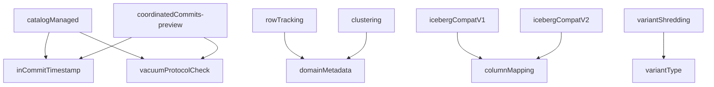
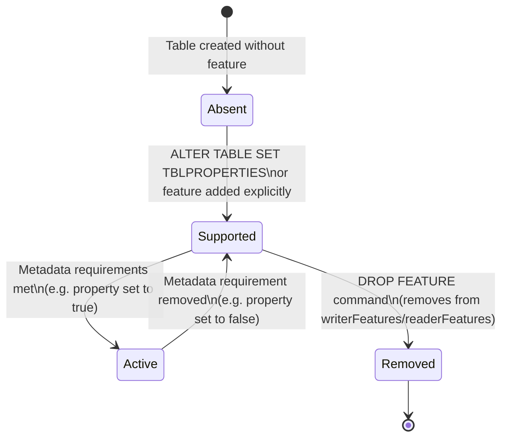

# Table Features Reference

## Purpose

Table Features are the extensibility mechanism introduced in Reader Version 3 / Writer Version 7. They replace the implicit feature negotiation of legacy protocol versions with an explicit enumeration in the `protocol` action. A client must implement all listed features to read or write a table. Features can be **writer-only** (only writers must implement them) or **reader-writer** (both readers and writers must implement them).

---

## Concepts

### Supported vs. Active

- **Supported**: The feature name is in `protocol.writerFeatures` and/or `protocol.readerFeatures`. Clients must understand and respect the feature, but it may not be in use.
- **Active**: The feature is supported **and** its metadata requirements are met. For example, `appendOnly` is active only when supported **and** `delta.appendOnly=true` is set in table properties.

### Legacy Features

Features released before the Table Features protocol (writer version < 7) are **legacy features**. They are **implicitly supported** when the protocol version meets their minimum versions, without being explicitly listed. When a table is upgraded to Writer Version 7, legacy features that were implicitly supported are added to `writerFeatures` (and `readerFeatures` if they are reader-writer features).

### Feature Types

| Base class (Scala) | Behavior |
|---|---|
| `LegacyWriterFeature(name, minWriterVersion)` | Implicitly supported at the given writer version; writer-only |
| `LegacyReaderWriterFeature(name, minReaderVersion, minWriterVersion)` | Implicitly supported at the given versions; reader-writer |
| `WriterFeature(name)` | Explicitly supported only; writer-only; minWriterVersion=7 |
| `ReaderWriterFeature(name)` | Explicitly supported only; reader-writer; minReaderVersion=3, minWriterVersion=7 |

---

## Complete Feature Reference

### Legacy Writer Features (implicitly supported at version thresholds)

| Feature | Name | Min Writer Version | What it enables | Auto-enabled by | Removable |
|---|---|---|---|---|---|
| Append-only Tables | `appendOnly` | 2 | Prevents DELETE/UPDATE/MERGE when `delta.appendOnly=true` | `delta.appendOnly=true` table property | No |
| Column Invariants | `invariants` | 2 | Enforces `delta.invariants` SQL expressions on column metadata | Presence of `delta.invariants` in any column metadata | No |
| CHECK Constraints | `checkConstraints` | 3 | Enforces `delta.constraints.*` SQL predicates on rows | Presence of any CHECK constraint | Yes |
| Change Data Feed | `changeDataFeed` | 4 | Writers produce `cdc` actions; readers consume `_change_data/` files | `delta.enableChangeDataFeed=true` | No |
| Generated Columns | `generatedColumns` | 4 | Writers enforce `delta.generationExpression` column metadata | Presence of generated column expressions | No |
| Identity Columns | `identityColumns` | 6 | Writers auto-assign unique values for identity columns | Presence of `delta.identity.*` column metadata | No |

### Legacy Reader-Writer Features

| Feature | Name | Min Reader Version | Min Writer Version | What it enables | Removable |
|---|---|---|---|---|---|
| Column Mapping | `columnMapping` | 2 | 5 | Physical column names/IDs decouple schema from Parquet; supports rename/drop without rewrite | Yes |

---

### Explicit Table Features (Writer Version 7+ required)

#### Writer-Only Features (minReaderVersion=0, minWriterVersion=7)

| Feature | Name | What it enables | Required features | Auto-enabled by | Removable |
|---|---|---|---|---|---|
| Timestamp NTZ | `timestampNtz` | `TIMESTAMP WITHOUT TIME ZONE` data type in schema | — | Presence of `TimestampNTZType` in schema | No |
| Domain Metadata | `domainMetadata` | Named configuration blobs stored via `domainMetadata` actions | — | — | Yes |
| Row Tracking | `rowTracking` | Row IDs and Row Commit Versions for cross-version row identity | `domainMetadata` | `delta.enableRowTracking=true` | Yes |
| Iceberg Compat V1 | `icebergCompatV1` | Ensures Delta tables can be converted to Iceberg V1 format | `columnMapping` | `delta.enableIcebergCompatV1=true` | No |
| Iceberg Compat V2 | `icebergCompatV2` | Ensures Delta tables can be converted to Iceberg V2 format | `columnMapping` | `delta.enableIcebergCompatV2=true` | No |
| Clustered Table | `clustering` | Liquid clustering via CLUSTER BY; stores clustering columns in `domainMetadata` | `domainMetadata` | Table created with `CLUSTER BY` | No |
| Allow Column Defaults | `allowColumnDefaults` | Column DEFAULT values usable in INSERT/UPDATE/MERGE | — | `delta.feature.allowColumnDefaults=enabled` | No |
| Materialize Partition Columns | `materializePartitionColumns` | Writers embed partition columns in Parquet data files | — | `delta.enableMaterializePartitionColumnsFeature=true` | Yes |
| In-Commit Timestamps | `inCommitTimestamp` | Monotonically increasing `inCommitTimestamp` in every `commitInfo` | — | `delta.enableInCommitTimestamps=true` | Yes |
| Checkpoint Protection | `checkpointProtection` | Ensures metadata cleanup happens atomically up to `requireCheckpointProtectionBeforeVersion` | — | Automatically set during feature drops that require history truncation | Yes |
| Coordinated Commits (preview) | `coordinatedCommits-preview` | Commits coordinated by an external commit coordinator | `inCommitTimestamp`, `vacuumProtocolCheck` | `delta.coordinatedCommits.commitCoordinator-preview` table property | Yes |
| Type Widening (preview) | `typeWidening-preview` | Preview-phase type widening; same spec as `typeWidening` | — | `delta.enableTypeWidening=true` (preview config) | Yes |
| Type Widening | `typeWidening` | Column type can be widened to compatible type (e.g. INT→LONG) | — | `delta.enableTypeWidening=true` | Yes |

#### Reader-Writer Features (minReaderVersion=3, minWriterVersion=7)

| Feature | Name | What it enables | Required features | Auto-enabled by | Removable |
|---|---|---|---|---|---|
| Deletion Vectors | `deletionVectors` | Soft-delete rows via RoaringBitmap-based DV files; avoids data file rewrites | — | `delta.enableDeletionVectors=true` | Yes |
| V2 Checkpoints | `v2Checkpoint` | UUID-named checkpoints with optional sidecar files and `checkpointMetadata` action | — | `delta.checkpointPolicy=v2` | Yes |
| VACUUM Protocol Check | `vacuumProtocolCheck` | Writers must check write protocol before VACUUM; prevents older vacuum from deleting files | — | — | Yes |
| Catalog-Managed Tables | `catalogManaged` | Commits go through the managing catalog; filesystem-based access blocked | `inCommitTimestamp`, `vacuumProtocolCheck` | Table created as catalog-managed | No (downgrade not yet implemented) |
| Variant Type (preview) | `variantType-preview` | Preview-phase `variant` semi-structured data type | — | Presence of variant type in schema (with preview flag) | No |
| Variant Type | `variantType` | GA `variant` semi-structured data type (Parquet struct-of-binary) | — | Presence of variant type in schema | No |
| Variant Shredding (preview) | `variantShredding-preview` | Preview-phase Parquet Variant shredding | `variantType-preview` | `delta.enableVariantShredding=true` (preview flag) | No |
| Variant Shredding | `variantShredding` | GA Parquet Variant shredding | `variantType` | `delta.enableVariantShredding=true` | No |
| Timestamp NTZ | `timestampNtz` | Listed in both reader and writer features when minReaderVersion=3 | — | Presence of `TimestampNTZType` in schema | No |

> [!NOTE]
> `timestampNtz` appears in both the writer-only and reader-writer tables because its classification depends on the protocol version. At Reader Version 2 / Writer Version < 7, it is a writer-only legacy feature. At Reader Version 3 / Writer Version 7, it is a `ReaderWriterFeature`.

---

## Feature Details

### `appendOnly`

- **Protocol**: minWriterVersion=2 (implicit); Writer Feature 7+ (explicit in `writerFeatures`)
- **Active when**: Feature is supported AND `delta.appendOnly=true`
- **Effect**: Rejects any write that modifies or removes data. Allows rearrangement-only operations (`dataChange=false`).
- **Activation**: Auto-updates protocol of existing tables on property set.

### `invariants`

- **Protocol**: minWriterVersion=2 (implicit)
- **Active when**: Presence of `delta.invariants` in any column's schema metadata
- **Effect**: Writers abort transactions where the invariant expression evaluates to `false` or `null`.
- **Format**: `{"expression": {"expression": "x > 3"}}` in column metadata under key `delta.invariants`.

### `checkConstraints`

- **Protocol**: minWriterVersion=3 (implicit)
- **Active when**: Any `delta.constraints.<name>` key in table `configuration`
- **Effect**: Writers validate existing data and new rows against SQL predicates.
- **Format**: `delta.constraints.birthDateCheck` = `"birthDate > '1900-01-01'"` in `metaData.configuration`.

### `columnMapping`

- **Protocol**: minReaderVersion=2, minWriterVersion=5 (implicit)
- **Modes**: `none` (default), `id` (resolve by Parquet `field_id`), `name` (resolve by `delta.columnMapping.physicalName`)
- **Active when**: `delta.columnMapping.mode` is `id` or `name`
- **Effect**: Decouples display column name from Parquet physical column name; enables cheap column renames and drops.
- **Physical name**: UUID-based (`col-<uuid>`); stored in `delta.columnMapping.physicalName` column metadata.
- **Column ID**: Stored in `delta.columnMapping.id` column metadata and as Parquet `field_id`.
- **Max column ID**: Tracked in `delta.columnMapping.maxColumnId` table property (monotonically increasing).

### `changeDataFeed`

- **Protocol**: minWriterVersion=4 (implicit)
- **Active when**: `delta.enableChangeDataFeed=true`
- **Effect**: Writers produce `cdc` actions and write files to `_change_data/`. CDC readers use these files instead of computing changes from `add`/`remove`.

### `deletionVectors`

- **Protocol**: minReaderVersion=3, minWriterVersion=7 (explicit)
- **Active when**: `delta.enableDeletionVectors=true` (for writing new DVs; reading is always required when the feature is supported)
- **Effect**: Allows `add` actions to include a `deletionVector` pointing to a RoaringBitmap file that marks invalidated rows. Readers must skip these rows.
- **Storage types**: `u` (relative UUID file path), `i` (inline base85), `p` (absolute path).
- **Constraint**: When DVs are present, `numRecords` in `add.stats` must be accurate (counts physical rows, not valid rows).

### `rowTracking`

- **Protocol**: minWriterVersion=7 (explicit writer feature)
- **Active when**: `delta.enableRowTracking=true`
- **Supported when**: `rowTracking` in `writerFeatures`
- **Effect**:
  - **Default generated Row IDs**: `baseRowId` in `add`/`remove` actions; row's fresh ID = `baseRowId + physicalIndex`.
  - **Stable Row IDs**: Preserved in hidden column `delta.rowTracking.materializedRowIdColumnName`.
  - **Default generated Row Commit Versions**: `defaultRowCommitVersion` in `add`/`remove`.
  - **Stable Row Commit Versions**: Preserved in hidden column `delta.rowTracking.materializedRowCommitVersionColumnName`.
  - High watermark tracked in `domainMetadata` with domain `delta.rowTracking`.
- **Requires**: `domainMetadata` feature.
- **Suspend**: `delta.rowTrackingSuspended=true` pauses ID assignment without disabling the feature.

### `domainMetadata`

- **Protocol**: minWriterVersion=7 (explicit writer feature)
- **Active when**: Present in `writerFeatures`
- **Effect**: Enables `domainMetadata` actions in commits and checkpoints. Two domain types:
  - User-controlled: names not starting with `delta.`
  - System-controlled: names starting with `delta.` (reserved; users cannot modify)
- **Used by**: `rowTracking` (stores high watermark), `clustering` (stores column list), `catalogManaged` (coordination state).

### `v2Checkpoint`

- **Protocol**: minReaderVersion=3, minWriterVersion=7 (explicit reader-writer)
- **Active when**: `delta.checkpointPolicy=v2`
- **Effect**: Enables UUID-named checkpoints with `checkpointMetadata` and optional sidecar Parquet files for file actions. Forbids multi-part checkpoints.
- **Backward compatibility**: Writers should periodically produce a V2 classic checkpoint (`<v>.checkpoint.parquet`) so older readers can detect protocol and fail gracefully.

### `inCommitTimestamp`

- **Protocol**: minWriterVersion=7 (explicit writer feature)
- **Active when**: `delta.enableInCommitTimestamps=true`
- **Effect**: Every commit must include `commitInfo` as the **first action** with `inCommitTimestamp` = max(currentTimeMs, previousInCommitTimestamp + 1). This creates a monotonically increasing, stable timestamp for time travel.
- **Provenance**: Enablement version tracked in `delta.inCommitTimestampEnablementVersion` and `delta.inCommitTimestampEnablementTimestamp`.
- **Required by**: `catalogManaged` (since publish timestamps are unreliable), `coordinatedCommits-preview`.

### `catalogManaged`

- **Protocol**: minReaderVersion=3, minWriterVersion=7 (explicit reader-writer)
- **Active when**: Both `readerFeatures` and `writerFeatures` contain `catalogManaged`
- **Effect**:
  - All commits must go through the managing catalog (not filesystem-based put-if-absent).
  - Filesystem-based writes are blocked.
  - Readers must contact the catalog for unpublished ratified commits.
  - `commitInfo` must include `txnId`.
  - `inCommitTimestamp` must be active.
- **Requires**: `inCommitTimestamp`, `vacuumProtocolCheck`.
- **Catalog interaction**: See `PROTOCOL.md` §"Catalog-managed tables" for full commit protocol.

### `vacuumProtocolCheck`

- **Protocol**: minReaderVersion=3, minWriterVersion=7 (explicit reader-writer)
- **Effect**: Forces VACUUM implementations to check the **write** protocol (not just the read protocol) before deleting files. Older VACUUM implementations that only check reader protocol will fail on tables with this feature, preventing accidental deletion of files needed by write features.
- **Required by**: `catalogManaged`, `coordinatedCommits-preview`.

### `clustering`

- **Protocol**: minWriterVersion=7 (explicit writer feature)
- **Active when**: Present in `writerFeatures` (always active when supported)
- **Effect**: Marks the table as a clustered table. Writers store clustering columns in `domainMetadata` with domain `delta.clustering`. Writers must set `clusteringProvider` in `add` actions for clustered files.
- **Constraint**: Clustered and partitioned tables are mutually exclusive.
- **Requires**: `domainMetadata`.

### `icebergCompatV1`

- **Protocol**: minWriterVersion=7 (explicit writer feature)
- **Active when**: `delta.enableIcebergCompatV1=true`
- **Constraints on writers**:
  - Column Mapping must be `name` or `id` mode.
  - Deletion Vectors must **not** be supported.
  - Partition columns must be materialized in Parquet files (placed after data columns).
  - All `add` actions must have `numRecords` in `stats`.
  - `Map`, `Array`, `Void` types are blocked.
  - Partition spec renames blocked.
- **Requires**: `columnMapping`.

### `icebergCompatV2`

- **Protocol**: minWriterVersion=7 (explicit writer feature)
- **Active when**: `delta.enableIcebergCompatV2=true`
- **Constraints**: All of V1's constraints plus:
  - IcebergCompatV1 must **not** be active simultaneously.
  - Deletion Vectors must **not** be active.
  - Nested `element`/`key`/`value` identifiers in `ArrayType`/`MapType` must be assigned and stored in `parquet.field.nested.ids` column metadata.
  - Timestamps written as int64.
  - Type widening limited to Iceberg V2-compatible changes.
  - Allowed schema types: `[byte, short, integer, long, float, double, decimal, string, binary, boolean, timestamp, timestampNTZ, date, array, map, struct]`.
- **Requires**: `columnMapping`.

### `typeWidening`

- **Protocol**: minReaderVersion=3, minWriterVersion=7 (explicit reader-writer)
- **Active when**: `delta.enableTypeWidening=true`
- **Supported type changes**:
  - Integer widening: `Byte` → `Short` → `Int` → `Long`
  - Float widening: `Float` → `Double`; `Byte`/`Short`/`Int` → `Double`
  - Date widening: `Date` → `TimestampNTZ`
  - Decimal widening: precision/scale increase; integer types → Decimal
- **Metadata**: Type change history recorded in `delta.typeChanges` on the nearest ancestor `StructField`.
- **Preview**: Also available as `typeWidening-preview` (same spec; for tables that enabled it during preview phase).

### `variantType`

- **Protocol**: minReaderVersion=3, minWriterVersion=7 (explicit reader-writer)
- **Active when**: Presence of `variant` type in table schema
- **Effect**: Enables `variant` semi-structured data type. Stored in Parquet as a struct with `value` (binary) and `metadata` (binary) fields per Spark Variant binary encoding.
- **Constraints**: Variant columns may not be partition or clustering columns. Stats support only `nullCount` (no min/max).
- **Preview**: Also available as `variantType-preview` (same spec).

### `variantShredding`

- **Protocol**: minReaderVersion=3, minWriterVersion=7 (explicit reader-writer)
- **Active when**: `delta.enableVariantShredding=true`
- **Effect**: Enables Parquet Variant shredding (stores typed sub-fields alongside the binary blob for query acceleration). Separate from `variantType`.
- **Requires**: `variantType` (or `variantType-preview` for the preview version).
- **Preview**: Also available as `variantShredding-preview`.

### `checkpointProtection`

- **Protocol**: minWriterVersion=7 (explicit writer feature)
- **Active when**: Present in `writerFeatures` with `delta.requireCheckpointProtectionBeforeVersion` table property set
- **Effect**: Writers must clean up metadata atomically up to `requireCheckpointProtectionBeforeVersion` in a single operation. This prevents partial cleanup that could leave the log in an inconsistent state during feature removal history truncation.
- **Used during**: Removal of features that require history truncation (e.g. `rowTracking`).

### `materializePartitionColumns`

- **Protocol**: minWriterVersion=7 (explicit writer feature)
- **Active when**: `delta.enableMaterializePartitionColumnsFeature=true`
- **Effect**: Writers embed partition column values directly in Parquet data files (after data columns). Useful for external readers that expect partition columns in Parquet rather than inferring them from directory structure.

### `allowColumnDefaults`

- **Protocol**: minWriterVersion=7 (explicit writer feature)
- **Active when**: Present in `writerFeatures`
- **Effect**: Enables column `DEFAULT` expressions in `CREATE TABLE` and `ALTER TABLE ... ALTER COLUMN ... SET DEFAULT`. Default expressions stored in `CURRENT_DEFAULT` column metadata. Variant columns must default to null.

### `coordinatedCommits-preview`

- **Protocol**: minWriterVersion=7 (explicit writer feature, preview phase)
- **Active when**: `delta.coordinatedCommits.commitCoordinator-preview` table property is set
- **Effect**: An external commit coordinator (not the catalog) manages commit ordering. Similar to `catalogManaged` but the coordinator is a pluggable service rather than the full catalog.
- **Requires**: `inCommitTimestamp`, `vacuumProtocolCheck`.

---

## Feature Dependency Graph

_Arrows: A → B means A requires B to also be supported._

---

## Protocol Version Summary

| Protocol (reader, writer) | Notable implicit features |
|---|---|
| (1, 1) | Baseline; no special features |
| (1, 2) | `appendOnly`, `invariants` |
| (1, 3) | + `checkConstraints` |
| (1, 4) | + `changeDataFeed`, `generatedColumns` |
| (2, 5) | + `columnMapping` |
| (2, 6) | + `identityColumns` |
| (3, 7) | All features explicit in `readerFeatures`/`writerFeatures` |

---

## Feature Lifecycle: Supported → Active → Removed

_Not all features are removable. Removable features (those implementing `RemovableFeature` in Scala) support a `DROP FEATURE` workflow that cleans up all traces before removing the protocol entry._
