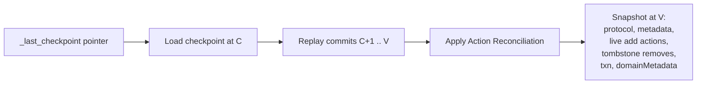

# Transaction Log Protocol

## Purpose

The Delta Transaction Log Protocol brings ACID properties to large collections of data files stored in a distributed file system or object store. It provides serializable writes via optimistic concurrency, snapshot isolation for reads, and self-describing tables (metadata co-located with data). The log is append-only; the current state of a table is reconstructed by _replaying_ actions from the log.

---

## Design Goals

| Goal | Mechanism |
|---|---|
| Serializable ACID writes | Multi-version concurrency control (MVCC); atomic commit via put-if-absent |
| Snapshot isolation reads | Readers pin a version; log replay produces a consistent file list |
| Scalability to billions of files | Checkpoints eliminate full log scan; data skipping avoids reading all files |
| Self-describing | All metadata stored in `_delta_log/` alongside data |
| Incremental processing | Streaming readers tail the log to find added/removed files |

---

## File Types and Layout

A Delta table is a directory. The `_delta_log/` sub-directory holds all protocol files. Data files live in the root directory (or subdirectories for partitioned tables). The full set of file types:

```
<table-root>/
  _delta_log/
    00000000000000000000.json          # Version 0 commit file
    00000000000000000010.json          # Version 10 commit file
    00000000000000000010.checkpoint.parquet  # V1 classic checkpoint at v10
    00000000000000000020.checkpoint.80a083e8-7026-4e79-81be-64bd76c43a11.json  # V2 UUID checkpoint
    _last_checkpoint                   # Pointer to most recent checkpoint
    _staged_commits/                   # Catalog-managed staged commits
      00000000000000000011.<uuid>.json
    _sidecars/                         # V2 checkpoint sidecar files
      016ae953-37a9-438e-8683-9a9a4a79a395.parquet
    00000000000000000004.00000000000000000006.compacted.json  # Log compaction file
    00000000000000000010.crc           # Version checksum file
  part-00000-<guid>.snappy.parquet    # Data file
  deletion_vector-<uuid>.bin          # Deletion Vector file
  _change_data/                       # CDC files
    cdc-00001-<guid>.snappy.parquet
```

### File Type Reference

| File | Name Pattern | Format | Purpose |
|---|---|---|---|
| Delta log entry (commit file) | `<v>.json` (20-digit zero-padded `v`) | Newline-delimited JSON | Atomic set of actions transforming table from `v-1` to `v` |
| Staged commit | `_staged_commits/<v>.<uuid>.json` | Newline-delimited JSON | Proposed commit for catalog-managed tables |
| Classic checkpoint | `<v>.checkpoint.parquet` | Parquet | Full table state snapshot at version `v` |
| UUID-named checkpoint | `<v>.checkpoint.<uuid>.{json,parquet}` | JSON or Parquet | V2 checkpoint with optional sidecars |
| Multi-part checkpoint | `<v>.checkpoint.<part>.<total>.parquet` | Parquet | Deprecated; parallel V1 checkpoint shards |
| Log compaction file | `<x>.<y>.compacted.json` | Newline-delimited JSON | Aggregated actions for commit range `[x, y]` |
| Last checkpoint file | `_last_checkpoint` | JSON | Pointer to most recent checkpoint |
| Version checksum file | `<v>.crc` | JSON | Integrity summary for version `v` |
| Sidecar file | `_sidecars/<uuid>.parquet` | Parquet | File actions referenced by V2 checkpoints |
| Data file | `part-<n>-<guid>.<format>` | Parquet (or other) | User table data |
| Deletion Vector file | `deletion_vector-<uuid>.bin` | Binary RoaringBitmap | Row-level soft deletes |
| Change Data file | `_change_data/<name>.parquet` | Parquet | Row-level change events for CDF |

---

## Protocol Version History

Protocol versioning prevents older clients from reading or writing tables that require capabilities they lack.

### Reader Versions

| Reader Version | Capability Required |
|---|---|
| 1 | Baseline; no additional features |
| 2 | Column Mapping (`columnMapping` table feature) |
| 3 | Table Features for readers — `readerFeatures` list in protocol action must be checked |

> [!NOTE]
> Reader Version 3 requires Writer Version 7. It is illegal to have Reader Version 3 with Writer Version < 7.

### Writer Versions

| Writer Version | Capability Required |
|---|---|
| 1 | Baseline |
| 2 | Append-only tables (`appendOnly`) + Column Invariants (`invariants`) |
| 3 | `delta.checkpoint.writeStatsAsJson/Struct`; CHECK constraints |
| 4 | Change Data Feed (`changeDataFeed`); Generated Columns |
| 5 | Column Mapping |
| 6 | Identity Columns |
| 7 | Table Features for writers — `writerFeatures` list in protocol action must be checked |

### Table Features Model (v3/v7)

When `minReaderVersion=3` and `minWriterVersion=7`, the `protocol` action carries two lists:

- `readerFeatures`: features readers **must** implement to read the table
- `writerFeatures`: features writers **must** implement to write the table

A feature supported by a protocol does not imply it is _active_ (a property may need to be set too). See [[table_features]] for full details.

---

## Log File Naming

All commit-version numbers in file names are zero-padded to **20 digits**. Part numbers for multi-part checkpoints are zero-padded to **10 digits**.

```
# Commit file for version 42
_delta_log/00000000000000000042.json

# V1 classic checkpoint for version 100
_delta_log/00000000000000000100.checkpoint.parquet

# V2 UUID-named checkpoint for version 100
_delta_log/00000000000000000100.checkpoint.80a083e8-7026-4e79-81be-64bd76c43a11.json

# Multi-part checkpoint: part 2 of 5 at version 100
_delta_log/00000000000000000100.checkpoint.0000000002.0000000005.parquet

# Log compaction for versions 4–6
_delta_log/00000000000000000004.00000000000000000006.compacted.json
```

---

## Delta Log Entry Format

Each commit file is **newline-delimited JSON**. Every line is a self-contained JSON object wrapping a single action. Actions are applied in the order encountered during replay.

```json
{"commitInfo":{"timestamp":1515491537026,"operation":"WRITE"}}
{"metaData":{"id":"af23c9d7-...","format":{"provider":"parquet"},...}}
{"add":{"path":"date=2017-12-10/part-000.parquet","size":841454,...}}
{"remove":{"path":"date=2017-12-09/part-001.parquet","deletionTimestamp":1515488792485,...}}
```

Key invariants:
- Writers **MUST NEVER** overwrite an existing log entry.
- A single log entry must not contain two actions that reconcile against each other (two `metaData` actions, two `protocol` actions, or two file actions for the same `(path, dvId)`).

---

## Snapshot Construction (Log Replay Algorithm)

A _snapshot_ at version `V` is the result of replaying all actions from the beginning of the log (or from the most recent checkpoint ≤ `V`) up to and including version `V`.

### Algorithm

```
1. Find the newest checkpoint C where C.version ≤ V
   (consult _last_checkpoint, then LIST _delta_log/ to confirm)
2. Load the checkpoint as the initial state
3. For each commit file from C.version+1 to V (in ascending order):
   a. Apply log compaction if available (reads compacted.json instead of individual commits)
   b. Apply each action per the reconciliation rules below
4. The resulting state is the snapshot at V
```

### Action Reconciliation Rules

| Action type | Reconciliation rule |
|---|---|
| `protocol` | Latest seen wins |
| `metaData` | Latest seen wins |
| `txn` | Latest `version` per `appId` wins |
| `domainMetadata` | Latest seen per `domain` wins; `removed=true` entries suppress earlier ones |
| `add` / `remove` | Keep newest action per `(path, deletionVector.uniqueId)` key; `add` = live file, `remove` = tombstone |
| `commitInfo` | Only the one from the target version is included (not preserved in checkpoints) |
| V2 checkpoint actions (`checkpointMetadata`, `sidecar`) | Not allowed in commit files; do not participate in log replay |

### Key Invariants

- An `add` and `remove` for the same `(path, dvId)` cannot coexist in the snapshot: the newer one wins.
- `remove` tombstones remain until VACUUM expires them (configurable retention, default 7 days).
- Snapshot reads return only `add` actions; `remove` actions serve only VACUUM.



_Log replay algorithm: start from checkpoint, apply delta files up to target version._

---

## Commit Protocol

### Filesystem-Based Commits (single-cluster)

Writers use **optimistic concurrency** (OCC):

1. Read the current snapshot (`N`).
2. Optimistically write new data files.
3. Prepare the commit content (set of actions).
4. Attempt to atomically write `_delta_log/<N+1>.json` using **put-if-absent** semantics (no overwrite).
5. If the file already exists (a concurrent writer won), detect the conflict:
   - If no logical conflict, retry from step 3 at the new version.
   - If conflict, abort or retry.

### Catalog-Managed Commits

When the `catalogManaged` table feature is enabled, the catalog becomes the source of truth for which commit wins. Three options for proposing/ratifying:

| Option | Mechanism |
|---|---|
| Staged + ratified | Write staged commit to `_staged_commits/<v>.<uuid>.json`; catalog atomically records it as version `v` |
| Inline | Client sends commit content to catalog server; catalog stores it directly |
| PUT-if-absent | Catalog atomically writes `_delta_log/<v>.json` directly (ratifies + publishes in one step) |

Rules:
- The catalog must not ratify version `v` until `v-1` is ratified.
- Ratified commits must be **published** (copied to `_delta_log/<v>.json`) in order.
- Delta clients reading catalog-managed tables must call the catalog to get ratified-but-unpublished commits, then combine with `LIST` results.
- Catalog-managed tables require `inCommitTimestamp` to be active (file modification timestamps become unreliable after out-of-order publishing).

See also [[table_features]] → `catalogManaged`.

---

## Table Version Semantics

- Versions are contiguous monotonically-increasing integers starting from 0.
- Each version corresponds to exactly one commit file (or ratified catalog commit).
- A table snapshot can be pinned at any committed version (time travel).
- Checkpoints may exist at any committed version and can be created at any time (but only after the associated commit file is written).
- Multiple checkpoints for the same version may exist (e.g. two clients raced); clients may choose either.

---

## Log Compaction Files

Log compaction files `<x>.<y>.compacted.json` aggregate actions from the commit range `[x, y]` after applying Action Reconciliation (without `commitInfo`). They are optional: readers may use them to avoid reading individual commit files for that range. Writers are not required to produce them.

Constraints:
- Compaction end version `y` must be strictly greater than start version `x`.
- Compaction files do not include `commitInfo` entries.

---

## Version Checksum Files

Each commit may be accompanied by a `<v>.crc` file containing integrity metrics (table size, file count, protocol, metadata, optionally all live `add` actions). Readers can validate table state by recomputing these metrics and comparing. Writers must:
- Write `.crc` only after the associated commit file succeeds.
- Never overwrite an existing `.crc` file.

For catalog-managed tables, the `.crc` file for version `v` **can** be written even if `v` is not yet published.

---

## Metadata Cleanup

Implementations should periodically delete old log files to bound `_delta_log` growth:

1. Identify the oldest version to retain (`cutOffCommit`).
2. Find the newest checkpoint at or before `cutOffCommit` (`cutOffCheckpoint`).
3. Delete all JSON commit files, checkpoint files, `.crc` files, and log compaction files before `cutOffCheckpoint`.
4. Preserve sidecar files referenced by any surviving checkpoint; delete unreferenced sidecars older than 1 day.
5. Delete staged commit files with version ≤ `cutOffCheckpoint.version`.

> [!NOTE]
> The JSON commit file at `cutOffCheckpoint`'s version must be preserved because checkpoints do not retain `commitInfo` actions (needed by features like In-Commit Timestamps).

---

## Diagram Opportunity Flag

> FLAG FOR ORCHESTRATOR: The interaction between catalog-managed commits (staged vs. inline vs. PUT-if-absent paths) and the standard filesystem commit path through `delta-storage` / `LogStore` warrants a sequence diagram in the module manifest alongside the existing write-path diagram. Relevant files: `PROTOCOL.md:1258-1320`, `storage/src/main/java/io/delta/storage/commit/CommitCoordinatorClient.java`.
